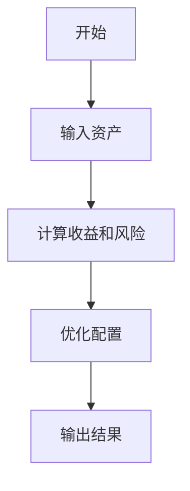
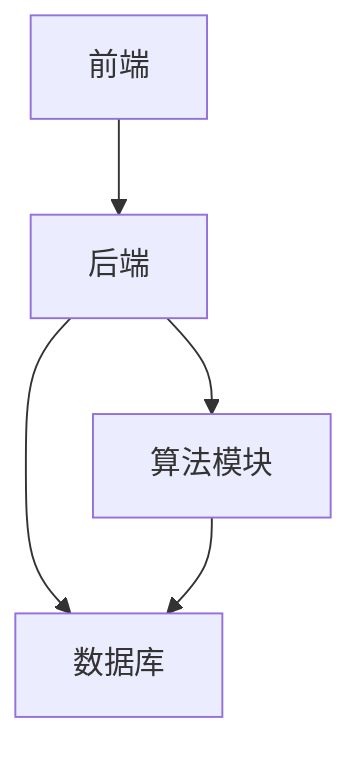

                 


# 股市估值高低对国际投资组合配置的影响

---

## 关键词：股市估值、投资组合配置、高估、低估、资产配置、风险控制

---

## 摘要：本文探讨股市估值高低对国际投资组合配置的影响，分析不同估值水平下的资产配置策略，结合算法和数学模型，提出优化投资组合的实践方法。

---

# 第1章：背景介绍

## 1.1 股市估值的基本概念

### 1.1.1 股票估值的定义与意义
股票估值是确定股票内在价值的过程，帮助投资者判断其价格是否合理。常用指标包括市盈率（P/E）、市净率（P/B）等。

### 1.1.2 股市估值的核心指标
- **市盈率（P/E）**：衡量股价与盈利的关系。
- **市净率（P/B）**：反映股价与资产价值的关系。

### 1.1.3 股市估值与投资回报的关系
高估的股市可能导致短期收益下降，低估的股市则可能带来长期收益机会。

## 1.2 投资组合配置的必要性

### 1.2.1 投资组合的基本概念
投资组合是将资金分配到不同资产以分散风险并优化收益。

### 1.2.2 资产配置的重要性
通过合理配置不同资产，降低风险并提高收益。

## 1.3 股市估值对投资组合配置的影响

### 1.3.1 高估值与低估值的定义
- 高估值：指标显著高于历史平均水平。
- 低估值：指标显著低于历史平均水平。

### 1.3.2 高低估值对投资组合的风险和收益的影响
高估值增加风险，低估提供收益机会。

### 1.3.3 不同市场周期下的配置策略
根据市场周期调整配置比例，平衡风险和收益。

---

# 第2章：核心概念与联系

## 2.1 常见估值指标

### 2.1.1 市盈率（P/E）
公式：$$ P/E = \frac{\text{股价}}{\text{每股收益}} $$
作用：评估股票相对于收益的高低。

### 2.1.2 市净率（P/B）
公式：$$ P/B = \frac{\text{股价}}{\text{每股净资产}} $$
作用：评估股票相对于资产的价值。

## 2.2 估值指标的比较与选择

### 2.2.1 不同指标的优缺点分析
| 指标 | 优点 | 缺点 |
|------|------|------|
| P/E | 反映盈利能力 | 易受盈利波动影响 |
| P/B | 反映资产价值 | 适用于净资产驱动型公司 |

## 2.3 实体关系图


---

# 第3章：算法原理讲解

## 3.1 均值-方差优化

### 3.1.1 算法原理
目标：最大化收益，最小化风险。

公式：$$ \text{Minimize } \sigma^2 \text{ s.t. } \mu \geq \text{目标收益} $$

### 3.1.2 流程图



## 3.2 风险调整后的收益模型

### 3.2.1 计算步骤

1. 计算每种资产的风险调整后收益。
2. 优化组合以最大化收益。

---

# 第4章：数学模型和公式

## 4.1 CAPM模型

公式：$$ E(R_i) = R_f + \beta_i (R_m - R_f) $$

解释：计算资产的预期收益。

## 4.2 APT模型

公式：$$ E(R_i) = \sum \lambda_j X_{i,j} $$

解释：基于多个因素解释收益。

---

# 第5章：系统分析与架构设计方案

## 5.1 问题场景介绍

### 5.1.1 系统目标
评估股市估值并优化投资组合。

## 5.2 系统功能设计

### 5.2.1 领域模型


## 5.3 系统架构设计



---

# 第6章：项目实战

## 6.1 环境安装

```bash
pip install numpy pandas matplotlib
```

## 6.2 核心实现代码

```python
import numpy as np

def portfolio_optimization(returns, covariance, target_return):
    # 使用均值-方差优化
    n = len(returns)
    cov = covariance
    inv_cov = np.linalg.inv(cov)
    ones = np.ones(n)
    weights = inv_cov @ ones / (ones.T @ inv_cov @ ones)
    return weights
```

## 6.3 案例分析

### 6.3.1 数据来源与处理
使用历史数据计算估值指标。

### 6.3.2 结果分析
根据优化结果调整配置比例。

---

# 第7章：最佳实践

## 7.1 小结
股市估值高低影响投资组合配置，需结合多种指标和模型。

## 7.2 投资组合配置策略建议
根据市场周期动态调整配置。

## 7.3 注意事项
避免单一依赖某一种指标，定期再平衡。

## 7.4 拓展阅读
推荐书籍和资源，深入学习投资组合管理。

---

# 作者：AI天才研究院 & 禅与计算机程序设计艺术

