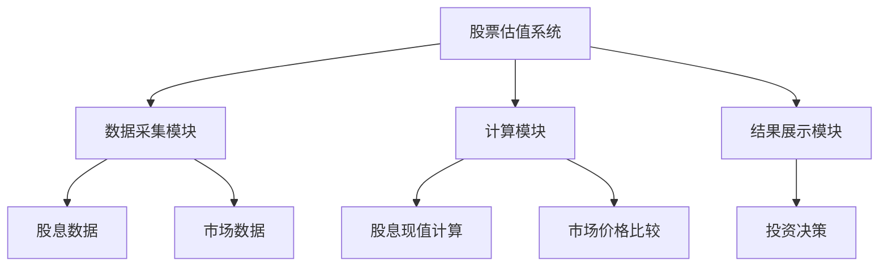

                 


# 股息贴现模型：估值的另一种思路

## 关键词
- 股息贴现模型
- 股票估值
- 投资分析
- DDM
- 财务分析
- 股票投资

## 摘要
股息贴现模型（Dividend Discount Model, DDM）是一种用于评估股票内在价值的方法，通过将未来股息折现来确定股票的合理价格。与传统的市盈率法和市净率法不同，DDM更关注公司未来股息的分配能力以及股东的现金流回报。本文将从DDM的核心概念、数学模型、算法实现、系统架构以及项目实战等多方面展开分析，帮助读者全面理解这一强大的股票估值工具。

---

# 第一部分: 股息贴现模型的概述与背景

## 第1章: 股息贴现模型的核心概念

### 1.1 股息贴现模型的背景介绍
#### 1.1.1 传统股票估值方法的局限性
传统的股票估值方法主要依赖市盈率（P/E）和市净率（P/B）等指标，但这些方法在面对不同行业和公司时存在明显局限性。例如，对于低成长性或亏损的公司，市盈率法难以提供有效的估值依据。此外，市盈率和市净率更多反映市场情绪，而非公司的真实价值。

#### 1.1.2 股息贴现模型的提出与发展
股息贴现模型（DDM）于20世纪60年代由约翰·林奇提出，其核心思想是通过将未来股息折现，计算股票的内在价值。这种方法特别适用于那些具有稳定股息支付能力的公司，因为股息是股东回报的重要组成部分。

#### 1.1.3 股息贴现模型的应用场景
- 适用于股息支付稳定的成熟企业。
- 适合长期投资者，尤其是注重现金流回报的投资者。
- 在公司基本面分析中提供额外的估值依据。

### 1.2 股息贴现模型的核心要素
#### 1.2.1 股息的定义与分类
股息是公司分配给股东的利润部分，通常分为普通股息、优先股息和特别股息。普通股息是最常见的股息形式，优先股息则是优先股股东享有的固定股息。

#### 1.2.2 股息增长率的计算方法
股息增长率是DDM模型的关键假设之一，通常基于历史股息增长率或行业平均增长率。公式如下：
$$ g = \frac{\text{未来股息} - \text{当前股息}}{\text{当前股息}} $$

#### 1.2.3 折现率的确定与影响
折现率是将未来股息折现为现值的贴现率，通常包括无风险利率和风险溢价。折现率的高低直接影响股票的估值结果。

### 1.3 股息贴现模型与传统估值方法的对比
#### 1.3.1 市盈率法的局限性
市盈率法无法反映公司的股息支付能力，且容易受市场情绪影响。

#### 1.3.2 市净率法的局限性
市净率法难以衡量公司的盈利能力，尤其在公司资产重且负债高的情况下。

#### 1.3.3 股息贴现模型的优势与适用性
- 更关注现金流回报。
- 更适合股息支付稳定的公司。
- 提供更客观的内在价值评估。

---

# 第二部分: 股息贴现模型的数学模型与公式

## 第2章: 股息贴现模型的数学模型与公式

### 2.1 股息贴现模型的基本公式
#### 2.1.1 股息贴现模型的核心公式
$$ V = \frac{D_1}{k - g} $$

其中：
- \( V \)：股票的内在价值
- \( D_1 \)：未来第一期股息
- \( k \)：折现率
- \( g \)：股息增长率

#### 2.1.2 股息贴现模型的扩展公式
$$ V = \frac{D_1}{(k - g)} + \frac{D_2}{(k - g)^2} + \frac{D_3}{(k - g)^3} + \cdots $$

---

## 第3章: 股息贴现模型的算法原理与实现

### 3.1 股息贴现模型的算法步骤
#### 3.1.1 确定股息增长率
- 通过历史股息数据计算股息增长率。
- 使用行业平均增长率作为参考。

#### 3.1.2 确定折现率
- 无风险利率 + 风险溢价。
- 通常采用市场平均回报率作为折现率。

#### 3.1.3 计算股息现值
- 使用DDM公式计算股息的现值总和。
- 比较股息现值与市场价格，判断股票是否被低估或高估。

#### 3.1.4 输出结果
- 如果股息现值 > 市场价格，股票可能被低估，值得买入。
- 如果股息现值 < 市场价格，股票可能被高估，值得卖出。

### 3.2 股息贴现模型的数学模型
$$ V = \frac{D_1}{k - g} $$

---

## 第4章: 股息贴现模型的系统架构与设计

### 4.1 系统架构设计


---

## 第5章: 股息贴现模型的项目实战

### 5.1 环境安装与配置
- Python环境：建议使用Python 3.8及以上版本。
- 第三方库：Pandas、NumPy、Matplotlib。

### 5.2 核心代码实现
```python
import pandas as pd
import numpy as np

def dividend_discount_model(fcf, g, k):
    # 计算股息现值
    present_value = fcf / (k - g)
    return present_value

# 示例数据
fcf = 1.5  # 自由现金流
g = 0.05   # 股息增长率
k = 0.10   # 折现率

# 计算内在价值
intrinsic_value = dividend_discount_model(fcf, g, k)
print(f"内在价值：{intrinsic_value:.2f}")
```

### 5.3 实际案例分析
假设某公司当前股息为2元，股息增长率为5%，折现率为10%。计算其股票的内在价值：
$$ V = \frac{2}{0.10 - 0.05} = 40 \text{元} $$

---

## 第6章: 最佳实践、小结与注意事项

### 6.1 小结
股息贴现模型是一种简单而有效的股票估值工具，特别适用于股息支付稳定的公司。通过将未来股息折现，投资者可以更好地理解股票的内在价值。

### 6.2 注意事项
- 选择合适的股息增长率和折现率。
- DDM模型假设股息持续增长，这在现实中可能不成立。
- 结合其他估值方法进行综合分析。

### 6.3 拓展阅读
- 《The Dividend Discount Model》
- 《股票投资实战策略》

---

# 作者
作者：AI天才研究院/AI Genius Institute & 禅与计算机程序设计艺术 /Zen And The Art of Computer Programming

