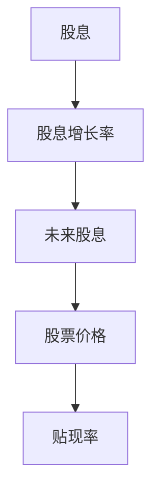
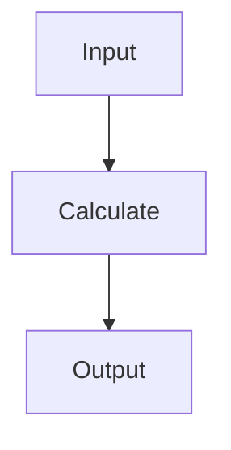

                 


# 股息贴现模型：基于未来现金流的股票估值

> 关键词：股息贴现模型，股票估值，未来现金流，股息现值，贴现率

> 摘要：股息贴现模型（Dividend Discount Model，DDM）是一种用于评估股票内在价值的重要方法，它通过将未来所有股息的现值加总，来确定股票的合理价格。本文将详细介绍股息贴现模型的核心概念、算法原理、系统分析以及项目实战，帮助读者全面理解如何利用DDM进行股票估值。

---

## 第1章: 股息贴现模型的背景介绍

### 1.1 股息贴现模型的起源与发展

股息贴现模型（DDM）是一种经典的股票估值方法，起源于20世纪中期。它基于股息的现值计算股票的价值，是金融学中最早的应用之一。随着金融理论的发展，DDM不断完善，并衍生出多种变种模型，如戈登增长模型（Gordon Growth Model）和多阶段股息贴现模型（Multi-Stage DDM）。

#### 1.1.1 股息贴现模型的起源
股息贴现模型的起源可以追溯到20世纪30年代，当时学者们开始研究如何通过股息来评估股票的价值。1962年，投资专家菲利普·费雪（Philip Fisher）在他的著作《Common Stocks and Uncommon Profits》中首次系统地阐述了股息贴现模型的核心思想。

#### 1.1.2 股息贴现模型的发展历程
股息贴现模型在20世纪60年代得到了进一步的发展，尤其是戈登增长模型的提出，将股息贴现模型与永续增长率结合起来，使其更加适用于实际投资分析。随着金融理论的深入研究，DDM逐渐扩展到多阶段模型，能够更好地适应不同公司的股息增长情况。

#### 1.1.3 股息贴现模型的现状与应用
目前，股息贴现模型已被广泛应用于股票估值，尤其是在评估高分红股票时。投资者可以通过DDM快速计算出股票的内在价值，从而做出投资决策。然而，DDM也存在一定的局限性，例如对股息增长率的敏感性以及对贴现率的依赖。

---

### 1.2 股息贴现模型的核心概念

#### 1.2.1 股息贴现模型的定义
股息贴现模型是一种通过将公司未来派发的股息进行现值化，以确定股票当前合理价格的估值方法。其核心思想是将股票视为一种永续年金，通过贴现率将未来股息折算到现在，从而计算出股票的内在价值。

#### 1.2.2 股息贴现模型的核心要素
股息贴现模型的计算依赖于以下几个核心要素：
1. **当前股息（D0）**：公司当前派发的股息。
2. **股息增长率（g）**：未来股息的年增长率。
3. **贴现率（r）**：用于将未来股息折算为现值的贴现率，通常等于股东要求的必要收益率。

#### 1.2.3 股息贴现模型的适用场景
股息贴现模型适用于那些股息稳定且能够持续增长的公司。例如，成熟行业的龙头公司或那些具有稳定现金流的公用事业公司。然而，对于股息不稳定或处于高速增长期的公司，DDM可能不太适用。

---

### 1.3 股息贴现模型的理论基础

#### 1.3.1 股票的内在价值
股票的内在价值是指基于公司未来现金流的现值。股息贴现模型通过将未来股息的现值加总，来估算股票的内在价值。公式如下：

$$
\text{内在价值} = \frac{D_1}{r - g} + \frac{D_2}{(r - g)(1 + r)} + \frac{D_3}{(r - g)(1 + r)^2} + \dots
$$

其中，$D_t$ 表示第$t$年的股息，$r$ 表示贴现率，$g$ 表示股息增长率。

#### 1.3.2 股息的现值计算
股息的现值计算是股息贴现模型的核心步骤。通过将未来股息按一定的贴现率折现，可以得到这些股息的现值。公式为：

$$
\text{现值} = \sum_{t=1}^{\infty} \frac{D_t}{(1 + r)^t}
$$

其中，$D_t = D_0 \times (1 + g)^{t-1}$，即股息按固定增长率增长。

#### 1.3.3 贴现率的确定
贴现率是股息贴现模型中的关键参数，通常等于投资者要求的必要收益率。贴现率的确定需要考虑市场利率、通货膨胀率以及公司的风险水平等因素。

---

### 1.4 股息贴现模型的边界与外延

#### 1.4.1 股息贴现模型的适用边界
股息贴现模型适用于那些股息稳定且能够持续增长的公司，尤其是那些股息占现金流比例较高的公司。对于那些股息不稳定的公司，DDM可能无法提供准确的估值。

#### 1.4.2 股息贴现模型的局限性
1. **股息增长率的假设**：股息贴现模型假设股息可以以固定速度持续增长，这在现实中可能并不成立。
2. **贴现率的敏感性**：贴现率的变化会对股票估值产生较大影响，尤其是在增长率较高的情况下。
3. **忽略股价波动**：股息贴现模型仅考虑股息因素，忽略了市场情绪和股价波动的影响。

#### 1.4.3 股息贴现模型与其他估值方法的对比
与其他估值方法相比，股息贴现模型的优势在于其简单性和可操作性。然而，它也存在一定的局限性，例如对股息增长率的敏感性。因此，在实际应用中，投资者通常会结合其他估值方法（如市盈率模型）来进行综合评估。

---

## 第2章: 股息贴现模型的核心概念与联系

### 2.1 股息贴现模型的核心原理

#### 2.1.1 股息贴现模型的基本公式
股息贴现模型的基本公式可以表示为：

$$
P_0 = \frac{D_1}{r - g} + \frac{D_2}{(r - g)(1 + r)} + \frac{D_3}{(r - g)(1 + r)^2} + \dots
$$

其中，$P_0$ 表示股票的当前价格，$D_1$、$D_2$、$D_3$ 分别表示第1年、第2年、第3年的股息。

#### 2.1.2 股息贴现模型的数学模型
股息贴现模型的数学模型可以进一步简化为：

$$
P_0 = \frac{D_0 \times (1 + g)}{r - g}
$$

其中，$D_0$ 表示当前股息，$g$ 表示股息增长率，$r$ 表示贴现率。

#### 2.1.3 股息贴现模型的假设条件
股息贴现模型的假设条件包括：
1. 股息可以以固定速度 $g$ 增长。
2. 贴现率 $r$ 在未来各期保持不变。
3. 股东的投资 horizon 为无限长，即考虑的是永续股息。

---

### 2.2 股息贴现模型的核心要素

#### 2.2.1 现金流的定义与计算
在股息贴现模型中，现金流指的是公司未来派发的股息。股息的计算公式为：

$$
D_t = D_0 \times (1 + g)^{t-1}
$$

其中，$t$ 表示时间，$D_0$ 表示当前股息，$g$ 表示股息增长率。

#### 2.2.2 贴现率的确定与影响
贴现率是股息贴现模型中的关键参数，其确定需要考虑市场利率、通货膨胀率以及公司的风险水平等因素。贴现率的增加会导致股票估值的下降，反之亦然。

#### 2.2.3 永续增长率的假设与验证
股息贴现模型假设股息可以以固定速度 $g$ 持续增长。然而，在实际应用中，投资者需要通过历史股息增长率和行业增长率来验证这一假设的合理性。

---

### 2.3 股息贴现模型的属性特征对比

#### 2.3.1 不同股息贴现模型的对比分析
股息贴现模型有多种变种，包括戈登增长模型和多阶段股息贴现模型。以下是几种常见模型的对比：

| 模型名称       | 核心假设                     | 适用场景                     |
|----------------|------------------------------|------------------------------|
| 戈登增长模型     | 股息以固定速度 $g$ 增长       | 适用于股息稳定增长的公司     |
| 多阶段股息贴现模型 | 股息增长率分为多个阶段       | 适用于股息增长阶段变化的公司   |

#### 2.3.2 股息贴现模型与股利折现模型的区别
股息贴现模型和股利折现模型在实际应用中常被混淆，但它们的核心区别在于：

- 股息贴现模型假设股息以固定速度增长。
- 股利折现模型则不假设股息增长率，而是将股利的未来现金流直接折现。

#### 2.3.3 股息贴现模型与市盈率模型的对比
股息贴现模型和市盈率模型是两种不同的股票估值方法。市盈率模型基于每股收益，而股息贴现模型基于未来股息的现值。以下是两者的对比：

| 模型名称   | 核心指标       | 适用场景                     |
|------------|----------------|------------------------------|
| 股息贴现模型 | 股息增长率和贴现率 | 适用于高分红且股息稳定的公司   |
| 市盈率模型   | 每股收益       | 适用于盈利稳定的公司         |

---

### 2.4 股息贴现模型的ER实体关系图

由于股息贴现模型主要涉及股息、贴现率和股息增长率三个核心要素，因此其实体关系图可以简化为：



---

## 第3章: 股息贴现模型的算法原理

### 3.1 股息贴现模型的算法流程

#### 3.1.1 算法的输入参数
股息贴现模型的输入参数包括：
1. 当前股息（D0）
2. 股息增长率（g）
3. 贴现率（r）

#### 3.1.2 算法的计算步骤
1. 根据股息增长率计算未来各期的股息。
2. 将未来股息按贴现率折现，计算其现值。
3. 将所有现值加总，得到股票的内在价值。

#### 3.1.3 算法的输出结果
股票的内在价值，即通过股息现值计算得出的股票合理价格。

---

### 3.2 股息贴现模型的数学模型

#### 3.2.1 股息贴现模型的公式推导
股息贴现模型的公式推导如下：

$$
P_0 = \frac{D_1}{r - g} + \frac{D_2}{(r - g)(1 + r)} + \frac{D_3}{(r - g)(1 + r)^2} + \dots
$$

由于 $D_t = D_0 \times (1 + g)^{t-1}$，代入公式后得到：

$$
P_0 = \frac{D_0 \times (1 + g)}{r - g}
$$

---

### 3.3 股息贴现模型的算法实现

#### 3.3.1 算法的实现步骤
1. 收集公司当前股息（D0）、股息增长率（g）和贴现率（r）。
2. 使用公式 $P_0 = \frac{D_0 \times (1 + g)}{r - g}$ 计算股票的内在价值。
3. 比较股票的内在价值与市场价，判断是否低估或高估。

#### 3.3.2 算法的实现代码
以下是使用Python实现股息贴现模型的代码示例：

```python
def dividend_discount_model(D0, g, r):
    # 计算股票的内在价值
    price = (D0 * (1 + g)) / (r - g)
    return price

# 示例计算
D0 = 2  # 当前股息
g = 0.05  # 股息增长率
r = 0.10  # 贴现率

intrinsic_value = dividend_discount_model(D0, g, r)
print(f"股票的内在价值为：{intrinsic_value}")
```

#### 3.3.3 算法的实现结果
通过上述代码，我们可以计算出股票的内在价值。例如，假设当前股息为2元，股息增长率为5%，贴现率为10%，则股票的内在价值为：

$$
P_0 = \frac{2 \times (1 + 0.05)}{0.10 - 0.05} = \frac{2.1}{0.05} = 42 \text{元}
$$

---

## 第4章: 股息贴现模型的系统分析

### 4.1 股息贴现模型的系统架构设计

#### 4.1.1 系统功能设计
股息贴现模型的系统架构包括以下几个模块：
1. **输入模块**：获取当前股息、股息增长率和贴现率。
2. **计算模块**：根据公式计算股票的内在价值。
3. **输出模块**：显示计算结果。

#### 4.1.2 系统架构图
以下是股息贴现模型的系统架构图：



---

### 4.2 股息贴现模型的接口设计

#### 4.2.1 输入接口
输入接口需要接收以下参数：
1. 当前股息（D0）
2. 股息增长率（g）
3. 贴现率（r）

#### 4.2.2 输出接口
输出接口需要显示股票的内在价值。

---

### 4.3 股息贴现模型的交互流程图

以下是股息贴现模型的交互流程图：

```mermaid
graph TD
    User --> Input: 输入D0, g, r
    Input --> Calculate: 计算股票价值
    Calculate --> Output: 输出结果
    Output --> User: 显示股票价值
```

---

## 第5章: 股息贴现模型的项目实战

### 5.1 项目环境安装

#### 5.1.1 系统要求
- Python 3.8及以上版本
- 安装必要的库（如numpy、pandas）

#### 5.1.2 环境配置
以下是环境配置示例：

```bash
pip install numpy pandas
```

---

### 5.2 系统核心实现源代码

#### 5.2.1 核心代码实现
以下是股息贴现模型的Python代码实现：

```python
import numpy as np
import pandas as pd

def calculate_intrinsic_value(D0, g, r):
    # 计算股票的内在价值
    intrinsic_value = (D0 * (1 + g)) / (r - g)
    return intrinsic_value

# 示例计算
D0 = 2
g = 0.05
r = 0.10

iv = calculate_intrinsic_value(D0, g, r)
print(f"股票的内在价值为：{iv}")
```

#### 5.2.2 代码应用解读与分析
上述代码首先定义了一个计算股票内在价值的函数 `calculate_intrinsic_value`，然后通过给定的参数（D0=2，g=5%，r=10%）计算股票的内在价值，并输出结果。

---

### 5.3 项目实战案例分析

#### 5.3.1 案例背景
假设某公司当前股息为2元，股息年增长率为5%，市场贴现率为10%。

#### 5.3.2 案例分析
根据股息贴现模型，股票的内在价值为：

$$
P_0 = \frac{2 \times (1 + 0.05)}{0.10 - 0.05} = \frac{2.1}{0.05} = 42 \text{元}
$$

因此，该股票的内在价值为42元。

#### 5.3.3 案例结果与解释
通过上述计算，投资者可以判断该股票是否被市场低估或高估。如果市场价低于42元，则该股票具有投资价值；如果市场价高于42元，则该股票可能被高估。

---

## 第6章: 股息贴现模型的总结与展望

### 6.1 本章总结
股息贴现模型是一种简单而有效的股票估值方法，通过将未来股息的现值加总来计算股票的内在价值。尽管其假设条件较为严格，但在实际应用中仍具有重要的参考价值。

### 6.2 未来展望
未来，随着金融理论的进一步发展和数据分析技术的进步，股息贴现模型可能会更加智能化和个性化。投资者可以通过结合大数据分析和人工智能技术，优化股息增长率和贴现率的估计，从而提高股票估值的准确性。

---

## 作者：AI天才研究院/AI Genius Institute & 禅与计算机程序设计艺术/Zen And The Art of Computer Programming

---

# 本文结束

