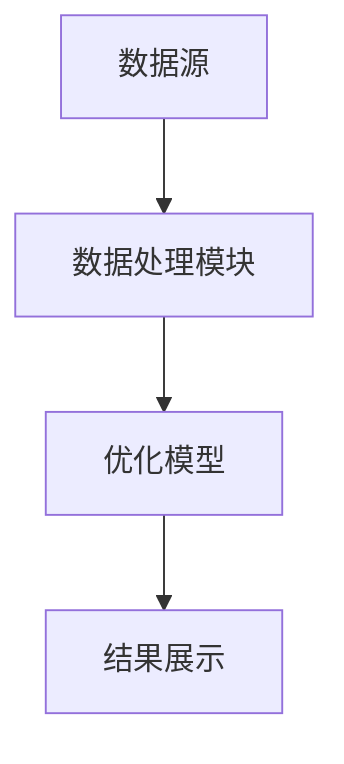

                 


# 股票与债券的平衡：降低投资组合风险的关键

> **关键词**：投资组合、股票、债券、风险管理、资产配置、夏普比率、现代投资组合理论

> **摘要**：本文探讨了股票和债券在投资组合中的平衡作用，分析了如何通过资产配置和风险管理来降低投资组合的整体风险。通过数学模型和实际案例，详细讲解了投资组合优化的策略和实现方法，帮助投资者理解如何在股票和债券之间找到最佳平衡点，以实现风险可控下的最大收益。

---

## 第一部分: 投资组合风险的基础知识

### 第1章: 股票与债券的基本概念

#### 1.1 股票的基本概念
股票是股份公司发行的，证明投资者对该公司部分所有权的证书。它代表了持有者对公司的资产和利润的要求权。股票分为多种类型，包括普通股和优先股。普通股持有人享有投票权，而优先股持有人在股息分配上享有优先权。

**股票的风险与收益特征**：
- **收益**：股票的收益主要来自资本增值（股价上涨）和股息收入。
- **风险**：股票市场波动大，存在市场风险、流动性风险和企业-specific风险。

#### 1.2 债券的基本概念
债券是债务工具，发行人向债券持有人借款，并承诺在特定时间内支付利息和本金。债券的种类包括政府债券、企业债券和 municipal bonds。

**债券的风险与收益特征**：
- **收益**：债券的主要收益来自固定的利息收入和到期时的本金偿还。
- **风险**：债券面临利率风险、流动性风险和信用风险。

#### 1.3 投资组合的基本概念
投资组合是指投资者持有的各种金融资产的集合，旨在通过多样化来降低风险。投资组合的风险和收益取决于资产的配置比例。

---

### 第2章: 投资组合风险的背景与问题描述

#### 2.1 投资组合风险的来源
投资组合风险来源于多种因素，包括市场波动、经济周期、利率变化等。

- **市场风险**：整体市场波动对投资组合的影响。
- **利率风险**：利率变化导致债券价格波动。
- **通货膨胀风险**：通胀影响资产的实际回报。
- **流动性风险**：资产难以快速变现的风险。

#### 2.2 股票与债券在投资组合中的作用
股票和债券在投资组合中起到平衡风险的作用。股票通常提供较高的收益潜力，但波动性较大；债券则提供稳定的收入，波动性较小。

- **股票的高收益与高风险**：适合风险承受能力强的投资者。
- **债券的稳定收益**：适合风险厌恶型的投资者。

#### 2.3 投资组合风险的优化目标
优化投资组合的目标是在风险可控的前提下实现收益最大化。这需要在股票和债券之间找到最佳的平衡点。

---

## 第二部分: 股票与债券的特性与资产配置

### 第3章: 股票与债券的特性分析

#### 3.1 股票的特性分析
股票的价格受多种因素影响，包括公司业绩、市场情绪和宏观经济环境。

- **收益来源**：资本增值和股息收入。
- **风险来源**：市场波动、公司业绩不佳等。

#### 3.2 债券的特性分析
债券的价格受利率和信用等级影响。

- **收益来源**：固定的利息收入。
- **风险来源**：利率上升导致债券价格下跌。

#### 3.3 股票与债券的比较分析

| 特性       | 股票          | 债券          |
|------------|---------------|---------------|
| 收益        | 高            | 稳定          |
| 风险        | 高            | 较低          |
| 流动性      | 较高          | 较高          |
| 价格波动    | 大            | 较小          |

---

## 第三部分: 投资组合优化的数学模型

### 第4章: 现代投资组合理论

#### 4.1 现代投资组合理论（MPT）介绍
MPT由Harry Markowitz提出，认为最优投资组合是那些在给定风险水平下提供最高收益的组合。

#### 4.2 均值-方差优化模型
投资组合优化的目标是找到最优的资产配置比例，使得在给定风险下的收益最大化。

$$\text{最大化 } \mu_p \text{，在 } \sigma_p \text{ 下}$$

其中：
- $\mu_p$ 是投资组合的期望收益。
- $\sigma_p$ 是投资组合的波动性（风险）。

#### 4.3 夏普比率
夏普比率衡量投资组合的风险调整后收益。

$$\text{夏普比率} = \frac{\mu_p - r_f}{\sigma_p}$$

其中：
- $\mu_p$ 是投资组合的收益。
- $r_f$ 是无风险利率。
- $\sigma_p$ 是投资组合的风险。

---

## 第四部分: 系统架构与实现

### 第5章: 投资组合优化系统架构

#### 5.1 系统功能设计
- 数据获取：从市场数据源获取股票和债券的价格数据。
- 模型实现：使用均值-方差模型进行优化。
- 结果展示：生成优化后的资产配置比例和风险收益分析。

#### 5.2 系统架构图



#### 5.3 系统实现代码

```python
import numpy as np
import pandas as pd
from scipy.optimize import minimize

def portfolio_optimization(returns, weights):
    n = len(weights)
    # 定义目标函数：最小化波动性
    def objective(weights):
        return np.dot(weights.T, np.dot(returns, weights))
    
    # 约束条件：权重之和为1
    cons = ({'type': 'eq', 'fun': lambda w: np.sum(w) - 1})
    # 约束条件：权重非负
    cons += [{'type': 'ineq', 'fun': lambda w: w[i] >= 0} for i in range(n)]
    
    result = minimize(objective, np.array(weights), constraints=cons)
    return result.x

# 示例数据
returns = np.array([[0.1, 0.05], [0.05, 0.08]])
weights = [0.5, 0.5]

optimal_weights = portfolio_optimization(returns, weights)
print("最优权重:", optimal_weights)
```

---

## 第五部分: 实战案例分析

### 第6章: 实战案例

#### 6.1 数据获取与预处理
从金融数据源获取股票和债券的历史价格数据，计算收益矩阵。

#### 6.2 模型应用
使用均值-方差模型优化资产配置比例。

#### 6.3 结果分析
分析优化后的投资组合的风险收益比，调整配置比例以适应市场变化。

---

## 第六部分: 总结与展望

### 6.1 总结
通过平衡股票和债券的比例，投资者可以在风险可控的前提下实现收益最大化。现代投资组合理论和数学模型为投资组合优化提供了科学依据。

### 6.2 展望
未来，随着人工智能和大数据技术的发展，投资组合优化将更加精准和高效。

---

**作者：AI天才研究院/AI Genius Institute & 禅与计算机程序设计艺术 /Zen And The Art of Computer Programming**

---

通过本文的详细分析，读者可以理解股票与债券在投资组合中的平衡作用，并掌握如何通过资产配置和风险管理来降低投资组合的整体风险。希望本文对投资者在实际操作中有所帮助。

