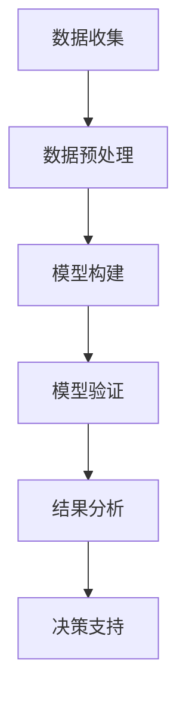
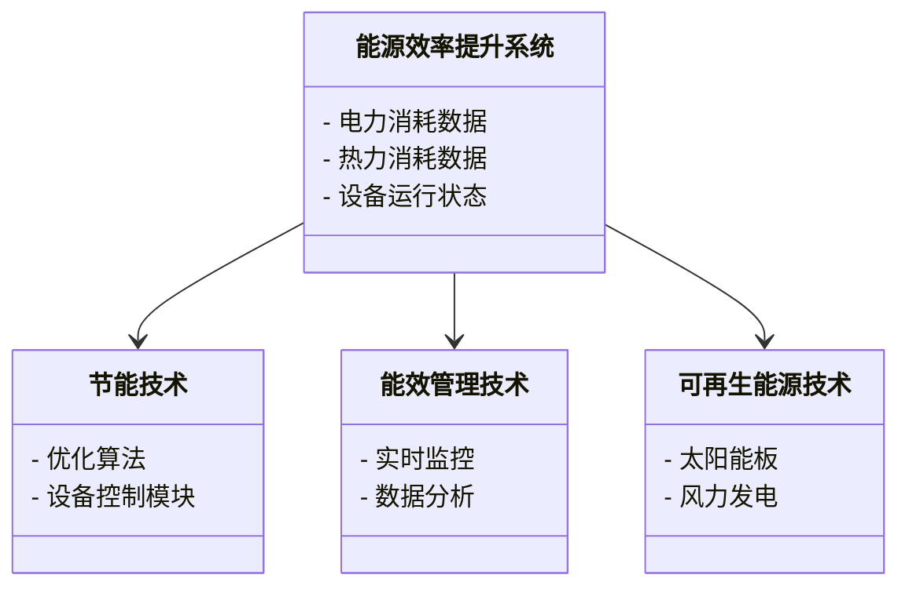
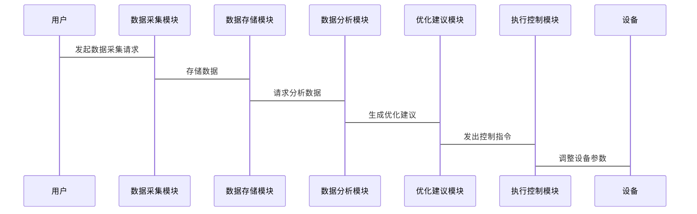

                 

<think>
好的，我现在需要为《能源效率提升技术的投资价值评估》这篇文章撰写详细的正文内容。根据用户的要求，文章需要包括背景介绍、核心概念、算法原理、数学模型、系统分析、项目实战、最佳实践等部分，并且每个部分都要详细展开。以下是具体的思考过程和撰写步骤：

### 第一部分：能源效率提升技术的背景与核心概念

#### 第1章：能源效率提升技术的背景与问题背景

**1.1 能源效率提升的背景与意义**

- **1.1.1 当前能源消耗现状与挑战**

  当前，全球能源消耗主要依赖化石燃料，导致能源危机和环境污染问题日益严重。能源消耗的增长速度超过了全球能源供应的可持续能力，这对经济发展和环境造成了双重压力。

- **1.1.2 能源效率提升的必要性与紧迫性**

  提升能源效率是应对能源危机、减少温室气体排放和实现可持续发展的关键。通过技术手段优化能源使用，可以在减少能源消耗的同时降低运营成本，实现经济效益和环境效益的双赢。

- **1.1.3 能源效率提升与可持续发展的关系**

  可持续发展要求在满足当前需求的同时不损害未来发展的可能性。能源效率提升是实现可持续发展的重要手段，通过合理利用能源，可以减少资源消耗，保护环境，促进经济发展。

**1.2 能源效率提升技术的定义与分类**

- **1.2.1 能源效率提升技术的定义**

  能源效率提升技术是指通过技术创新、设备优化和管理改进等方式，提高能源使用效率，减少能源浪费的技术。

- **1.2.2 能源效率提升技术的主要分类**

  - **节能技术**：通过改进设备、优化工艺流程等方式减少能源消耗。
  - **可再生能源技术**：利用风能、太阳能等可再生能源替代传统能源。
  - **能效管理技术**：通过智能系统实时监控和管理能源使用，优化能源分配。

- **1.2.3 各类技术的核心特征与应用场景**

  - 节能技术：适用于工业生产、建筑等领域。
  - 可再生能源技术：适用于电力供应、交通等领域。
  - 能效管理技术：适用于能源管理、智能电网等领域。

**1.3 能源效率提升技术的经济与社会价值**

- **1.3.1 能源效率提升对经济发展的贡献**

  通过减少能源消耗，降低企业运营成本，提高经济效益。同时，推动技术创新，促进新兴产业发展。

- **1.3.2 能源效率提升对社会可持续发展的影响**

  减少环境污染，缓解能源短缺问题，促进社会和谐发展。

- **1.3.3 技术的市场潜力与投资回报分析**

  能源效率提升技术市场需求大，投资回报周期短，具有较高的市场潜力和投资回报率。

**1.4 能源效率提升技术的政策与市场环境**

- **1.4.1 全球能源政策与法规对能源效率的推动**

  各国政府通过制定能源效率标准、补贴政策等推动能源效率提升技术的发展。

- **1.4.2 各国能源效率提升目标与实施路径**

  不同国家根据自身情况制定能源效率提升目标，采取相应的政策措施。

- **1.4.3 技术创新与市场化的驱动因素**

  市场需求、政策支持和技术创新共同驱动能源效率提升技术的发展。

**1.5 本章小结**

本章介绍了能源效率提升技术的背景、定义、分类及其经济和社会价值，分析了政策与市场环境对技术发展的推动作用，为后续分析奠定了基础。

### 第二部分：能源效率提升技术的核心概念与联系

#### 第2章：能源效率提升技术的核心概念

**2.1 能源效率提升技术的核心原理**

- **2.1.1 能源转换与利用的基本原理**

  能源从一种形式转化为另一种形式，在这个过程中，能量损失是不可避免的。通过技术手段减少能量损失，可以提高能源使用效率。

- **2.1.2 能源效率优化的关键技术特征**

  - 高效性：技术在能源转换过程中损失小，效率高。
  - 可靠性：技术稳定，能够长期运行。
  - 可扩展性：技术适用于不同规模和场景。

- **2.1.3 技术创新对能源效率的推动作用**

  创新是能源效率提升的核心动力，新技术的出现不断推动能源使用效率的提高。

**2.2 能源效率提升技术的关键属性对比**

- **2.2.1 各类技术的效率指标对比**

  对比不同技术的能源效率，例如节能技术的效率提升比例、可再生能源的转化效率等。

- **2.2.2 技术的经济性与环境效益对比**

  从经济成本和环境效益两方面分析不同技术的优劣。

- **2.2.3 技术的适用性与局限性对比**

  不同技术在不同场景下的适用性及其局限性分析。

**2.3 能源效率提升技术的实体关系架构**

- **2.3.1 ER实体关系图的构建**

  构建一个能源效率提升技术的实体关系模型，包括技术、应用领域、政策支持、市场需求等实体及其关系。

- **2.3.2 关键实体间的关联与依赖关系**

  分析技术、政策、市场之间的相互作用和依赖关系。

- **2.3.3 技术应用中的协同效应分析**

  探讨不同技术协同应用带来的效益，例如节能技术和能效管理技术的协同应用。

### 第三部分：能源效率提升技术的投资价值评估方法

#### 第3章：能源效率提升技术的数学模型与算法原理

**3.1 投资价值评估的数学模型**

- **3.1.1 净现值（Net Present Value, NPV）模型**

  NPV是评估投资项目经济可行性的关键指标，计算公式如下：

  $$ NPV = \sum_{t=0}^{n} \frac{C_t}{(1 + r)^t} $$

  其中，\( C_t \) 是第 \( t \) 年的净现金流，\( r \) 是折现率。

- **3.1.2 内部收益率（Internal Rate of Return, IRR）模型**

  IRR是使得投资项目的净现值为零的折现率，公式为：

  $$ NPV = \sum_{t=0}^{n} \frac{C_t}{(1 + IRR)^t} = 0 $$

- **3.1.3 投资回收期（Payback Period）模型**

  投资回收期是指投资项目的现金流入足以收回初始投资所需的时间。

- **3.1.4 资产评估模型与风险调整因子**

  在评估时需要考虑技术风险、市场风险等，通过调整模型参数反映这些风险因素。

**3.2 投资价值评估的算法流程**

- **3.2.1 数据收集与处理流程**

  - 收集历史数据和市场数据。
  - 数据清洗和预处理。

- **3.2.2 参数估计与模型构建**

  - 确定模型参数，如折现率、现金流预测等。
  - 构建数学模型，进行模拟计算。

- **3.2.3 模型验证与优化**

  - 验证模型的准确性和稳定性。
  - 根据实际情况调整模型参数，优化模型。

- **3.2.4 结果分析与决策支持**

  - 分析模型结果，评估投资价值。
  - 提供决策支持，帮助投资者做出最优选择。

**3.3 投资价值评估的流程图**

使用 Mermaid 绘制流程图：



**3.4 投资价值评估的数学公式**

- 净现值计算公式：

  $$ NPV = \sum_{t=0}^{n} \frac{C_t}{(1 + r)^t} $$

- 内部收益率计算公式：

  $$ NPV = \sum_{t=0}^{n} \frac{C_t}{(1 + IRR)^t} = 0 $$

### 第四部分：系统分析与架构设计方案

#### 第4章：能源效率提升技术的系统分析与架构设计

**4.1 问题场景介绍**

- 描述一个具体的能源效率提升项目，例如某工厂的节能改造项目。

**4.2 项目介绍**

- 项目目标：提高能源使用效率，降低运营成本。
- 项目范围：涵盖工厂的生产线、设备和能源管理。

**4.3 系统功能设计（领域模型 Mermaid 类图）**

使用 Mermaid 绘制领域模型类图：



**4.4 系统架构设计（Mermaid 架构图）**

使用 Mermaid 绘制系统架构图：


**4.5 系统接口设计**

- 数据采集接口：采集设备运行数据和能源消耗数据。
- 数据存储接口：将数据存入数据库。
- 数据分析接口：对数据进行处理和分析，生成优化建议。
- 执行控制接口：根据优化建议调整设备运行参数。

**4.6 系统交互 Mermaid 序列图**

使用 Mermaid 绘制系统交互序列图：



### 第五部分：项目实战

#### 第5章：能源效率提升技术的项目实战

**5.1 环境安装**

- 安装必要的软件和工具，如编程语言、数据分析工具等。

**5.2 系统核心实现源代码**

- 以下是某节能优化算法的伪代码示例：

```python
def energy_efficiency_optimization(data):
    # 数据预处理
    processed_data = preprocess(data)
    # 参数估计
    params = estimate_params(processed_data)
    # 优化算法
    optimal_solution = optimize(processed_data, params)
    # 结果分析
    return analyze(optimal_solution)
```

**5.3 代码应用解读与分析**

- 解释代码的功能和实现步骤，分析优化算法的效率和效果。

**5.4 实际案例分析和详细讲解剖析**

- 以某企业为例，分析其能源使用情况，评估不同技术的投资价值，提出优化建议。

**5.5 项目小结**

总结项目实施的经验和教训，提出改进建议。

### 第六部分：最佳实践与小结

#### 第6章：最佳实践、小结、注意事项与拓展阅读

**6.1 最佳实践**

- 技术选型：根据具体需求选择合适的技术方案。
- 数据管理：确保数据的准确性和完整性。
- 风险控制：制定风险应对策略，降低投资风险。

**6.2 小结**

总结全文，重申能源效率提升技术的重要性和投资价值，强调技术创新和政策支持对技术发展的推动作用。

**6.3 注意事项**

- 投资者在评估时应充分考虑技术风险和市场变化。
- 技术开发者应关注技术创新和成本优化。

**6.4 拓展阅读**

推荐相关领域的书籍和论文，供读者进一步学习和研究。

---

**作者：AI天才研究院/AI Genius Institute & 禅与计算机程序设计艺术 /Zen And The Art of Computer Programming**

---

通过以上详细的思考过程，我可以系统地撰写出一篇结构清晰、内容详实的技术博客文章，全面分析能源效率提升技术的投资价值评估。

