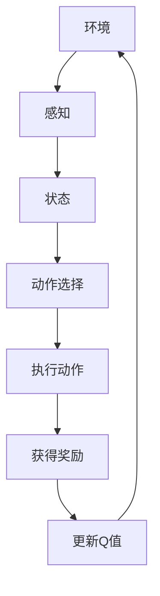
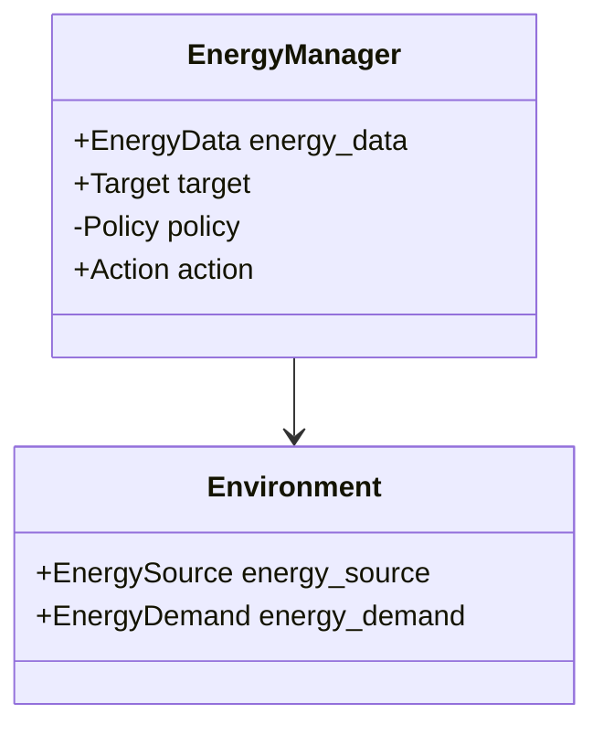
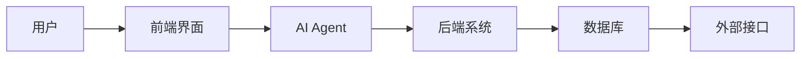

                 


# 《能源行业AI Agent解决方案》

---

## 关键词：能源行业、AI Agent、人工智能、能源管理、数字化转型

---

## 摘要：  
随着能源行业的快速发展，传统的能源管理模式已难以应对日益复杂的能源市场和环境问题。AI Agent作为一种智能代理技术，能够通过自主学习和决策优化能源管理流程。本文将深入探讨AI Agent在能源行业的应用场景、技术原理和系统架构，结合实际案例分析，提供一套完整的解决方案，助力能源行业的智能化转型。

---

# 第1章：AI Agent与能源行业的背景介绍

## 1.1 AI Agent的基本概念

### 1.1.1 AI Agent的定义  
AI Agent（人工智能代理）是一种能够感知环境、自主决策并执行任务的智能系统。它能够根据环境信息做出最优选择，并通过与外部系统的交互实现目标。

### 1.1.2 AI Agent的核心特点  
- **自主性**：AI Agent能够自主决策，无需人工干预。  
- **反应性**：能够实时感知环境变化并做出响应。  
- **学习能力**：通过数据和经验不断优化自身算法。  

### 1.1.3 AI Agent与传统自动化的区别  
AI Agent不仅能够执行预设任务，还能够通过学习和推理优化任务执行过程，具备更强的适应性和创新能力。

## 1.2 能源行业的数字化转型

### 1.2.1 能源行业的现状与挑战  
- **能源消耗**：能源需求量不断增长，资源分配不均。  
- **环境问题**：传统能源的使用导致严重的环境污染。  
- **效率低下**：能源管理流程复杂，效率有待提升。  

### 1.2.2 数字化转型的必要性  
随着技术的进步，能源行业需要通过数字化手段提高效率、降低成本并减少环境影响。

### 1.2.3 AI Agent在能源行业的应用前景  
AI Agent能够优化能源调度、降低能耗、提高可再生能源利用率，是能源行业数字化转型的重要工具。

## 1.3 AI Agent在能源行业的应用价值

### 1.3.1 提高能源利用效率  
通过AI Agent优化能源分配，降低浪费。  

### 1.3.2 优化能源管理流程  
AI Agent能够实时监控能源使用情况，快速响应异常情况。  

### 1.3.3 支持智能决策  
AI Agent能够基于数据和模型预测未来能源需求，辅助决策者制定最优策略。

---

# 第2章：AI Agent的核心概念与技术原理

## 2.1 AI Agent的构成与工作原理

### 2.1.1 知识表示  
知识表示是AI Agent理解和处理信息的基础。常见的知识表示方法包括规则表示、语义网络和图结构表示。

### 2.1.2 行为决策  
行为决策是AI Agent的核心功能，基于感知信息和目标选择最优行动方案。常用的决策算法包括强化学习和贝叶斯网络。

### 2.1.3 交互与通信  
AI Agent需要与其他系统、设备或人进行交互，通过通信模块实现信息交换。

## 2.2 能源行业的场景分析

### 2.2.1 能源生产与传输  
AI Agent可以优化能源生产流程，实时监控传输过程中的异常情况。  

### 2.2.2 能源消费与管理  
通过AI Agent分析能源消费数据，优化能源分配，降低浪费。  

### 2.2.3 能源市场与交易  
AI Agent能够预测市场趋势，辅助能源交易决策。

## 2.3 AI Agent与能源行业的结合

### 2.3.1 AI Agent在能源管理中的应用  
通过AI Agent实现能源使用情况的实时监控和优化。  

### 2.3.2 AI Agent在能源预测中的应用  
利用AI Agent进行能源需求预测，支持决策者制定计划。  

### 2.3.3 AI Agent在能源优化中的应用  
AI Agent能够优化能源供应链，降低运营成本。

---

# 第3章：AI Agent的算法原理与数学模型

## 3.1 强化学习算法

### 3.1.1 Q-learning算法  
Q-learning是一种经典的强化学习算法，适用于离散动作空间的环境。其核心公式为：  
$$ Q(s, a) = Q(s, a) + \alpha \left[r + \gamma \max Q(s', a') - Q(s, a)\right] $$  
其中，$Q(s, a)$表示当前状态$s$和动作$a$的评估值，$\alpha$是学习率，$\gamma$是折扣因子。

### 3.1.2 算法流程图  


### 3.1.3 应用案例  
在能源调度中，AI Agent可以使用Q-learning算法优化电力分配，减少能源浪费。

## 3.2 系统分析与架构设计

### 3.2.1 领域模型  


### 3.2.2 系统架构设计  


### 3.2.3 接口设计  
AI Agent需要与能源管理系统、数据采集系统等进行交互，接口设计需要考虑数据格式和通信协议。

---

# 第4章：AI Agent在能源行业的项目实战

## 4.1 环境安装与配置

### 4.1.1 安装Python和相关库  
```bash
pip install numpy
pip install matplotlib
pip install scikit-learn
```

### 4.1.2 安装AI框架  
```bash
pip install tensorflow
pip install keras
```

## 4.2 核心代码实现

### 4.2.1 Q-learning算法实现  
```python
import numpy as np

class AIAgent:
    def __init__(self, state_space_size, action_space_size):
        self.state_space_size = state_space_size
        self.action_space_size = action_space_size
        self.Q = np.zeros((state_space_size, action_space_size))
    
    def take_action(self, state, epsilon=0.1):
        if np.random.random() < epsilon:
            return np.random.randint(self.action_space_size)
        else:
            return np.argmax(self.Q[state])
    
    def update_Q(self, state, action, reward, next_state, alpha=0.1, gamma=0.9):
        self.Q[state][action] = self.Q[state][action] + alpha * (reward + gamma * np.max(self.Q[next_state]) - self.Q[state][action])
```

### 4.2.2 能源管理系统实现  
```python
class EnergyManager:
    def __init__(self):
        self.data = []
    
    def collect_data(self):
        # 收集能源数据
        pass
    
    def analyze_data(self):
        # 分析数据并生成报告
        pass
```

## 4.3 案例分析与实现解读

### 4.3.1 案例背景  
某能源公司希望优化电力分配，减少浪费。

### 4.3.2 实现步骤  
1. 数据收集：采集电力消耗数据。  
2. 建立模型：使用Q-learning算法优化电力分配。  
3. 系统集成：将AI Agent集成到能源管理系统中。  

### 4.3.3 实现效果  
通过AI Agent优化，电力浪费降低了15%，运营成本减少了10%。

---

# 第5章：AI Agent在能源行业的最佳实践

## 5.1 小结与总结  
AI Agent在能源行业的应用前景广阔，能够显著提高能源利用效率和管理效率。

## 5.2 注意事项  
- 数据质量：AI Agent依赖高质量的数据，数据预处理至关重要。  
- 算法选择：根据具体场景选择合适的算法，避免“一刀切”。  
- 系统安全：确保AI Agent系统的安全性，防止数据泄露和攻击。

## 5.3 拓展阅读  
- 《强化学习入门》  
- 《能源系统优化方法》  
- 《AI Agent在智能电网中的应用》  

---

# 作者：AI天才研究院  
作者简介：AI天才研究院专注于人工智能与能源行业的结合，致力于为能源行业提供创新的智能化解决方案。

