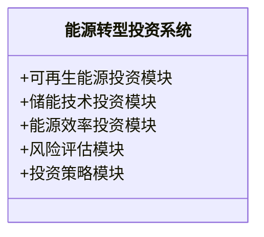
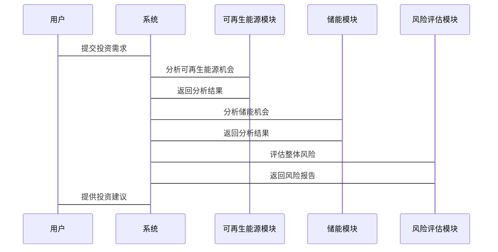

                 


# 能源转型投资：机遇与风险分析

## 关键词：
- 能源转型，投资，可再生能源，风险分析，机会分析，能源效率

## 摘要：
能源转型是全球关注的焦点，随着传统能源的枯竭和环境问题的加剧，向可再生能源的转变成为必然趋势。本文探讨能源转型投资中的机遇与风险，分析技术、政策和市场的多维度影响，帮助投资者制定有效的策略，抓住投资机会，降低风险。

---

## 第1章：能源转型投资的背景与问题描述

### 1.1 能源转型的背景与重要性

能源转型是全球能源系统从化石燃料向可再生能源的转变，主要由气候变化、资源枯竭和环境污染驱动。这一转型不仅关乎环境保护，也影响经济发展和能源安全。

#### 1.1.1 全球能源结构的变化趋势
全球能源消费正从化石燃料向可再生能源过渡，各国政府和企业加大投资，推动能源结构优化。

#### 1.1.2 能源转型对全球经济的影响
能源转型将重塑全球经济格局，创造新的投资机会，同时带来技术和商业模式的创新。

#### 1.1.3 投资在能源转型中的关键作用
投资是推动能源转型的核心动力，尤其是在技术研发和基础设施建设方面。

### 1.2 问题背景与问题描述

#### 1.2.1 当前能源系统面临的挑战
传统能源系统依赖化石燃料，面临资源枯竭、环境污染和气候变化等问题。

#### 1.2.2 能源转型的核心问题
如何在经济可行的前提下，实现从化石燃料到可再生能源的平稳过渡，同时确保能源供应的安全性和稳定性。

#### 1.2.3 问题的边界与外延
能源转型不仅涉及能源生产，还包括能源存储、传输和消费模式的改变，影响整个产业链。

### 1.3 问题解决与投资机会

#### 1.3.1 能源转型的解决方案概述
技术创新、政策支持和市场驱动是实现能源转型的关键因素。

#### 1.3.2 投资在能源转型中的角色
投资者在技术研发、基础设施建设和市场拓展中发挥关键作用，推动可再生能源的发展。

#### 1.3.3 投资机会的初步分析
可再生能源、储能技术和能源效率等领域具备较高的投资潜力。

---

## 第2章：能源转型投资的核心概念

### 2.1 能源转型投资的定义与特征

#### 2.1.1 能源转型投资的定义
能源转型投资指在可再生能源、储能和能源效率等领域的投资，旨在推动能源系统向清洁、高效转型。

#### 2.1.2 能源转型投资的核心特征
- 可持续性：关注长期环境效益。
- 创新驱动：依赖新技术的开发和应用。
- 风险较高：市场和技术不确定性较大。
- 政策依赖：受政府政策和法规影响显著。

#### 2.1.3 能源转型投资与传统能源投资的区别
传统能源投资集中在化石燃料，而转型投资聚焦于可再生能源和新技术。

### 2.2 能源转型投资的关键要素

#### 2.2.1 技术创新
技术创新是推动能源转型的核心动力，尤其是太阳能、风能等可再生能源技术的进步。

#### 2.2.2 政策支持
政府政策和法规对能源转型投资起着关键作用，包括补贴、税收优惠和监管框架。

#### 2.2.3 市场需求
随着环保意识的增强和能源需求的增长，市场对可再生能源的需求持续上升。

### 2.3 能源转型投资的分析框架

#### 2.3.1 技术维度的分析
分析可再生能源技术的成熟度、成本和 scalability，评估其市场竞争力。

#### 2.3.2 政策维度的分析
研究政府政策对能源转型的影响，包括补贴、税收和监管变化。

#### 2.3.3 市场维度的分析
评估市场需求、竞争状况和价格走势，预测投资回报。

---

## 第3章：能源转型投资的风险分析

### 3.1 风险分析的必要性

#### 3.1.1 风险分析的重要性
识别和评估风险是制定投资策略的关键步骤，有助于投资者做出明智决策。

#### 3.1.2 风险分析的步骤
- 识别潜在风险
- 分析风险的影响
- 制定风险管理策略

### 3.2 能源转型投资的主要风险

#### 3.2.1 技术风险
技术不成熟或研发失败可能导致项目失败，影响投资回报。

#### 3.2.2 政策风险
政策变化可能影响投资收益，例如补贴减少或法规收紧。

#### 3.2.3 市场风险
市场需求不足或价格波动可能导致投资损失。

### 3.3 风险评估模型

#### 3.3.1 风险评估模型的构建
采用层次分析法（AHP）构建风险评估模型，考虑技术、政策和市场三个维度。

#### 3.3.2 风险评估模型的实施
通过权重分配和综合评分，评估不同投资项目的整体风险水平。

---

## 第4章：能源转型投资的机遇分析

### 4.1 可再生能源投资的机遇

#### 4.1.1 太阳能
技术进步降低成本，市场需求增长，投资回报显著。

#### 4.1.2 风能
技术成熟，成本下降，政策支持推动市场扩张。

#### 4.1.3 水能
作为稳定的可再生能源，水能发电技术成熟，市场潜力大。

### 4.2 储能技术投资的机遇

#### 4.2.1 储能技术的发展现状
电池技术进步，储能系统成本下降，应用范围扩大。

#### 4.2.2 储能技术的未来趋势
随着技术进步和规模效应，储能成本将进一步降低，应用更加广泛。

### 4.3 能源效率投资的机遇

#### 4.3.1 能源效率的提升空间
通过技术改进和管理优化，提高能源使用效率，降低成本。

#### 4.3.2 能源效率投资的回报潜力
高效能设备和智能系统投资回报周期短，经济效益显著。

---

## 第5章：机会评估与投资策略

### 5.1 投资策略的制定

#### 5.1.1 投资目标的确定
明确投资目标，选择适合的可再生能源领域，如太阳能或风能。

#### 5.1.2 投资组合的优化
分散投资于不同领域和项目，降低整体风险。

### 5.2 投资风险的管理

#### 5.2.1 风险分散
通过多样化投资，降低单一项目风险。

#### 5.2.2 风险对冲
利用金融工具对冲政策和技术风险，确保投资组合的稳定性。

---

## 第6章：能源转型投资的系统分析与架构设计

### 6.1 系统功能设计

#### 6.1.1 领域模型（Mermaid 类图）


### 6.2 系统架构设计

#### 6.2.1 系统架构图（Mermaid 架构图）
```mermaid
client
    /api
server
    /energy-transition-invest
```

### 6.3 系统接口设计

#### 6.3.1 接口描述
- API接口用于数据传输和功能调用，确保系统模块之间的通信。

### 6.4 系统交互流程（Mermaid 序列图）


---

## 第7章：项目实战

### 7.1 环境安装

#### 7.1.1 安装Python和相关库
```bash
pip install numpy pandas matplotlib
```

### 7.2 核心代码实现

#### 7.2.1 风险评估模型
```python
import numpy as np
import pandas as pd

def risk_assessment(projects):
    weights = [0.4, 0.3, 0.3]  # 技术、政策、市场权重
    risks = []
    for proj in projects:
        tech_risk = proj['tech_risk']
        policy_risk = proj['policy_risk']
        market_risk = proj['market_risk']
        total_risk = weights[0] * tech_risk + weights[1] * policy_risk + weights[2] * market_risk
        risks.append(total_risk)
    return risks

# 示例项目数据
projects = [
    {'tech_risk': 0.2, 'policy_risk': 0.3, 'market_risk': 0.4},
    {'tech_risk': 0.3, 'policy_risk': 0.2, 'market_risk': 0.5}
]

risks = risk_assessment(projects)
print(risks)
```

### 7.3 案例分析与总结

#### 7.3.1 案例分析
分析一个太阳能项目，评估其技术、政策和市场风险，计算总风险评分。

#### 7.3.2 项目总结
项目实施的关键因素，包括技术选型、政策合规和市场定位。

---

## 第8章：总结与展望

### 8.1 全文总结
能源转型投资潜力巨大，但也面临技术和政策风险。通过科学的风险评估和策略制定，投资者可以有效抓住机遇，降低风险。

### 8.2 未来展望
随着技术进步和政策支持，能源转型投资将继续增长，推动全球能源系统向清洁、高效方向发展。

---

## 作者：AI天才研究院 & 禅与计算机程序设计艺术

