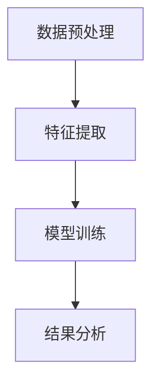
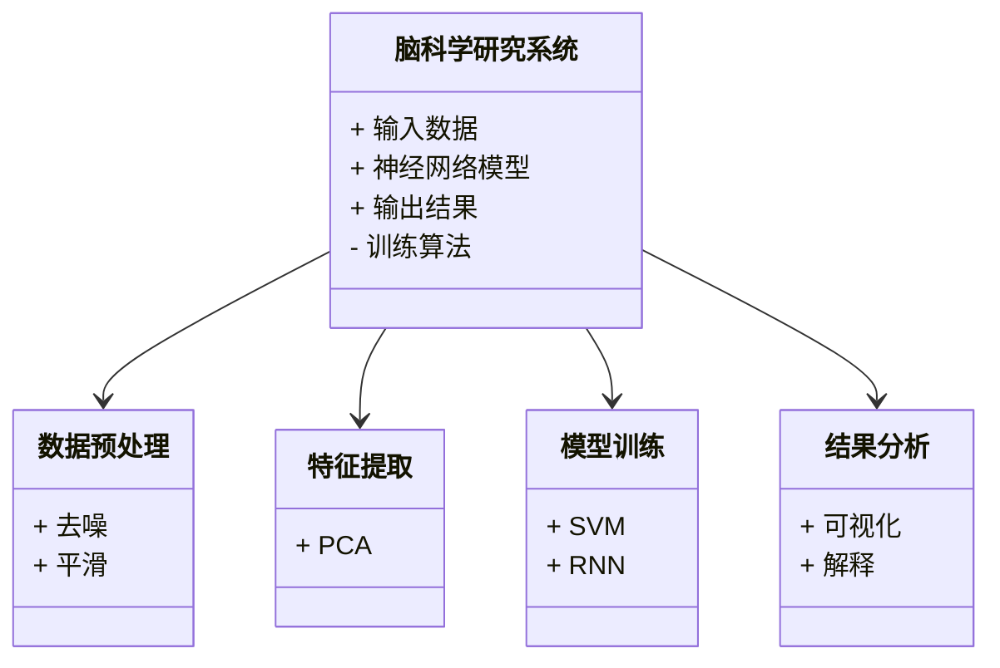
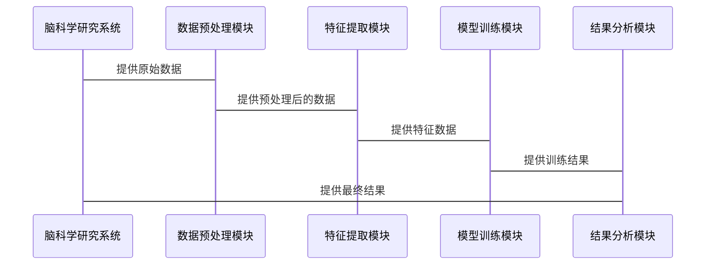

                 


# 脑科学研究进展对医疗和教育领域的影响

---

## 关键词：脑科学研究，医疗，教育，神经科学，认知科学，个性化学习，医疗影像，神经康复

---

## 摘要

脑科学研究的飞速进展为医疗和教育领域带来了深远的影响。通过理解大脑的工作机制，科学家们能够开发出更有效的治疗方法和教育策略。本文将探讨脑科学研究在医疗和教育领域的具体应用，分析其带来的变革，并展望未来的发展方向。

---

## 第1章: 脑科学研究的背景与现状

### 1.1 脑科学研究的历史与发展

#### 1.1.1 从经典神经科学到现代脑科学研究的演进

神经科学的研究可以追溯到古希腊时期，但真正意义上的现代脑科学研究始于20世纪。随着科技的进步，科学家们能够更深入地探索大脑的结构和功能。

- **经典神经科学**：主要关注神经元的基本功能和神经冲动的传导。
- **现代脑科学研究**：借助先进的技术手段，如fMRI和EEG，研究者能够实时观察大脑活动，揭示神经网络的复杂性。

#### 1.1.2 当代脑科学研究的主要方向

当代脑科学研究主要集中在以下几个方向：

1. **神经可塑性**：研究大脑如何通过改变结构和功能来适应环境变化。
2. **认知神经科学**：探讨记忆、学习、决策等高级认知功能的神经机制。
3. **神经网络与人工智能**：将大脑的神经网络原理应用于AI算法设计。

#### 1.1.3 脑科学研究的技术突破与未来趋势

近年来，脑科学研究的技术突破包括：

- **非侵入式脑成像技术**：如fMRI和EEG，使得大脑活动的实时监测成为可能。
- **神经调控技术**：如深部脑刺激（DBS）和经颅磁刺激（TMS），用于治疗神经系统疾病。

未来，脑科学研究将朝着更精准、更个体化的方向发展，尤其是在医疗和教育领域的应用潜力巨大。

---

## 第2章: 脑科学研究对医疗领域的影响

### 2.1 神经康复与脑损伤修复

#### 2.1.1 脑损伤的神经可塑性机制

神经可塑性是指大脑在受到损伤后，通过重新组织神经元连接来恢复功能的机制。这一过程为神经康复提供了理论基础。

- **关键机制**：神经元之间的突触连接强度变化和新神经元的生成。
- **应用案例**：通过康复训练激活神经可塑性，帮助中风患者恢复运动功能。

#### 2.1.2 神经康复技术的应用与挑战

现代神经康复技术包括：

1. **虚拟现实康复**：通过虚拟现实环境模拟日常场景，帮助患者进行功能训练。
2. **神经反馈训练**：利用EEG技术实时监测大脑活动，指导患者进行自我调节。

#### 2.1.3 基于脑科学的康复训练方案设计

基于神经可塑性的康复方案设计需要结合患者的个体差异，制定个性化的训练计划。

- **个性化方案**：根据患者的神经活动特点，调整训练强度和内容。
- **效果评估**：通过神经影像技术监测神经可塑性变化，评估康复效果。

### 2.2 精神疾病与脑科学研究

#### 2.2.1 精神疾病的神经机制研究

精神疾病如抑郁症和焦虑症的神经机制研究揭示了大脑功能异常的根源。

- **抑郁症的神经机制**：前额叶皮层和海马的活动异常与情绪调节功能受损有关。
- **焦虑症的神经机制**：杏仁核过度激活导致情绪处理异常。

#### 2.2.2 脑科学在抑郁症、焦虑症等疾病治疗中的应用

- **药物治疗**：基于神经递质调节的药物设计，如SSRIs。
- **神经调控治疗**：如DBS和TMS，用于治疗难治性抑郁症。

#### 2.2.3 精准医疗与个体化治疗方案的实现

精准医疗通过基因检测和神经影像分析，为患者制定个性化的治疗方案。

- **基因组学**：分析与疾病相关的基因变异。
- **神经影像**：评估大脑结构和功能的异常。

### 2.3 脑科学研究在医学影像与诊断中的应用

#### 2.3.1 医学影像分析的脑科学基础

医学影像技术的进步依赖于对大脑功能的理解。

- **fMRI技术**：揭示大脑功能分区的动态变化。
- **PET扫描**：用于检测神经递质的活动。

#### 2.3.2 基于AI的脑部疾病诊断技术

人工智能技术在医学影像分析中的应用显著提高了诊断效率和准确性。

- **深度学习模型**：用于自动识别病变区域。
- **数据挖掘**：从大量数据中提取有用的诊断信息。

#### 2.3.3 脑科学研究对医学影像技术的推动作用

脑科学研究为医学影像技术提供了理论支持，推动了技术的不断进步。

- **算法优化**：基于脑科学原理改进图像处理算法。
- **精准诊断**：通过分析大脑活动，实现疾病的早期发现。

---

## 第3章: 脑科学研究对教育领域的影响

### 3.1 脑科学与学习机制

#### 3.1.1 学习记忆的神经机制

学习记忆的神经机制研究表明，海马和内嗅皮层在记忆形成中起关键作用。

- **短期记忆与长期记忆**：短期记忆依赖海马，长期记忆依赖内嗅皮层。
- **神经元的突触可塑性**：突触强度的改变是记忆形成的基础。

#### 3.1.2 不同学习风格的神经特征

不同学习风格（如视觉型、听觉型）对应不同的大脑活动模式。

- **视觉型学习者**：视觉皮层活动较强。
- **听觉型学习者**：听觉皮层活动较强。

#### 3.1.3 基于脑科学的个性化学习方案设计

个性化学习方案设计需要考虑个体的神经特征。

- **认知风格分析**：通过神经影像技术确定个体的学习偏好。
- **动态调整**：根据学习效果实时调整教学策略。

### 3.2 教育领域的脑科学研究应用

#### 3.2.1 注意力机制与教学策略

注意力机制是学习过程中至关重要的一部分。

- **注意力的神经机制**：前额叶皮层和顶叶皮层共同参与注意力调节。
- **教学中的应用**：通过设计吸引注意力的教学材料，提高学习效果。

#### 3.2.2 情绪调节与学习效果

情绪状态直接影响学习效果。

- **情绪的神经机制**：杏仁核和前额叶皮层共同调节情绪反应。
- **教学中的应用**：通过情绪管理训练提高学生的学习能力。

#### 3.2.3 脑科学研究对教育模式的改变

脑科学研究为教育模式的创新提供了科学依据。

- **翻转课堂**：基于神经科学的理论，优化教学流程。
- **混合式教学**：结合在线学习和面对面教学，提高学习效果。

### 3.3 未来的教育方向

#### 3.3.1 脑科学研究对教育技术的推动

教育技术的进步依赖于脑科学研究的成果。

- **教育游戏设计**：基于大脑的奖赏机制设计游戏，提高学习趣味性。
- **智能教学系统**：通过分析学生的大脑活动，提供个性化的教学支持。

#### 3.3.2 脑科学研究对教师培训的影响

教师需要掌握脑科学研究的基本知识，以更好地指导学生学习。

- **教师培训内容**：包括神经科学基础和教育应用策略。
- **培训方式**：结合实际案例，提高教师的实践能力。

#### 3.3.3 教育公平与脑科学研究

脑科学研究为实现教育公平提供了新的思路。

- **资源分配**：根据学生的学习需求，合理分配教育资源。
- **政策制定**：基于脑科学研究的成果，制定更有效的教育政策。

---

## 第4章: 算法与数学模型

### 4.1 脑科学研究中的算法原理

#### 4.1.1 机器学习在脑科学研究中的应用

机器学习技术在脑科学研究中被广泛应用，特别是在数据分析和模式识别方面。

- **数据预处理**：对脑电信号进行去噪和平滑处理。
- **特征提取**：通过主成分分析（PCA）提取有用的特征。
- **分类与预测**：使用支持向量机（SVM）和随机森林（RF）进行分类。

#### 4.1.2 基于深度学习的脑科学研究

深度学习在脑科学研究中的应用主要体现在图像分析和序列建模方面。

- **卷积神经网络（CNN）**：用于医学影像的分割和分类。
- **循环神经网络（RNN）**：用于时间序列数据的分析，如EEG信号处理。

#### 4.1.3 算法流程图



### 4.2 数学模型与公式

#### 4.2.1 神经网络的基本数学模型

神经网络的数学模型包括激活函数和损失函数。

- **激活函数**：如sigmoid函数：
  $$ f(x) = \frac{1}{1 + e^{-x}} $$
- **损失函数**：如均方误差：
  $$ L = \frac{1}{n}\sum_{i=1}^{n}(y_i - \hat{y}_i)^2 $$

#### 4.2.2 神经网络的训练过程

神经网络的训练过程包括正向传播和反向传播两个阶段。

- **正向传播**：将输入数据通过网络计算出输出结果。
- **反向传播**：计算损失函数的梯度，更新网络参数。

---

## 第5章: 系统设计与架构方案

### 5.1 系统功能设计

#### 5.1.1 领域模型（Mermaid类图）



### 5.2 系统架构设计

#### 5.2.1 系统架构（Mermaid架构图）


### 5.3 系统接口设计

#### 5.3.1 系统接口

- **输入接口**：接收原始数据，如EEG信号。
- **输出接口**：输出分析结果，如分类标签。

#### 5.3.2 系统交互（Mermaid序列图）



---

## 第6章: 项目实战

### 6.1 环境安装

#### 6.1.1 安装Python环境

```bash
pip install numpy
pip install scikit-learn
pip install matplotlib
pip install pytorch
```

### 6.2 核心代码实现

#### 6.2.1 数据预处理代码

```python
import numpy as np

def preprocess(data):
    # 去噪
    filtered_data = np.zeros_like(data)
    for i in range(len(data)):
        filtered_data[i] = data[i] - 2 * data[i-1] + data[i-2]
    # 平滑
    smoothed_data = np.convolve(filtered_data, np.ones(5)/5, mode='valid')
    return smoothed_data
```

#### 6.2.2 模型训练代码

```python
import torch
import torch.nn as nn

class SimpleNN(nn.Module):
    def __init__(self, input_size, hidden_size, output_size):
        super(SimpleNN, self).__init__()
        self.fc1 = nn.Linear(input_size, hidden_size)
        self.fc2 = nn.Linear(hidden_size, output_size)
        self.relu = nn.ReLU()
    
    def forward(self, x):
        out = self.fc1(x)
        out = self.relu(out)
        out = self.fc2(out)
        return out

model = SimpleNN(input_size=10, hidden_size=20, output_size=5)
criterion = nn.CrossEntropyLoss()
optimizer = torch.optim.Adam(model.parameters(), lr=0.001)
```

### 6.3 代码应用解读与分析

#### 6.3.1 数据预处理

数据预处理是脑科学研究中不可或缺的一步，去噪和平滑处理能够提高数据质量，为后续分析提供更准确的基础。

#### 6.3.2 模型训练

神经网络模型的训练过程包括正向传播和反向传播两个阶段，通过优化算法不断更新模型参数，最终达到较好的分类效果。

### 6.4 实际案例分析和详细讲解剖析

#### 6.4.1 案例分析

以EEG信号分类为例，通过预处理后的数据输入神经网络模型，实现对不同情绪状态的分类。

- **数据来源**：实验中收集的EEG信号。
- **模型训练**：使用SVM和RNN两种算法进行训练。
- **结果分析**：比较两种算法的分类准确率。

### 6.5 项目小结

通过本项目，我们验证了神经网络在脑科学研究中的应用潜力，同时也发现了数据质量对模型性能的重要影响。

---

## 第7章: 结论与展望

### 7.1 脑科学研究的成果总结

脑科学研究的成果已经渗透到医疗和教育领域的方方面面，从疾病治疗到学习优化，脑科学研究为人类提供了更科学的解决方案。

### 7.2 对未来发展的展望

未来，脑科学研究将继续推动医疗和教育领域的发展，尤其是在以下几个方面：

- **精准医疗**：基于个体基因和神经特征的个性化治疗方案。
- **智能教育**：结合脑科学研究成果，开发更高效的教育工具和方法。

### 7.3 最佳实践 tips

- **数据质量**：确保数据的准确性和完整性。
- **算法选择**：根据具体问题选择合适的算法。
- **模型解释性**：关注模型的可解释性，避免黑箱操作。

---

## 作者：AI天才研究院/AI Genius Institute & 禅与计算机程序设计艺术/Zen And The Art of Computer Programming

---

通过以上结构和内容，我们可以看到脑科学研究在医疗和教育领域的深远影响。希望这篇技术博客能够为读者提供有价值的见解和启发。

