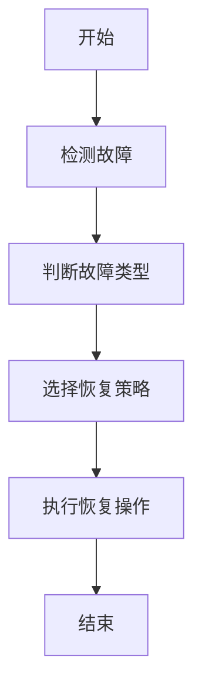
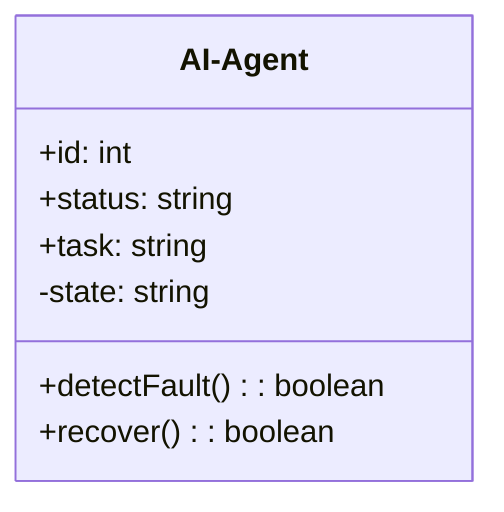
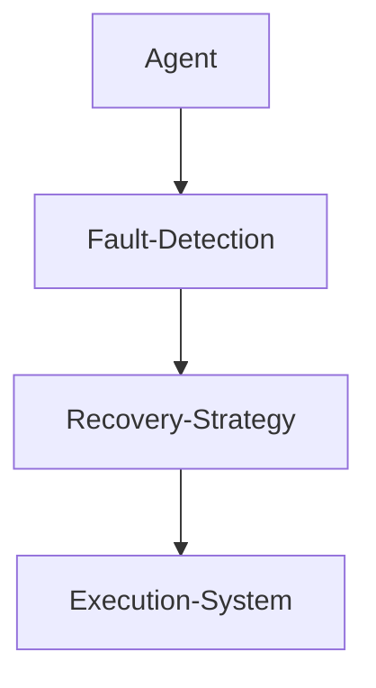
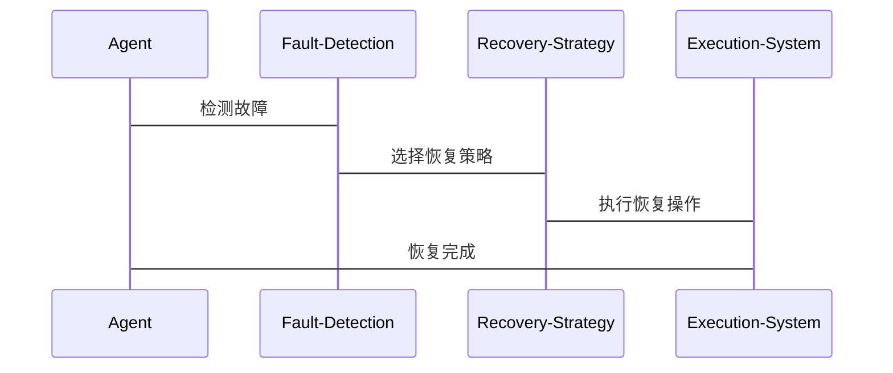

                 


# 自动故障恢复：提高AI Agent的可靠性

## 关键词：
自动故障恢复, AI Agent, 可靠性, 系统架构, 算法原理, 项目实战

## 摘要：
本文深入探讨了自动故障恢复技术在提升AI Agent可靠性中的关键作用。通过分析故障检测与恢复的核心算法，结合系统架构设计，提出了提高AI Agent稳定性的解决方案。文章从理论到实践，系统性地介绍了自动故障恢复的实现路径，为读者提供了全面的技术指导。

---

# 第1章: 自动故障恢复与AI Agent可靠性概述

## 1.1 自动故障恢复的背景与意义
### 1.1.1 故障恢复的背景介绍
在现代计算机系统中，故障恢复技术是确保系统稳定运行的关键。随着AI Agent的应用越来越广泛，其可靠性问题变得尤为重要。AI Agent作为一种智能代理，需要在复杂多变的环境中自主运行，而故障恢复能力是其核心能力之一。

### 1.1.2 AI Agent在现代系统中的重要性
AI Agent能够执行复杂任务，例如自然语言处理、图像识别和决策优化。然而，这些任务的复杂性也使得AI Agent更容易受到硬件故障、网络中断或算法错误的影响。因此，提高AI Agent的可靠性不仅是技术需求，更是用户体验的保障。

### 1.1.3 自动故障恢复的核心价值
自动故障恢复能够帮助AI Agent在发生故障时，自动检测问题并采取恢复措施，从而减少系统停机时间，提高系统的可用性和稳定性。这种技术不仅降低了维护成本，还提升了用户对系统的信任度。

## 1.2 AI Agent可靠性问题的提出
### 1.2.1 可靠性问题的定义与特征
可靠性是指系统在规定条件下完成指定功能的能力。对于AI Agent而言，可靠性问题主要体现在算法错误、数据丢失、网络中断等方面。这些问题可能导致AI Agent无法正常执行任务，甚至引发严重后果。

### 1.2.2 自动故障恢复与AI Agent可靠性之间的关系
自动故障恢复是提高AI Agent可靠性的关键技术。通过及时检测和修复故障，AI Agent能够在复杂环境中保持稳定运行，从而提升整体系统的可靠性。

### 1.2.3 当前技术面临的挑战
当前，AI Agent的可靠性问题主要体现在故障检测的准确性、恢复策略的有效性以及系统架构的复杂性等方面。如何在复杂的环境中实现高效的故障恢复，是当前技术面临的主要挑战。

## 1.3 自动故障恢复的目标与实现路径
### 1.3.1 自动故障恢复的目标
自动故障恢复的目标是在故障发生时，快速检测并采取恢复措施，确保AI Agent能够继续执行任务。这包括故障检测、恢复策略制定和恢复执行三个主要步骤。

### 1.3.2 实现自动故障恢复的主要路径
实现自动故障恢复需要从算法设计、系统架构和工程实现等多个方面入手。首先，需要设计高效的故障检测算法；其次，需要制定合理的恢复策略；最后，需要通过系统架构设计确保恢复措施能够有效执行。

### 1.3.3 本章小结
本章从背景和意义入手，介绍了自动故障恢复的核心价值，并提出了实现自动故障恢复的目标和路径。

---

# 第2章: 自动故障恢复的核心概念

## 2.1 故障检测与恢复的基本原理
### 2.1.1 故障检测的定义与实现方法
故障检测是自动故障恢复的第一步。通过监测系统状态，检测到故障后，系统会触发恢复机制。

### 2.1.2 故障恢复的定义与实现策略
故障恢复是指在检测到故障后，系统采取措施以恢复到正常状态。这包括重新初始化、重试、切换备用系统等多种策略。

### 2.1.3 故障检测与恢复的关联性分析
故障检测和恢复是密不可分的两个环节。故障检测的准确性直接影响恢复策略的有效性。因此，需要将故障检测和恢复策略结合起来设计。

## 2.2 AI Agent中的容错与冗余机制
### 2.2.1 容错设计的基本概念
容错设计是指在系统设计中引入冗余机制，以应对潜在的故障。通过冗余设计，可以在故障发生时快速切换到备用系统，从而减少停机时间。

### 2.2.2 冗余技术在故障恢复中的应用
冗余技术在故障恢复中广泛应用，例如数据冗余、系统冗余和任务冗余。这些技术可以通过备份数据或备用系统来确保系统的稳定性。

### 2.2.3 容错与冗余的优缺点对比
容错设计的优势在于能够快速恢复系统，但其缺点是增加了系统的复杂性和成本。冗余技术虽然能够提高系统的可靠性，但可能会增加资源消耗。

## 2.3 自动故障恢复的核心要素
### 2.3.1 故障监测系统
故障监测系统是实现自动故障恢复的基础。通过实时监测系统状态，能够及时发现潜在故障。

### 2.3.2 恢复策略执行系统
恢复策略执行系统负责根据故障监测结果采取相应的恢复措施。这包括触发恢复机制、执行恢复操作等。

### 2.3.3 容错设计与实现
容错设计是实现自动故障恢复的关键。通过在系统设计阶段引入容错机制，可以有效降低故障对系统的影响。

## 2.4 本章小结
本章详细介绍了自动故障恢复的核心概念，包括故障检测与恢复的基本原理、容错与冗余机制以及核心要素。这些概念为后续章节的深入分析奠定了基础。

---

# 第3章: 自动故障恢复算法原理

## 3.1 常见的故障恢复算法
### 3.1.1 状态监测算法
状态监测算法通过监测系统状态，判断系统是否处于正常状态。如果检测到异常状态，系统将触发恢复机制。

### 3.1.2 错误检测算法
错误检测算法通过分析系统行为，判断是否存在错误。常见的错误检测算法包括异常检测算法和模式识别算法。

### 3.1.3 恢复执行算法
恢复执行算法负责在检测到故障后，执行相应的恢复操作。这包括重试、切换备用系统和数据恢复等。

## 3.2 故障恢复算法的数学模型
### 3.2.1 故障概率模型
故障概率模型用于评估系统发生故障的概率。通过分析系统的故障历史数据，可以建立故障概率模型，从而指导恢复策略的制定。

### 3.2.2 恢复成功率模型
恢复成功率模型用于评估恢复策略的有效性。通过分析恢复操作的成功率，可以优化恢复策略，提高系统的可靠性。

## 3.3 算法流程图


## 3.4 本章小结
本章详细介绍了常见的故障恢复算法及其数学模型，并通过流程图展示了算法的执行过程。这些算法为实现自动故障恢复提供了理论基础。

---

# 第4章: 系统分析与架构设计

## 4.1 项目介绍
本章以一个AI Agent系统为例，介绍系统的设计目标和功能需求。

## 4.2 系统功能设计
### 4.2.1 领域模型


### 4.2.2 系统架构设计


## 4.3 系统接口设计
系统接口设计包括故障检测接口、恢复策略接口和执行系统接口。

## 4.4 系统交互流程


## 4.5 本章小结
本章通过系统架构设计和交互流程图，详细介绍了AI Agent系统的实现过程。

---

# 第5章: 项目实战

## 5.1 环境安装
本节介绍如何搭建开发环境，包括安装必要的软件和工具。

## 5.2 核心代码实现
### 5.2.1 故障检测模块
```python
def detect_fault():
    # 检测故障逻辑
    return True if fault else False
```

### 5.2.2 恢复策略模块
```python
def recover():
    # 恢复策略逻辑
    return True if recovery successful else False
```

## 5.3 代码解读与分析
详细解读核心代码，分析其工作原理和实现效果。

## 5.4 案例分析
通过实际案例分析，展示自动故障恢复技术在AI Agent中的应用。

## 5.5 本章小结
本章通过项目实战，详细介绍了自动故障恢复技术的实现过程。

---

# 第6章: 总结与展望

## 6.1 本章总结
总结全文，回顾自动故障恢复技术的核心内容和实现路径。

## 6.2 最佳实践
提出提高AI Agent可靠性的最佳实践建议。

## 6.3 小结
简要总结本章内容，为读者提供一个清晰的结论。

## 6.4 注意事项
提醒读者在实际应用中需要注意的问题。

## 6.5 拓展阅读
推荐相关领域的拓展阅读资料，供读者深入学习。

---

# 作者：AI天才研究院 & 禅与计算机程序设计艺术

