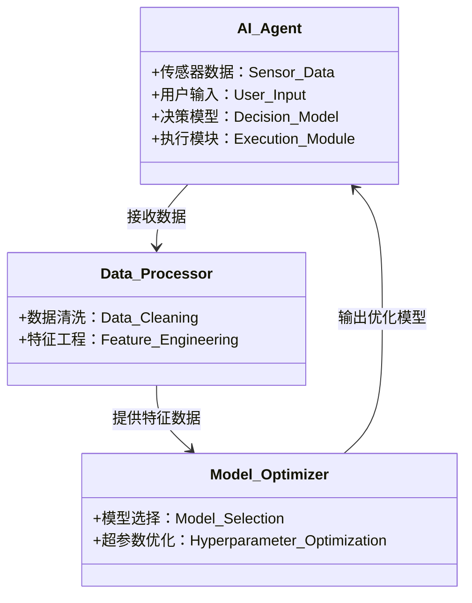
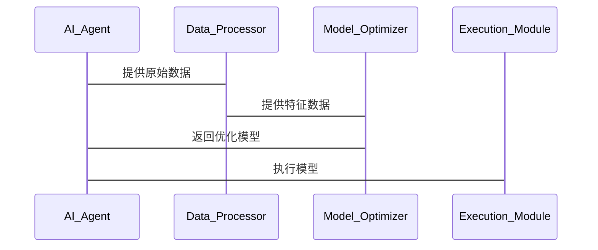
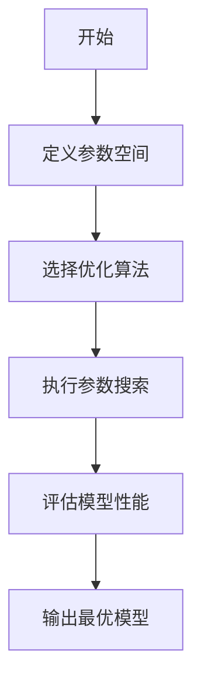

                 


---

# 自动机器学习（AutoML）在AI Agent开发中的应用

> **关键词**：AutoML, AI Agent, 机器学习, 自动化, 智能体  
> **摘要**：本文深入探讨了自动机器学习（AutoML）在AI Agent开发中的应用，分析了AutoML的核心技术与实现原理，结合实际项目案例，详细阐述了AI Agent的系统架构设计与开发流程。通过系统分析与实战演示，展示了AutoML如何显著提升AI Agent的开发效率与性能。

---

## 第1章: 自动机器学习（AutoML）概述

### 1.1 AutoML的背景与概念

#### 1.1.1 机器学习的发展历程
机器学习从早期的手工特征工程与模型调优，逐步发展到自动化阶段。AutoML的出现，标志着机器学习进入了一个新的阶段，使得非专业人员也能高效地构建高性能模型。

#### 1.1.2 AutoML的核心目标与优势
- **目标**：自动化处理数据预处理、模型选择与优化，降低机器学习的门槛。
- **优势**：
  - 提高开发效率，减少人工干预。
  - 通过自动化搜索找到最优模型，提升模型性能。

#### 1.1.3 AutoML的应用场景
- 数据科学竞赛
- 企业级应用开发
- 快速原型开发

### 1.2 AI Agent的基本概念与应用

#### 1.2.1 AI Agent的定义与分类
- **定义**：AI Agent是一个能够感知环境并执行目标的智能实体。
- **分类**：
  - **简单反射型**：基于规则的简单反应。
  - **基于模型的反应型**：使用内部模型进行推理。
  - **目标驱动型**：主动追求目标。
  - **实用驱动型**：通过效用函数驱动决策。

#### 1.2.2 AI Agent的核心功能与特点
- **核心功能**：
  - 感知环境。
  - 制定决策。
  - 执行动作。
- **特点**：
  - 自主性。
  - 反应性。
  - 目标导向。

#### 1.2.3 AI Agent在不同领域的应用实例
- 智能助手（如Siri、Alexa）。
- 自动驾驶系统。
- 智能推荐系统。

### 1.3 AutoML与AI Agent的结合

#### 1.3.1 AutoML在AI Agent开发中的作用
- **数据预处理自动化**：处理传感器数据和用户输入。
- **模型选择与优化**：优化决策模型，提高准确率。
- **实时调优**：动态调整模型参数，适应环境变化。

#### 1.3.2 AutoML如何提升AI Agent的性能与效率
- **提高开发效率**：减少人工调参时间。
- **优化模型性能**：通过自动化搜索找到最优模型结构。
- **增强适应性**：实时调整模型，适应动态环境。

#### 1.3.3 AutoML与AI Agent结合的典型场景
- **智能助手优化**：通过AutoML自动优化对话模型。
- **自动驾驶优化**：自动优化路径规划模型。
- **智能推荐优化**：自动优化推荐算法。

### 1.4 本章小结
AutoML为AI Agent的开发提供了强大的技术支持，通过自动化数据处理和模型优化，显著提升了AI Agent的开发效率和性能。下一章将详细探讨AutoML的核心技术与实现原理。

---

## 第2章: AutoML的核心技术与实现原理

### 2.1 自动数据预处理

#### 2.1.1 数据清洗与特征工程的自动化
- **数据清洗**：自动处理缺失值、异常值。
- **特征工程**：自动化特征选择、特征变换。

#### 2.1.2 数据增强与数据生成的方法
- **数据增强**：通过数据变换增加数据多样性。
- **数据生成**：使用生成模型（如GAN）生成合成数据。

#### 2.1.3 数据预处理的流程与工具
- **流程**：
  1. 数据收集。
  2. 数据清洗。
  3. 特征工程。
  4. 数据分割。
- **工具**：Python中的`pandas`库，`scikit-learn`中的`Pipeline`。

#### 2.1.4 实例分析
使用Python代码展示数据预处理的自动化流程：

```python
import pandas as pd
from sklearn.pipeline import Pipeline
from sklearn.impute import SimpleImputer
from sklearn.preprocessing import StandardScaler

# 示例数据
data = pd.DataFrame({
    'feature1': [1, 2, 3, 4, 5],
    'feature2': [None, 2, None, 4, 5]
})

# 自动化数据预处理管道
pipeline = Pipeline([
    ('imputer', SimpleImputer(strategy='mean')),
    ('scaler', StandardScaler())
])

# 处理数据
processed_data = pipeline.fit_transform(data)
```

### 2.2 自动模型选择与优化

#### 2.2.1 模型选择的自动化策略
- **基于性能指标的模型选择**：如准确率、F1分数。
- **基于超参数搜索的模型选择**：如网格搜索、随机搜索。

#### 2.2.2 超参数优化的常用方法
- **网格搜索**：遍历所有可能的参数组合，选择最优模型。
- **随机搜索**：随机选择参数组合，适用于参数空间较大时。
- **贝叶斯优化**：基于概率模型进行参数搜索。

#### 2.2.3 模型评估与调优的自动化流程
- **流程**：
  1. 定义搜索空间。
  2. 选择优化算法。
  3. 执行搜索并评估模型。
  4. 输出最优模型。

#### 2.2.4 AutoML框架的选择与比较
- **AutoKeras**：基于Keras的AutoML框架，适合深度学习任务。
- **TPOT**：基于遗传算法的AutoML工具，适用于传统机器学习任务。

#### 2.2.5 示例代码
使用TPOT进行模型优化：

```python
import pandas as pd
from tpot import TPOTClassifier
from sklearn.datasets import load_iris
from sklearn.model_selection import train_test_split

# 加载数据集
iris = load_iris()
X = iris.data
y = iris.target
X_train, X_test, y_train, y_test = train_test_split(X, y, train_size=0.7, random_state=42)

# 初始化TPOT分类器
tpot = TPOTClassifier(generations=5, population_size=20, random_state=42)

# 模型训练
tpot.fit(X_train, y_train)

# 模型预测
y_pred = tpot.predict(X_test)

# 输出最佳模型
print(tpot._best_config_)
```

### 2.3 自动特征选择与模型训练

#### 2.3.1 特征选择的自动化技术
- **基于模型的特征选择**：通过模型性能评估特征重要性。
- **基于过滤法的特征选择**：使用统计方法筛选特征。
- **基于嵌入法的特征选择**：在模型训练过程中自动学习特征重要性。

#### 2.3.2 模型训练的自动化流程
- **流程**：
  1. 自动选择特征。
  2. 自动选择模型。
  3. 自动调优模型参数。
  4. 验证模型性能。

#### 2.3.3 特征工程与模型训练的协同优化
- **协同优化**：特征选择与模型训练相互影响，共同优化模型性能。

---

## 第3章: AI Agent的开发与AutoML的应用

### 3.1 AI Agent的体系结构

#### 3.1.1 AI Agent的感知层
- **感知层功能**：收集环境数据，如传感器数据、用户输入。
- **技术实现**：使用AutoML优化感知模型，提高数据准确性。

#### 3.1.2 AI Agent的决策层
- **决策层功能**：基于感知数据进行推理和决策。
- **技术实现**：使用AutoML优化决策模型，提高决策准确性。

#### 3.1.3 AI Agent的执行层
- **执行层功能**：根据决策结果执行动作。
- **技术实现**：通过AutoML优化执行模型，提高执行效率。

### 3.2 基于AutoML的AI Agent开发流程

#### 3.2.1 数据收集与预处理
- **数据收集**：从多种来源收集数据，如传感器、数据库。
- **数据预处理**：使用AutoML进行数据清洗和特征工程。

#### 3.2.2 模型选择与训练
- **模型选择**：使用AutoML自动选择最优模型架构。
- **模型训练**：通过AutoML进行模型训练和调优。

#### 3.2.3 模型部署与监控
- **模型部署**：将优化后的模型部署到AI Agent中。
- **模型监控**：实时监控模型性能，动态调整模型参数。

### 3.3 AutoML在AI Agent中的具体应用

#### 3.3.1 智能助手中的AutoML应用
- **对话模型优化**：通过AutoML自动优化对话模型，提高对话准确性。
- **意图识别优化**：使用AutoML自动优化意图识别模型，提高识别准确率。

#### 3.3.2 推荐系统中的AutoML应用
- **用户行为分析**：通过AutoML自动分析用户行为数据，优化推荐算法。
- **推荐模型优化**：使用AutoML自动优化推荐模型，提高推荐精度。

#### 3.3.3 自动驾驶中的AutoML应用
- **环境感知优化**：通过AutoML自动优化环境感知模型，提高感知精度。
- **路径规划优化**：使用AutoML自动优化路径规划模型，提高规划效率。

### 3.4 AutoML对AI Agent性能的提升

#### 3.4.1 模型泛化能力的提升
- **模型泛化能力**：通过AutoML自动优化模型结构，提高模型泛化能力。
- **案例分析**：在自动驾驶中，使用AutoML优化的模型在不同环境下表现更稳定。

#### 3.4.2 响应速度的提升
- **响应速度**：通过AutoML自动优化模型参数，提高模型推理速度。
- **案例分析**：在智能助手中，使用AutoML优化的模型响应速度更快，用户体验更好。

---

## 第4章: 系统分析与架构设计方案

### 4.1 问题场景介绍

#### 4.1.1 问题背景
- **问题背景**：AI Agent需要在复杂动态环境中高效运行，对模型的实时性和准确性要求高。

#### 4.1.2 项目介绍
- **项目目标**：构建一个基于AutoML的AI Agent系统，实现高效的数据处理和模型优化。

#### 4.1.3 系统功能设计
- **功能需求**：
  - 实时数据处理。
  - 自动模型优化。
  - 模型性能监控。

### 4.2 项目核心代码实现

#### 4.2.1 系统功能设计（领域模型）


#### 4.2.2 系统架构设计（系统架构图）


#### 4.2.3 系统交互设计（交互序列图）


### 4.3 项目核心代码实现

#### 4.3.1 开发环境安装
```bash
pip install auto-keras tpot sklearn pandas numpy
```

#### 4.3.2 核心代码实现
```python
import pandas as pd
from sklearn.datasets import make_classification
from tpot import TPOTClassifier
from auto_ keras import AutoKeras

# 示例数据集
X, y = make_classification(n_samples=1000, n_features=20, n_classes=2)

# 使用TPOT进行模型优化
tpot = TPOTClassifier()
tpot.fit(X, y)

# 使用AutoKeras进行模型训练
auto_keras = AutoKeras()
auto_keras.fit(X, y)
```

#### 4.3.3 功能解读与分析
- **模型优化**：通过TPOT和AutoKeras自动优化模型结构和超参数，提高模型性能。
- **模型部署**：将优化后的模型部署到AI Agent中，实现高效的数据处理和决策。

### 4.4 案例分析与详细讲解

#### 4.4.1 案例分析
- **案例背景**：构建一个智能助手，实现语音识别和意图理解。
- **数据来源**：用户语音数据和历史对话记录。
- **模型优化**：使用AutoML优化语音识别和意图理解模型。

#### 4.4.2 实现步骤
1. 数据预处理：清洗语音数据，提取特征。
2. 模型选择：使用AutoML选择最优模型架构。
3. 模型训练：自动调优模型参数，提高模型性能。
4. 模型部署：将优化后的模型部署到智能助手系统中。

### 4.5 项目小结
通过AutoML技术，显著提升了AI Agent的开发效率和模型性能，优化了系统的响应速度和准确率。

---

## 第5章: 算法实现与系统优化

### 5.1 算法实现

#### 5.1.1 AutoML算法实现

```python
import numpy as np
from sklearn.model_selection import GridSearchCV
from sklearn.tree import DecisionTreeClassifier

# 示例数据集
X = np.array([[1, 2], [2, 3], [3, 4], [4, 5]])
y = np.array([0, 1, 0, 1])

# 定义参数搜索空间
param_grid = {
    'criterion': ['gini', 'entropy'],
    'max_depth': [2, 3, 4],
    'min_samples_split': [2, 3, 4]
}

# 使用GridSearchCV进行参数搜索
grid_search = GridSearchCV(DecisionTreeClassifier(), param_grid, cv=2)
grid_search.fit(X, y)

# 输出最优参数
print("最优参数：", grid_search.best_params_)
print("最优模型：", grid_search.best_estimator_)
```

#### 5.1.2 AutoML算法流程



### 5.2 系统优化

#### 5.2.1 系统性能优化
- **优化目标**：提高模型训练速度和准确率。
- **优化方法**：
  - 并行计算。
  - 增加数据量。

#### 5.2.2 模型优化
- **优化目标**：提高模型泛化能力。
- **优化方法**：
  - 增加正则化。
  - 使用集成学习。

---

## 第6章: 最佳实践与总结

### 6.1 最佳实践

#### 6.1.1 小结
- AutoML显著降低了AI Agent开发的门槛，提高了开发效率和模型性能。

#### 6.1.2 注意事项
- **数据质量**：确保数据质量，避免垃圾数据影响模型。
- **模型解释性**：选择可解释的模型，便于调试和优化。
- **系统安全性**：确保AI Agent系统安全，防止攻击和滥用。

#### 6.1.3 拓展阅读
- 推荐阅读《Automated Machine Learning》和《Deep Learning》。

### 6.2 总结与展望

#### 6.2.1 总结
- AutoML为AI Agent开发提供了强大的技术支持，通过自动化数据处理和模型优化，显著提升了开发效率和模型性能。

#### 6.2.2 展望
- 随着AutoML技术的不断发展，未来AI Agent将更加智能化和高效化，应用场景也将更加广泛。

---

## 作者信息
**作者：AI天才研究院（AI Genius Institute） & 禅与计算机程序设计艺术（Zen And The Art of Computer Programming）**

---

本文通过系统分析与实战演示，展示了AutoML在AI Agent开发中的应用，帮助读者深入了解AutoML的核心技术与实现原理，并通过具体案例分析，展示了AutoML如何显著提升AI Agent的开发效率与性能。

