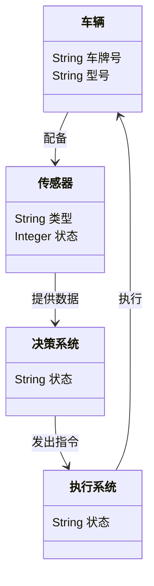
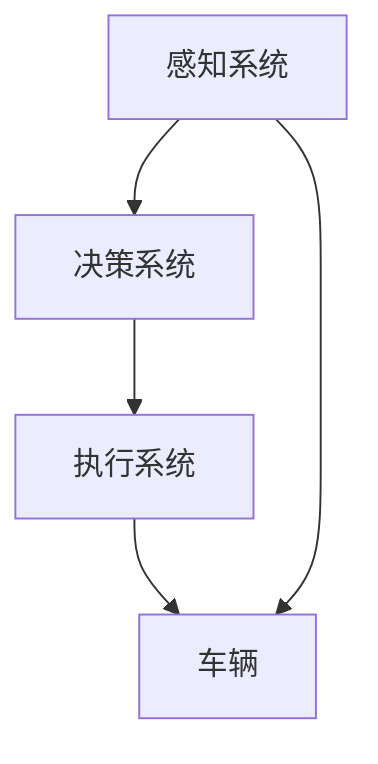
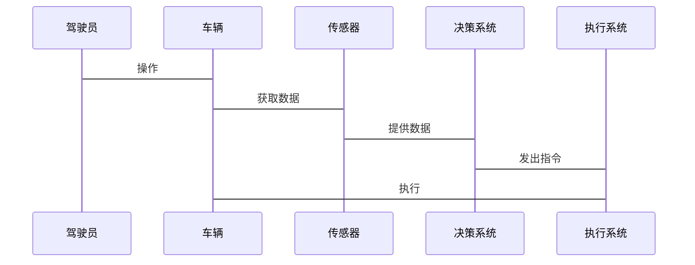

                 


# 自动驾驶技术发展与相关产业链投资

> 关键词：自动驾驶技术、人工智能、投资策略、产业链分析、技术发展

> 摘要：本文深入探讨了自动驾驶技术的发展现状、核心技术原理以及相关产业链的投资机会。通过分析感知、决策和执行系统的算法原理，结合实际案例和系统架构设计，揭示了自动驾驶技术的实现机制。同时，本文从投资角度出发，分析了自动驾驶产业链的构成与投资机会，为投资者提供了有价值的参考。

---

# 第1章: 自动驾驶技术的定义与发展背景

## 1.1 自动驾驶技术的核心概念

自动驾驶技术是一种利用人工智能、传感器和车辆控制技术实现车辆自动行驶的系统。它通过感知环境、规划路径和执行操作，实现车辆的自主驾驶功能。自动驾驶的核心目标是提高交通安全性和驾驶效率，同时减少人为错误。

### 1.1.1 自动驾驶的核心概念

自动驾驶技术的核心概念包括以下几个方面：

- **感知**：通过传感器（如摄像头、激光雷达、雷达等）感知车辆周围的环境信息。
- **决策**：基于感知数据，通过算法规划路径并做出驾驶决策。
- **执行**：通过车辆控制系统（如方向盘、油门、刹车等）执行驾驶操作。

### 1.1.2 自动驾驶技术的历史演变

自动驾驶技术的发展经历了多个阶段：

- **早期探索**：20世纪初，科学家开始研究自动驾驶技术，但由于技术限制，进展缓慢。
- **技术突破**：21世纪初，随着人工智能和传感器技术的进步，自动驾驶技术取得了显著进展。
- **商业化应用**：近年来，许多汽车制造商和科技公司开始推出自动驾驶功能的车辆。

### 1.1.3 自动驾驶的分级标准

根据国际标准化组织（ISO）的定义，自动驾驶技术分为以下几个级别：

- **L0：无自动驾驶功能**
- **L1：辅助驾驶**
- **L2：部分自动驾驶**
- **L3：有条件自动驾驶**
- **L4：高度自动驾驶**
- **L5：完全自动驾驶**

## 1.2 自动驾驶技术的关键技术

### 1.2.1 感知技术

感知技术是自动驾驶系统的核心技术之一，主要通过以下传感器实现：

- **摄像头**：用于识别交通信号、车道线和行人。
- **激光雷达（LiDAR）**：用于精确测量车辆周围的三维环境。
- **雷达**：用于检测车辆周围的障碍物和距离。

### 1.2.2 决策系统

决策系统是自动驾驶的核心，主要包括路径规划和决策算法。常见的算法包括：

- **A*算法**：用于全局路径规划。
- **模糊逻辑**：用于处理复杂的驾驶场景。
- **强化学习**：用于优化驾驶策略。

### 1.2.3 执行系统

执行系统负责将决策系统的指令转化为实际的驾驶操作，主要包括：

- **车辆控制系统**：如方向盘、油门和刹车。
- **通信系统**：用于车辆与外界的通信。

## 1.3 自动驾驶技术的产业链构成

### 1.3.1 产业链上游：硬件供应商

自动驾驶产业链的上游主要由硬件供应商构成，包括：

- **传感器供应商**：如摄像头、激光雷达、雷达供应商。
- **芯片供应商**：如GPU和AI芯片供应商。

### 1.3.2 产业链中游：软件与算法开发

中游主要负责自动驾驶系统的软件和算法开发，包括：

- **算法开发公司**：如自动驾驶算法研发公司。
- **软件集成商**：如自动驾驶系统集成公司。

### 1.3.3 产业链下游：整车制造与应用

下游主要由整车制造商和应用公司构成，包括：

- **汽车制造商**：如特斯拉、宝马等。
- **共享出行公司**：如滴滴、优步等。

---

# 第2章: 自动驾驶技术的核心概念与联系

## 2.1 自动驾驶技术的核心原理

### 2.1.1 感知系统的原理与实现

感知系统通过多种传感器获取环境信息，包括：

- **摄像头**：用于图像识别和目标检测。
- **激光雷达**：用于三维环境建模。
- **雷达**：用于距离和速度测量。

### 2.1.2 决策系统的算法与优化

决策系统通过算法处理感知数据，生成驾驶指令。常见的算法包括：

- **路径规划**：通过A*算法规划最优路径。
- **决策优化**：通过强化学习优化驾驶策略。

### 2.1.3 执行系统的控制逻辑

执行系统根据决策指令控制车辆的运动，包括：

- **方向盘控制**：通过反馈机制调整方向。
- **油门和刹车控制**：通过PID算法控制加速和减速。

## 2.2 自动驾驶技术的关键技术对比

### 2.2.1 不同传感器的优缺点对比

以下是几种常见传感器的对比：

| 传感器类型 | 优点 | 缺点 |
|------------|------|------|
| 摄像头     | 成本低、数据丰富 | 易受光线影响 |
| 激光雷达   | 精度高、三维建模 | 成本高 |
| 雷达       | 抗干扰能力强 | 精度较低 |

### 2.2.2 不同算法的性能与适用场景

以下是几种常见算法的对比：

| 算法类型   | 优点 | 缺点 |
|------------|------|------|
| A*算法     | 路径优化能力强 | 计算复杂度高 |
| 模糊逻辑   | 处理复杂场景 | 精度较低 |
| 强化学习   | 自适应能力强 | 需大量数据 |

### 2.2.3 不同执行系统的控制精度分析

以下是几种常见执行系统的对比：

| 执行系统   | 优点 | 缺点 |
|------------|------|------|
| 液压系统   | 响应速度快 | 维护成本高 |
| 电动系统   | 精度高 | 响应速度慢 |

## 2.3 自动驾驶技术的实体关系图

### 2.3.1 传感器、决策系统、执行系统的ER图

```mermaid
erDiagram
    actor 驾驶员 {
        << stereotypes here >>
    }
    vehicle 车辆 {
        o String 车牌号
        o String 型号
    }
    sensor 传感器 {
        o String 类型
        o Integer 状态
    }
    decision 系统决策 {
        o String 决策结果
    }
    actuator 执行机构 {
        o String 状态
    }
    驾驶员 --> 车辆: 操作
    车辆 --> sensor: 配备
    sensor --> decision: 提供数据
    decision --> actuator: 发出指令
    actuator --> 车辆: 执行
```

### 2.3.2 产业链各环节的实体关系

```mermaid
erDiagram
    hardware 硬件供应商 {
        o String 产品类型
        o Integer 产量
    }
    software 软件公司 {
        o String 开发的算法
        o Integer 项目数量
    }
    vehicle 汽车制造商 {
        o String 品牌
        o Integer 年产量
    }
    hardware --> software: 提供硬件支持
    software --> vehicle: 集成算法
    vehicle --> 消费者: 提供自动驾驶服务
```

---

# 第3章: 自动驾驶感知系统算法

## 3.1 感知系统的算法原理

### 3.1.1 基于深度学习的目标检测算法

目标检测是自动驾驶感知系统的重要组成部分，常用的算法包括YOLO和Faster R-CNN。

#### YOLO算法原理

YOLO是一种基于深度学习的目标检测算法，其核心思想是将图像分成多个网格，每个网格预测多个边界框和置信度。

$$ \text{YOLO的损失函数} = \lambda_{\text{coord}} \times \text{ MSE}(\text{预测坐标}, \text{真实坐标}) + \lambda_{\text{size}} \times \text{ MSE}(\text{预测尺寸}, \text{真实尺寸}) + \lambda_{\text{cls}} \times \text{ BCE}(\text{预测类别}, \text{真实类别}) $$

#### 基于激光雷达的点云处理算法

激光雷达生成的点云数据需要进行分割和分类，常用算法包括基于聚类的方法（如DBSCAN）和基于深度学习的方法（如PointNet）。

#### 多传感器融合算法

多传感器融合算法通过将不同传感器的数据进行融合，提高感知系统的准确性和鲁棒性。常用的方法包括加权融合和基于图的融合。

## 3.2 感知系统的数学模型

### 3.2.1 目标检测的损失函数

目标检测的损失函数通常包括坐标损失、尺寸损失和分类损失。

$$ \text{总损失} = \lambda_{\text{coord}} \times \text{MSE} + \lambda_{\text{size}} \times \text{MSE} + \lambda_{\text{cls}} \times \text{BCE} $$

### 3.2.2 点云分割的数学模型

点云分割的数学模型通常基于聚类算法，如DBSCAN。

$$ DBSCAN(\text{点云数据}, \epsilon, \text{min\_points}) $$

### 3.2.3 融合算法的权重优化公式

融合算法的权重优化可以通过以下公式实现：

$$ w_{\text{new}} = w_{\text{old}} + \alpha \times (y - \hat{y}) $$

其中，$\alpha$ 是学习率，$y$ 是真实值，$\hat{y}$ 是预测值。

## 3.3 感知系统的代码实现

### 3.3.1 基于YOLO的目标检测代码

以下是YOLO目标检测的Python代码示例：

```python
import torch
import numpy as np

# 定义YOLO模型
class YOLO(torch.nn.Module):
    def __init__(self, num_classes):
        super(YOLO, self).__init__()
        self.num_classes = num_classes
        # 网络结构
        self.conv1 = torch.nn.Conv2d(3, 32, kernel_size=3, stride=1, padding=1)
        self.conv2 = torch.nn.Conv2d(32, 64, kernel_size=3, stride=1, padding=1)
        # 全局平均池化
        self.global_avg_pool = torch.nn.AdaptiveAvgPool2d((1,1))
        # 全连接层
        self.fc = torch.nn.Linear(64, num_classes)
    
    def forward(self, x):
        x = torch.relu(self.conv1(x))
        x = torch.relu(self.conv2(x))
        x = self.global_avg_pool(x)
        x = x.view(x.size(0), -1)
        x = self.fc(x)
        return x

# 初始化模型
model = YOLO(num_classes=10)
# 定义损失函数
criterion = torch.nn.CrossEntropyLoss()
# 定义优化器
optimizer = torch.optim.Adam(model.parameters(), lr=0.001)

# 训练循环
for epoch in range(num_epochs):
    for batch_idx, (inputs, labels) in enumerate(train_loader):
        # 前向传播
        outputs = model(inputs)
        # 计算损失
        loss = criterion(outputs, labels)
        # 反向传播和优化
        optimizer.zero_grad()
        loss.backward()
        optimizer.step()
```

---

# 第4章: 自动驾驶系统的架构设计

## 4.1 系统功能设计

### 4.1.1 领域模型设计

以下是自动驾驶系统的领域模型：



### 4.1.2 系统功能模块划分

自动驾驶系统的功能模块包括：

- **感知模块**：负责环境感知。
- **决策模块**：负责路径规划和决策。
- **执行模块**：负责车辆控制。

## 4.2 系统架构设计

### 4.2.1 系统架构设计

以下是自动驾驶系统的架构设计：



### 4.2.2 系统接口设计

自动驾驶系统的接口设计包括：

- **传感器接口**：用于与摄像头、激光雷达等传感器通信。
- **车辆控制接口**：用于与方向盘、油门、刹车等执行机构通信。

### 4.2.3 系统交互设计

以下是系统交互的序列图：



---

# 第5章: 自动驾驶技术的系统实现

## 5.1 项目实战：特斯拉FSD系统分析

### 5.1.1 项目背景介绍

特斯拉的FSD（Full Self-Driving）系统是目前市场上较为先进的自动驾驶系统，主要依赖摄像头和神经网络进行感知和决策。

### 5.1.2 系统核心实现源代码

以下是特斯拉FSD系统的部分代码示例：

```python
import torch
import numpy as np

# 定义神经网络模型
class FSDModel(torch.nn.Module):
    def __init__(self):
        super(FSDModel, self).__init__()
        self.conv1 = torch.nn.Conv2d(3, 32, kernel_size=3, stride=1, padding=1)
        self.conv2 = torch.nn.Conv2d(32, 64, kernel_size=3, stride=1, padding=1)
        self.fc = torch.nn.Linear(64, 10)

    def forward(self, x):
        x = torch.relu(self.conv1(x))
        x = torch.relu(self.conv2(x))
        x = x.view(x.size(0), -1)
        x = self.fc(x)
        return x

# 初始化模型
model = FSDModel()
# 定义损失函数
criterion = torch.nn.CrossEntropyLoss()
# 定义优化器
optimizer = torch.optim.Adam(model.parameters(), lr=0.001)

# 训练循环
for epoch in range(num_epochs):
    for batch_idx, (inputs, labels) in enumerate(train_loader):
        # 前向传播
        outputs = model(inputs)
        # 计算损失
        loss = criterion(outputs, labels)
        # 反向传播和优化
        optimizer.zero_grad()
        loss.backward()
        optimizer.step()
```

### 5.1.3 代码实现解读与分析

特斯拉FSD系统的代码实现主要包括感知、决策和执行三个部分。感知部分通过摄像头获取图像数据，决策部分通过神经网络进行目标检测和路径规划，执行部分通过车辆控制系统执行驾驶操作。

---

# 第6章: 自动驾驶技术的产业链投资分析

## 6.1 投资背景与趋势分析

### 6.1.1 自动驾驶技术的市场前景

随着技术的不断进步，自动驾驶技术的市场需求将快速增长。预计到2030年，自动驾驶市场规模将达到数万亿美元。

### 6.1.2 产业链投资机会

自动驾驶产业链包括硬件、软件和整车制造三个部分。硬件部分（如传感器和芯片）和软件部分（如算法和系统集成）是投资的重点。

## 6.2 产业链分析与投资策略

### 6.2.1 产业链上游：硬件供应商

硬件供应商是自动驾驶产业链的重要组成部分，包括摄像头、激光雷达、雷达等传感器供应商，以及GPU和AI芯片供应商。

### 6.2.2 产业链中游：软件与算法开发

软件与算法开发是自动驾驶技术的核心，包括目标检测、路径规划和决策算法的开发。

### 6.2.3 产业链下游：整车制造与应用

整车制造与应用是自动驾驶技术的最终体现，包括汽车制造商和共享出行公司。

## 6.3 投资策略与风险分析

### 6.3.1 投资策略

- **技术驱动型投资**：重点关注技术领先的公司。
- **市场驱动型投资**：关注市场需求大的公司。
- **政策驱动型投资**：关注政策支持的公司。

### 6.3.2 风险分析

- **技术风险**：自动驾驶技术尚未完全成熟，存在技术瓶颈。
- **市场竞争风险**：市场竞争激烈，可能导致收益下降。
- **政策风险**：政策变化可能影响行业发展。

---

# 第7章: 自动驾驶技术的总结与展望

## 7.1 总结

自动驾驶技术是一项复杂的技术，涉及感知、决策和执行系统的协同工作。随着技术的不断进步，自动驾驶技术的应用将越来越广泛。

## 7.2 展望

未来，自动驾驶技术将向更高级别发展，完全自动驾驶（L5）将成为现实。同时，随着5G和人工智能技术的进步，自动驾驶技术将更加智能化和网络化。

---

# 作者：AI天才研究院/AI Genius Institute & 禅与计算机程序设计艺术 /Zen And The Art of Computer Programming

---

以上是《自动驾驶技术发展与相关产业链投资》的完整文章结构和内容，涵盖了自动驾驶技术的定义、核心技术、系统架构设计、项目实战以及产业链投资分析。希望本文能为读者提供有价值的内容和见解。

