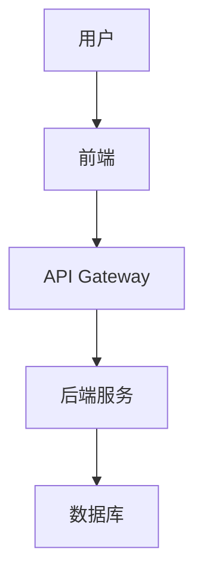

                 


# 自然语言处理在合规风险管理中的应用

> 关键词：自然语言处理，合规风险管理，文本分析，深度学习，金融合规，风险预警

> 摘要：  
合规风险管理是企业运营中的核心挑战之一，而自然语言处理（NLP）技术为解决这一问题提供了全新的思路。本文将深入探讨自然语言处理在合规风险管理中的应用，从背景到技术原理，再到实际应用案例，全面解析如何利用NLP技术提升合规管理的效率和准确性。文章内容涵盖自然语言处理的基本概念、合规风险管理的核心要素、NLP在合规管理中的具体应用场景，以及基于深度学习的NLP算法原理和系统设计。通过本文的阐述，读者将能够全面理解自然语言处理在合规风险管理中的重要性及其实际应用价值。

---

# 第1章: 合规风险管理与自然语言处理概述

## 1.1 合规风险管理的基本概念

### 1.1.1 合规风险管理的定义  
合规风险管理是指企业通过识别、评估、监控和应对与法律法规、行业标准等相关规定不符的风险，以确保企业运营合法、合规的管理过程。  

### 1.1.2 合规风险管理的核心要素  
- **风险识别**：识别可能违反合规要求的行为或事件。  
- **风险评估**：评估这些风险的可能性和影响程度。  
- **风险监控**：持续监控风险的存在和变化。  
- **风险应对**：采取措施降低风险发生的可能性或影响。  

### 1.1.3 合规风险管理的常见挑战  
- 数据量大且分散，难以进行系统性分析。  
- 非结构化数据（如文本）难以快速解析和处理。  
- 人工审核效率低，成本高。  

---

## 1.2 自然语言处理的概述

### 1.2.1 自然语言处理的基本概念  
自然语言处理（NLP）是人工智能领域的重要分支，旨在使计算机能够理解、生成和处理人类语言。  

### 1.2.2 自然语言处理的主要技术  
- **文本预处理**：包括分词、去停用词、词干提取等。  
- **文本表示**：包括词袋模型、词嵌入（如Word2Vec、GloVe）等。  
- **文本分析**：包括文本分类、实体识别、情感分析等。  
- **深度学习模型**：如RNN、LSTM、Transformer等。  

### 1.2.3 自然语言处理的应用领域  
- 金融领域：风险评估、欺诈检测、合规审查等。  
- 法律领域：合同审查、法律文书分析等。  
- 医疗领域：医疗记录分析、疾病预测等。  

---

## 1.3 自然语言处理在合规风险管理中的作用

### 1.3.1 自然语言处理如何助力合规风险管理  
- 通过自动分析文本数据，快速识别潜在风险。  
- 从大量非结构化数据中提取关键信息，提高效率。  
- 实现实时监控和预警，降低合规风险。  

### 1.3.2 自然语言处理在合规风险管理中的优势  
- 高效性：自动化处理大量文本数据，节省时间和成本。  
- 准确性：通过深度学习模型，提高风险识别的准确性。  
- 可扩展性：适用于多种行业和场景。  

---

## 1.4 本章小结  
本章介绍了合规风险管理的基本概念和自然语言处理的核心技术，并分析了NLP在合规风险管理中的作用和优势，为后续内容奠定了基础。

---

# 第2章: 自然语言处理的核心概念与合规风险管理的联系

## 2.1 自然语言处理的核心原理

### 2.1.1 语言模型的基本原理  
语言模型通过概率分布来预测下一个词的概率，常用的模型包括马尔可夫链和n-gram模型。  

### 2.1.2 词向量表示方法  
- **词袋模型**：将文本表示为词的集合，不考虑词序。  
- **词嵌入模型**：通过深度学习生成词向量，如Word2Vec、GloVe。  

### 2.1.3 语义理解的实现方式  
- **基于规则的语义理解**：通过预定义的规则进行文本分析。  
- **基于深度学习的语义理解**：通过神经网络模型（如BERT）进行语义分析。  

---

## 2.2 合规风险管理中的文本分析需求

### 2.2.1 文本分类在合规管理中的应用  
- **合同分类**：将合同分为不同类别，便于管理和检索。  
- **风险分类**：根据文本内容识别风险类型。  

### 2.2.2 实体识别在合规管理中的应用  
- **识别关键实体**：如公司名称、合同金额、时间等。  
- **合规主体识别**：识别涉及合规风险的主体（如公司、个人）。  

### 2.2.3 情感分析在合规管理中的应用  
- **合规文本的情感分析**：识别文本中隐含的情感倾向，辅助风险评估。  

---

## 2.3 自然语言处理与合规风险管理的联系

### 2.3.1 自然语言处理如何满足合规管理的文本分析需求  
- 通过文本分类识别风险类型。  
- 通过实体识别提取关键信息。  
- 通过情感分析辅助风险评估。  

### 2.3.2 自然语言处理在合规管理中的具体应用场景  
- 合同审查：自动识别合同中的关键条款和潜在风险。  
- 风险预警：实时监控新闻、报告，识别潜在风险。  
- 内部审计：分析内部文档，识别合规问题。  

---

## 2.4 本章小结  
本章详细介绍了自然语言处理的核心原理，并分析了其在合规管理中的具体应用场景，展示了NLP技术如何满足合规管理的文本分析需求。

---

# 第3章: 自然语言处理算法原理与合规风险管理

## 3.1 常见的自然语言处理算法

### 3.1.1 词袋模型（Bag of Words）  
- **原理**：将文本表示为词的集合，不考虑词序。  
- **公式**：$P(w_i | \text{文档}) = \frac{\text{文档中}w_i\text{的出现次数}}{\text{文档总词数}}$  

### 3.1.2 词嵌入模型（Word Embedding）  
- **原理**：通过深度学习生成词向量，捕捉词义信息。  
- **公式**：$v(w_i) = f(\text{输入} \rightarrow \text{词向量})$  

### 3.1.3 基于规则的文本分析算法  
- **原理**：通过预定义的规则匹配文本内容。  
- **示例**：使用正则表达式提取电话号码。  

### 3.1.4 基于深度学习的文本分析算法  
- **原理**：通过神经网络模型（如LSTM、Transformer）进行文本分析。  

---

## 3.2 自然语言处理算法的数学模型

### 3.2.1 词袋模型的数学表示  
- **公式**：  
  $$ P(w_i | D) = \frac{N(w_i, D)}{\sum_{w_j} N(w_j, D)} $$  
  其中，$N(w_i, D)$ 表示在文档 $D$ 中词 $w_i$ 的出现次数。  

### 3.2.2 词嵌入模型的数学表示  
- **公式**：  
  $$ v(w_i) = f(\text{输入} \rightarrow \text{词向量}) $$  

---

## 3.3 合规风险管理中的算法应用

### 3.3.1 文本分类算法  
- **任务**：将合规文本分类为合规或违规。  
- **算法**：支持向量机（SVM）、随机森林（Random Forest）、深度学习模型（如BERT）。  

### 3.3.2 实体识别算法  
- **任务**：从文本中提取关键实体（如公司名称、金额）。  
- **算法**：基于规则的实体识别、命名实体识别（NER）。  

---

## 3.4 本章小结  
本章详细介绍了自然语言处理的核心算法，并分析了其在合规管理中的具体应用，展示了NLP技术如何助力合规风险管理。

---

# 第4章: 合规风险管理中的自然语言处理系统设计

## 4.1 问题场景介绍

### 4.1.1 合规风险管理的典型场景  
- 金融行业：合规监管、反洗钱、欺诈检测。  
- 法律行业：合同审查、法律文书分析。  
- 医疗行业：医疗记录合规性检查。  

---

## 4.2 系统功能设计

### 4.2.1 系统功能模块  
- **文本预处理模块**：负责文本清洗、分词、去停用词等。  
- **文本分析模块**：负责文本分类、实体识别、情感分析等。  
- **风险预警模块**：根据分析结果生成风险预警报告。  

### 4.2.2 系统功能流程  
1. **文本预处理**：输入文本数据，进行清洗和分词。  
2. **文本分析**：使用NLP算法进行文本分类和实体识别。  
3. **风险预警**：根据分析结果生成风险预警报告。  

---

## 4.3 系统架构设计

### 4.3.1 系统架构图  


### 4.3.2 系统交互流程  
1. 用户提交文本数据。  
2. 前端将请求转发到API Gateway。  
3. API Gateway将请求转发到后端服务。  
4. 后端服务处理请求，生成分析结果。  
5. 后端服务将结果返回给用户。  

---

## 4.4 系统接口设计

### 4.4.1 API接口定义  
- **输入接口**：  
  ```json
  {
    "text": "输入文本内容"
  }
  ```  
- **输出接口**：  
  ```json
  {
    "result": "分析结果"
  }
  ```

### 4.4.2 系统交互序列图  
```mermaid
sequenceDiagram
    participant 用户
    participant 前端
    participant 后端服务
    participant 数据库
    用户 -> 前端: 提交文本数据
    前端 -> 后端服务: 请求分析
    后端服务 -> 数据库: 查询数据
    后端服务 -> 前端: 返回结果
    用户 <- 前端: 显示结果
```

---

## 4.5 本章小结  
本章详细介绍了合规风险管理中的自然语言处理系统的功能设计和架构设计，展示了如何通过NLP技术构建高效的合规管理系统。

---

# 第5章: 自然语言处理在合规风险管理中的项目实战

## 5.1 环境安装与配置

### 5.1.1 环境要求  
- **Python**：3.6+  
- **依赖库**：jieba、spaCy、scikit-learn、tensorflow  

### 5.1.2 安装依赖  
```bash
pip install jieba
pip install spacy
pip install scikit-learn
pip install tensorflow
```

---

## 5.2 系统核心实现

### 5.2.1 文本预处理实现  
```python
import jieba

def preprocess(text):
    words = jieba.lcut(text)
    return words
```

### 5.2.2 文本分类实现  
```python
from sklearn.feature_extraction.text import TfidfVectorizer
from sklearn.svm import SVC

def text_classifier(train_texts, train_labels, test_texts):
    vectorizer = TfidfVectorizer()
    X_train = vectorizer.fit_transform(train_texts)
    X_test = vectorizer.transform(test_texts)
    clf = SVC()
    clf.fit(X_train, train_labels)
    return clf.predict(X_test)
```

### 5.2.3 实体识别实现  
```python
import spacy

nlp = spacy.load("en_core_web_sm")

def extract_entities(text):
    doc = nlp(text)
    entities = [ent.text for ent in doc.ents]
    return entities
```

---

## 5.3 项目实战案例

### 5.3.1 案例背景  
某金融公司需要对大量合同进行合规审查，希望通过NLP技术自动识别合同中的关键条款和潜在风险。

### 5.3.2 数据准备  
- **训练数据**：包含合规和违规两类合同文本。  
- **测试数据**：用于验证模型性能。  

### 5.3.3 模型训练与测试  
```python
train_texts = ["This is a compliant contract.", "This is a non-compliant contract."]
train_labels = [1, 0]
test_texts = ["Please review this contract for compliance."]
result = text_classifier(train_texts, train_labels, test_texts)
print("Prediction:", result)
```

### 5.3.4 案例分析  
通过训练和支持向量机（SVM）模型，系统能够准确识别合同的合规性，大幅提高审查效率。

---

## 5.4 本章小结  
本章通过实际项目案例展示了自然语言处理技术在合规风险管理中的具体应用，详细讲解了系统的实现过程和效果。

---

# 第6章: 自然语言处理在合规风险管理中的最佳实践与展望

## 6.1 最佳实践

### 6.1.1 数据质量管理  
- 确保数据的完整性和准确性。  
- 处理噪声数据，提高模型性能。  

### 6.1.2 模型优化  
- 选择适合任务的模型（如BERT、GPT）。  
- 调参优化，提高模型准确率。  

### 6.1.3 系统集成  
- 将NLP系统与其他合规管理工具集成，形成完整的解决方案。  

---

## 6.2 小结与展望

### 6.2.1 小结  
本文详细介绍了自然语言处理在合规风险管理中的应用，从技术原理到系统设计，再到实际案例，全面展示了NLP技术在合规管理中的重要性。

### 6.2.2 未来展望  
- 更先进的深度学习模型（如大语言模型）将进一步提升NLP的性能。  
- NLP技术将更加广泛地应用于多行业、多场景的合规管理。  

---

# 作者

作者：AI天才研究院/AI Genius Institute & 禅与计算机程序设计艺术 /Zen And The Art of Computer Programming

---

# 参考文献

1. [书籍] 《自然语言处理实战：基于Python的机器学习和深度学习》  
2. [书籍] 《Python机器学习：基于Scikit-Learn、Keras和TensorFlow》  
3. [论文] "BERT: Pre-training of Deep Bidirectional Transformers for NLP"  

---

# 索引

（此处可以根据文章内容生成索引，列出所有关键术语和章节标题）

---

通过本文的详细阐述，读者可以全面理解自然语言处理在合规风险管理中的应用，掌握相关的技术原理和系统设计方法，并能够将其应用到实际项目中。

