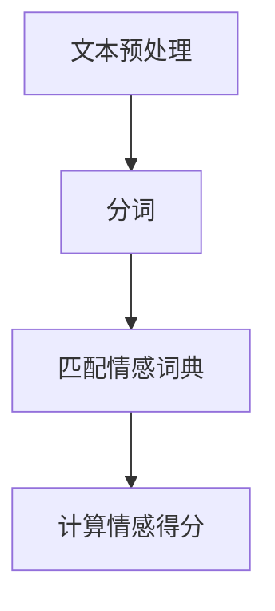

                 


# 自然语言处理在投资者情绪分析中的应用

## 关键词：
自然语言处理，投资者情绪分析，文本挖掘，机器学习，深度学习

## 摘要：
本文探讨了自然语言处理技术在投资者情绪分析中的应用，分析了情绪分析的核心概念、算法原理及系统设计，通过具体案例展示了如何利用NLP技术从文本数据中提取情绪信息，为投资决策提供支持。文章内容涵盖从基础概念到高级算法的详细讲解，并结合实际案例进行深入分析。

---

## 第一部分：背景介绍

### 第1章：自然语言处理与投资者情绪分析概述

#### 1.1 自然语言处理的基本概念
自然语言处理（Natural Language Processing, NLP）是人工智能领域的重要分支，旨在让计算机能够理解、处理和生成人类语言。其核心任务包括文本分类、信息提取、情感分析等。NLP的应用广泛，如机器翻译、智能客服、搜索引擎优化等。

#### 1.2 投资者情绪分析的定义与重要性
投资者情绪分析是指通过分析文本数据（如社交媒体评论、新闻文章）来判断市场参与者的情绪状态，如乐观、悲观或中立。情绪分析在投资决策中扮演着重要角色，能够帮助投资者识别市场趋势，预测价格波动，优化投资组合。然而，情绪分析也面临挑战，如文本的复杂性和噪声干扰。

---

## 第二部分：核心概念与联系

### 第2章：投资者情绪分析的核心概念与模型

#### 2.1 情绪分析的分类与特征
情绪分析可以分为三类：情感极性分类、情感强度分析和情感方面分析。以下是常见分类的对比：

| 分类方法 | 描述 | 优点 | 缺点 |
|----------|------|------|------|
| 基于规则 | 使用情感词典和规则匹配 | 实现简单，速度快 | 易受文本复杂性影响 |
| 统计模型 | 基于特征工程和机器学习 | 高准确性 | 特征选择依赖人工 |
| 深度学习 | 基于神经网络 | 自动提取特征 | 训练时间长 |

此外，情绪分析的实体关系可以通过ER图展示：

```mermaid
er
entity 投资者情绪分析 {
    id 情绪ID
    情感极性 极性
    情感强度 强度
    情感方面 方面
}
```

---

## 第三部分：算法原理讲解

### 第3章：基于规则的情绪分析算法

#### 3.1 规则的构建与应用
基于规则的情绪分析通过构建情感词典，匹配文本中的关键词来判断情绪。例如，使用SentiWordNet词典，将文本中的关键词映射到正面、负面或中性。

以下是实现步骤：



代码实现：

```python
# 情感词典加载
from nltk.corpus import sentiwordnet as swn

def get_sentiment_score(text):
    words = text.split()
    score = 0
    for word in words:
        synsets = swn.senti_synsets(word)
        if synsets:
            score += synsets[0].pos_score() - synsets[0].neg_score()
    return score
```

---

## 第四部分：系统分析与架构设计

### 第4章：系统功能设计与架构

#### 4.1 项目介绍
投资者情绪分析系统旨在通过分析社交媒体数据，为投资者提供情绪参考。系统功能包括数据采集、预处理、特征提取、模型训练和结果展示。

#### 4.2 系统架构设计


---

## 第五部分：项目实战

### 第5章：投资者情绪分析项目实战

#### 5.1 环境安装
安装必要的库：
```bash
pip install nltk
pip install numpy
pip install scikit-learn
```

#### 5.2 核心实现

```python
from sklearn.feature_extraction.text import TfidfVectorizer
from sklearn.linear_model import LogisticRegression

# 数据预处理
def preprocess(text):
    return text.lower().strip()

# 模型训练
vectorizer = TfidfVectorizer(ngram_range=(1,2))
X = vectorizer.fit_transform(corpus)
model = LogisticRegression()
model.fit(X, labels)
```

#### 5.3 案例分析
使用Twitter数据集进行情绪分析，提取关键词和情感特征，训练模型并评估性能。

---

## 第六部分：总结与扩展

### 第6章：最佳实践与注意事项

- **数据质量**：确保数据来源可靠，预处理干净。
- **模型选择**：根据任务选择合适的算法。
- **实时分析**：结合流处理技术进行实时情绪监测。

### 6.2 小结
本文详细探讨了自然语言处理在投资者情绪分析中的应用，从基本概念到具体实现，为读者提供了全面的指导。情绪分析在投资领域具有重要价值，但仍有诸多挑战需要克服。

### 6.3 拓展阅读
- 阅读相关文献，如《情感分析：观点挖掘实用教程》。
- 关注最新的深度学习模型，如BERT在情绪分析中的应用。

---

## 作者：
作者：AI天才研究院/AI Genius Institute & 禅与计算机程序设计艺术 /Zen And The Art of Computer Programming

