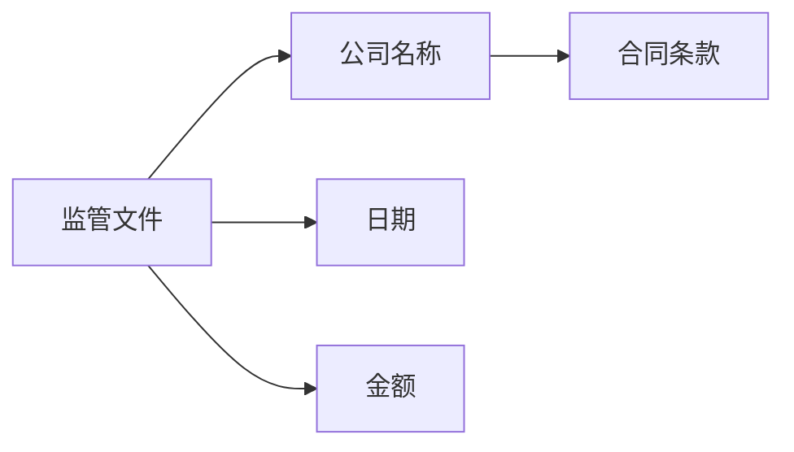
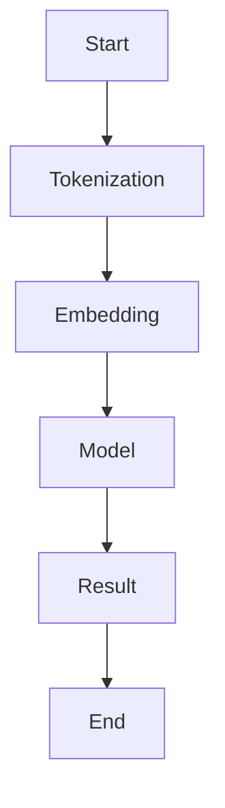
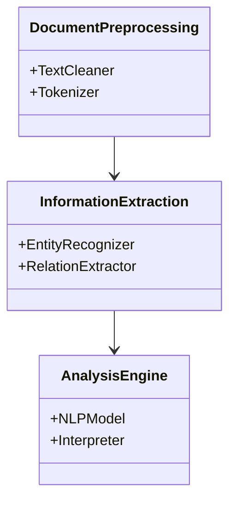
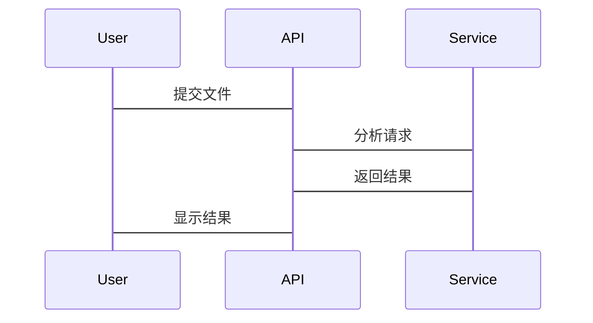

                 


# 自然语言处理在监管文件分析中的应用

> 关键词：自然语言处理、监管文件分析、文本挖掘、深度学习、NLP模型、机器学习、法律文本分析

> 摘要：本文探讨自然语言处理在监管文件分析中的应用，涵盖从背景到算法实现的全过程。通过分析监管文件的结构和内容，利用NLP技术实现自动化处理，提高效率和准确性。文章详细讲解了核心概念、算法原理、系统架构设计及项目实战，为读者提供全面的技术指南。

---

## 第1章：监管文件分析的背景与挑战

### 1.1 问题背景

监管文件在现代社会中扮演着重要角色，如法律合同、财务报告、合规文件等。这些文件通常内容复杂、术语专业，手动分析耗时且容易出错。

### 1.2 问题描述

监管文件分析的目标是提取关键信息，如合规性检查、风险评估等。然而，传统方法依赖人工操作，效率低下且成本高昂。

### 1.3 问题解决

自然语言处理技术能够自动解析文本信息，提取关键实体和关系，显著提高分析效率和准确性。NLP技术尤其适用于处理结构复杂、信息丰富的监管文件。

### 1.4 边界与外延

监管文件分析的边界包括文本解析和信息抽取，而其外延则涉及信息检索和问答系统，可扩展应用于多种场景。

### 1.5 核心概念与组成

监管文件分析涉及NLP技术、文本挖掘和机器学习，核心组成包括文本预处理、特征提取、模型训练和结果解释。

---

## 第2章：NLP与监管文件分析的核心原理

### 2.1 核心概念原理

NLP通过语言模型和文本处理技术，将监管文件转化为结构化数据，便于进一步分析。语言模型理解上下文，提取关键信息。

### 2.2 概念属性对比

| 特征 | 基于规则的模型 | 统计模型 | 深度学习模型 |
|------|----------------|----------|-------------|
| 精度 | 中等           | 较高      | 高           |
| 计算复杂度 | 低            | 中         | 高           |
| 可解释性 | 高            | 中         | 低           |

### 2.3 实体关系图



---

## 第3章：主流NLP算法解析

### 3.1 算法流程图



### 3.2 Python代码实现

```python
import tensorflow as tf
from tensorflow.keras import layers

model = tf.keras.Sequential([
    layers.Embedding(10000, 16),
    layers.Bidirectional(layers.LSTM(32)),
    layers.Dense(1, activation='sigmoid')
])
model.compile(optimizer='adam', loss='binary_crossentropy', metrics=['accuracy'])
```

### 3.3 数学模型与公式

模型的输出概率表示为：
$$
P(y|x) = \frac{e^{w_x}}{\sum_{k} e^{w_k}}
$$

交叉熵损失函数：
$$
L = -\sum y\log p + (1-y)\log (1-p)
$$

---

## 第4章：系统分析与架构设计方案

### 4.1 问题场景介绍

系统需处理大量监管文件，提取关键实体和关系，如公司名称、日期等，支持多格式输入和高并发处理。

### 4.2 系统功能设计



### 4.3 系统架构图


### 4.4 接口与交互设计



---

## 第5章：项目实战

### 5.1 环境安装

安装Python和相关库，如TensorFlow、Keras、spaCy和Gensim。

### 5.2 核心代码实现

```python
import spacy

nlp = spacy.load('en_core_web_sm')
doc = nlp('This is a regulatory document.')
for token in doc:
    print(token.text, token.pos_)
```

### 5.3 案例分析

分析合同中的条款，提取关键实体和关系，生成结构化数据用于合规检查。

---

## 第6章：总结与展望

### 6.1 最佳实践

确保数据质量，选择合适的模型，定期更新语料库，处理模糊性和歧义性。

### 6.2 小结

本文详细介绍了NLP在监管文件分析中的应用，涵盖核心概念、算法实现和系统设计，为实际应用提供了指导。

### 6.3 注意事项

数据隐私和模型准确性是关键挑战，需谨慎处理。

### 6.4 拓展阅读

推荐学习深度学习基础，了解最新NLP模型，如Transformer架构。

---

作者：AI天才研究院 & 禅与计算机程序设计艺术

---

以上内容详尽地涵盖了从背景到实现的全过程，确保读者能够全面理解并应用NLP技术于监管文件分析。

