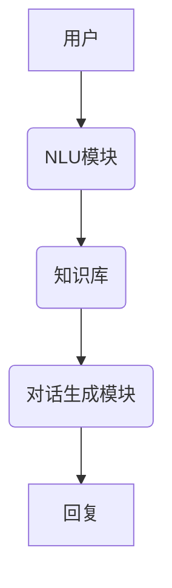
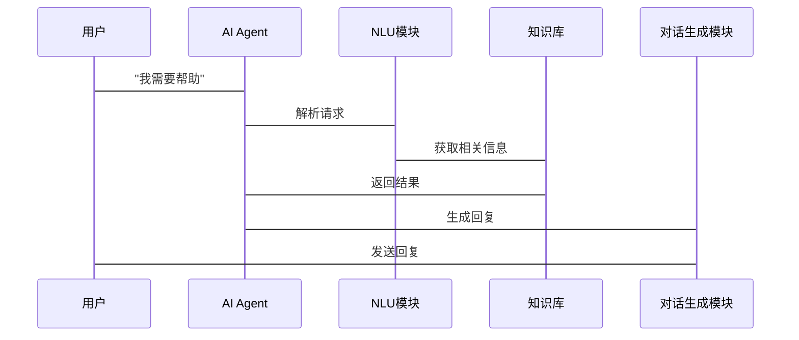

                 


# 自然语言处理技术在AI Agent中的应用

## 关键词：
自然语言处理, AI Agent, 对话生成, 信息抽取, 多语言支持

## 摘要：
本文深入探讨了自然语言处理技术在AI Agent中的应用，涵盖从基础概念到具体实现的各个方面。首先介绍了自然语言处理和AI Agent的基本概念，分析了它们的结合背景和应用现状。接着详细讲解了自然语言处理在AI Agent中的核心算法和系统架构设计，包括词嵌入、序列模型、对话生成等技术。最后通过一个智能客服系统的实战案例，展示了如何将这些技术应用于实际场景，并总结了相关经验和未来发展方向。

---

# 第一部分: 自然语言处理技术与AI Agent概述

## 第1章: 自然语言处理技术基础

### 1.1 自然语言处理的定义与核心任务
#### 1.1.1 自然语言处理的定义
自然语言处理（NLP）是计算机科学、人工智能和语言学的交叉领域，旨在让计算机能够理解、生成和处理人类语言。NLP的目标是实现人与计算机之间的自然语言交互。

#### 1.1.2 自然语言处理的核心任务
NLP的核心任务包括：
1. 语言理解：如分词、句法分析、语义理解。
2. 语言生成：如文本摘要、机器翻译、对话生成。
3. 信息提取：如信息抽取、知识图谱构建。

#### 1.1.3 自然语言处理的演进历程
从基于规则的NLP到统计学习，再到深度学习驱动的NLP，技术不断进步。当前，大模型如GPT、BERT等推动了NLP的革新。

### 1.2 AI Agent的基本概念
#### 1.2.1 AI Agent的定义
AI Agent（智能体）是能够感知环境、做出决策并执行动作的实体，旨在帮助用户完成任务或提供服务。

#### 1.2.2 AI Agent的核心特征
1. 感知能力：通过传感器或API获取环境信息。
2. 决策能力：基于感知信息做出最优决策。
3. 执行能力：通过执行器与环境交互。

#### 1.2.3 AI Agent的应用场景
1. 智能助手：如Siri、Alexa。
2. 智能客服：用于客户咨询和服务。
3. 机器人对话：实现人机交互。

### 1.3 自然语言处理在AI Agent中的结合
#### 1.3.1 自然语言理解（NLU）
NLU帮助AI Agent理解用户输入的文本，包括意图识别、实体抽取。

#### 1.3.2 自然语言生成（NLG）
NLG用于生成自然语言的输出，如对话回复、文本摘要。

---

## 第2章: 自然语言处理技术在AI Agent中的应用背景

### 2.1 自然语言处理技术的发展现状
#### 2.1.1 传统NLP技术的局限性
基于规则的NLP在处理复杂语境时表现不佳，且难以扩展。

#### 2.1.2 深度学习驱动的NLP技术
深度学习如RNN、Transformer等模型显著提升了NLP的性能。

#### 2.1.3 大模型时代的NLP技术
大模型如GPT-3、PaLM等具备强大的理解和生成能力。

### 2.2 AI Agent的市场需求与挑战
#### 2.2.1 AI Agent的市场需求
随着AI技术的进步，市场对智能助手、智能客服的需求日益增长。

#### 2.2.2 自然语言处理在AI Agent中的挑战
1. 多语言支持的复杂性。
2. 实时性和响应速度的要求。
3. 领域知识的适应性。

### 2.3 自然语言处理与AI Agent的结合
NLP为AI Agent提供了语言理解和生成的能力，使其能够更自然地与用户交互。

---

## 第3章: 自然语言处理技术与AI Agent的核心概念

### 3.1 自然语言处理的核心原理
#### 3.1.1 语言模型的训练与推理
语言模型通过大量数据训练，学习语言的统计规律，用于生成和理解文本。

#### 3.1.2 词向量与上下文理解
词向量如Word2Vec、BERT等捕捉词语的语义信息，帮助模型理解上下文。

#### 3.1.3 语法分析与语义理解
语法分析（如分句、词性标注）和语义理解（如意图识别）是NLP的关键步骤。

### 3.2 AI Agent的架构与功能模块
#### 3.2.1 AI Agent的感知层
感知层负责接收和解析用户输入，包括NLU模块。

#### 3.2.2 AI Agent的决策层
决策层根据用户需求和知识库做出决策，可能涉及对话生成。

#### 3.2.3 AI Agent的执行层
执行层负责将决策转化为具体行动，如调用API或生成回复。

### 3.3 自然语言处理在AI Agent中的具体应用
#### 3.3.1 信息抽取与知识库构建
通过NLP技术提取文本中的实体和关系，构建知识图谱。

#### 3.3.2 对话生成与交互优化
利用生成模型优化对话的流畅性和自然性。

#### 3.3.3 多语言支持与跨文化适应
NLP技术帮助AI Agent实现多语言支持和文化适应。

---

## 第4章: 自然语言处理技术在AI Agent中的算法原理

### 4.1 词嵌入算法
#### 4.1.1 Word2Vec算法原理
Word2Vec通过上下文预测词或词预测上下文，生成词向量。

```python
class Word2Vec:
    def __init__(self, vocabulary):
        self.vocabulary = vocabulary
        self.embeddings = {}  # word: embedding vector

    def train(self, sentences):
        # 训练逻辑，更新embeddings
        pass
```

#### 4.1.2 GLOVE算法原理
GLOVE基于全局词向量表示，通过优化目标函数得到词向量。

$$
\text{argmin}_\theta \sum_{i<j} \text{loss}(x_i, x_j, \theta)
$$

#### 4.1.3 BERT的预训练目标
BERT通过 masked LM 和 next sentence prediction 预训练，捕捉双向语义。

### 4.2 序列模型在NLP中的应用
#### 4.2.1 RNN与LSTM原理
RNN处理序列数据，LSTM通过门控机制解决长序列遗忘问题。

```python
class LSTM:
    def __init__(self, input_size, hidden_size):
        self.input_size = input_size
        self.hidden_size = hidden_size
        self.W = np.random.randn(input_size, hidden_size)
        self.U = np.random.randn(hidden_size, hidden_size)
        self.bias = np.zeros(hidden_size)
```

#### 4.2.2 Transformer模型结构
Transformer由编码器和解码器组成，采用自注意力机制。

$$
\text{Attention}(Q, K, V) = \text{softmax}\left(\frac{QK^T}{\sqrt{d_k}}\right)V
$$

#### 4.2.3 多模态模型的融合
将文本、图像等多种模态信息融合，提升理解能力。

### 4.3 对话生成算法
#### 4.3.1 基于规则的对话生成
通过预定义的规则生成回复，适用于简单场景。

#### 4.3.2 基于生成模型的对话生成
利用RNN或Transformer生成多样化的回复。

#### 4.3.3 基于强化学习的对话生成
通过强化学习优化对话策略，提升回复质量。

---

## 第5章: 自然语言处理技术在AI Agent中的系统分析与架构设计

### 5.1 系统架构设计
#### 5.1.1 系统功能模块
1. NLU模块：解析用户输入，提取意图和实体。
2. 知识库：存储领域知识，辅助决策。
3. 对话生成模块：生成自然语言回复。

#### 5.1.2 系统架构图


### 5.2 接口设计
#### 5.2.1 NLU接口
API用于接收用户输入，返回意图和实体。

#### 5.2.2 对话生成接口
API接收上下文，生成回复文本。

### 5.3 交互流程


---

## 第6章: 项目实战——智能客服系统的实现

### 6.1 环境配置
安装Python、TensorFlow、Keras等工具。

### 6.2 核心代码实现
#### 6.2.1 NLU模块
```python
def intent_classification(text):
    # 使用预训练模型进行意图分类
    model = load_model('intent_model.h5')
    prediction = model.predict([text])
    return intents[prediction.argmax()]
```

#### 6.2.2 对话生成模块
```python
def generate_response(intent, context):
    # 基于意图和上下文生成回复
    response = model.generate_response(intent, context)
    return response
```

### 6.3 案例分析
通过具体案例展示系统的运行流程和效果。

### 6.4 项目小结
总结项目实现的关键点和经验教训。

---

## 第7章: 自然语言处理技术在AI Agent中的最佳实践

### 7.1 小结
总结本文的主要内容和核心观点。

### 7.2 注意事项
1. 数据质量对模型性能至关重要。
2. 需要不断优化对话策略。
3. 多语言支持需要额外的资源和训练。

### 7.3 拓展阅读
推荐相关书籍和论文，供读者深入学习。

---

## 作者：AI天才研究院/AI Genius Institute & 禅与计算机程序设计艺术 /Zen And The Art of Computer Programming

---

本文通过系统性的分析和实践，深入探讨了自然语言处理技术在AI Agent中的应用，从算法原理到系统设计，再到项目实现，为读者提供了全面的视角和实用的指导。希望本文能为AI Agent的发展和应用提供有价值的参考。

