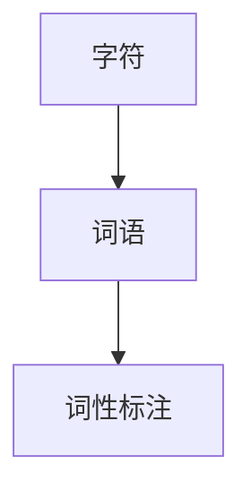
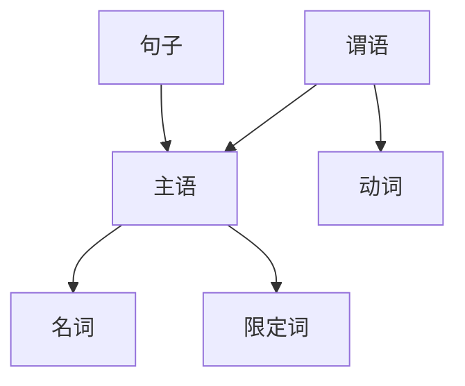
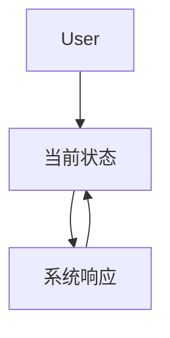
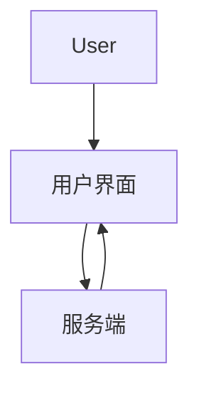
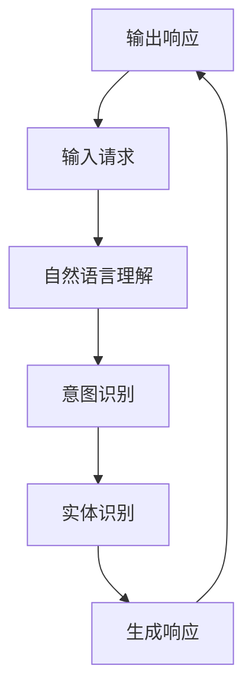

                 


# 自然语言理解在智能客户服务中的应用

> 关键词：自然语言理解、智能客服、意图识别、实体识别、深度学习

> 摘要：本文深入探讨了自然语言理解（NLU）技术在智能客户服务中的应用，分析了其在提升客户体验和优化服务效率方面的重要作用。文章从基础概念、核心技术、系统架构到实际案例，全面解析了NLU在智能客服中的应用，并提供了详细的算法原理和实现方法。

---

# 第一部分：引言

## 第1章：智能客户服务的背景与现状

### 1.1 智能客户服务的背景
智能客户服务的兴起源于传统客户服务模式的局限性。传统客服依赖人工操作，效率低、成本高且难以满足大规模客户需求。随着人工智能技术的发展，尤其是自然语言处理（NLP）和自然语言理解（NLU）技术的进步，智能客服逐渐成为提升客户体验和优化服务流程的重要工具。

### 1.2 自然语言理解的核心作用
自然语言理解（NLU）是人工智能领域的核心技术，旨在让计算机能够理解和解析人类的自然语言。在智能客服中，NLU主要用于识别客户的意图和提取实体信息，从而实现自动化服务和个性化响应。

### 1.3 本文的目标与结构
本文旨在探讨NLU在智能客服中的具体应用，分析其技术原理和实现方法。文章结构如下：
1. 引言：介绍智能客户服务的背景与现状。
2. 自然语言理解基础：讲解NLU的核心概念和技术。
3. NLU在智能客服中的应用：分析意图识别、实体识别等任务。
4. 智能客服系统设计：探讨系统架构和接口设计。
5. 项目实战：通过具体案例展示NLU技术的实现与应用。
6. 总结与展望：总结全文并展望未来发展。

---

# 第二部分：自然语言理解基础

## 第2章：自然语言理解的核心技术

### 2.1 词法分析
词法分析是NLU的基础，旨在将连续的文本分解为词汇单位。常用方法包括分词和词性标注。

#### 分词
分词是将连续的字符分割成有意义的词语。例如，将“helloworld”分割为“hello”和“world”。



### 2.2 句法分析
句法分析研究句子的结构和语法关系，帮助理解文本的语义。

#### 依存句法分析
依存句法分析通过构建依存关系图来展示词语之间的关系。



### 2.3 实体识别
实体识别（NER）是识别文本中的人名、地名、组织名等专有名词。

#### 常用实体类别
| 实体类型 | 示例 |
|----------|------|
| 人名 | 李小龙、奥巴马 |
| 地名 | 北京、纽约 |
| 组织名 | 微软、苹果 |

### 2.4 意图识别
意图识别旨在理解用户行为背后的目标，例如识别用户是想查询产品信息还是投诉问题。

#### 常见意图类型
| 意图类型 | 示例 |
|----------|------|
| 查询产品信息 | "请问你们有哪些产品？" |
| 投诉问题 | "我遇到了一个问题，请帮我看一下。" |

### 2.5 常用NLU模型
| 模型名称 | 描述 |
|----------|------|
| TF-IDF | 统计模型，常用于关键词提取 |
| LSTM | 循环神经网络，适合处理序列数据 |
| Transformer | 基于注意力机制的模型，如BERT |

---

# 第三部分：自然语言理解在智能客服中的应用

## 第3章：意图识别在智能客服中的应用

### 3.1 意图识别的基本原理
意图识别通过分析用户的文本或语音，确定其背后的目的。常用算法包括基于规则的分类和机器学习模型。

#### 3.1.1 基于规则的分类
基于规则的分类通过预定义的规则将文本映射到特定的意图。

```python
def detect_intent(text):
    if "产品" in text:
        return "查询产品信息"
    elif "投诉" in text:
        return "投诉问题"
    else:
        return "其他"
```

#### 3.1.2 机器学习模型
机器学习模型通过训练数据学习意图分类器。

```python
from sklearn.svm import SVC
from sklearn.feature_extraction.text import TfidfVectorizer

# 训练数据
X = ["产品咨询", "服务投诉", "技术支持"]
y = ["查询产品信息", "投诉问题", "技术支持"]

# 特征提取
vectorizer = TfidfVectorizer()
X_vec = vectorizer.fit_transform(X)

# 训练模型
model = SVC()
model.fit(X_vec, y)

# 预测
text = "我遇到了一个问题，请帮助我解决。"
text_vec = vectorizer.transform([text])
intent = model.predict(text_vec)
print(intent[0])  # 输出："投诉问题"
```

### 3.2 实体识别在智能客服中的应用
实体识别用于提取文本中的关键信息，如客户名称、联系方式等。

#### 3.2.1 实体识别的实现
使用命名实体识别（NER）模型提取实体。

```python
from spacy.lang.zh import Chinese
import spacy

# 加载模型
nlp = spacy.load("zh_core_web_sm")

# 文本处理
doc = nlp("我的名字是李小龙，联系方式是138-1234-5678。")
for token in doc:
    if token.ent_type_:
        print(f"{token.text}({token.ent_type_})")
```

---

## 第4章：对话管理在智能客服中的应用

### 4.1 对话管理的基本原理
对话管理负责维护对话的上下文，确保服务过程的连贯性。

#### 4.1.1 对话状态跟踪
对话状态跟踪通过记录用户的当前意图和历史对话内容来管理对话。



### 4.2 基于规则的对话管理
基于规则的对话管理通过预定义的规则处理用户请求。

```python
def handle_request(request):
    if request == "查询产品":
        return "请提供产品名称。"
    elif request == "投诉":
        return "请描述具体问题。"
    else:
        return "无法识别您的请求。"
```

### 4.3 基于机器学习的对话管理
基于机器学习的对话管理通过训练数据学习对话策略。

```python
from tensorflow.keras import layers
import tensorflow as tf

# 定义模型
model = tf.keras.Sequential([
    layers.Dense(64, activation='relu'),
    layers.Dense(32, activation='relu'),
    layers.Dense(1, activation='sigmoid')
])

# 编译模型
model.compile(optimizer='adam', loss='binary_crossentropy', metrics=['accuracy'])

# 训练模型
model.fit(x_train, y_train, epochs=10, batch_size=32)
```

---

# 第四部分：智能客服系统的架构与设计

## 第5章：智能客服系统的架构设计

### 5.1 系统功能设计
智能客服系统的主要功能包括用户输入处理、意图识别、实体提取和对话管理。

#### 5.1.1 用户输入处理
用户输入处理负责接收用户的文本或语音输入，并进行预处理。

```python
def preprocess_input(text):
    text = text.lower()
    return text
```

### 5.2 系统架构设计
智能客服系统的架构通常包括前端界面、后端服务和数据库。

#### 5.2.1 前端界面
前端界面负责与用户交互，接收输入并显示输出。



### 5.3 接口设计
智能客服系统需要与外部系统（如数据库、第三方API）进行交互。

#### 5.3.1 实体提取接口
实体提取接口用于提取文本中的关键信息。

```python
def extract_entities(text):
    # 使用预训练模型进行实体识别
    nlp = spacy.load("zh_core_web_sm")
    doc = nlp(text)
    entities = []
    for token in doc.ents:
        entities.append((token.text, token.label_))
    return entities
```

### 5.4 交互流程设计
交互流程设计描述用户与系统之间的对话流程。



---

# 第五部分：项目实战

## 第6章：智能客服系统项目实战

### 6.1 项目环境搭建
项目环境搭建需要安装必要的库和工具。

```bash
pip install spacy transformers tensorflow scikit-learn
python -m spacy download zh_core_web_sm
```

### 6.2 核心功能实现

#### 6.2.1 意图识别实现
使用支持向量机（SVM）进行意图分类。

```python
from sklearn.svm import SVC
from sklearn.feature_extraction.text import TfidfVectorizer

# 训练数据
X = ["产品咨询", "服务投诉", "技术支持"]
y = ["查询产品信息", "投诉问题", "技术支持"]

# 特征提取
vectorizer = TfidfVectorizer()
X_vec = vectorizer.fit_transform(X)

# 训练模型
model = SVC()
model.fit(X_vec, y)

# 预测
text = "我遇到了一个问题，请帮助我解决。"
text_vec = vectorizer.transform([text])
intent = model.predict(text_vec)
print(intent[0])  # 输出："投诉问题"
```

### 6.3 系统测试与优化
系统测试包括单元测试、集成测试和用户测试。优化方向包括提升模型准确率和优化系统性能。

---

# 第六部分：总结与展望

## 第7章：总结与展望

### 7.1 全文总结
本文详细探讨了自然语言理解在智能客户服务中的应用，分析了其在意图识别、实体识别和对话管理中的具体应用，并提供了系统的架构设计和项目实战案例。

### 7.2 未来展望
随着深度学习和大模型技术的发展，智能客服系统将更加智能化和个性化。未来的研究方向包括多轮对话优化、情感理解和多语言支持。

### 7.3 最佳实践
- 在实际应用中，建议结合具体业务需求选择合适的NLU模型。
- 定期更新训练数据以提升模型的准确性和适应性。
- 注意保护用户隐私，确保数据安全。

---

# 作者：AI天才研究院/AI Genius Institute & 禅与计算机程序设计艺术 /Zen And The Art of Computer Programming

---

本文通过系统地分析自然语言理解在智能客户服务中的应用，为读者提供了从理论到实践的全面指导。希望本文能为相关领域的研究和应用提供有价值的参考。

