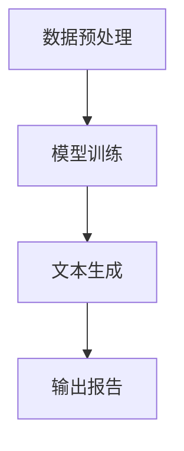

                 


# 自然语言生成技术在金融报告写作中的应用

## 关键词：自然语言生成，金融报告，NLP，文本生成，机器学习

## 摘要：自然语言生成（Natural Language Generation, NLG）技术在金融报告写作中的应用正变得越来越重要。本文将详细探讨NLG技术的基本原理、其在金融报告写作中的具体应用，以及如何通过算法优化和系统架构设计来提升金融报告的质量和效率。我们将从背景介绍、核心概念、算法原理、系统架构、项目实战和最佳实践等多个维度进行深入分析，为读者提供全面的技术解读。

---

## 第一章: 自然语言生成技术的背景与概念

### 1.1 自然语言生成技术的基本概念

自然语言生成（Natural Language Generation, NLG）是一种人工智能技术，旨在将结构化数据转换为自然流畅的文本。它通过算法和模型，模拟人类语言生成的过程，生成符合语法和语义的文本内容。

#### 1.1.1 自然语言生成技术的定义

自然语言生成技术是指通过计算机程序生成人类可读文本的技术。它涵盖了从简单文本生成到复杂内容创作的多种场景，广泛应用于多个领域，包括金融、医疗、教育等。

#### 1.1.2 自然语言生成技术的核心要素

- **输入数据**：NLG系统的输入通常是结构化数据或半结构化数据，如表格、JSON等。
- **生成模型**：基于统计、规则或深度学习模型，如RNN、LSTM、Transformer等。
- **语言知识**：包含词典、语法规则和领域知识的数据库，确保生成文本的准确性和流畅性。
- **输出文本**：生成的自然语言文本，符合特定的格式和风格要求。

#### 1.1.3 自然语言生成技术的分类

- **基于规则的方法**：通过预定义的规则生成文本，适用于简单场景，如天气预报。
- **基于统计的方法**：利用概率模型，根据数据分布生成文本。
- **基于深度学习的方法**：使用神经网络模型，如RNN、LSTM、Transformer等，生成高质量的自然语言文本。

### 1.2 金融报告写作的特点与需求

金融报告的写作具有高度的专业性和复杂性，通常涉及大量的数据和复杂的分析。

#### 1.2.1 金融报告的写作特点

- **专业性**：金融报告需要使用专业的术语和行业知识。
- **数据驱动**：报告内容通常基于大量的结构化数据。
- **准确性**：报告中的数据和分析必须准确无误。
- **及时性**：报告需要及时生成，以反映最新的市场动态。

#### 1.2.2 金融报告写作中的常见问题

- **时间成本高**：撰写高质量的金融报告需要大量的人工劳动。
- **一致性问题**：不同报告之间可能存在风格和格式不一致的问题。
- **数据准确性**：人工撰写报告时，容易出现数据错误或遗漏。

#### 1.2.3 自然语言生成技术在金融报告写作中的优势

- **提高效率**：NLG技术可以快速生成大量报告，节省时间和人力资源。
- **确保一致性**：通过统一的模型生成报告，保持风格和格式的一致性。
- **数据准确性**：NLG技术能够准确处理和引用数据，减少人为错误。

### 1.3 自然语言生成技术与金融报告的结合

自然语言生成技术在金融报告中的应用可以显著提升报告的生成效率和质量。

#### 1.3.1 自然语言生成技术在金融报告中的应用场景

- **市场分析报告**：生成市场趋势分析、行业动态等内容。
- **财务分析报告**：生成财务数据总结、财务比率分析等内容。
- **投资建议报告**：根据市场数据生成投资建议和策略。

#### 1.3.2 自然语言生成技术对金融报告写作效率的提升

通过自动化生成报告内容，NLG技术可以显著缩短报告撰写时间，同时减少人力资源的投入。

#### 1.3.3 自然语言生成技术对金融报告质量的改善

NLG技术能够确保报告内容的准确性和一致性，同时优化文本的流畅性和可读性。

---

## 第二章: 自然语言生成技术的核心概念与原理

### 2.1 自然语言生成技术的核心概念

自然语言生成技术的核心在于将结构化数据转换为自然语言文本，同时确保生成文本的准确性和流畅性。

#### 2.1.1 自然语言生成技术的输入与输出

- **输入**：结构化数据（如表格、JSON）或半结构化数据（如文本段落）。
- **输出**：自然流畅的文本，如市场分析、财务总结等。

#### 2.1.2 自然语言生成技术的生成过程

生成过程通常包括数据处理、模型选择、文本生成和优化调整四个阶段。

#### 2.1.3 自然语言生成技术的关键技术点

- **数据预处理**：清洗和转换输入数据，使其适合生成模型的输入。
- **模型选择**：选择合适的生成模型（如RNN、Transformer）进行文本生成。
- **文本优化**：对生成的文本进行语法检查和风格调整，确保其准确性和流畅性。

### 2.2 自然语言生成技术的模型结构

自然语言生成技术的模型结构多种多样，主要包括基于规则的模型、统计模型和深度学习模型。

#### 2.2.1 基于统计的自然语言生成模型

基于统计的模型通过概率计算生成文本，常用的模型包括n-gram模型和隐马尔可夫模型。

#### 2.2.2 基于神经网络的自然语言生成模型

基于神经网络的模型（如RNN、LSTM、Transformer）通过深度学习生成高质量的自然语言文本。

#### 2.2.3 基于Transformer的自然语言生成模型

基于Transformer的模型（如BERT、GPT）在自然语言生成领域表现尤为出色，能够生成连贯且有意义的文本内容。

### 2.3 自然语言生成技术的训练与优化

自然语言生成模型的训练和优化是确保生成文本质量的关键。

#### 2.3.1 自然语言生成模型的训练流程

- **数据准备**：收集和整理训练数据。
- **模型训练**：使用训练数据对生成模型进行训练。
- **模型评估**：通过测试数据评估模型的生成效果。
- **模型优化**：根据评估结果优化模型参数和结构。

#### 2.3.2 自然语言生成模型的损失函数

常用的损失函数包括交叉熵损失函数和BLEU分数。

#### 2.3.3 自然语言生成模型的优化方法

常用的优化方法包括Adam优化器和学习率衰减策略。

---

## 第三章: 自然语言生成技术在金融报告中的应用

### 3.1 金融报告写作中的文本生成

自然语言生成技术在金融报告中的文本生成具有重要的应用价值。

#### 3.1.1 金融报告中的文本生成需求

- **市场分析**：生成市场趋势分析报告。
- **财务分析**：生成财务数据总结报告。
- **投资建议**：生成投资策略建议报告。

#### 3.1.2 自然语言生成技术在金融报告文本生成中的应用

- **市场动态报告**：根据实时市场数据生成市场动态分析。
- **财务数据报告**：根据财务数据生成财务分析报告。
- **投资策略报告**：根据市场和财务数据生成投资策略建议。

#### 3.1.3 自然语言生成技术在金融报告文本生成中的挑战

- **数据多样性**：需要处理不同类型和规模的数据。
- **生成准确性**：确保生成文本的准确性和可靠性。
- **文本流畅性**：生成的文本需要流畅自然，符合专业术语和表达习惯。

### 3.2 自然语言生成技术在金融报告中的具体应用

#### 3.2.1 金融报告中的文本摘要

自然语言生成技术可以用于生成报告的摘要，帮助读者快速获取关键信息。

#### 3.2.2 金融报告中的数据报告生成

自然语言生成技术可以将结构化数据转换为自然语言文本，生成数据报告。

#### 3.2.3 金融报告中的市场分析与预测

自然语言生成技术可以用于生成市场分析和预测报告，提供专业的市场见解。

---

## 第四章: 自然语言生成技术的算法原理

### 4.1 自然语言生成技术的算法概述

自然语言生成技术的算法主要包括基于规则的算法和基于深度学习的算法。

#### 4.1.1 自然语言生成技术的主要算法

- **基于规则的生成算法**：通过预定义的规则生成文本。
- **基于统计的生成算法**：利用概率模型生成文本。
- **基于深度学习的生成算法**：使用神经网络生成高质量的自然语言文本。

#### 4.1.2 自然语言生成技术的训练流程

自然语言生成模型的训练流程包括数据准备、模型训练和模型评估三个阶段。

---

## 第五章: 自然语言生成技术的系统架构设计

### 5.1 金融报告写作系统的模块划分

金融报告写作系统通常包括数据预处理模块、模型训练模块和文本生成模块。

#### 5.1.1 数据预处理模块

数据预处理模块负责将原始数据转换为适合生成模型输入的形式。

#### 5.1.2 模型训练模块

模型训练模块负责使用预处理后的数据对生成模型进行训练。

#### 5.1.3 文本生成模块

文本生成模块负责根据训练好的模型生成自然语言文本。

### 5.2 金融报告写作系统的流程图

以下是一个金融报告写作系统的流程图：



---

## 第六章: 自然语言生成技术的项目实战

### 6.1 环境安装

在进行项目实战之前，需要安装必要的软件和库。

#### 6.1.1 安装Python和必要的库

- Python：3.8或更高版本
- 库：TensorFlow、Keras、PyTorch、Hugging Face Transformers

#### 6.1.2 安装自然语言处理库

- NLTK：Python自然语言处理工具包
- SpaCy：另一个强大的自然语言处理库

### 6.2 核心代码实现

以下是一个基于Transformer的自然语言生成模型的实现示例：

```python
import tensorflow as tf
from tensorflow import keras

# 定义生成模型
class NLGModel(keras.Model):
    def __init__(self, vocab_size):
        super(NLGModel, self).__init__()
        self.embedding = keras.layers.Embedding(vocab_size, 64)
        self.transformer = TransformerLayer()
        self.dense = keras.layers.Dense(vocab_size, activation='softmax')

    def call(self, inputs):
        x = self.embedding(inputs)
        x = self.transformer(x)
        x = self.dense(x)
        return x

# 定义Transformer层
class TransformerLayer(keras.layers.Layer):
    def __init__(self, **kwargs):
        super(TransformerLayer, self).__init__(**kwargs)
        self.mha = MultiHeadAttention(8, 64)
        self.ffn = Dense(units=64, activation='relu')

    def call(self, inputs):
        x = self.mha(x, x)
        x = self.ffn(x)
        return x
```

### 6.3 实际案例分析

以下是一个生成市场分析报告的实际案例：

```python
import pandas as pd
import numpy as np

# 数据预处理
data = pd.read_csv('market_data.csv')
preprocessed_data = data[['Date', 'Price', 'Volume']]

# 模型训练
model = NLGModel(len(tokenizer.vocab))
model.compile(optimizer='adam', loss='sparse_categorical_crossentropy')
model.fit(preprocessed_data, epochs=10, batch_size=32)

# 文本生成
input_sequence = tokenizer.text_to_sequence('market analysis')
generated_text = model.generate_text(input_sequence)
print(generated_text)
```

---

## 第七章: 自然语言生成技术的最佳实践

### 7.1 最佳实践

- **数据质量**：确保输入数据的准确性和完整性。
- **模型选择**：根据具体任务选择合适的生成模型。
- **文本优化**：对生成的文本进行语法检查和风格调整。

### 7.2 小结

自然语言生成技术在金融报告写作中的应用具有重要的意义，可以显著提升报告的生成效率和质量。

### 7.3 注意事项

- **数据隐私**：注意保护数据隐私，遵守相关法律法规。
- **模型优化**：持续优化生成模型，提升生成文本的质量。
- **用户反馈**：收集用户反馈，不断改进生成模型和系统。

### 7.4 拓展阅读

- 《Deep Learning for NLP》
- 《Transformers: State-of-the-Art NLP》
- 《Financial Reporting and Analysis》

---

## 作者：AI天才研究院/AI Genius Institute & 禅与计算机程序设计艺术 /Zen And The Art of Computer Programming

---

以上是关于自然语言生成技术在金融报告写作中的应用的完整目录和内容概述。希望对您有所帮助！

