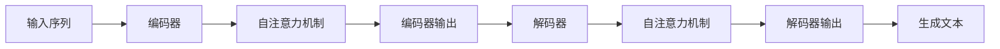
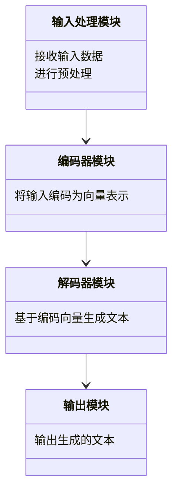

                 


# 自然语言生成：提升AI Agent的表达能力

> 关键词：自然语言生成，AI Agent，文本生成，生成模型，Transformer，GPT

> 摘要：自然语言生成（Natural Language Generation, NLG）是人工智能领域中的重要技术，用于使AI能够生成人类语言。本文详细探讨了如何通过自然语言生成技术提升AI Agent的表达能力，涵盖了背景、核心概念、算法原理、系统架构、项目实战以及最佳实践等方面，帮助读者全面理解并掌握自然语言生成的应用与实现。

---

## 第一部分: 自然语言生成基础

### 第1章: 自然语言生成的背景与概念

#### 1.1 自然语言生成的定义与特点

自然语言生成（NLG）是指通过计算机算法生成人类语言文本的过程。与自然语言理解（NLU）不同，NLG关注的是将结构化的数据或信息转换为流畅、自然的文本表达。

**特点：**
- **生成性**：NLG系统能够生成新的文本内容，而不是简单地检索或匹配已有数据。
- **多样性**：生成的文本可以根据需求多样化，例如不同的语气、风格或长度。
- **上下文依赖性**：生成的文本通常依赖于上下文信息，以确保语义的连贯性和相关性。

#### 1.2 自然语言生成的应用领域

NLG技术广泛应用于多个领域，以下是其中几个主要领域：

1. **人工智能对话系统**：例如智能客服、虚拟助手等，NLG用于生成与用户的对话内容。
2. **自动内容生成**：包括新闻报道、产品描述、营销文案等的自动生成。
3. **机器翻译与文本摘要**：NLG在翻译和摘要任务中起着关键作用，确保生成文本的准确性和流畅性。

#### 1.3 自然语言生成与AI Agent的关系

AI Agent（智能代理）是一种能够感知环境并采取行动以实现目标的实体。NLG技术在AI Agent中的作用至关重要，主要体现在以下几个方面：

1. **交互能力**：AI Agent需要通过自然语言与用户进行交互，NLG使其能够生成自然的对话内容。
2. **任务执行**：AI Agent可以通过NLG技术生成指令或解释，帮助用户完成特定任务。
3. **用户体验**：流畅的自然语言生成能力能够显著提升用户的体验，使AI Agent更加智能化和人性化。

---

### 第2章: 自然语言生成的核心概念与原理

#### 2.1 生成模型的工作原理

生成模型的目标是将输入的信息转换为自然语言文本。常见的生成模型包括基于规则的生成、统计生成和基于深度学习的生成。

1. **基于规则的生成**：通过预定义的语法规则生成文本，通常用于简单任务，如句法树的生成。
2. **统计生成**：利用统计语言模型，通过概率计算生成最可能的文本。
3. **基于深度学习的生成**：采用神经网络模型（如RNN、Transformer）生成高质量的文本。

#### 2.2 自然语言生成的关键技术

1. **语言模型的训练与优化**：语言模型通过大量数据的训练，学习语言的分布规律，从而生成自然的文本。
2. **解码策略的选择**：解码策略决定了生成文本的方式，包括贪心解码、束搜索等。
3. **多模态生成**：结合图像、语音等多种模态信息，生成更丰富的文本内容。

---

### 第3章: 自然语言生成的算法原理

#### 3.1 基于Transformer的生成模型

Transformer模型通过自注意力机制，捕捉文本中的长距离依赖关系，从而生成高质量的文本。

1. **自注意力机制**：通过计算输入序列中每个词与其他词的相关性，生成上下文相关的表示。
2. **解码器结构**：解码器通过逐步生成文本，结合自注意力和前一个时间步的输出，生成最终的文本。



#### 3.2 GPT模型的生成原理

GPT（Generative Pre-trained Transformer）模型通过预训练的方式，学习语言的分布规律，并在生成阶段通过解码器生成文本。

1. **预训练阶段**：模型通过大量文本数据的训练，学习语言的语法和语义。
2. **生成阶段**：基于输入的上下文，模型生成最可能的后续文本。

---

### 第4章: 自然语言生成的数学模型与公式

#### 4.1 语言模型的概率公式

语言模型的目标是计算给定输入序列的概率。最大似然估计（MLE）是最常用的训练方法，公式如下：

$$ \text{MLE} = \arg\max_{\theta} \prod_{i=1}^{n} P(x_i | x_{<i}, \theta) $$

其中，$x_i$ 表示输入序列中的第i个词，$\theta$ 表示模型参数。

#### 4.2 注意力机制的数学表达

自注意力机制的计算公式如下：

$$ \text{Attention}(Q, K, V) = \text{softmax}\left(\frac{QK^T}{\sqrt{d_k}}\right)V $$

其中，$Q$、$K$、$V$ 分别是查询、键和值矩阵，$d_k$ 是键的维度。

---

### 第5章: 系统架构设计

#### 5.1 功能模块设计

一个完整的自然语言生成系统通常包括以下几个功能模块：

1. **输入处理模块**：接收输入数据并进行预处理。
2. **编码器模块**：将输入数据编码为模型可处理的形式。
3. **解码器模块**：生成自然语言文本。
4. **输出模块**：将生成的文本输出并进行后处理。



---

### 第6章: 项目实战

#### 6.1 环境配置

安装必要的库：

```bash
pip install torch
pip install transformers
```

#### 6.2 核心实现代码

以下是一个简单的生成模型的实现代码：

```python
import torch
import torch.nn as nn

class SimpleGenerator(nn.Module):
    def __init__(self, input_dim, output_dim):
        super(SimpleGenerator, self).__init__()
        self.fc = nn.Linear(input_dim, output_dim)
    
    def forward(self, x):
        output = self.fc(x)
        return output

# 初始化模型
input_dim = 100
output_dim = 50
model = SimpleGenerator(input_dim, output_dim)
```

#### 6.3 功能解读与案例分析

通过上述代码，我们可以生成简单的文本内容。实际应用中，可以结合具体的任务需求，优化模型的结构和参数。

---

### 第7章: 最佳实践与总结

#### 7.1 注意事项

1. **模型调优**：选择合适的超参数和优化方法，提升生成效果。
2. **生成结果优化**：通过采样策略和解码方法，优化生成文本的质量。
3. **性能优化**：通过并行计算和模型剪枝等方法，提升生成速度。

#### 7.2 拓展阅读

1. [《Deep Learning》] by Ian Goodfellow
2. [《Natural Language Processing with PyTorch》] by A. R. Sadat Ali

---

作者：AI天才研究院 & 禅与计算机程序设计艺术

