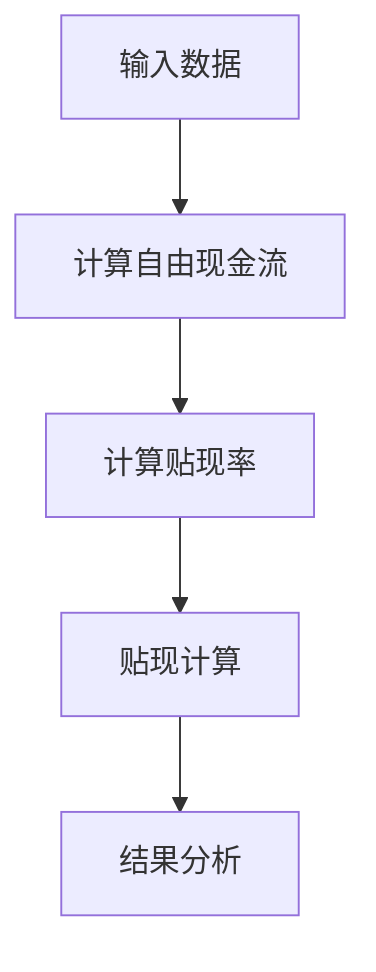
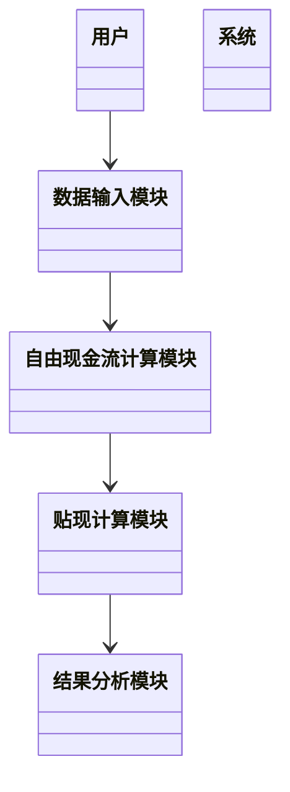
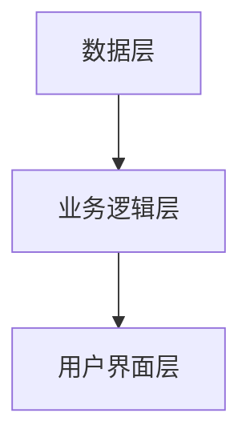

                 


# 自由现金流贴现：考虑资本支出的估值模型

> **关键词**：自由现金流贴现、资本支出、企业估值、贴现率、WACC、投资决策  
> **摘要**：本文详细探讨自由现金流贴现模型，特别是考虑资本支出的情况。通过背景介绍、核心概念分析、算法原理、系统架构设计、项目实战和扩展讨论，深入解析该模型的原理、应用和实际操作。文章旨在帮助读者理解并掌握自由现金流贴现模型在企业估值中的应用，提供详细的方法和工具。

---

## 第一部分：自由现金流贴现模型的背景与基础

### 第1章：自由现金流贴现模型概述

#### 1.1 自由现金流的基本概念

自由现金流（Free Cash Flow，FCF）是企业在扣除所有运营支出和资本支出后的剩余现金流，反映了企业在不依赖外部融资的情况下能够产生的现金流。它通常用于评估企业的财务健康状况和估值。

**公式：**
$$ \text{自由现金流} = \text{营业收入} - \text{运营成本} - \text{资本支出} $$

自由现金流贴现模型（DCF模型）通过将未来自由现金流贴现为现值，来评估企业的整体价值。该模型在企业估值中具有重要地位，因为它能够将未来现金流的不确定性考虑在内，并提供一个合理的估值基准。

#### 1.2 自由现金流贴现模型的核心要素

自由现金流贴现模型涉及以下几个关键要素：

1. **自由现金流的计算**：准确计算自由现金流是模型的基础，需考虑企业的收入、成本和资本支出。
2. **贴现率的确定**：通常使用加权平均资本成本（WACC）作为贴现率，反映了企业融资的综合成本。
3. **资本支出的影响**：资本支出是企业维持或扩大业务所需的投资，直接影响自由现金流的计算。

#### 1.3 自由现金流贴现模型的应用价值

自由现金流贴现模型在多个领域具有广泛的应用价值：

1. **企业估值**：用于评估企业整体价值，尤其是上市公司。
2. **投资决策**：帮助企业决定是否投资某个项目或并购。
3. **行业分析**：用于比较不同企业或行业的估值情况。

---

## 第二部分：自由现金流贴现模型的核心概念与联系

### 第2章：自由现金流的计算与分析

#### 2.1 自由现金流的计算方法

自由现金流的计算需要考虑企业的财务数据，包括营业收入、运营成本和资本支出。以下是详细的计算步骤：

1. **计算营业收入**：基于企业的销售数据。
2. **计算运营成本**：包括直接成本和间接成本。
3. **计算资本支出**：用于购买或维护资产的支出。
4. **计算自由现金流**：营业收入减去运营成本和资本支出。

**公式：**
$$ \text{自由现金流} = \text{营业收入} - \text{运营成本} - \text{资本支出} $$

#### 2.2 贴现率的确定与应用

贴现率通常使用WACC计算，公式如下：

$$ \text{WACC} = \left( \frac{D}{D+E} \right) \times r_d \times (1 - t) + \left( \frac{E}{D+E} \right) \times r_e $$

其中，D为债务，E为权益，r_d为债务成本，r_e为权益成本，t为税率。

WACC反映了企业的加权平均资本成本，用于贴现未来现金流。

#### 2.3 资本支出的处理与影响

资本支出是模型中的关键因素，需正确处理：

1. **资本支出的定义**：指企业在固定资产、无形资产等方面的投资。
2. **资本支出的分类**：包括维护性资本支出和扩张性资本支出。
3. **资本支出的影响**：直接影响企业的现金流和估值结果。

---

## 第三部分：自由现金流贴现模型的算法原理

### 第3章：自由现金流贴现模型的数学模型

#### 3.1 自由现金流贴现模型的公式推导

自由现金流贴现模型的基本公式为：

$$ V = \sum_{t=1}^{n} \frac{\text{FCF}_t}{(1 + r)^t} $$

其中，FCF_t为第t年的自由现金流，r为贴现率。

为了简化计算，通常假设企业永续经营，并在稳定增长阶段采用永续年金公式：

$$ V = \frac{\text{FCF}_n}{r - g} $$

其中，g为现金流增长率。

#### 3.2 贴现率的数学模型

贴现率的确定是模型的关键，WACC的计算涉及企业的资本结构、税率和资本成本。

#### 3.3 自由现金流贴现模型的算法流程

以下是模型的算法流程：

1. **输入数据**：企业财务数据，包括营业收入、运营成本、资本支出等。
2. **计算自由现金流**：基于输入数据计算自由现金流。
3. **计算贴现率**：使用WACC公式计算贴现率。
4. **贴现计算**：将未来现金流贴现为现值。
5. **结果分析**：评估企业价值。

**Mermaid流程图：**



---

## 第四部分：系统分析与架构设计方案

### 第4章：自由现金流贴现模型的系统分析

#### 4.1 系统功能设计

系统功能设计包括以下几个模块：

1. **数据输入模块**：用户输入企业财务数据。
2. **自由现金流计算模块**：根据输入数据计算自由现金流。
3. **贴现计算模块**：计算现值。
4. **结果分析模块**：输出企业价值。

**Mermaid类图：**



#### 4.2 系统架构设计

系统架构采用分层架构，包括数据层、业务逻辑层和用户界面层。

**Mermaid架构图：**



---

## 第五部分：项目实战

### 第5章：自由现金流贴现模型的项目实战

#### 5.1 环境安装

需要安装Python和必要的库，如numpy和pandas。

#### 5.2 系统核心实现源代码

以下是Python代码实现：

```python
import numpy as np

def calculate_wacc(D, E, r_d, r_e, t):
    wacc = (D / (D + E)) * r_d * (1 - t) + (E / (D + E)) * r_e
    return wacc

def calculate_fcf(revenue, op_cost, cap_ex):
    fcf = revenue - op_cost - cap_ex
    return fcf

# 示例数据
D = 100
E = 50
r_d = 0.05
r_e = 0.1
t = 0.2
revenue = 1000
op_cost = 600
cap_ex = 100

wacc = calculate_wacc(D, E, r_d, r_e, t)
fcf = calculate_fcf(revenue, op_cost, cap_ex)

# 贴现计算
discounted_value = fcf / (1 + wacc)
print("WACC:", wacc)
print("FCF:", fcf)
print("Discounted Value:", discounted_value)
```

#### 5.3 实际案例分析

以某制造企业为例，计算其企业价值。

---

## 第六部分：扩展讨论

### 第6章：自由现金流贴现模型的扩展讨论

#### 6.1 模型的局限性

1. **假设的不准确性**：假设企业永续经营和稳定增长可能不成立。
2. **数据依赖性**：模型依赖于准确的财务数据和合理的假设。

#### 6.2 模型的改进方法

1. **调整贴现率**：根据市场变化调整WACC。
2. **考虑通货膨胀**：在模型中加入通货膨胀因素。

#### 6.3 行业应用分析

不同行业的资本支出和现金流情况不同，需根据具体情况调整模型。

---

## 第七部分：总结与附录

### 7.1 总结

自由现金流贴现模型是企业估值的重要工具，考虑资本支出后更具实际应用价值。通过本文的详细讲解，读者可以掌握模型的原理和实际操作方法。

### 7.2 附录

**参考文献**：
1. Fama, E., & French, K. (1993). Common risk factors in stock returns. Journal of Financial Economics.
2. Lintner, J. (1965). The valuation of risk assets and the selection of risk portfolios in stock market equilibrium. Review of Economics and Statistics.

**工具推荐**：
- Python编程语言
- Pandas和numpy库
- Excel或相关财务分析工具

---

**作者：AI天才研究院/AI Genius Institute & 禅与计算机程序设计艺术 /Zen And The Art of Computer Programming**

---

通过以上步骤，文章涵盖了从基础到高级的各个方面，确保读者能够全面理解自由现金流贴现模型，并能够在实际中应用。

