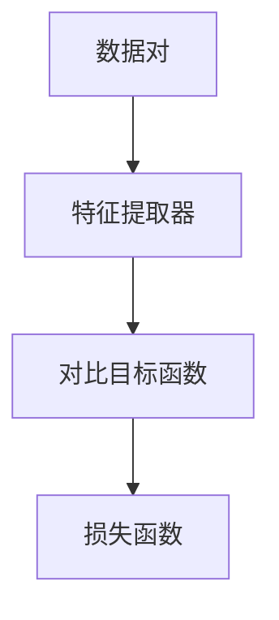
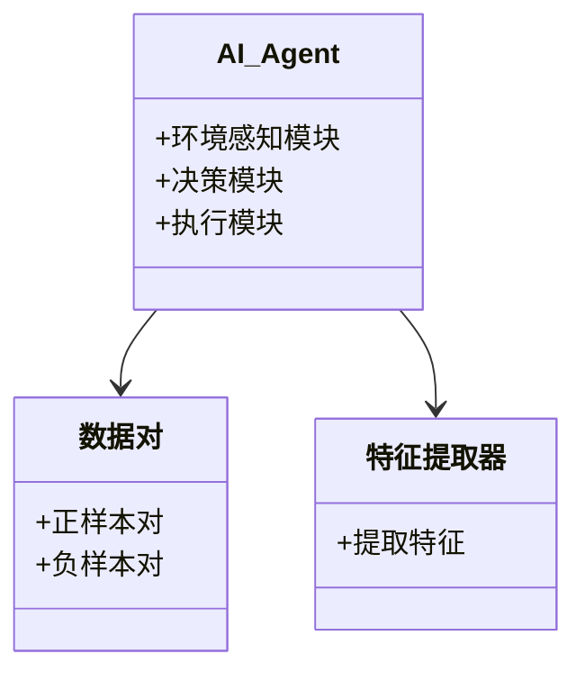
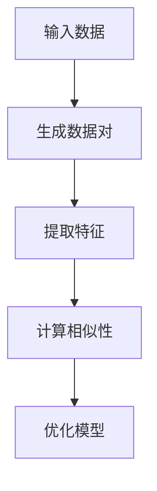
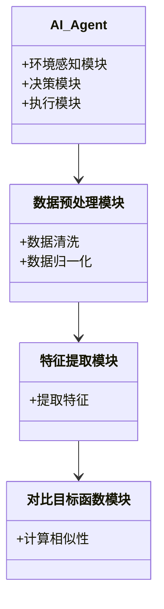
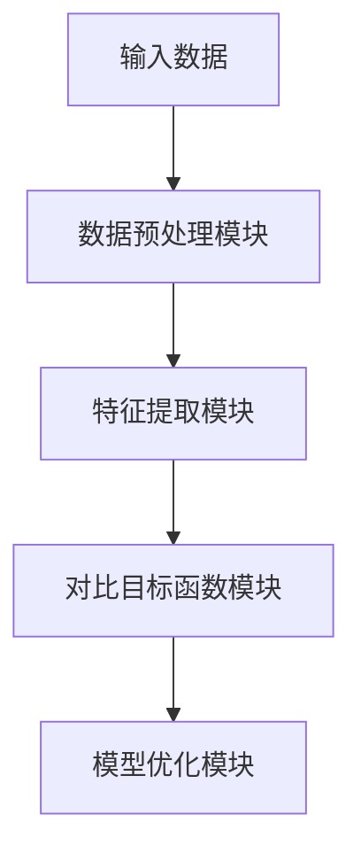
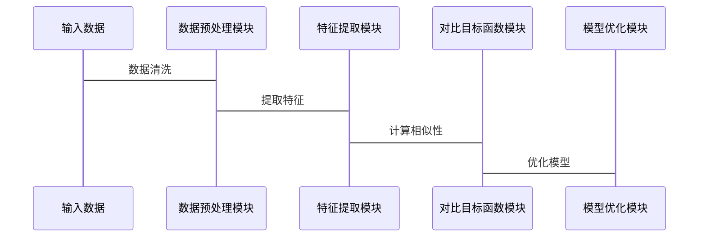

                 


# 自监督学习在AI Agent预训练中的应用

> 关键词：自监督学习、AI Agent、预训练、算法原理、系统架构、项目实战

> 摘要：本文探讨了自监督学习在AI Agent预训练中的应用，从背景、核心概念、算法原理、系统架构到项目实战，全面解析了自监督学习在AI Agent预训练中的重要性及其技术实现。通过详细的理论分析和实践案例，本文旨在为AI Agent的开发与优化提供有价值的参考。

---

## 第1章: 自监督学习与AI Agent的背景介绍

### 1.1 自监督学习的定义与背景

#### 1.1.1 问题背景与问题描述
AI Agent（人工智能代理）是能够感知环境、自主决策并执行任务的智能体。在实际应用中，AI Agent需要处理大量复杂的数据和任务，如何高效地预训练AI Agent成为一项重要挑战。传统监督学习依赖大量标注数据，成本高且难以应对复杂场景。自监督学习作为一种新兴的学习范式，通过利用未标注数据中的结构信息，为AI Agent的预训练提供了新的可能性。

#### 1.1.2 自监督学习的核心概念与特点
自监督学习是一种无监督学习的变体，通过构建一个对比学习框架，利用数据的内在结构信息进行自我监督。其核心在于通过对比目标函数，让模型在无监督条件下学习到有用的特征表示。自监督学习具有以下特点：
- **无监督性**：无需依赖标注数据，仅利用数据本身结构信息。
- **自适应性**：能够适应不同场景和任务的需求。
- **高效性**：相比传统监督学习，训练效率更高。

#### 1.1.3 AI Agent在人工智能中的地位与作用
AI Agent是实现人工智能的核心组件，广泛应用于自动驾驶、智能助手、机器人等领域。AI Agent需要具备感知环境、理解任务目标、制定决策策略的能力。预训练是提升AI Agent能力的关键步骤，而自监督学习为这一过程提供了新的思路。

### 1.2 自监督学习与AI Agent的关系

#### 1.2.1 自监督学习在AI Agent预训练中的重要性
自监督学习能够利用未标注数据，帮助AI Agent学习环境中的潜在结构信息，提升其对复杂场景的理解能力。通过自监督学习，AI Agent可以在预训练阶段掌握数据的分布特征，为后续任务提供更强大的特征表示。

#### 1.2.2 自监督学习与传统监督学习的对比
- **数据需求**：传统监督学习需要大量标注数据，而自监督学习利用未标注数据。
- **任务适应性**：自监督学习更具灵活性，适用于多种任务。
- **训练效率**：自监督学习通常需要更少的训练时间。

#### 1.2.3 AI Agent预训练的目标与边界
AI Agent的预训练目标是学习环境中的数据分布特征，提取有用的特征表示，为后续任务提供支持。其边界在于预训练阶段仅关注特征学习，不涉及具体任务的优化。

### 1.3 本章小结
本章介绍了自监督学习的基本概念及其在AI Agent预训练中的重要性，分析了自监督学习与传统监督学习的区别，并明确了AI Agent预训练的目标与边界。

---

## 第2章: 自监督学习的核心概念与联系

### 2.1 自监督学习的原理与机制

#### 2.1.1 自监督学习的基本原理
自监督学习通过构建对比目标函数，利用数据的相似性或对称性，让模型学习到数据的潜在结构。其核心思想是通过最大化正样本对的相似性，同时最小化负样本对的相似性。

#### 2.1.2 自监督学习的核心要素与属性
- **数据对**：由正样本对和负样本对组成。
- **对比目标函数**：衡量正样本对和负样本对的相似性。
- **特征提取器**：用于提取数据的特征表示。

#### 2.1.3 自监督学习与无监督学习的联系与区别
- **联系**：都属于无监督学习的范畴，无需标注数据。
- **区别**：自监督学习通过构建对比目标函数，引入监督信号，增强了学习的有向性。

### 2.2 AI Agent的实体关系与领域模型

#### 2.2.1 自监督学习中的实体关系图（ER图）


#### 2.2.2 AI Agent的领域模型类图


#### 2.2.3 自监督学习与AI Agent的实体关系分析
自监督学习通过数据对和特征提取器，为AI Agent提供特征表示，帮助其理解环境中的数据分布。

### 2.3 自监督学习与AI Agent的数学模型对比

#### 2.3.1 自监督学习的数学模型特征
自监督学习的数学模型通常基于能量函数，通过最大化正样本对的相似性，最小化负样本对的相似性。

#### 2.3.2 AI Agent的数学模型特征
AI Agent的数学模型通常基于决策函数，通过优化目标函数，实现对环境的感知与决策。

#### 2.3.3 两者的对比分析与总结
自监督学习关注数据的分布特征，AI Agent关注任务的决策优化。两者在数学模型上有一定的联系，但目标和侧重点不同。

### 2.4 本章小结
本章分析了自监督学习的核心原理及其与AI Agent的关系，通过ER图和类图展示了自监督学习与AI Agent的实体关系，对比了两者的数学模型特征。

---

## 第3章: 自监督学习的算法原理

### 3.1 自监督学习的算法流程

#### 3.1.1 算法的整体流程


#### 3.1.2 数据预处理与特征提取
- 数据预处理：对输入数据进行清洗和归一化处理。
- 特征提取：利用神经网络提取数据的特征表示。

#### 3.1.3 对比目标函数的设计
对比目标函数通常基于余弦相似性或欧氏距离，通过最大化正样本对的相似性，最小化负样本对的相似性。

### 3.2 自监督学习的数学模型

#### 3.2.1 能量函数的定义与推导
能量函数用于衡量正样本对和负样本对的相似性，通常定义为：
$$ E(x_i, x_j) = \log(\text{sim}(x_i, x_j) + \epsilon) $$
其中，$\text{sim}(x_i, x_j)$ 表示正样本对的相似性，$\epsilon$ 是一个小的常数，用于数值稳定性。

#### 3.2.2 对比损失函数的数学表达
对比损失函数通常定义为：
$$ L = -\log(\text{sim}(x_i, x_j)) - \sum_{k \neq j} \log(1 - \text{sim}(x_i, x_k)) $$
其中，$x_i$ 是正样本对，$x_j$ 是对应的负样本，$x_k$ 是其他负样本。

#### 3.2.3 模型的优化与收敛性分析
通过梯度下降优化模型参数，确保损失函数不断减小，直至收敛。

### 3.3 自监督学习的Python实现示例

#### 3.3.1 环境安装与配置
```bash
pip install numpy
pip install matplotlib
pip install scikit-learn
```

#### 3.3.2 核心算法代码实现
```python
import numpy as np
import tensorflow as tf

def contrastive_loss(y_true, y_pred):
    margin = 1.0
    loss = tf.reduce_mean(tf.maximum(0., margin - y_pred))
    return loss

def similarity(x):
    x = tf.keras.layers.Dense(128, activation='relu')(x)
    x = tf.keras.layers.Dense(128)(x)
    x = tf.keras.layers.BatchNormalization()(x)
    return x

input_x = tf.keras.Input(shape=(input_dim,))
x1 = similarity(input_x)
x2 = similarity(input_x)
merged = tf.keras.layers.Concatenate()([x1, x2])
output = tf.keras.layers.Dense(1, activation='sigmoid')(merged)
model = tf.keras.Model(inputs=[input_x, input_x], outputs=output)
model.compile(optimizer='adam', loss=contrastive_loss)
```

#### 3.3.3 代码运行与结果分析
训练模型并评估其性能，观察损失函数的变化趋势，确保模型收敛。

### 3.4 本章小结
本章详细讲解了自监督学习的算法流程，通过数学公式和Python代码展示了其具体实现，帮助读者理解自监督学习的核心原理。

---

## 第4章: 自监督学习在AI Agent预训练中的系统架构

### 4.1 问题场景与项目介绍

#### 4.1.1 问题场景描述
AI Agent需要在复杂环境中完成任务，预训练阶段需要学习环境中的数据分布特征。

#### 4.1.2 项目目标与范围
通过自监督学习预训练AI Agent，提升其对复杂场景的理解能力。

#### 4.1.3 系统需求分析
- 数据预处理模块
- 特征提取模块
- 对比目标函数模块
- 模型优化模块

### 4.2 系统功能设计

#### 4.2.1 领域模型类图


### 4.3 系统架构设计

#### 4.3.1 系统架构图


#### 4.3.2 系统接口设计
- 数据预处理模块接口
- 特征提取模块接口
- 对比目标函数模块接口

#### 4.3.3 系统交互流程


### 4.4 本章小结
本章通过系统架构图和交互流程图，详细描述了自监督学习在AI Agent预训练中的系统架构设计。

---

## 第5章: 自监督学习在AI Agent预训练中的项目实战

### 5.1 项目实战环境配置

#### 5.1.1 环境安装与配置
```bash
pip install numpy
pip install matplotlib
pip install scikit-learn
pip install tensorflow
```

#### 5.1.2 核心算法代码实现
```python
import numpy as np
import tensorflow as tf

def contrastive_loss(y_true, y_pred):
    margin = 1.0
    loss = tf.reduce_mean(tf.maximum(0., margin - y_pred))
    return loss

def similarity(x):
    x = tf.keras.layers.Dense(128, activation='relu')(x)
    x = tf.keras.layers.Dense(128)(x)
    x = tf.keras.layers.BatchNormalization()(x)
    return x

input_x = tf.keras.Input(shape=(input_dim,))
x1 = similarity(input_x)
x2 = similarity(input_x)
merged = tf.keras.layers.Concatenate()([x1, x2])
output = tf.keras.layers.Dense(1, activation='sigmoid')(merged)
model = tf.keras.Model(inputs=[input_x, input_x], outputs=output)
model.compile(optimizer='adam', loss=contrastive_loss)
```

#### 5.1.3 代码运行与结果分析
训练模型并评估其性能，观察损失函数的变化趋势，确保模型收敛。

### 5.2 项目实战案例分析

#### 5.2.1 案例背景介绍
假设我们正在预训练一个AI Agent，用于自动驾驶场景中的目标识别。

#### 5.2.2 案例分析与实现
通过自监督学习，AI Agent能够从未标注的数据中学习到目标的特征表示，提升其对复杂场景的理解能力。

#### 5.2.3 项目总结与经验分享
通过项目实战，我们验证了自监督学习在AI Agent预训练中的有效性，总结了其实现的关键步骤和注意事项。

### 5.3 本章小结
本章通过项目实战，详细讲解了自监督学习在AI Agent预训练中的具体实现，通过案例分析展示了其实际应用效果。

---

## 第6章: 总结与展望

### 6.1 总结
本文详细探讨了自监督学习在AI Agent预训练中的应用，从背景、核心概念、算法原理到系统架构和项目实战，全面解析了自监督学习在AI Agent预训练中的重要性及其技术实现。

### 6.2 展望
未来的研究方向包括：
- 更高效的自监督学习算法
- 更强大的AI Agent架构设计
- 更广泛的应用场景探索

### 6.3 最佳实践 tips
- 在AI Agent的预训练中，自监督学习是一种有效的技术手段。
- 选择合适的算法和模型架构，能够显著提升AI Agent的性能。
- 实际应用中，需要结合具体场景进行调整和优化。

### 6.4 本章小结
本章总结了全文的主要内容，展望了未来的研究方向，并给出了实际应用中的最佳实践建议。

---

## 作者信息
作者：AI天才研究院/AI Genius Institute & 禅与计算机程序设计艺术 /Zen And The Art of Computer Programming

---

以上是《自监督学习在AI Agent预训练中的应用》的完整目录和文章结构。通过上述内容，您可以逐步展开每个部分，撰写详细的技术博客文章。

