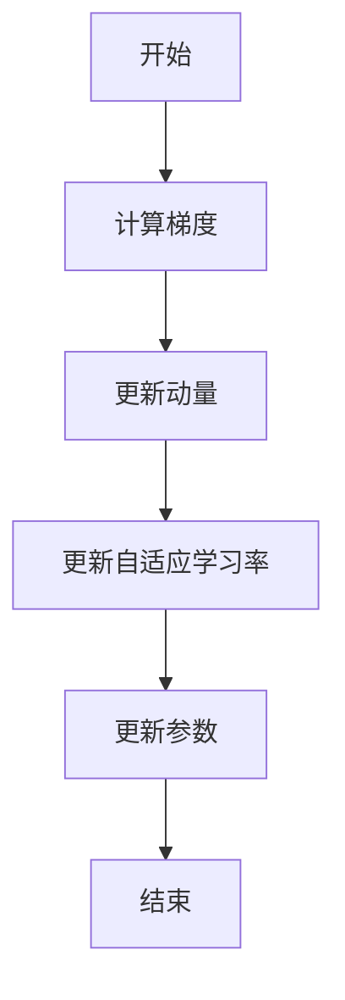
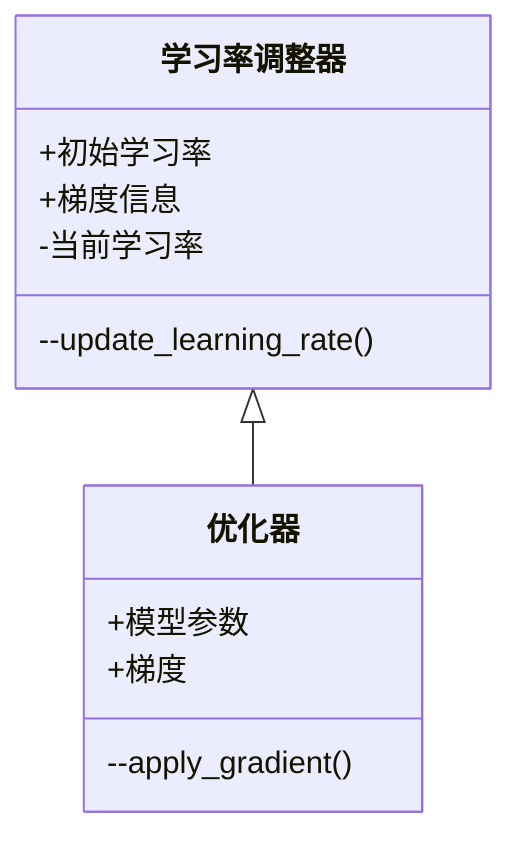
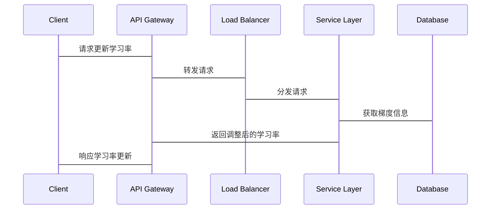

                 


# 自适应学习率：优化AI Agent的训练过程

## 关键词
自适应学习率、AI Agent、优化算法、机器学习、深度学习

## 摘要
自适应学习率是一种动态调整优化算法中学习率的技术，能够显著提高AI Agent的训练效率和模型性能。本文将详细介绍自适应学习率的核心概念、算法原理、系统架构设计、项目实战以及最佳实践，帮助读者深入理解并掌握这一技术。

---

# 第一部分: 自适应学习率的核心概念与背景

## 第1章: 自适应学习率的基本概念

### 1.1 什么是自适应学习率
#### 1.1.1 学习率的定义与作用
学习率是优化算法中的关键超参数，决定了模型参数更新的步长。学习率过大可能导致模型发散，过小则会收敛速度过慢。

#### 1.1.2 自适应学习率的定义
自适应学习率是一种动态调整学习率的技术，能够在训练过程中根据数据特性自动调整学习率。

#### 1.1.3 自适应学习率与传统学习率的区别
| 特性 | 传统学习率 | 自适应学习率 |
|------|------------|--------------|
| 灵活性 | 固定或手动调整 | 动态自适应调整 |
| 适用性 | 适用于简单任务 | 适用于复杂任务 |
| 收敛速度 | 较慢 | 较快 |

### 1.2 自适应学习率的背景与问题背景
#### 1.2.1 AI Agent训练中的优化问题
在复杂任务中，传统固定学习率难以适应数据分布的变化，导致训练效率低下。

#### 1.2.2 传统学习率的局限性
- 收敛速度慢
- 易陷入局部最优
- 需要手动调整，增加人工成本

#### 1.2.3 自适应学习率的提出与目标
通过动态调整学习率，提高训练效率和模型性能。

### 1.3 自适应学习率的核心要素
#### 1.3.1 学习率调整的必要性
动态调整学习率可以更好地适应数据分布的变化。

#### 1.3.2 自适应学习率的实现机制
通过监控梯度信息，动态调整学习率。

#### 1.3.3 自适应学习率的边界与外延
自适应学习率不仅适用于深度学习，还可应用于强化学习等场景。

## 第2章: 自适应学习率的核心概念与联系

### 2.1 自适应学习率的原理与实现
#### 2.1.1 自适应学习率的数学模型
$$ \text{自适应学习率} = \frac{\text{初始学习率}}{1 + \text{梯度方差}} $$

#### 2.1.2 自适应学习率的核心算法
- Adam
- AdaGrad
- RMSProp

### 2.2 自适应学习率的属性特征对比
| 算法 | 参数自适应 | 动量机制 | 适应性 |
|------|------------|----------|--------|
| Adam | 是 | 是 | 高 |
| AdaGrad | 是 | 否 | 中 |
| RMSProp | 是 | 否 | 中 |

### 2.3 自适应学习率的ER实体关系图
```mermaid
erDiagram
    actor 学习率调整器 {
        role 自适应学习率
    }
    actor 优化器 {
        role 使用自适应学习率
    }
    actor 梯度计算 {
        role 提供梯度信息
    }
    learning_rate<---adjustment<----optimizer<----gradient
```

---

# 第二部分: 自适应学习率的算法原理

## 第3章: 自适应学习率的算法原理

### 3.1 自适应学习率的核心算法
#### 3.1.1 Adam算法的原理与实现
Adam结合动量和自适应学习率，通过维护梯度的移动平均和方差实现动态调整。

#### 3.1.2 AdaGrad算法的原理与实现
AdaGrad通过累积梯度平方和来动态调整学习率。

#### 3.1.3 RMSProp算法的原理与实现
RMSProp通过滑动平均梯度平方来调整学习率。

### 3.2 自适应学习率的数学模型与公式
#### 3.2.1 Adam算法的数学公式
$$ m_t = \beta_1 m_{t-1} + (1-\beta_1)g_t $$
$$ v_t = \beta_2 v_{t-1} + (1-\beta_2)g_t^2 $$
$$ \theta_{t+1} = \theta_t - \frac{\eta}{\sqrt{v_t + \epsilon}} m_t $$

#### 3.2.2 AdaGrad算法的数学公式
$$ s_t = s_{t-1} + g_t^2 $$
$$ \theta_{t+1} = \theta_t - \frac{\eta}{\sqrt{s_t}} g_t $$

#### 3.2.3 RMSProp算法的数学公式
$$ v_t = \beta v_{t-1} + (1-\beta)g_t^2 $$
$$ \theta_{t+1} = \theta_t - \frac{\eta}{\sqrt{v_t}} g_t $$

### 3.3 自适应学习率的算法流程图


---

# 第三部分: 自适应学习率的系统架构设计

## 第4章: 自适应学习率的系统分析与架构设计

### 4.1 系统分析
#### 4.1.1 问题场景介绍
在AI Agent训练中，需要动态调整学习率以提高训练效率。

#### 4.1.2 项目目标与范围
设计一个自适应学习率优化系统，应用于深度学习模型的训练。

#### 4.1.3 系统功能需求分析
- 实时监控梯度
- 动态调整学习率
- 提供多种自适应算法选择

### 4.2 系统架构设计
#### 4.2.1 领域模型设计（Mermaid类图）


#### 4.2.2 系统架构设计（Mermaid架构图）


#### 4.2.3 系统接口设计
- 接口名称：update_learning_rate
- 输入：梯度信息
- 输出：调整后的学习率

#### 4.2.4 系统交互流程（Mermaid序列图）


---

# 第四部分: 自适应学习率的项目实战

## 第5章: 自适应学习率的项目实战

### 5.1 项目环境安装
```bash
pip install numpy matplotlib
```

### 5.2 系统核心实现源代码
```python
import numpy as np

class AdaptiveLearningRate:
    def __init__(self, initial_learning_rate=0.001, beta=0.99):
        self.learning_rate = initial_learning_rate
        self.beta = beta
        self.gradient_variance = 0

    def update_learning_rate(self, gradient):
        self.gradient_variance = self.beta * self.gradient_variance + (1 - self.beta) * (gradient ** 2)
        new_learning_rate = self.learning_rate / (np.sqrt(self.gradient_variance) + 1e-8)
        return new_learning_rate

# 示例使用
learning_rate = AdaptiveLearningRate()
current_learning_rate = learning_rate.update_learning_rate(0.1)
print(current_learning_rate)
```

### 5.3 代码解读与分析
- `AdaptiveLearningRate`类初始化：设置初始学习率和动量系数。
- `update_learning_rate`方法：根据当前梯度更新学习率。
- 示例使用：计算并输出调整后的学习率。

### 5.4 案例分析与详细讲解
通过实际案例分析，展示自适应学习率在训练过程中的应用效果。

### 5.5 项目小结
总结项目实现的关键点和经验教训。

---

# 第五部分: 自适应学习率的最佳实践与小结

## 第6章: 自适应学习率的最佳实践

### 6.1 自适应学习率的注意事项
- 选择合适的初始学习率
- 调整动量系数和自适应参数
- 定期监控训练过程

### 6.2 自适应学习率的优化技巧
- 使用预训练模型
- 结合正则化技术
- 实时监控训练指标

### 6.3 自适应学习率的未来趋势
- 更智能的自适应算法
- 结合强化学习的应用
- 自适应学习率在分布式训练中的应用

## 第7章: 总结与展望

### 7.1 总结
自适应学习率通过动态调整学习率，显著提升了AI Agent的训练效率和模型性能。

### 7.2 展望
未来，自适应学习率将与更多优化技术结合，推动AI训练的效率提升。

---

# 作者：AI天才研究院 & 禅与计算机程序设计艺术

