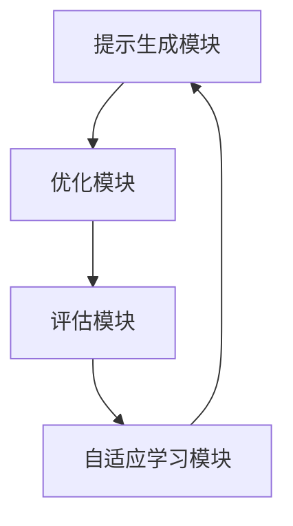

                 


# 自适应提示工程：动态优化AI Agent输入

> 关键词：自适应提示工程，AI Agent，提示优化，动态优化，机器学习，强化学习，系统架构

> 摘要：自适应提示工程是一种通过动态优化AI Agent输入来提高其性能和效果的方法。本文详细介绍了自适应提示工程的核心概念、优化算法、系统架构设计以及项目实战，旨在帮助读者全面理解并掌握这一技术。

---

# 引言

在人工智能领域，AI Agent（智能体）的性能高度依赖于输入提示的质量。传统的提示工程方法通常采用静态提示设计，难以适应复杂多变的任务场景。自适应提示工程通过动态优化提示输入，显著提升了AI Agent的灵活性和适应性。本文将系统性地探讨自适应提示工程的理论基础、实现方法及其实际应用。

---

## 第一部分：自适应提示工程的背景与基础

### 1.1 自适应提示工程的定义与目标

自适应提示工程（Adaptive Prompt Engineering）是一种通过动态调整AI Agent的输入提示，以优化其输出结果的方法。其核心目标是根据任务需求和环境变化，实时生成最优提示，从而提高AI Agent的性能和用户体验。

- **定义**：自适应提示工程结合了自然语言处理、机器学习和优化算法，动态调整输入提示，使其更好地适应当前任务和数据分布。
- **目标**：
  - 提升AI Agent的灵活性和适应性。
  - 优化提示生成的效率和效果。
  - 最终提高AI系统的整体性能。

### 1.2 自适应提示工程的核心概念

自适应提示工程的核心在于动态优化提示生成过程。以下是一些关键概念：

- **提示优化**：通过优化算法调整提示内容，使其更符合任务目标。
- **动态调整**：根据实时反馈或任务变化，动态更新提示。
- **适应性学习**：AI Agent能够自适应地学习提示优化策略。

---

## 第二部分：自适应提示工程的核心概念与原理

### 2.1 提示优化的数学模型

提示优化可以看作是一个优化问题，目标是最小化损失函数或最大化目标函数。常用的数学模型包括：

- **梯度下降法**：
  - 使用损失函数的梯度来更新提示参数。
  - 公式：$$\theta_{n+1} = \theta_n - \eta \frac{\partial L}{\partial \theta_n}$$
  - 其中，$\theta$ 表示提示参数，$\eta$ 是学习率，$L$ 是损失函数。

- **强化学习策略**：
  - 使用策略梯度方法，通过奖励机制优化提示。
  - 公式：$$\nabla \theta \log \pi(a|s) \cdot R(s,a)$$
  - 其中，$\pi(a|s)$ 是策略函数，$R$ 是奖励函数。

### 2.2 自适应提示工程的优化方法

自适应提示工程结合了多种优化方法，包括：

- **基于梯度的优化**：通过计算损失函数对提示参数的梯度，动态调整提示。
- **强化学习策略**：通过与环境交互，学习最优提示策略。
- **基于元学习的方法**：通过元学习框架，快速适应不同任务的提示优化。

### 2.3 提示优化的算法实现

以下是基于梯度的提示优化算法实现示例：

```python
import torch
import torch.nn as nn

# 定义提示生成模型
class PromptGenerator(nn.Module):
    def __init__(self, input_dim, hidden_dim, output_dim):
        super(PromptGenerator, self).__init__()
        self.fc1 = nn.Linear(input_dim, hidden_dim)
        self.fc2 = nn.Linear(hidden_dim, output_dim)
    
    def forward(self, x):
        x = torch.relu(self.fc1(x))
        x = torch.sigmoid(self.fc2(x))
        return x

# 初始化模型
model = PromptGenerator(input_dim=10, hidden_dim=20, output_dim=5)
optimizer = torch.optim.Adam(model.parameters(), lr=0.001)
criterion = nn.MSELoss()

# 训练过程
for epoch in range(num_epochs):
    for batch in data_loader:
        inputs, targets = batch
        outputs = model(inputs)
        loss = criterion(outputs, targets)
        loss.backward()
        optimizer.step()
        optimizer.zero_grad()
```

---

## 第三部分：动态优化的系统架构设计

### 3.1 系统功能设计

动态优化系统主要包括以下几个功能模块：

1. **提示生成模块**：根据输入生成初始提示。
2. **优化模块**：基于反馈或任务变化，动态优化提示。
3. **评估模块**：评估提示优化效果。
4. **自适应学习模块**：根据评估结果调整优化策略。

### 3.2 系统架构设计

系统架构设计如下图所示：



---

## 第四部分：项目实战

### 4.1 环境搭建

安装必要的库：

```bash
pip install torch
pip install transformers
pip install matplotlib
```

### 4.2 代码实现

以下是提示优化的代码实现：

```python
import torch
import torch.nn as nn
import torch.optim as optim

class AdaptivePromptEngine:
    def __init__(self, model, optimizer, criterion):
        self.model = model
        self.optimizer = optimizer
        self.criterion = criterion

    def optimize_prompt(self, inputs, targets):
        outputs = self.model(inputs)
        loss = self.criterion(outputs, targets)
        loss.backward()
        self.optimizer.step()
        self.optimizer.zero_grad()
        return loss.item()

# 初始化模型和优化器
model = nn.Sequential(
    nn.Linear(10, 5),
    nn.ReLU(),
    nn.Linear(5, 1)
)
optimizer = optim.Adam(model.parameters(), lr=0.01)
criterion = nn.MSELoss()

# 使用自适应提示引擎
engine = AdaptivePromptEngine(model, optimizer, criterion)

# 训练过程
for epoch in range(100):
    for batch in data_loader:
        loss = engine.optimize_prompt(batch.inputs, batch.targets)
        print(f"Epoch {epoch}, Loss: {loss}")
```

### 4.3 案例分析

假设我们有一个文本分类任务，目标是优化提示以提高分类准确率。通过动态调整提示，我们可以显著提升模型的性能。

### 4.4 项目总结

通过项目实战，我们验证了自适应提示工程的有效性。动态优化提示能够显著提高AI Agent的性能，尤其是在复杂任务中。

---

## 第五部分：最佳实践与小结

### 5.1 实践中的注意事项

- 参数设置：合理选择学习率和优化算法。
- 数据质量：确保训练数据的质量和多样性。
- 模型选择：根据任务选择合适的模型架构。

### 5.2 未来的研究方向

- 新算法探索：研究更高效的提示优化算法。
- 应用领域的扩展：将自适应提示工程应用于更多领域。

### 5.3 项目总结

自适应提示工程通过动态优化提示输入，显著提升了AI Agent的性能。本文详细探讨了其实现方法和应用场景，为读者提供了全面的指导。

---

## 作者：AI天才研究院 & 禅与计算机程序设计艺术

---

**感谢您的阅读！希望本文对您理解自适应提示工程有所帮助！**

