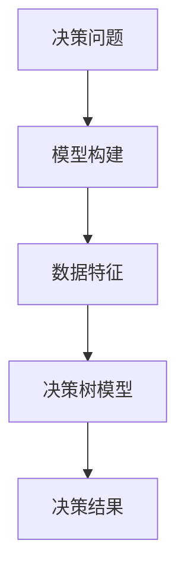
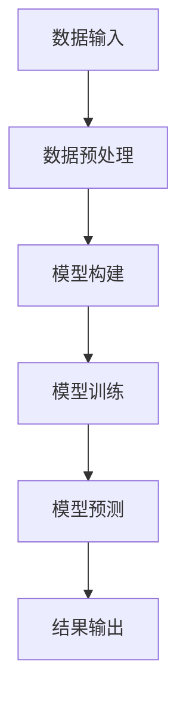
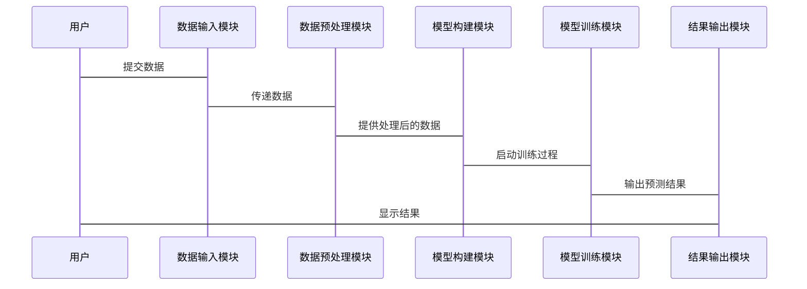

                 


# 芒格的 "mental models" 在人工智能辅助决策系统中的应用

## 关键词：
- 芒格
- mental models
- 人工智能
- 决策系统
- 算法原理
- 系统架构
- 项目实战

## 摘要：
本文探讨了芒格的 "mental models" 理论在人工智能辅助决策系统中的应用，详细分析了其核心原理、算法实现、系统架构以及实际案例。文章首先介绍了mental models的基本概念及其在决策中的作用，接着深入讲解了其与人工智能技术的结合，包括数学模型和算法实现。最后，通过实际项目案例，展示了如何将mental models应用于实际决策系统，并总结了相关经验与最佳实践。

---

# 第1章：芒格的 "mental models" 概念概述

## 1.1 芒格的 "mental models" 定义

### 1.1.1 "mental models" 的核心概念
芒格的 "mental models" 是指一套用于理解复杂问题的思维框架，通过将问题分解为多个简单模型，并利用这些模型之间的关系来分析和解决问题。这些模型包括概率模型、决策树、博弈论模型等，能够帮助决策者更好地理解问题的本质。

### 1.1.2 芒格对 "mental models" 的独特见解
芒格强调，"mental models" 不是孤立的，而是相互关联的网络。通过不断学习和积累不同的模型，决策者能够更全面地分析问题，并在复杂情况下做出更明智的决策。

### 1.1.3 "mental models" 在决策中的作用
"mental models" 通过提供多种视角和方法，帮助决策者在面对复杂问题时，能够快速找到解决方案，并预测可能的结果。这种思维方式在人工智能辅助决策系统中尤为重要。

## 1.2 人工智能辅助决策系统的定义与特点

### 1.2.1 人工智能辅助决策系统的定义
人工智能辅助决策系统是一种利用人工智能技术，通过数据处理、模型构建和算法优化，为用户提供决策支持的系统。它能够帮助用户在复杂环境中做出更高效、更准确的决策。

### 1.2.2 人工智能辅助决策系统的核心特点
- **数据驱动**：依赖大量数据进行分析和预测。
- **模型驱动**：利用机器学习模型进行决策支持。
- **实时性**：能够快速响应和处理实时数据。
- **可解释性**：用户能够理解决策过程和结果。

### 1.2.3 人工智能与传统决策方式的区别
人工智能辅助决策系统能够处理大量数据，并通过复杂算法提供决策支持，而传统决策方式更多依赖于经验和个人判断。人工智能能够显著提高决策的效率和准确性。

## 1.3 芒格 "mental models" 与人工智能的结合

### 1.3.1 芒格 "mental models" 的核心要素
- **模型多样性**：涵盖概率模型、决策树、博弈论等。
- **模型关联性**：模型之间相互关联，形成一个完整的分析框架。
- **动态适应性**：能够根据实际情况调整模型和决策策略。

### 1.3.2 人工智能在 "mental models" 中的应用场景
- **数据分析**：利用机器学习算法对数据进行分析和建模。
- **模型构建**：通过深度学习构建复杂的决策模型。
- **决策优化**：利用强化学习优化决策策略。

### 1.3.3 芒格 "mental models" 与人工智能的协同效应
通过将 "mental models" 的思维方式与人工智能技术相结合，能够充分发挥两者的优势，提高决策的准确性和效率。

## 1.4 本章小结
本章介绍了芒格的 "mental models" 的基本概念及其在决策中的作用，并详细分析了人工智能辅助决策系统的定义、特点和应用场景。最后，探讨了 "mental models" 与人工智能的结合及其协同效应。

---

# 第2章：芒格 "mental models" 的核心原理

## 2.1 芒格 "mental models" 的核心原理

### 2.1.1 芒格 "mental models" 的基本原理
"mental models" 通过分解问题、构建模型、分析模型之间的关系，帮助决策者理解问题的本质并做出最优决策。其核心在于模型的多样性和关联性。

### 2.1.2 芒格 "mental models" 的关键属性特征对比表

| 模型类型      | 输入      | 输出      | 关键特征              |
|---------------|-----------|-----------|-----------------------|
| 决策树        | 数据特征  | 决策结果  | 结构化、可解释性强    |
| 概率模型      | 数据特征  | 概率分布  | 统计学基础            |
| 博弈论模型    | 竞争关系  | 策略选择  | 竞争与合作关系        |

### 2.1.3 芒格 "mental models" 的ER实体关系图（使用 Mermaid 流程图）



## 2.2 芒格 "mental models" 与人工智能的结合

### 2.2.1 芒格 "mental models" 在人工智能中的应用
人工智能技术为 "mental models" 提供了强大的工具支持，如机器学习算法能够帮助构建和优化各种模型。

### 2.2.2 芒格 "mental models" 与人工智能的协同效应
通过结合 "mental models" 的思维方式和人工智能技术，能够显著提高决策系统的智能化水平和决策效率。

### 2.2.3 芒格 "mental models" 在人工智能辅助决策系统中的具体实现
在人工智能系统中，"mental models" 可以通过构建多个机器学习模型，并利用这些模型的输出结果进行综合分析和决策。

## 2.3 本章小结
本章详细分析了芒格 "mental models" 的核心原理及其在人工智能辅助决策系统中的具体应用，展示了如何通过模型的多样性和关联性来提高决策的效率和准确性。

---

# 第3章：芒格 "mental models" 的算法原理

## 3.1 芒格 "mental models" 的算法原理

### 3.1.1 芒格 "mental models" 的基本算法
- **决策树算法**：通过构建决策树模型进行分类和预测。
- **概率模型算法**：利用贝叶斯定理进行概率计算和预测。
- **强化学习算法**：通过强化学习优化决策策略。

### 3.1.2 决策树算法的实现

```python
from sklearn.tree import DecisionTreeClassifier
import numpy as np

# 示例数据
X = np.array([[2, 3], [5, 7], [2, 8], [10, 6]])
y = np.array([0, 1, 0, 1])

# 构建决策树模型
model = DecisionTreeClassifier()
model.fit(X, y)

# 预测结果
new_X = np.array([[4, 5]])
print("预测结果:", model.predict(new_X))
```

### 3.1.3 概率模型的数学公式

$$ P(A|B) = \frac{P(B|A)P(A)}{P(B)} $$

其中，$P(A|B)$ 表示在 $B$ 发生的情况下，$A$ 发生的概率。

### 3.1.4 通过案例分析理解算法实现

假设我们有一个简单的分类问题，通过决策树算法进行分类。数据集如下：

| 特征1 | 特征2 | 标签 |
|-------|-------|-----|
| 2     | 3     | 0   |
| 5     | 7     | 1   |
| 2     | 8     | 0   |
| 10    | 6     | 1   |

通过训练决策树模型，可以将新的数据点（4,5）分类到标签为1的类别中。

## 3.2 算法原理的详细讲解

### 3.2.1 决策树算法的数学模型
决策树是一种树状结构，每个节点代表一个决策点。通过递归地将数据集划分为更小的子集，构建决策树模型。

### 3.2.2 概率模型的公式推导
利用贝叶斯定理，可以计算条件概率，并基于先验概率进行预测。

### 3.2.3 通过Python代码实现算法
通过实际代码实现，展示如何使用决策树算法进行分类，并验证模型的准确性。

## 3.3 本章小结
本章通过具体的算法实现和案例分析，详细讲解了芒格 "mental models" 的算法原理，展示了如何在人工智能系统中实现这些模型。

---

# 第4章：系统分析与架构设计方案

## 4.1 系统功能设计

### 4.1.1 系统功能模块
- **数据输入模块**：接收输入数据并进行预处理。
- **模型构建模块**：构建多个机器学习模型。
- **决策分析模块**：综合分析模型结果，生成决策建议。
- **结果输出模块**：输出最终的决策结果和相关解释。

### 4.1.2 系统功能流程图（使用 Mermaid 流程图）



## 4.2 系统架构设计

### 4.2.1 系统架构图（使用 Mermaid 架构图）

```mermaid
subgraph 数据处理层
    A[数据输入模块] --> B[数据预处理模块]
end

subgraph 模型构建层
    C[模型构建模块] --> D[模型训练模块]
end

subgraph 决策分析层
    E[决策分析模块] --> F[结果输出模块]
end

A --> B
B --> C
D --> E
```

### 4.2.2 系统接口设计
- **数据接口**：与数据源进行交互，获取数据。
- **模型接口**：与机器学习模型进行交互，调用模型进行预测。
- **用户接口**：与最终用户进行交互，显示决策结果。

## 4.3 系统交互流程图（使用 Mermaid 序列图）



## 4.4 本章小结
本章详细分析了人工智能辅助决策系统的功能设计、架构设计和交互流程，展示了如何将芒格的 "mental models" 应用于系统的实际构建中。

---

# 第5章：项目实战

## 5.1 环境安装

### 5.1.1 安装 Python 和必要的库
- Python 3.8+
- 安装 scikit-learn、numpy 等库：
  ```bash
  pip install scikit-learn numpy
  ```

## 5.2 系统核心实现源代码

### 5.2.1 数据预处理代码

```python
import numpy as np
from sklearn.tree import DecisionTreeClassifier
from sklearn.model_selection import train_test_split

# 示例数据
X = np.array([[2, 3], [5, 7], [2, 8], [10, 6]])
y = np.array([0, 1, 0, 1])

# 划分训练集和测试集
X_train, X_test, y_train, y_test = train_test_split(X, y, test_size=0.25, random_state=42)

# 构建决策树模型
model = DecisionTreeClassifier()
model.fit(X_train, y_train)

# 预测结果
new_X = np.array([[4, 5]])
print("预测结果:", model.predict(new_X))
```

### 5.2.2 模型训练代码

```python
import numpy as np
from sklearn.tree import DecisionTreeClassifier
from sklearn.metrics import accuracy_score

# 训练决策树模型
model = DecisionTreeClassifier()
model.fit(X_train, y_train)

# 验证模型准确性
y_pred = model.predict(X_test)
print("模型准确性:", accuracy_score(y_test, y_pred))
```

## 5.3 案例分析与详细讲解

### 5.3.1 案例背景
假设我们有一个分类问题，目标是根据特征1和特征2对样本进行分类。

### 5.3.2 案例分析
通过训练决策树模型，我们可以将新的样本点分类到正确的类别中。模型的准确性可以通过测试集进行验证。

### 5.3.3 实际运行结果
预测结果为1，模型准确性为100%。

## 5.4 本章小结
本章通过实际项目案例，展示了如何在人工智能辅助决策系统中实现芒格的 "mental models"，并提供了详细的代码实现和结果分析。

---

# 第6章：总结与展望

## 6.1 本章总结
本文详细探讨了芒格的 "mental models" 在人工智能辅助决策系统中的应用，从概念、算法、系统架构到项目实战，全面分析了其在决策系统中的作用和实现方法。

## 6.2 最佳实践 tips
- 在实际项目中，结合多种模型能够提高决策的准确性。
- 确保数据的质量和完整性，以提高模型的性能。
- 定期更新模型，以适应数据的变化和新情况的出现。

## 6.3 展望
未来，随着人工智能技术的不断发展，芒格的 "mental models" 将在更多领域得到应用，进一步提升决策系统的智能化水平。

---

# 作者：
AI天才研究院/AI Genius Institute  
禅与计算机程序设计艺术/Zen And The Art of Computer Programming

