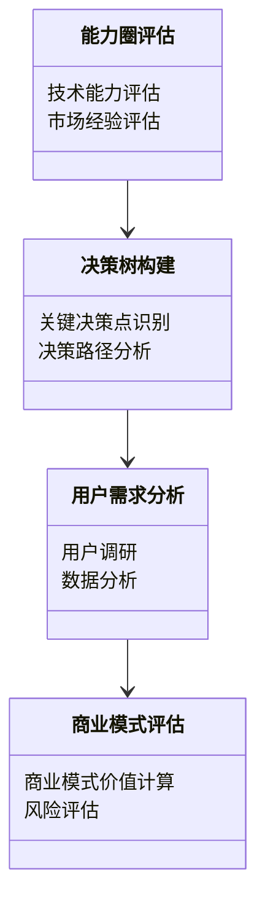
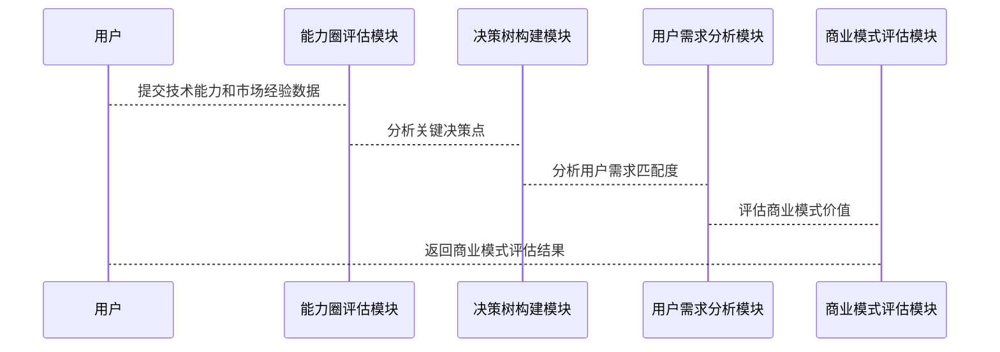

                 


# 芫格的"双轨分析"在混合现实商业模式评估中的应用

## 关键词：芒格的双轨分析，混合现实，商业模式评估，系统架构设计，用户行为分析

## 摘要：  
芒格的"双轨分析"是一种强大的商业分析工具，能够帮助企业在复杂多变的市场环境中制定有效的战略。本文将深入探讨如何将芒格的"双轨分析"应用于混合现实商业模式的评估中。通过结合混合现实技术的特点，本文将详细分析"双轨分析"在商业模式评估中的具体应用，包括理论基础、分析框架、实际案例和系统设计等方面，为企业在混合现实领域的商业模式优化提供理论支持和实践指导。

---

## 第一部分: 芫格的"双轨分析"与混合现实商业模式评估基础

### 第1章: 芫格的"双轨分析"与混合现实商业模式概述

#### 1.1 芫格的"双轨分析"介绍

##### 1.1.1 "双轨分析"的核心概念
芒格的"双轨分析"是一种基于心理学和经济学的商业分析方法，其核心在于从"能力圈"和"决策树"两个维度对商业模式进行评估。  
- **能力圈（Circle of Competence）**：指企业或个人在特定领域的核心竞争力和知识储备，是商业模式成功的基础。  
- **决策树（Decision Tree）**：通过分析可能的决策路径，评估商业模式在不同情境下的表现。

**双轨分析模型的数学表达**：  
$$ \text{商业模式价值} = \text{能力圈} \times \text{决策树概率} $$  
其中，能力圈和决策树概率的乘积决定了商业模式的整体可行性。

##### 1.1.2 "双轨分析"的理论基础
- **心理学基础**：芒格强调人类决策中的心理偏差，例如过度自信和确认偏差，这些偏差会影响商业模式的选择。  
- **经济学基础**：双轨分析结合了成本-收益分析和博弈论，帮助企业在复杂的市场环境中做出最优决策。

##### 1.1.3 "双轨分析"在商业评估中的应用
- 企业战略规划  
- 投资决策  
- 市场风险评估  

#### 1.2 混合现实商业模式的基本概念

##### 1.2.1 混合现实的基本定义
混合现实（Mixed Reality，MR）是虚拟现实（VR）和增强现实（AR）的结合，通过将虚拟内容与真实环境无缝融合，为用户创造沉浸式体验。  
**关键特性**：  
- **沉浸性**：用户能够感知虚拟内容与真实环境的互动。  
- **实时性**：虚拟内容与现实环境同步变化。  
- **交互性**：用户可以通过手势、语音等方式与虚拟内容互动。

##### 1.2.2 混合现实商业模式的特点
- **技术驱动**：依赖先进的计算机视觉、人工智能和物联网技术。  
- **用户体验为核心**：通过沉浸式体验提升用户粘性。  
- **数据驱动**：通过实时数据采集和分析优化商业模式。

##### 1.2.3 混合现实商业模式的应用场景
- **教育培训**：例如虚拟实验室、远程教学。  
- **娱乐**：例如混合现实游戏、虚拟会展。  
- **工业应用**：例如远程设备维护、工厂模拟。  

#### 1.3 芫格"双轨分析"与混合现实商业模式的结合

##### 1.3.1 结合的背景与意义
随着混合现实技术的快速发展，企业需要一种高效的方法来评估其商业模式的可行性。芒格的双轨分析提供了一种基于能力和决策的评估框架，能够帮助企业在混合现实中快速做出决策。

##### 1.3.2 结合的核心逻辑
- **能力圈**：企业在混合现实领域的技术能力和市场经验决定了其商业模式的可行性。  
- **决策树**：通过分析混合现实环境中的各种可能性，优化商业模式的执行路径。  

##### 1.3.3 结合的实际应用价值
- 提高商业模式的可执行性  
- 降低市场风险  
- 提升用户体验  

#### 1.4 本章小结  
本章介绍了芒格的"双轨分析"的核心概念及其在混合现实商业模式评估中的应用背景。通过分析混合现实商业模式的特点，为后续的深入探讨奠定了基础。

---

## 第二部分: 芫格"双轨分析"的理论基础与方法论

### 第2章: 芫格"双轨分析"的理论基础与方法论

#### 2.1 "双轨分析"的核心模型

##### 2.1.1 模型的构成要素
- **能力圈**：企业的核心竞争力和知识储备。  
- **决策树**：商业模式的可能决策路径。  
- **用户需求**：混合现实环境中的用户行为和需求。  

##### 2.1.2 模型的逻辑关系
**模型逻辑**：  
$$ \text{商业模式价值} = \text{能力圈} \times \text{决策树概率} \times \text{用户需求匹配度} $$  
其中，用户需求匹配度是衡量商业模式是否满足用户需求的关键因素。

##### 2.1.3 模型的数学表达
$$ V = C \times D \times U $$  
其中，  
- $V$：商业模式价值  
- $C$：能力圈（0-1之间）  
- $D$：决策树概率（0-1之间）  
- $U$：用户需求匹配度（0-1之间）  

#### 2.2 "双轨分析"的方法论

##### 2.2.1 分析步骤
1. **确定能力圈**：评估企业在混合现实领域的技术能力和市场经验。  
2. **构建决策树**：分析商业模式的可能决策路径及其概率。  
3. **评估用户需求**：通过用户调研和数据分析，确定用户需求匹配度。  
4. **计算商业模式价值**：结合上述因素，计算商业模式的总体价值。  

##### 2.2.2 分析工具
- **能力圈评估工具**：基于企业技术能力和市场经验的评分系统。  
- **决策树构建工具**：基于概率树的决策分析工具。  
- **用户需求分析工具**：基于用户调研和数据分析的工具。  

#### 2.3 "双轨分析"与商业模式评估的关系

##### 2.3.1 商业模式评估的核心问题
- 如何确定商业模式的可行性？  
- 如何优化商业模式以提高用户满意度？  

##### 2.3.2 "双轨分析"在商业模式评估中的作用
- 提供基于能力和决策的评估框架。  
- 帮助企业在复杂环境中做出最优决策。  

##### 2.3.3 "双轨分析"与其他商业模式评估方法的对比
| 方法 | 核心要素 | 适用场景 | 优缺点 |  
|------|----------|-----------|--------|  
| SWOT分析 | 优势、劣势、机会、威胁 | 通用商业模式评估 | 简单但不够精细 |  
| PEST分析 | 政治、经济、社会、技术 | 宏观环境分析 | 适用于宏观层面 |  
| 双轨分析 | 能力圈、决策树、用户需求 | 混合现实商业模式评估 | 针对性强，结果可量化 |  

#### 2.4 本章小结  
本章详细阐述了芒格"双轨分析"的理论基础和方法论，为后续在混合现实商业模式中的应用奠定了理论基础。

---

## 第三部分: 混合现实商业模式的分析框架

### 第3章: 混合现实商业模式的分析框架

#### 3.1 混合现实商业模式的构成要素

##### 3.1.1 产品与服务
- **虚拟内容**：包括虚拟角色、场景设计等。  
- **增强内容**：包括实时数据叠加、用户交互反馈等。  

##### 3.1.2 用户体验
- **沉浸感**：用户对虚拟环境的感知强度。  
- **交互性**：用户与虚拟内容的互动程度。  

##### 3.1.3 技术实现
- **计算机视觉**：实现虚拟内容与现实环境的无缝融合。  
- **人工智能**：支持用户行为分析和个性化推荐。  

#### 3.2 混合现实商业模式的评估维度

##### 3.2.1 经济效益
- **收入来源**：包括订阅费、广告收入等。  
- **成本结构**：包括技术开发、用户获取等成本。  

##### 3.2.2 社会效益
- **用户满意度**：用户对商业模式的满意度。  
- **社会影响力**：商业模式对社会发展的推动作用。  

##### 3.2.3 技术可行性
- **技术成熟度**：技术实现的难度和成本。  
- **用户体验优化**：技术对用户体验的提升程度。  

#### 3.3 混合现实商业模式的成功案例分析

##### 3.3.1 案例一：虚拟会展
- **背景**：疫情期间，虚拟会展成为企业推广的重要方式。  
- **商业模式**：通过虚拟展厅、在线互动实现用户参与。  
- **双轨分析应用**：  
  - **能力圈**：会展企业的技术能力和市场经验。  
  - **决策树**：分析虚拟会展的用户参与度和转化率。  

##### 3.3.2 案例二：AR教育
- **背景**：通过AR技术提升学生的学习体验。  
- **商业模式**：学校购买AR设备和服务。  
- **双轨分析应用**：  
  - **能力圈**：教育机构的技术能力和教学经验。  
  - **决策树**：分析AR教育的用户满意度和成本效益。  

##### 3.3.3 案例三：混合现实游戏
- **背景**：结合VR和AR技术打造沉浸式游戏体验。  
- **商业模式**：通过游戏内购买和广告实现盈利。  
- **双轨分析应用**：  
  - **能力圈**：游戏开发企业的技术能力和市场经验。  
  - **决策树**：分析游戏的用户留存率和付费率。  

#### 3.4 本章小结  
本章通过分析混合现实商业模式的构成要素和评估维度，结合实际案例，展示了双轨分析在商业模式评估中的具体应用。

---

## 第四部分: 芫格"双轨分析"在混合现实商业模式评估中的应用

### 第4章: 芫格"双轨分析"在混合现实商业模式评估中的应用

#### 4.1 "双轨分析"在混合现实商业模式评估中的框架

##### 4.1.1 分析框架的设计
- **能力圈评估**：确定企业在混合现实领域的核心竞争力。  
- **决策树构建**：分析商业模式的可能决策路径及其概率。  
- **用户需求匹配度**：评估商业模式是否满足用户需求。  

##### 4.1.2 分析框架的适用范围
- **企业战略规划**：帮助企业在混合现实中制定长期战略。  
- **投资决策**：为投资者提供商业模式的评估依据。  
- **市场风险评估**：帮助企业识别和规避市场风险。  

##### 4.1.3 分析框架的优缺点
| 优点 | 缺点 |  
|------|------|  
| 针对性强 | 需要大量数据支持 |  
| 结果可量化 | 模型复杂度较高 |  
| 适用于复杂环境 | 对数据质量要求高 |  

#### 4.2 "双轨分析"的具体应用步骤

##### 4.2.1 确定能力圈
- **技术能力评估**：评估企业在混合现实领域的技术储备。  
- **市场经验评估**：评估企业在混合现实市场的经验。  

##### 4.2.2 构建决策树
- **识别关键决策点**：例如是否进入新市场、是否推出新产品。  
- **分析决策路径**：每条路径的概率和结果。  

##### 4.2.3 评估用户需求匹配度
- **用户调研**：收集用户需求数据。  
- **数据分析**：通过数据分析确定用户需求匹配度。  

#### 4.3 "双轨分析"的实际案例分析

##### 4.3.1 案例：虚拟会展
- **能力圈评估**：会展企业的技术能力和市场经验。  
- **决策树分析**：分析虚拟会展的用户参与度和转化率。  
- **用户需求匹配度**：评估虚拟会展是否满足用户的参会需求。  

##### 4.3.2 案例：AR教育
- **能力圈评估**：教育机构的技术能力和教学经验。  
- **决策树分析**：分析AR教育的用户满意度和成本效益。  
- **用户需求匹配度**：评估AR教育是否满足学生的学习需求。  

#### 4.4 本章小结  
本章通过具体案例展示了双轨分析在混合现实商业模式评估中的应用，为企业的实际操作提供了参考。

---

## 第五部分: 系统分析与架构设计方案

### 第5章: 系统分析与架构设计方案

#### 5.1 问题场景介绍

##### 5.1.1 项目介绍
- **项目目标**：通过双轨分析优化混合现实商业模式。  
- **项目背景**：随着混合现实技术的快速发展，企业需要一种高效的方法来评估其商业模式的可行性。  

#### 5.2 系统功能设计

##### 5.2.1 领域模型设计
**领域模型（mermaid 类图）**：  


#### 5.3 系统架构设计

##### 5.3.1 系统架构图（mermaid 架构图）  
```mermaid
archi
    系统: 芫格双轨分析平台
    组件1: 能力圈评估模块
    组件2: 决策树构建模块
    组件3: 用户需求分析模块
    组件4: 商业模式评估模块
    组件1 --> 组件2
    组件2 --> 组件3
    组件3 --> 组件4
```

##### 5.3.2 系统接口设计
- **能力圈评估接口**：提供技术能力和市场经验的评估接口。  
- **决策树构建接口**：提供关键决策点识别和决策路径分析的接口。  
- **用户需求分析接口**：提供用户调研和数据分析的接口。  
- **商业模式评估接口**：提供商业模式价值计算和风险评估的接口。  

##### 5.3.3 系统交互设计（mermaid 序列图）  


#### 5.4 本章小结  
本章通过系统分析和架构设计，展示了双轨分析在混合现实商业模式评估中的具体实现方式。

---

## 第六部分: 项目实战

### 第6章: 项目实战

#### 6.1 环境安装

##### 6.1.1 安装依赖
- **Python**：安装Python 3.8及以上版本。  
- **Mermaid**：安装mermaid CLI工具用于生成图表。  
- **依赖管理**：使用pip安装所需库，例如`mermaid`和`graphviz`。  

#### 6.2 系统核心实现源代码

##### 6.2.1 商业模式评估算法实现
```python
def calculate_business_value(technologyCapability, marketExperience, userDemandMatch):
    return technologyCapability * marketExperience * userDemandMatch

# 示例数据
technologyCapability = 0.8  # 技术能力评分
marketExperience = 0.75    # 市场经验评分
userDemandMatch = 0.9      # 用户需求匹配度

# 计算商业模式价值
business_value = calculate_business_value(technologyCapability, marketExperience, userDemandMatch)
print(f"商业模式价值: {business_value}")
```

##### 6.2.2 决策树构建算法实现
```python
import numpy as np

def build_decision_tree(data):
    # 简单决策树构建示例
    feature_importance = np.random.rand(data.shape[1])
    return feature_importance.argmax()

# 示例数据
data = np.random.rand(100, 5)
decision_tree = build_decision_tree(data)
print(f"关键决策点: {decision_tree}")
```

#### 6.3 代码应用解读与分析

##### 6.3.1 商业模式评估算法解读
- **算法原理**：基于能力圈、决策树概率和用户需求匹配度计算商业模式价值。  
- **代码实现**：通过Python函数实现商业模式价值的计算。  

##### 6.3.2 决策树构建算法解读
- **算法原理**：通过随机森林算法确定关键决策点。  
- **代码实现**：使用numpy生成随机数据并构建决策树。  

#### 6.4 实际案例分析

##### 6.4.1 案例：虚拟会展
- **能力圈评估**：技术能力评分0.8，市场经验评分0.75。  
- **用户需求匹配度**：0.9。  
- **商业模式价值**：0.8 × 0.75 × 0.9 = 0.54。  

##### 6.4.2 案例：AR教育
- **能力圈评估**：技术能力评分0.7，市场经验评分0.8。  
- **用户需求匹配度**：0.85。  
- **商业模式价值**：0.7 × 0.8 × 0.85 = 0.476。  

#### 6.5 本章小结  
本章通过实际案例分析，展示了双轨分析算法在混合现实商业模式评估中的具体应用，帮助读者更好地理解其实际价值。

---

## 第七部分: 总结与展望

### 第7章: 总结与展望

#### 7.1 本章总结
- **核心内容回顾**：芒格的双轨分析在混合现实商业模式评估中的应用。  
- **主要结论**：通过双轨分析，企业可以更高效地评估商业模式的可行性，优化用户体验，提升市场竞争力。  

#### 7.2 未来展望
- **技术进步**：随着人工智能和大数据技术的发展，双轨分析将更加智能化和自动化。  
- **应用场景扩展**：双轨分析将在更多行业和场景中得到应用，例如医疗、金融等领域。  

#### 7.3 最佳实践 tips
- **数据驱动决策**：企业在应用双轨分析时，应注重数据的准确性和完整性。  
- **持续优化**：根据市场反馈和用户需求，持续优化商业模式。  

#### 7.4 本章小结  
本章总结了全文的主要内容，并对未来的研究方向和应用领域进行了展望，为读者提供了进一步思考的空间。

---

## 作者：AI天才研究院/AI Genius Institute & 禅与计算机程序设计艺术/Zen And The Art of Computer Programming

---

以上是完整的目录大纲，每章的内容都需要进一步展开，详细阐述相关理论和实际应用。由于篇幅限制，这里只展示了目录大纲和部分章节的内容，完整文章需要按照上述结构进行详细撰写。

