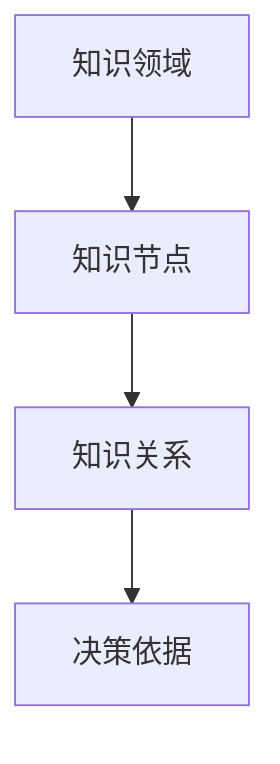
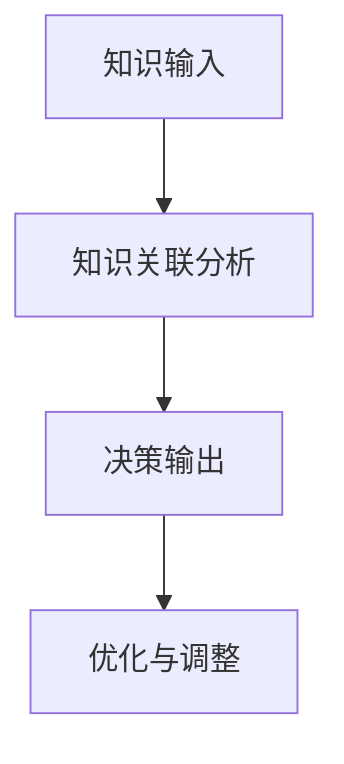

                 


# 芒格的"多元思维格栅"：提高决策质量的工具

**关键词**：芒格、多元思维格栅、决策质量、知识整合、认知模型、思维工具、决策优化

**摘要**：芒格的多元思维模型是一种通过整合多个学科知识来提升决策质量的工具。本文将详细分析芒格的"多元思维格栅"的核心概念、算法原理、系统架构以及实际应用，帮助读者理解如何通过构建多维度的知识框架来优化决策过程。

---

## 第一部分：芒格的多元思维模型概述

### 第1章：芒格及其多元思维模型

#### 1.1 芒格的生平与思想
- **1.1.1 芒格的早年经历**  
  芒格（Charlie Munger）是著名投资家巴菲特的合作伙伴，出生于1924年，毕业于密歇根大学和哈佛法学院。他以独特的思维方式和深刻的投资哲学闻名。
  
- **1.1.2 芒格的投资哲学**  
  芒格强调通过多学科知识的整合来分析问题，避免单一思维的局限性。他认为投资不仅仅是数学问题，更是心理学、经济学和哲学的综合应用。

- **1.1.3 芒格的多元思维模型**  
  多元思维模型是芒格提出的核心思想，主张通过构建多学科的知识框架来帮助决策者更好地理解问题的本质。

#### 1.2 多元思维模型的核心概念
- **1.2.1 多元思维模型的定义**  
  多元思维模型是指通过整合多个学科的核心原则，构建一个多层次的知识框架，从而帮助决策者更好地分析问题和做出决策。

- **1.2.2 多元思维模型的特点**  
  1. **知识的多样性**：涵盖多个学科的核心概念。  
  2. **知识的关联性**：强调不同学科之间的相互作用。  
  3. **知识的动态性**：随着环境变化不断更新和完善。

- **1.2.3 多元思维模型与决策的关系**  
  通过多元思维模型，决策者能够从多个角度分析问题，避免单一视角的局限性，从而提高决策的准确性和可靠性。

#### 1.3 多元思维模型的应用领域
- **1.3.1 投资决策中的应用**  
  在投资决策中，芒格通过整合经济学、心理学和数学等学科的知识，帮助投资者更好地分析公司价值和市场趋势。

- **1.3.2 管理决策中的应用**  
  在企业管理中，多元思维模型可以帮助管理者更好地理解市场、客户和内部运营，从而做出更明智的决策。

- **1.3.3 日常决策中的应用**  
  在日常生活中，多元思维模型可以帮助个人更好地分析问题，避免冲动决策，提高生活质量。

#### 1.4 本章小结
本章介绍了芒格及其多元思维模型的核心思想，强调了多元思维模型在投资、管理和日常决策中的重要性。

---

## 第二部分：多元思维格栅的核心概念与联系

### 第2章：多元思维格栅的结构与特点

#### 2.1 多元思维格栅的基本结构
- **2.1.1 格栅的概念**  
  格栅是一种知识框架，通过将不同学科的核心原则整合到一个网格中，帮助决策者更好地理解问题。

- **2.1.2 格栅的层次划分**  
  1. **知识领域**：如经济学、心理学、数学等。  
  2. **知识节点**：各领域的核心概念。  
  3. **知识关系**：节点之间的相互作用和联系。

- **2.1.3 格栅的动态调整**  
  随着环境的变化，格栅需要不断更新和调整，以适应新的知识和信息。

#### 2.2 多元思维格栅的特点
- **2.2.1 知识的多样性**  
  多元思维格栅涵盖了多个学科的核心知识，避免了单一视角的局限性。

- **2.2.2 知识的关联性**  
  各个知识节点之间存在相互作用和联系，形成了一个有机的知识网络。

- **2.2.3 知识的动态性**  
  随着时间和环境的变化，格栅需要不断更新和优化，以保持其有效性和适用性。

#### 2.3 多元思维格栅的核心要素
- **2.3.1 核心知识领域**  
  包括经济学、心理学、数学、哲学等学科。

- **2.3.2 核心知识节点**  
  各领域的核心概念，如经济学中的供需关系，心理学中的认知偏差等。

- **2.3.3 核心知识关系**  
  不同知识节点之间的相互作用和联系。

#### 2.4 本章小结
本章详细分析了多元思维格栅的结构和特点，强调了其在知识整合和决策优化中的重要性。

---

## 第三部分：多元思维格栅的核心概念与联系

### 第3章：多元思维格栅的核心概念与联系

#### 3.1 核心概念原理
- **3.1.1 多元思维模型的数学基础**  
  多元思维模型可以通过图论和网络理论来描述，各知识节点之间的关系可以用图的边来表示。

- **3.1.2 多元思维模型的逻辑结构**  
  多元思维模型的逻辑结构是一个多层次的知识网络，各层次之间通过相互作用和关联形成一个有机的整体。

- **3.1.3 多元思维模型的实践应用**  
  在实际决策中，多元思维模型可以帮助决策者从多个角度分析问题，避免单一视角的局限性。

#### 3.2 核心概念属性特征对比表格
以下表格对比了多元思维模型与传统思维模型的核心属性特征：

| **属性**       | **多元思维模型**                     | **传统思维模型**                     |
|----------------|--------------------------------------|--------------------------------------|
| 知识范围       | 多学科知识整合                       | 单一学科知识                         |
| 知识关联性     | 强调知识之间的相互作用               | 知识之间相对独立                     |
| 知识动态性     | 动态调整和更新                       | 静态，较少调整                       |
| 决策效果       | 提高决策的准确性和可靠性               | 可能存在片面性和局限性               |

#### 3.3 ER实体关系图架构的 Mermaid 流程图
以下是一个多元思维格栅的实体关系图：



#### 3.4 本章小结
本章通过对比分析和图形展示，详细阐述了多元思维格栅的核心概念和其与传统思维模型的区别。

---

## 第四部分：多元思维格栅的算法原理

### 第4章：多元思维格栅的算法原理

#### 4.1 多元思维格栅的算法流程
- **4.1.1 知识输入与处理**  
  将不同学科的核心知识整合到一个知识框架中，形成初始的知识网络。

- **4.1.2 知识关联与分析**  
  通过图论和网络理论分析知识之间的关系，识别关键节点和关系。

- **4.1.3 决策输出与优化**  
  根据知识网络的分析结果，生成最优的决策方案，并不断优化和调整。

#### 4.2 多元思维格栅的数学模型与公式
- **4.2.1 知识关联度计算公式**  
  $$关联度 = \frac{共同属性}{总属性}$$  
  例如，经济学和心理学的知识节点之间的关联度可以通过其共同属性（如行为经济学）除以总属性来计算。

- **4.2.2 决策权重计算公式**  
  $$权重 = \frac{知识领域的重要性}{总领域数}$$  
  例如，经济学在投资决策中的权重可能高于心理学。

#### 4.3 多元思维格栅的流程图
以下是一个多元思维格栅的算法流程图：



#### 4.4 本章小结
本章详细介绍了多元思维格栅的算法原理，包括知识输入、关联分析和决策输出的流程，以及相关的数学公式和流程图。

---

## 第五部分：多元思维格栅的系统架构与设计

### 第5章：多元思维格栅的系统架构设计

#### 5.1 问题场景介绍
- **5.1.1 投资决策中的问题场景**  
  例如，分析一家公司的投资价值时，需要综合考虑财务状况、行业趋势、市场环境等多个因素。

- **5.1.2 管理决策中的问题场景**  
  例如，制定公司战略时，需要综合考虑市场需求、内部资源、竞争环境等多个方面。

#### 5.2 系统功能设计
- **5.2.1 知识领域模型**  
  使用Mermaid图描述知识领域的类图：

  ```mermaid
  classDiagram
      class 知识领域 {
          属性：名称、权重
          方法：获取关联知识、计算关联度
      }
  ```

- **5.2.2 知识节点模型**  
  使用Mermaid图描述知识节点的类图：

  ```mermaid
  classDiagram
      class 知识节点 {
          属性：名称、属性
          方法：获取关联关系、计算权重
      }
  ```

- **5.2.3 知识关系模型**  
  使用Mermaid图描述知识关系的类图：

  ```mermaid
  classDiagram
      class 知识关系 {
          属性：关系类型、权重
          方法：计算关联度、生成决策依据
      }
  ```

#### 5.3 系统架构设计
- **5.3.1 系统架构图**  
  使用Mermaid图描述系统的整体架构：

  ```mermaid
  graph TD
      A[知识领域] --> B[知识节点]
      B --> C[知识关系]
      C --> D[决策依据]
  ```

- **5.3.2 系统接口设计**  
  例如，用户输入问题，系统输出决策建议，接口设计如下：

  ```mermaid
  sequenceDiagram
      participant 用户
      participant 系统
      用户 -> 系统: 提出问题
      系统 -> 用户: 返回决策建议
  ```

#### 5.4 本章小结
本章通过系统架构设计和功能模块分析，详细阐述了多元思维格栅在实际应用中的具体实现方式。

---

## 第六部分：多元思维格栅的项目实战

### 第6章：多元思维格栅的项目实战

#### 6.1 项目介绍
- **6.1.1 项目背景**  
  例如，分析一家科技公司的投资价值，需要综合考虑技术、市场、财务等多个因素。

- **6.1.2 项目目标**  
  构建一个多元思维格栅，帮助投资者更好地分析公司的投资价值。

#### 6.2 系统核心实现源代码
以下是一个简单的多元思维格栅实现的Python代码示例：

```python
class KnowledgeNode:
    def __init__(self, name, attributes):
        self.name = name
        self.attributes = attributes

class KnowledgeRelation:
    def __init__(self, type, weight):
        self.type = type
        self.weight = weight

class KnowledgeGraph:
    def __init__(self):
        self.nodes = []
        self.relations = []

    def add_node(self, node):
        self.nodes.append(node)

    def add_relation(self, relation):
        self.relations.append(relation)

    def calculate_association(self, node1, node2):
        # 简单的关联度计算
        common_attributes = len(set(node1.attributes) & set(node2.attributes))
        return common_attributes / (len(node1.attributes) + len(node2.attributes))
```

#### 6.3 代码应用解读与分析
- **代码功能分析**  
  该代码定义了知识节点、知识关系和知识图谱类，可以用于构建多元思维格栅。通过`calculate_association`方法计算两个知识节点的关联度。

- **代码实现细节**  
  代码中使用了集合操作来计算共同属性，简单直观，适用于小规模的知识图谱构建。

#### 6.4 实际案例分析
- **案例背景**  
  分析一家科技公司的投资价值，需要综合考虑技术、市场、财务等多个因素。

- **案例分析**  
  使用多元思维格栅，构建一个包含技术、市场、财务等多个知识节点的图谱，分析各节点之间的关联度，生成决策建议。

#### 6.5 项目小结
本章通过实际案例分析和代码实现，详细展示了多元思维格栅在项目中的具体应用过程。

---

## 第七部分：多元思维格栅的最佳实践与小结

### 第7章：多元思维格栅的最佳实践

#### 7.1 最佳实践 tips
- **持续学习**：不断扩展知识领域，丰富知识网络。  
- **动态调整**：根据环境变化，及时更新知识图谱。  
- **多角度分析**：在决策过程中，尽量从多个角度分析问题，避免单一视角的局限性。

#### 7.2 小结
多元思维格栅是一种强大的知识整合工具，能够帮助决策者从多个角度分析问题，提高决策的准确性和可靠性。

#### 7.3 注意事项
- **知识的选择**：需要选择高质量的知识节点，避免引入低质量的信息。  
- **知识的关联**：需要合理设计知识节点之间的关联关系，避免过于复杂。  
- **决策的优化**：需要根据实际情况，动态调整决策方案。

#### 7.4 拓展阅读
- **推荐书籍**  
  1. 《芒格的智慧：投资的思考》  
  2. 《认知的偏见与决策》  
  3. 《系统思维：复杂系统的分析与设计》  

#### 7.5 工具推荐
- **知识管理工具**  
  1. Notion  
  2. MindMaple  
  3. Evernote  

- **思维导图工具**  
  1. MindMeister  
  2. Lucidchart  
  3. Draw.io  

#### 7.6 本章小结
本章总结了多元思维格栅的最佳实践，提供了相关书籍和工具的推荐，帮助读者更好地应用多元思维模型。

---

## 附录：芒格的多元思维格栅相关资源

### 附录1：芒格的经典语录
- "任何愚蠢的事情，都可能在某时变得合理。"  
- "投资的秘诀在于投资于那些你真正理解的领域。"  
- "成功的秘诀在于不断学习和应用知识。"

### 附录2：推荐书籍
1. 《芒格的智慧：投资的思考》  
2. 《认知的偏见与决策》  
3. 《系统思维：复杂系统的分析与设计》  

### 附录3：工具推荐
1. **知识管理工具**：Notion、Evernote、MindMaple  
2. **思维导图工具**：MindMeister、Lucidchart、Draw.io  

---

## 作者：AI天才研究院/AI Genius Institute & 禅与计算机程序设计艺术/Zen And The Art of Computer Programming

---

以上是文章的完整目录结构和内容概要，您可以根据需要进一步扩展每一章节的具体内容，添加更多的细节、实例和解释，以满足文章的长度和深度要求。

