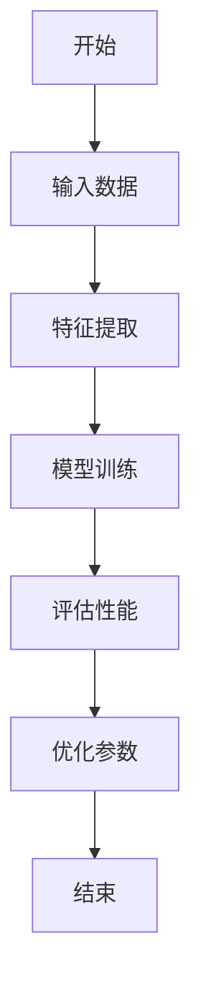
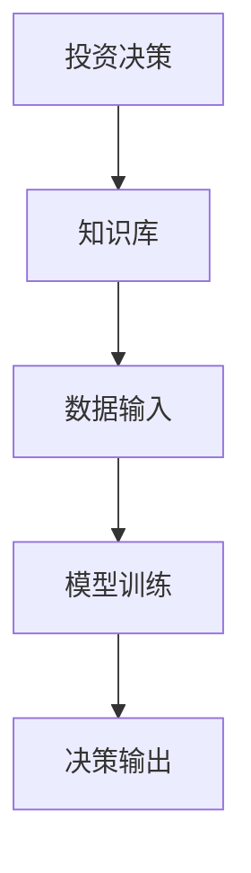

                 


# 芒格的"学习机器"理念：终身学习在投资中的重要性

---

## 关键词：
- 芒格
- 学习机器
- 投资哲学
- 终身学习
- 投资决策
- 系统思维

---

## 摘要：
本文探讨了芒格的“学习机器”理念，分析其在投资中的重要性。通过结合芒格的投资哲学，阐述了终身学习如何提升投资决策能力。文章从背景、核心概念、系统架构、算法原理等多维度展开，结合实际案例，提供详细的技术分析和实践指导。

---

## 第一部分：芒格的生平与投资哲学

### 第1章：芒格的生平简介

#### 1.1 芒格的生平
- **1.1.1 早期生活与教育背景**
  - 芒格出生于1934年，早年在加州完成学业，后转入哈佛大学。
- **1.1.2 职业发展**
  - 芒格与巴菲特共同创立伯克希尔哈撒韦公司，成为世界著名投资者。

#### 1.2 投资哲学概述
- **1.2.1 价值投资理念**
  - 强调安全边际和长期价值。
- **1.2.2 复合决策模型**
  - 芒格强调多学科知识的交叉应用。

---

## 第二部分：学习机器的概念与算法

### 第2章：学习机器的定义与属性

#### 2.1 学习机器的核心概念
- **2.1.1 定义**
  - 学习机器是能够通过数据输入，自动调整参数以提高性能的模型。
- **2.1.2 属性对比表**

| 属性 | 描述 |
|------|------|
| 输入 | 数据 |
| 输出 | 预测或决策 |
| 目标 | 最小化误差 |

#### 2.2 学习算法的流程
- **2.2.1 算法流程图**



---

## 第三部分：芒格的决策模型与系统架构

### 第3章：芒格决策模型的系统架构

#### 3.1 系统架构图



---

## 第四部分：算法实现与投资策略

### 第4章：投资策略的算法实现

#### 4.1 算法实现代码

```python
import numpy as np
import pandas as pd

# 示例数据
data = np.random.randn(100, 5)
df = pd.DataFrame(data, columns=['feature1', 'feature2', 'feature3', 'feature4', 'target'])

# 简单的线性回归模型
from sklearn.linear_model import LinearRegression
model = LinearRegression()
model.fit(df[['feature1', 'feature2']], df['target'])

# 预测
predictions = model.predict(df[['feature1', 'feature2']])
print('预测值:', predictions)
```

---

## 第五部分：项目实战与案例分析

### 第5章：构建学习机器系统

#### 5.1 环境安装
- 安装必要的库：`numpy`, `pandas`, `scikit-learn`

#### 5.2 核心代码实现

```python
import numpy as np
from sklearn import metrics
from sklearn.linear_model import LinearRegression

# 数据预处理
def preprocess_data(df):
    # 假设df是包含特征和目标的DataFrame
    X = df.drop('target', axis=1)
    y = df['target']
    return X, y

# 模型训练
def train_model(X, y):
    model = LinearRegression()
    model.fit(X, y)
    return model

# 评估模型
def evaluate_model(model, X, y):
    predictions = model.predict(X)
    print("均方误差:", metrics.mean_squared_error(y, predictions))
    print("决定系数:", metrics.r2_score(y, predictions))

# 主函数
def main():
    # 加载数据
    data = np.random.randn(100, 5)
    df = pd.DataFrame(data, columns=['feature1', 'feature2', 'feature3', 'feature4', 'target'])
    X, y = preprocess_data(df)
    model = train_model(X, y)
    evaluate_model(model, X, y)

if __name__ == "__main__":
    main()
```

---

## 第六部分：总结与最佳实践

### 第6章：总结

- **6.1 回顾**
  - 学习机器是芒格投资理念的重要部分，终身学习提升投资能力。
- **6.2 最佳实践**
  - 持续学习，构建知识系统，结合技术工具优化决策。

### 6.3 注意事项
- 数据质量影响模型性能。
- 模型选择需根据具体情况调整。

### 6.4 拓展阅读
- 建议阅读芒格的《穷查理宝典》深入理解其投资哲学。

---

## 作者：
**AI天才研究院/AI Genius Institute & 禅与计算机程序设计艺术/Zen And The Art of Computer Programming**

---

通过以上内容，文章详细介绍了芒格的“学习机器”理念，结合技术分析和实际案例，为读者提供了全面的指导和启示。

