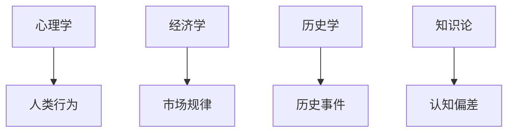
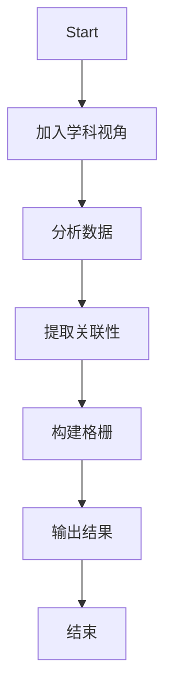
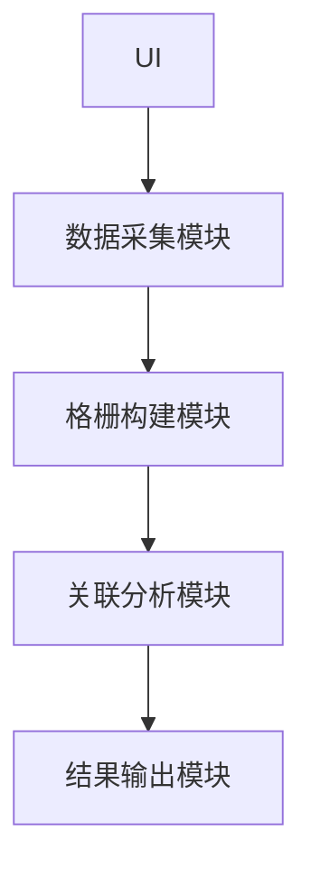

                 


# 芒格的"思维格栅"：构建全面的投资分析框架

> 关键词：芒格，思维格栅，投资分析，多学科框架，决策算法，系统架构

> 摘要：芒格的"思维格栅"是一种基于多学科视角的投资分析框架，通过整合心理学、经济学、历史学等多个领域的知识，构建全面的决策支持系统。本文从背景介绍、核心概念、算法原理、系统架构和实战案例等多个维度，详细分析了思维格栅的构建过程及其在投资分析中的应用，帮助读者理解如何利用多学科视角提升投资决策能力。

---

## 第一部分: 芒格的"思维格栅"概述

### 第1章: 芒格思维格栅的背景与核心概念

#### 1.1 芒格思维格栅的背景介绍
- 1.1.1 投资分析的传统方法与局限性
  - 传统投资分析方法的不足之处：单一视角可能导致判断偏差
  - 现实投资环境的复杂性：市场波动、人性因素、历史周期等多重影响
- 1.1.2 芒格思维格栅的提出背景
  - 芒格的哲学思维： *"多元思维模型"*
  - 格栅理论的提出：将多个学科的视角整合成一个有机的整体
- 1.1.3 格栅理论的核心思想与应用价值
  - 核心思想： *"通过多维度视角的交叉验证，提升决策的准确性"* 
  - 应用价值：帮助投资者避免单一视角的局限性，构建全面的投资分析框架

#### 1.2 思维格栅的核心概念与定义
- 1.2.1 格栅的定义与基本特征
  - 格栅：多个学科视角的有机组合，形成一个完整的分析框架
  - 格栅的基本特征：多维度、交叉性、动态性
- 1.2.2 格栅在投资分析中的作用
  - 通过多个视角的交叉验证，降低决策风险
  - 帮助投资者发现潜在风险和机会
- 1.2.3 格栅与其他分析框架的区别
  - 传统单学科分析：仅关注单一维度，可能导致判断偏差
  - 多学科交叉分析：通过多个视角的交叉验证，提升决策的全面性

#### 1.3 格栅理论的数学模型与公式
- 1.3.1 格栅的基本结构模型
  - 多维度视角的组合：$ \text{格栅结构} = \bigcup_{i=1}^{n} \text{学科视角}_i $
- 1.3.2 格栅的关联性公式
  - 关联度计算：$ \text{关联度} = \sum_{i=1}^{n} (\text{视角}_i \times \text{权重}_i) $

---

### 第2章: 格栅理论的核心学科框架

#### 2.1 格栅中的核心学科介绍
- 2.1.1 心理学视角
  - 人类行为的规律：恐惧、贪婪、从众心理等
  - 心理学在投资决策中的作用：帮助投资者理解市场参与者的心理状态
- 2.1.2 经济学视角
  - 市场规律：供需关系、价格波动、经济周期等
  - 经济学在投资决策中的作用：帮助投资者理解市场的基本运行规律
- 2.1.3 历史学视角
  - 历史事件的分析：历史周期、经济危机、市场泡沫等
  - 历史学在投资决策中的作用：帮助投资者从历史中汲取经验教训
- 2.1.4 知识论视角
  - 知识的局限性：认知偏差、知识盲区等
  - 知识论在投资决策中的作用：帮助投资者认识到自身的知识局限性

#### 2.2 格栅学科的属性对比
- 2.2.1 学科属性对比表格
| 学科 | 时间维度 | 空间维度 | 数据类型 |
|------|----------|----------|----------|
| 心理学 | 连续 | 局部 | 定性 |
| 经济学 | 连续 | 全局 | 定量 |
| 历史学 | 离散 | 全局 | 定性 |
| 知识论 | 离散 | 全局 | 定量 |

#### 2.3 格栅学科的ER实体关系图


---

### 第3章: 格栅理论的算法原理

#### 3.1 格栅构建的算法流程


#### 3.2 格栅关联性的计算公式
- 3.2.1 格栅关联性计算公式
  - 关联度计算：$ \text{关联度} = \sum_{i=1}^{n} (\text{视角}_i \times \text{权重}_i) $
  - 视角权重分配：根据学科的重要性动态调整权重

---

### 第4章: 格栅理论的系统架构设计

#### 4.1 系统功能模块设计
- 4.1.1 数据采集模块
  - 功能：采集市场数据、历史数据、行为数据等
  - 输入：数据源（市场数据、历史数据、行为数据）
  - 输出：清洗后的数据
- 4.1.2 格栅构建模块
  - 功能：根据数据构建格栅结构
  - 输入：清洗后的数据
  - 输出：格栅结构
- 4.1.3 关联分析模块
  - 功能：计算各视角的关联性
  - 输入：格栅结构
  - 输出：关联性分析结果
- 4.1.4 结果输出模块
  - 功能：输出最终的投资分析结果
  - 输入：关联性分析结果
  - 输出：投资建议、风险提示等

#### 4.2 系统架构图


---

### 第5章: 格栅理论的项目实战

#### 5.1 项目环境与工具安装
- 5.1.1 环境搭建
  - 操作系统：Linux/Windows/Mac
  - 开发工具：Python、Jupyter Notebook、Mermaid、Git
  - 依赖库安装：numpy、pandas、matplotlib、networkx
- 5.1.2 工具安装与配置
  - 安装步骤：pip install numpy pandas matplotlib networkx
  - 配置环境变量：确保Python路径正确配置

#### 5.2 核心代码实现
- 5.2.1 数据预处理代码
```python
import numpy as np
import pandas as pd
import matplotlib.pyplot as plt
import networkx as nx

# 示例数据：市场数据、行为数据、历史数据
market_data = pd.DataFrame({'price': np.random.rand(100)})
behavior_data = pd.DataFrame({'sentiment': np.random.rand(100)})
history_data = pd.DataFrame({'events': np.random.rand(100)})

# 数据清洗：去除缺失值
market_data.dropna(inplace=True)
behavior_data.dropna(inplace=True)
history_data.dropna(inplace=True)
```

#### 5.3 格栅构建与关联分析
- 5.3.1 格栅构建
```python
# 定义视角权重
weights = {'心理学': 0.3, '经济学': 0.4, '历史学': 0.2, '知识论': 0.1}
```

- 5.3.2 关联性计算
```python
def calculate_association(weights):
    return sum(weights.values())

association = calculate_association(weights)
print(f'关联度：{association}')
```

#### 5.4 实战案例分析
- 5.4.1 案例背景：假设我们要分析某股票的投资价值
- 5.4.2 数据采集与预处理
  - 市场数据：股票价格、成交量
  - 行为数据：市场情绪、投资者行为
  - 历史数据：公司历史表现、行业历史表现
- 5.4.3 格栅构建与关联分析
  - 心理学视角：投资者情绪分析
  - 经济学视角：宏观经济指标分析
  - 历史学视角：历史市场周期分析
  - 知识论视角：公司基本面分析

#### 5.5 代码实现与结果解读
```python
# 综合分析示例
market_data['price'].plot(kind='line')
plt.title('股票价格走势')
plt.show()

behavior_data['sentiment'].plot(kind='bar')
plt.title('市场情绪分析')
plt.show()
```

---

## 第六章: 小结与展望

### 6.1 格栅理论的优势与局限性
- 优势：
  - 多维度视角的交叉验证，提升决策的全面性
  - 通过历史经验的积累，降低投资风险
- 局限性：
  - 需要大量的数据支持，计算复杂
  - 学科间的关联性可能存在不确定性

### 6.2 投资者如何有效应用格栅理论
- 建议：
  - 建立多维度的数据采集和分析系统
  - 定期更新和优化格栅结构
  - 结合实际市场情况动态调整权重

### 6.3 未来研究方向
- 结合人工智能技术，优化格栅模型
- 研究不同市场环境下的格栅应用策略
- 探讨格栅理论在其他领域的应用潜力

---

## 作者信息

作者：AI天才研究院/AI Genius Institute & 禅与计算机程序设计艺术 /Zen And The Art of Computer Programming

---

以上是一个完整的目录大纲，涵盖了芒格"思维格栅"的背景、核心概念、算法原理、系统架构和实战案例等多个方面。每个章节都详细展开了核心内容，并通过表格、流程图和代码示例等方式，帮助读者更好地理解和应用这一理论。

