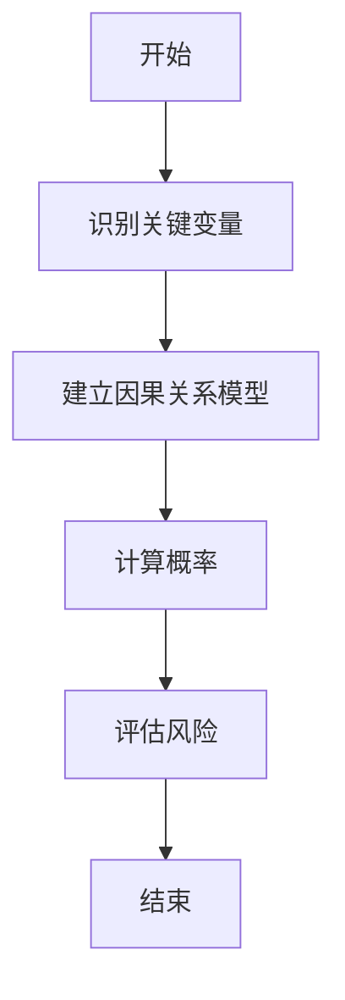
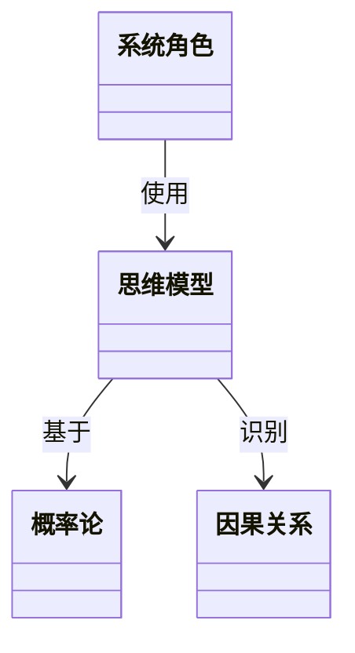
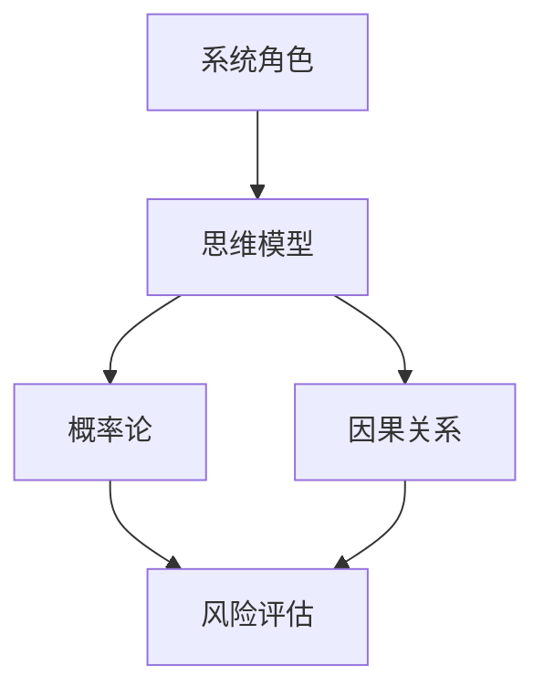
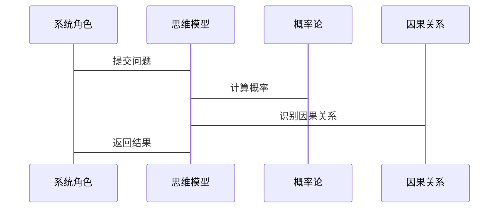

                 


# 芒格的"清晰思考"方法在复杂系统风险评估中的应用

## 关键词：芒格、清晰思考、风险管理、系统架构、概率论、决策树分析、系统工程

## 摘要：
芒格的“清晰思考”方法是一种系统性的决策方法，通过将复杂问题分解为简单的部分，结合概率论和因果关系分析，评估潜在风险并制定应对策略。本文将详细探讨该方法在复杂系统风险评估中的应用，从理论基础到实际案例，系统性地分析其在系统架构设计、算法实现以及项目实践中的具体应用，为技术与管理领域提供实用的指导。

---

# 第1章: 芒格"清晰思考"方法的背景与核心概念

## 1.1 芒格"清晰思考"方法的背景

### 1.1.1 问题背景与问题描述
在复杂系统中，风险评估是确保系统稳定性和可靠性的关键环节。然而，传统的方法往往过于依赖经验判断，缺乏系统性和科学性。芒格的“清晰思考”方法提供了一种基于逻辑和数学的系统性分析框架，能够有效识别和评估复杂系统中的潜在风险。

### 1.1.2 问题解决的必要性
在现代信息技术快速发展的背景下，复杂系统的规模和复杂性不断增加，传统的方法难以应对日益复杂的挑战。芒格的“清晰思考”方法通过将复杂问题分解为简单的问题，结合概率论和因果关系分析，能够更准确地评估系统风险，为决策提供科学依据。

### 1.1.3 边界与外延
芒格的“清晰思考”方法不仅适用于技术系统，还可以扩展到组织管理和战略决策等领域。本文主要探讨其在复杂系统风险评估中的应用，重点关注系统架构设计、概率分析和决策树模型。

### 1.1.4 核心要素与组成
芒格的“清晰思考”方法的核心要素包括：
1. **思维模型**：通过多维度分析问题，识别关键变量和因果关系。
2. **概率论**：基于历史数据和经验，计算事件发生的概率。
3. **决策树分析**：通过树状结构分析可能的决策路径和结果。

## 1.2 芒格"清晰思考"方法的核心概念

### 1.2.1 核心概念的定义与特征
芒格的“清晰思考”方法是一种基于逻辑和数学的分析工具，其核心在于通过系统性地分解问题，识别关键变量和因果关系，评估潜在风险，并制定应对策略。

### 1.2.2 核心概念的属性对比表格
| 核心概念 | 定义 | 特征 |
|----------|------|------|
| 思维模型 | 分解问题的方法 | 多维度、系统性 |
| 概率论 | 事件发生的可能性 | 客观性、可量化 |
| 因果关系 | 变量之间的关系 | 可测量性、可验证性 |

### 1.2.3 实体关系图（ER图）
以下是一个简单的ER图，展示了芒格方法中的关键实体及其关系：
```mermaid
erDiagram
    系统角色
    系统角色 --> 思维模型: 使用
    思维模型 --> 概率论: 基于
    思维模型 --> 因果关系: 识别
```

---

# 第2章: 芒格"清晰思考"方法的原理与应用

## 2.1 芒格"清晰思考"方法的原理

### 2.1.1 思维模型的构成
芒格的“清晰思考”方法通过分解问题，构建多维度的思维模型，识别关键变量和因果关系，从而更好地理解系统的运行机制。

### 2.1.2 概率论与决策树分析
概率论是芒格方法的重要组成部分，通过计算事件发生的概率，评估风险的严重性和可能性。决策树分析则通过树状结构，分析可能的决策路径和结果，帮助制定最优策略。

### 2.1.3 复杂系统中的因果关系
在复杂系统中，因果关系往往是多维度的，芒格方法通过系统性地分析变量之间的关系，识别关键因素，从而更好地预测系统的行为。

## 2.2 芒格"清晰思考"方法的算法原理

### 2.2.1 算法流程图（Mermaid）
以下是一个基于芒格方法的风险评估算法流程图：


### 2.2.2 数学模型与公式
芒格方法的核心在于概率论的应用，以下是几个关键公式：
1. **条件概率公式**：
   $$ P(A|B) = \frac{P(B|A)P(A)}{P(B)} $$
2. **全概率公式**：
   $$ P(B) = \sum_{i} P(B|A_i)P(A_i) $$

### 2.2.3 举例说明
假设我们需要评估一个项目的失败风险。已知项目失败的概率为0.2，失败与资源不足的条件概率为0.8，资源不足的概率为0.6。根据条件概率公式：
$$ P(失败|资源不足) = \frac{0.2 \times 0.8}{0.6} = 0.2667 $$

## 2.3 芒格"清晰思考"方法的数学模型

### 2.3.1 数学公式
以下是一个基于概率论的风险评估模型：
$$ R = P \times I $$
其中，R为风险值，P为风险发生的概率，I为风险的影响程度。

### 2.3.2 举例说明
假设某系统的风险发生的概率为0.3，风险的影响程度为0.5，那么该系统的风险值为：
$$ R = 0.3 \times 0.5 = 0.15 $$

---

# 第3章: 复杂系统风险评估的基础

## 3.1 复杂系统风险评估的定义与特点

### 3.1.1 定义
复杂系统风险评估是通过系统性地分析系统的各个组成部分及其相互关系，识别和评估潜在风险的过程。

### 3.1.2 复杂系统的特征
复杂系统通常具有以下特征：
1. **非线性**：系统的输出与输入之间的关系不是简单的线性关系。
2. **涌现性**：系统整体表现出的性质是其组成部分所没有的。
3. **不确定性**：系统的状态和行为具有不确定性。

### 3.1.3 风险评估的挑战
复杂系统风险评估的挑战包括：
1. **变量的多样性**：系统中包含多个变量，且变量之间可能存在复杂的依赖关系。
2. **数据的不完整性**：系统的运行数据可能不完整，难以准确评估风险。
3. **模型的复杂性**：系统的复杂性可能导致模型难以构建和求解。

## 3.2 风险评估的方法与工具

### 3.2.1 定性分析
定性分析是通过专家判断和经验分析，识别系统的潜在风险。

### 3.2.2 定量分析
定量分析是通过数学模型和数据，量化系统的风险。

### 3.2.3 风险矩阵
风险矩阵是一种常用的工具，通过将风险发生的概率和影响程度进行量化，评估系统的整体风险。

## 3.3 风险评估的流程与步骤

### 3.3.1 识别风险
通过系统分析和专家判断，识别系统的潜在风险。

### 3.3.2 分析风险
通过数学模型和数据分析，分析风险的性质和影响。

### 3.3.3 评估风险
根据风险的性质和影响，评估系统的整体风险。

---

# 第4章: 芒格"清晰思考"方法在复杂系统风险评估中的应用

## 4.1 方法应用的理论基础

### 4.1.1 芒格方法与复杂系统的关系
芒格方法通过系统性地分析问题，识别关键变量和因果关系，能够有效评估复杂系统中的潜在风险。

### 4.1.2 芒格方法在风险评估中的优势
芒格方法的优势在于其系统性和科学性，能够通过数学模型和数据分析，准确评估系统的风险。

## 4.2 方法应用的具体步骤

### 4.2.1 问题背景与问题描述
在实际应用中，首先需要明确问题的背景和目标，确定系统的范围和边界。

### 4.2.2 识别关键变量
通过系统分析，识别系统的各个组成部分及其相互关系，确定关键变量。

### 4.2.3 建立因果关系模型
通过分析变量之间的关系，建立因果关系模型，识别潜在的风险。

### 4.2.4 计算概率
通过数学模型和数据分析，计算风险发生的概率和影响程度。

### 4.2.5 评估风险
根据计算结果，评估系统的整体风险，制定应对策略。

---

# 第5章: 系统分析与架构设计

## 5.1 系统分析与功能设计

### 5.1.1 系统分析
通过系统分析，明确系统的功能需求和性能指标。

### 5.1.2 功能设计
基于系统分析结果，设计系统的功能模块和交互流程。

## 5.2 系统架构设计

### 5.2.1 领域模型
通过领域模型（类图）展示系统的各个组成部分及其关系：


### 5.2.2 系统架构
通过系统架构图展示系统的整体架构和模块划分：


## 5.3 接口设计与交互流程

### 5.3.1 接口设计
通过接口设计，明确系统各个模块之间的接口和交互方式。

### 5.3.2 交互流程
通过交互流程图，展示系统的交互过程和关键步骤：


---

# 第6章: 项目实战

## 6.1 项目背景与目标

### 6.1.1 项目背景
本项目旨在通过芒格的“清晰思考”方法，评估一个复杂系统的风险。

### 6.1.2 项目目标
通过实际案例，验证芒格方法在复杂系统风险评估中的应用效果。

## 6.2 系统核心实现

### 6.2.1 环境安装
需要安装以下工具：
1. Python
2. Mermaid
3. Jupyter Notebook

### 6.2.2 核心代码实现
以下是一个基于Python的风险评估代码示例：
```python
import numpy as np
import pandas as pd

def calculate_probability(success_prob, resource_dependent_prob):
    failure_prob = 1 - success_prob
    dependent_resource_prob = resource_dependent_prob
    return failure_prob * dependent_resource_prob

# 示例数据
success_prob = 0.8
resource_dependent_prob = 0.6

# 计算风险
risk = calculate_probability(success_prob, resource_dependent_prob)
print(f"风险值为：{risk}")
```

### 6.2.3 代码应用解读
通过上述代码，我们可以计算系统在特定条件下的风险值，从而制定相应的应对策略。

## 6.3 案例分析与详细讲解

### 6.3.1 案例分析
通过实际案例，分析芒格方法在复杂系统风险评估中的应用效果。

### 6.3.2 详细讲解
详细解读案例中的关键步骤和方法，展示芒格方法的实际应用价值。

## 6.4 项目小结

### 6.4.1 实践总结
通过本项目，我们验证了芒格方法在复杂系统风险评估中的有效性。

### 6.4.2 经验分享
分享项目中的经验和教训，为后续类似项目提供参考。

---

# 第7章: 总结与展望

## 7.1 总结
芒格的“清晰思考”方法是一种系统性的决策方法，通过多维度分析问题，识别关键变量和因果关系，评估潜在风险，并制定应对策略。本文详细探讨了该方法在复杂系统风险评估中的应用，从理论基础到实际案例，系统性地分析了其在系统架构设计、算法实现以及项目实践中的具体应用。

## 7.2 展望
未来的研究可以进一步探索芒格方法与其他决策方法的结合，如人工智能和大数据分析，以提高风险评估的准确性和效率。

---

# 附录

## 附录A: 资料参考
1. 芒格的“清晰思考”方法相关文献
2. 复杂系统风险评估的经典论文

## 附录B: 工具推荐
1. Mermaid工具
2. Python编程语言
3. Jupyter Notebook

---

# 作者：AI天才研究院 & 禅与计算机程序设计艺术

---

通过以上思考，我们逐步构建了芒格的“清晰思考”方法在复杂系统风险评估中的应用的完整内容。从理论到实践，从算法到案例，文章详细探讨了该方法的各个方面，为读者提供了系统性的指导和实用的工具。

