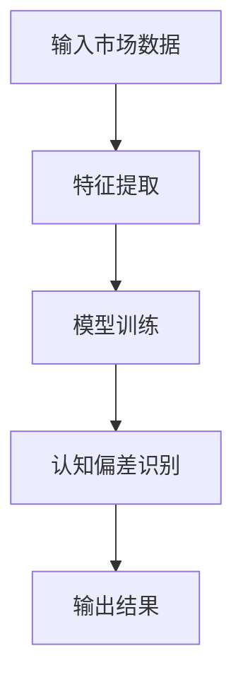
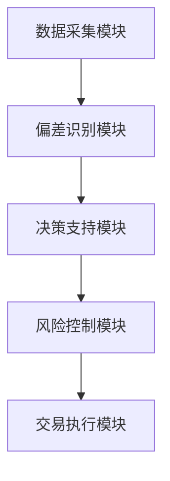

                 


# 芒格的认知偏差理论：如何在高频交易时代保持理性

> 关键词：认知偏差，芒格理论，高频交易，理性决策，算法，心理影响

> 摘要：本文通过分析芒格的认知偏差理论，探讨在高频交易这一复杂且高压力的环境中，如何识别和克服认知偏差，保持理性决策。文章从认知偏差的基本概念出发，结合高频交易的特点，深入分析认知偏差在高频交易中的具体表现，并提出相应的应对策略。通过算法实现和系统设计，本文提供了一种基于认知偏差理论的高频交易决策支持系统，帮助交易者在复杂的市场环境中保持理性。

---

# 正文

## 第1章: 认知偏差的基本概念

### 1.1 认知偏差的定义与分类

认知偏差（Cognitive Bias）是指人在信息处理和决策过程中，由于主观因素的影响，偏离客观事实的系统性错误。认知偏差可以分为以下几类：

- **确认性偏差（Confirmation Bias）**：倾向于寻找和接受与自己已有观点一致的信息，忽略或曲解与之相悖的信息。
- **过度自信偏差（Overconfidence Bias）**：对自己掌握的信息或决策能力过于自信，低估了不确定性。
- **可得性偏差（Availability Bias）**：根据容易回忆或想到的信息做出决策，而忽略了其他重要的信息。
- **损失厌恶（Loss Aversion）**：对损失的恐惧超过了对收益的追求，导致决策者在面对风险时过于保守或激进。

### 1.2 芮格的认知偏差理论

芒格（Charlie Munger）是认知偏差研究的重要倡导者之一。他认为，认知偏差是人类决策过程中的“心理误判”，并提出了著名的“清单式决策法”来克服这些偏差。芒格强调，认知偏差不仅存在于个体决策中，也存在于集体决策和系统设计中。

芒格的认知偏差理论的核心观点包括：

1. **认知偏差是系统性的**：认知偏差不是随机的错误，而是人类大脑信息处理机制的固有缺陷。
2. **认知偏差与利益冲突相关**：某些认知偏差来源于个体或集体的利益冲突，例如确认性偏差可能源于维护已有决策的需要。
3. **克服认知偏差需要系统性方法**：芒格提出了“多元思维模型”（Mental Models），通过多维度的思考和分析，减少单一视角带来的偏差。

### 1.3 高频交易的特点与挑战

高频交易（High-Frequency Trading, HFT）是指通过计算机算法在极短时间内完成的交易行为。高频交易的特点包括：

- **高频率**：交易决策和执行速度极快，通常以毫秒为单位。
- **自动化**：交易策略和执行高度依赖算法，人工干预极少。
- **大数据驱动**：高频交易依赖大量的市场数据和算法模型。

认知偏差在高频交易中的具体表现包括：

1. **过度自信偏差**：交易者可能因为算法的准确性而过度自信，忽视市场的不确定性。
2. **可得性偏差**：交易者可能根据最近的市场数据做出决策，忽略历史数据中的长期趋势。
3. **损失厌恶**：在面对亏损时，交易者可能采取激进的策略试图挽回损失，导致更大的损失。

---

## 第2章: 认知偏差的系统分析与算法原理

### 2.1 认知偏差的系统模型

认知偏差的系统模型可以分为以下几个部分：

- **输入层**：市场数据、交易信号、历史交易记录。
- **处理层**：算法模型、认知偏差识别模块、决策支持模块。
- **输出层**：交易决策、风险提示、策略优化建议。

### 2.2 认知偏差的数学模型

认知偏差的数学模型可以通过概率论和统计学来描述。例如，过度自信偏差可以通过以下模型进行分析：

$$ P(\text{错误决策}) = 1 - P(\text{正确信息处理}) $$

其中，$P(\text{正确信息处理})$ 是信息处理过程中正确的概率，受到认知偏差的影响。

### 2.3 认知偏差识别的算法原理

以下是一个基于机器学习的认知偏差识别算法的流程图：



代码实现：

```python
import numpy as np
from sklearn import svm

# 特征提取
def extract_features(data):
    features = []
    for d in data:
        features.append([d['volume'], d['price_change']])
    return np.array(features)

# 模型训练
def train_model(features, labels):
    clf = svm.SVC()
    clf.fit(features, labels)
    return clf

# 认知偏差识别
def identify_bias(model, new_data):
    features = extract_features(new_data)
    predicted_labels = model.predict(features)
    return predicted_labels
```

---

## 第3章: 高频交易中的认知偏差案例分析

### 3.1 高频交易中的典型认知偏差案例

1. **过度自信偏差**：交易者过度依赖算法模型，忽视市场变化的复杂性。
2. **沉没成本偏差**：交易者在亏损后继续加码，试图挽回损失，导致更大的亏损。
3. **羊群效应**：交易者跟随市场趋势，缺乏独立判断，导致集体误判。

### 3.2 认知偏差对高频交易决策的影响

认知偏差可能导致以下问题：

1. **交易策略失效**：算法模型未能准确反映市场变化，导致交易亏损。
2. **风险管理失控**：交易者忽视市场风险，导致杠杆过度使用。
3. **交易成本增加**：频繁的交易可能导致交易费用累积，影响整体收益。

### 3.3 高频交易中克服认知偏差的策略

1. **提高自我认知**：交易者需要意识到认知偏差的存在，并主动调整决策过程。
2. **建立科学的决策机制**：引入多元化的决策模型，减少单一视角的影响。
3. **引入技术手段辅助决策**：利用算法和大数据分析，优化交易策略。

---

## 第4章: 项目实战与系统设计

### 4.1 项目介绍

本项目旨在开发一个基于认知偏差理论的高频交易决策支持系统。系统通过分析市场数据和交易行为，识别潜在的认知偏差，并提供决策优化建议。

### 4.2 系统功能设计

以下是系统的功能模块划分：

- **数据采集模块**：采集市场数据和交易记录。
- **偏差识别模块**：识别交易中的认知偏差。
- **决策支持模块**：提供优化的交易策略。
- **风险控制模块**：评估和控制交易风险。

### 4.3 系统架构设计

系统架构图如下：



### 4.4 项目小结

通过本项目的实现，交易者可以在高频交易中减少认知偏差的影响，提高决策的科学性和准确性。

---

## 第5章: 总结与展望

### 5.1 总结

芒格的认知偏差理论为我们提供了克服决策偏差的重要方法。通过系统分析和算法实现，我们可以将认知偏差理论应用于高频交易中，帮助交易者保持理性决策。

### 5.2 展望

未来的研究可以进一步探索认知偏差与算法交易的结合，开发更加智能化的交易系统，帮助交易者在复杂多变的市场环境中保持优势。

---

# 作者

作者：AI天才研究院/AI Genius Institute & 禅与计算机程序设计艺术 /Zen And The Art of Computer Programming

