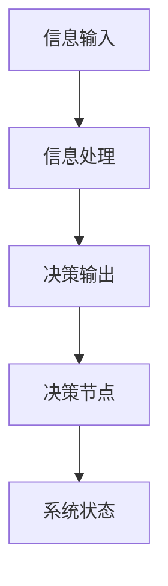

                 

# 芒格的"远离"策略：避开不懂的领域

## 关键词：
芒格、远离策略、投资决策、风险管理、认知边界、价值投资、长期视角

## 摘要：
芒格的“远离”策略是一种基于认知边界和风险管理的投资方法，强调避开自己不理解的领域，以降低投资风险并实现长期价值增长。本文将从策略背景、核心概念、算法原理、系统架构和项目实战等多个角度，详细分析芒格的“远离”策略，并通过实际案例帮助读者理解其在投资决策中的应用。

---

## 第一部分：芒格的“远离”策略概述

### 第1章：芒格“远离”策略的背景与核心思想

#### 1.1 投资中的“远离”策略：芒格的智慧
- **从巴菲特到芒格**：芒格作为巴菲特的长期合作伙伴，以其独特的投资哲学闻名。他提出的“远离”策略是价值投资的重要组成部分。
- **“远离”策略的提出背景**：在复杂多变的市场环境中，投资者往往容易被短期收益诱惑，忽视自己认知的边界。芒格提出“远离”策略，强调专注于自己理解的领域，避免盲目投资。
- **策略的核心理念**：通过避开不懂的领域，降低投资风险，实现长期稳定的收益。

#### 1.2 “远离”策略的哲学基础
- **认知边界**：每个人的认知有限，投资时必须明确自己的知识边界，避免超出能力范围的决策。
- **风险管理**：芒格认为，风险管理是投资的核心，而“远离”策略是管理风险的重要手段。
- **长期视角**：投资不仅是对市场的理解，更是对自身认知能力的深刻反思，长期视角下，“远离”策略能够帮助投资者避免重大损失。

#### 1.3 “远离”策略的现实意义
- **当前市场环境**：在信息爆炸的时代，投资者面临更多的不确定性，明确认知边界显得尤为重要。
- **投资者误区**：许多投资者倾向于追求高收益，忽视自己对投资标的理解深度，导致重大损失。
- **对个人投资的影响**：通过“远离”策略，投资者能够更好地管理风险，实现稳健的长期收益。

---

## 第二部分：芒格“远离”策略的核心概念与原理

### 第2章：“远离”策略的核心概念解析

#### 2.1 “远离”策略的定义与特征
- **定义**：芒格的“远离”策略是指投资者在投资决策中，避免进入自己不理解的领域，专注于自己熟悉的投资标的。
- **核心特征**：
  - 认知边界：明确自己的知识范围，避免超出能力范围的投资。
  - 风险规避：通过避开不确定的领域，降低投资风险。
  - 长期视角：注重长期价值，而非短期收益。

#### 2.2 “远离”策略的关键要素
- **认知边界**：投资者需要对自己擅长的领域有清晰的认识，通过学习和研究确定自己的知识范围。
- **风险规避**：通过“远离”策略，避免投资于高风险、低确定性的领域，降低本金损失的概率。
- **长期视角**：芒格强调长期投资，认为短期波动不应影响长期决策。

#### 2.3 “远离”策略的数学模型
- **期望收益模型**：$$E = \sum_{i=1}^{n} p_i \cdot v_i$$
  - $$E$$：期望收益。
  - $$p_i$$：第i种投资的概率。
  - $$v_i$$：第i种投资的收益。
- **投资组合模型**：$$P = \sum_{j=1}^{m} w_j \cdot a_j$$
  - $$P$$：投资组合的总价值。
  - $$w_j$$：第j种资产的权重。
  - $$a_j$$：第j种资产的价值。
- **风险规避模型**：$$R = \sum_{k=1}^{l} r_k \cdot f_k$$
  - $$R$$：风险值。
  - $$r_k$$：第k种风险因素的概率。
  - $$f_k$$：第k种风险因素的影响。

---

## 第三部分：“远离”策略的系统分析与架构设计

### 第3章：基于“远离”策略的决策框架

#### 3.1 投资决策的系统模型
- **系统模型构建**：
  - $$S = \{s_1, s_2, ..., s_n\}$$
    - $$S$$：系统状态集合。
    - $$s_i$$：第i种系统状态。
  - $$D = \{d_1, d_2, ..., d_m\}$$
    - $$D$$：决策节点集合。
    - $$d_j$$：第j种决策节点。
  - $$T = \{t_1, t_2, ..., t_k\}$$
    - $$T$$：状态转移集合。
    - $$t_l$$：第l种状态转移。

#### 3.2 “远离”策略的架构设计
- **信息输入**：
  - $$I = \{i_1, i_2, ..., i_n\}$$
    - $$i_j$$：第j种输入信息。
- **信息处理**：
  - $$P = \{p_1, p_2, ..., p_m\}$$
    - $$p_k$$：第k种处理过程。
- **决策输出**：
  - $$O = \{o_1, o_2, ..., o_k\}$$
    - $$o_l$$：第l种决策输出。

#### 3.3 系统架构的Mermaid图

---

## 第四部分：“远离”策略的项目实战与案例分析

### 第4章：实际案例分析与策略应用

#### 4.1 案例背景介绍
- **项目介绍**：假设我们是一名价值投资者，专注于寻找具有长期增长潜力的企业。
- **案例场景**：投资者面临两个投资选择：科技初创公司和传统制造业企业。

#### 4.2 信息输入与处理
- **信息输入**：
  - 科技初创公司：$$I_{tech} = \{i_1, i_2, ..., i_n\}$$
    - $$i_1$$：高增长潜力。
    - $$i_2$$：高风险，市场不确定性大。
  - 传统制造业企业：$$I_{manufacturing} = \{j_1, j_2, ..., j_m\}$$
    - $$j_1$$：稳定的收益。
    - $$j_2$$：低增长潜力。
- **信息处理**：
  - 科技初创公司：$$P_{tech} = \{p_1, p_2, ..., p_k\}$$
    - $$p_1$$：高增长潜力的验证。
    - $$p_2$$：市场不确定性分析。
  - 传统制造业企业：$$P_{manufacturing} = \{q_1, q_2, ..., q_l\}$$
    - $$q_1$$：收益稳定性分析。
    - $$q_2$$：行业竞争状况评估。

#### 4.3 决策输出与结果分析
- **科技初创公司**：
  - $$O_{tech} = \{o_1, o_2, ..., o_n\}$$
    - $$o_1$$：投资建议：$$o_1 = \text{不建议投资}$$
    - 理由：$$p_2$$分析显示市场不确定性较大，超出投资者认知边界。
- **传统制造业企业**：
  - $$O_{manufacturing} = \{o_3, o_4, ..., o_m\}$$
    - $$o_3$$：投资建议：$$o_3 = \text{建议投资}$$
    - 理由：$$q_1$$分析显示收益稳定，符合长期价值投资理念。

#### 4.4 决策序列图

---

## 第五部分：总结与建议

### 第5章：芒格“远离”策略的总结与应用建议

#### 5.1 总结
- **核心总结**：
  - 芒格的“远离”策略强调认知边界和风险管理，帮助投资者避开不懂的领域，降低投资风险。
  - 通过明确自己的知识范围，投资者可以专注于自己熟悉的投资标的，实现长期稳定的收益。
  - 数学模型和系统架构的分析表明，“远离”策略不仅是一种投资策略，更是一种科学的决策方法。

#### 5.2 应用建议
- **明确认知边界**：投资者需要通过不断学习和研究，明确自己的知识范围，避免超出能力范围的投资。
- **风险管理**：在投资决策中，始终将风险管理放在首位，通过“远离”策略降低潜在风险。
- **长期视角**：芒格的“远离”策略强调长期投资，投资者应避免被短期波动干扰，坚持长期价值投资理念。

#### 5.3 最佳实践 tips
- **持续学习**：保持对市场的学习和研究，扩展认知边界。
- **分散投资**：通过分散投资降低风险，但不要超过自己认知范围。
- **定期评估**：定期评估投资组合，确保符合“远离”策略的要求。

---

## 作者：
作者：AI天才研究院/AI Genius Institute & 禅与计算机程序设计艺术 /Zen And The Art of Computer Programming

---

希望这篇文章能为您提供关于芒格“远离”策略的全面理解和应用方法，帮助您在投资决策中更好地管理风险，实现长期稳健的收益。

