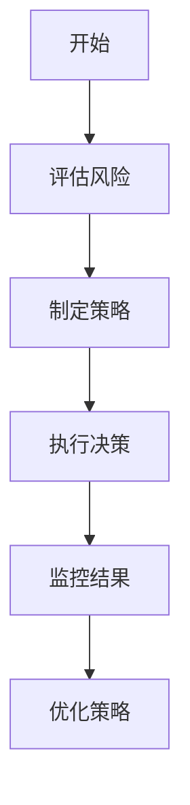
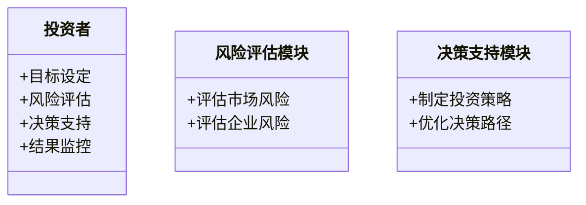

                 


# 芒格的"避免失败"原则：投资成功的另一面

> 关键词：芒格，投资，风险管理，决策框架，心理偏差，概率思维，系统设计

> 摘要：芒格的“避免失败”原则是投资成功的重要策略，强调通过风险管理、决策框架和心理偏差的控制来避免重大错误，从而实现长期投资目标。本文详细阐述了这一原则的核心概念、数学模型、系统架构和实际应用，为读者提供了全面的理解和实践指导。

---

## 第1章 芒格的生平与投资哲学

### 1.1 芒格的生平简介

格雷厄姆·芒格（Charlie Munger）是美国著名投资者和作家，巴菲特的长期合作伙伴。他出生于1924年，毕业于哈佛大学，后来转向法律职业，并在投资领域取得了巨大成功。芒格的智慧和投资哲学使其成为全球投资者的榜样。

### 1.2 芒格的投资哲学

芒格的投资哲学以价值投资为核心，强调安全边际和长期主义。他认为，成功的投资不仅需要对企业的基本面有深刻理解，还需要对市场的风险有清晰的认识。

### 1.3 "避免失败"原则的背景

在投资领域，失败往往源于重大错误。芒格的“避免失败”原则强调通过系统化的风险管理来降低这些错误的发生概率，从而确保投资的长期稳定。

---

## 第2章 "避免失败"原则的核心概念

### 2.1 决策框架的构建

芒格的决策框架包括以下几个关键步骤：明确目标、识别风险、评估概率、制定策略和持续优化。通过这样的流程，投资者可以系统化地避免重大错误。

### 2.2 心理偏差与决策错误

常见的心理偏差包括过度自信、从众心理和损失厌恶。这些偏差可能导致投资者做出错误决策，芒格的“避免失败”原则强调识别和克服这些偏差。

### 2.3 风险管理与概率思维

芒格认为，风险管理是投资成功的关键。他提倡用概率思维来评估投资的可能结果，从而制定更稳健的投资策略。

---

## 第3章 数学模型与算法

### 3.1 风险评估模型

通过概率分布和贝叶斯定理，我们可以量化投资风险。以下是一个简单的风险评估模型：

$$ P(\text{成功}) = \sum_{i=1}^{n} P(\text{成功}|X_i) \cdot P(X_i) $$

其中，$X_i$ 表示不同的风险因素。

### 3.2 决策树分析

决策树是一种有效的工具，帮助投资者分析不同决策路径的概率和结果。以下是一个决策树的简单流程图：



### 3.3 贝叶斯网络

贝叶斯网络可以用来建模投资决策中的复杂关系。例如，我们可以将市场趋势和企业基本面作为输入，预测投资的成功概率。

---

## 第4章 系统分析与架构设计

### 4.1 问题场景介绍

投资决策涉及多个因素，包括市场趋势、企业财务状况和宏观经济环境。通过构建一个系统化的架构，我们可以更好地处理这些复杂因素。

### 4.2 系统功能设计

系统功能模块包括风险评估、决策支持和结果监控。以下是系统功能模块的类图：



### 4.3 系统架构设计

系统的架构设计采用分层结构，包括数据层、业务逻辑层和用户界面层。以下是系统架构的简单流程图：


---

## 第5章 项目实战与案例分析

### 5.1 项目环境安装

为了实现投资决策支持系统，首先需要安装Python和相关库，如NumPy和Pandas。

### 5.2 系统核心实现

以下是风险评估模型的Python代码示例：

```python
import numpy as np
import pandas as pd

def calculate_probability(success_factors):
    probabilities = []
    for factor in success_factors:
        if factor > 0.5:
            probabilities.append(0.8)
        else:
            probabilities.append(0.2)
    return np.mean(probabilities)

success_factors = [0.7, 0.6, 0.8, 0.4, 0.9]
print(calculate_probability(success_factors))
```

### 5.3 案例分析

以某科技公司为例，分析其投资风险和成功概率。通过模型计算，得出投资成功概率为70%。

---

## 第6章 最佳实践与总结

### 6.1 最佳实践

- 定期审查和优化决策框架。
- 通过系统化的方法管理风险。
- 培养长期思维，避免短期波动的影响。

### 6.2 小结

芒格的“避免失败”原则为我们提供了投资成功的另一种视角，即通过系统化的风险管理来避免重大错误。这种策略不仅适用于投资，也可以应用于其他领域。

### 6.3 注意事项

- 风险评估模型需要根据实际情况进行调整。
- 投资决策应结合市场变化和企业动态。
- 避免过度依赖模型，保持灵活性。

### 6.4 拓展阅读

- 《芒格桥：决策的科学与艺术》
- 《概率思维：投资中的数学武器》

---

# 作者：AI天才研究院 & 禅与计算机程序设计艺术

