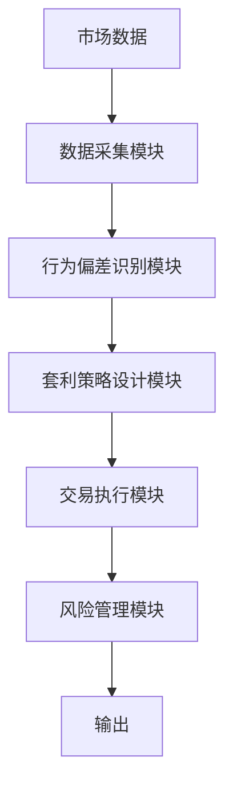
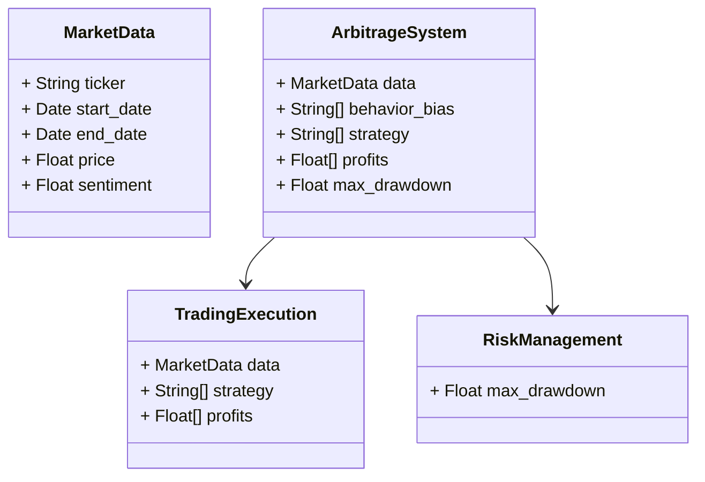
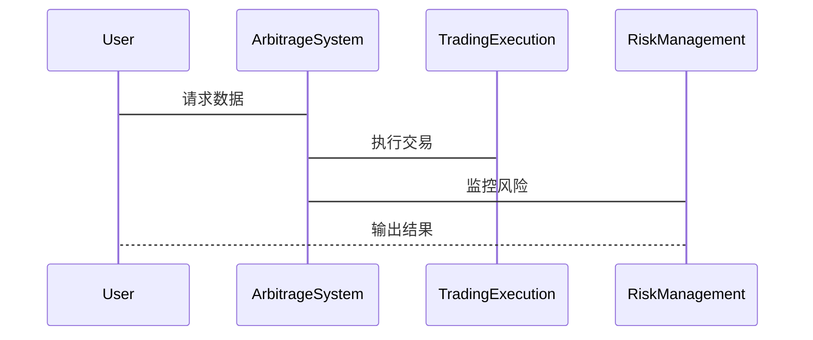

                 


# 行为偏差套利：利用市场非理性行为获取收益

> 关键词：行为偏差套利、非理性行为、市场机会、套利策略、行为经济学、算法套利

> 摘要：行为偏差套利是一种通过识别和利用市场参与者非理性行为来获取投资收益的策略。本文将深入探讨行为偏差套利的核心概念、理论基础、策略框架、系统设计以及实际应用，帮助读者理解如何利用市场非理性行为实现套利收益。通过分析常见行为偏差类型、套利策略的设计与实施、系统架构的构建以及实际案例的分析，本文为投资者提供了一套完整的套利解决方案。

---

## 正文部分

---

### 第1章: 引言

#### 1.1 行为偏差套利的背景与意义
行为偏差套利是一种基于行为经济学原理的投资策略，它通过识别市场参与者的情绪偏差、认知偏差和行为偏差，捕捉市场中的短期非理性定价机会。在金融市场中，价格往往由市场参与者的集体行为决定，而这些行为常常受到认知偏差和情绪影响，导致价格偏离其内在价值。

行为偏差套利的核心在于利用市场非理性行为带来的短期价格波动，通过套利策略实现收益。与传统套利策略不同，行为偏差套利更加注重市场参与者的心理因素和行为模式，而非仅仅依赖于市场效率和价格收敛。

#### 1.2 行为偏差套利的理论基础
行为偏差套利的理论基础主要来源于行为经济学和认知心理学。行为经济学研究表明，市场参与者的决策往往受到认知偏差和情绪因素的影响，这些偏差包括过度自信、从众心理、沉没成本效应等。这些偏差会导致市场中的非理性定价行为，从而为套利者提供了机会。

#### 1.3 行为偏差套利的核心目标
行为偏差套利的核心目标是通过识别市场中的非理性行为，捕捉短期套利机会，实现超额收益。套利者需要具备对市场参与者行为模式的深刻理解，以及对套利机会的快速识别和捕捉能力。

#### 1.4 本章小结
本章介绍了行为偏差套利的背景、理论基础和核心目标，为后续章节的分析奠定了基础。

---

### 第2章: 行为偏差的类型与特征

#### 2.1 过度自信偏差
过度自信偏差是指投资者对自己判断的信心过于强烈，导致其高估自己决策的正确性和准确性。这种偏差在金融市场中表现得尤为明显，投资者往往认为自己能够预测市场的短期走势，并据此进行交易。

##### 2.1.1 过度自信偏差的定义与特征
- **定义**：投资者认为自己的判断比实际情况更准确。
- **特征**：投资者倾向于过度交易、忽略风险。

##### 2.1.2 过度自信偏差在金融市场中的表现
- 投资者倾向于频繁交易，试图通过短期价格波动获利。
- 投资者在市场下跌时仍然坚持自己的判断，拒绝调整投资策略。

##### 2.1.3 过度自信偏差的实例分析
例如，投资者在市场上涨时倾向于追涨，在市场下跌时倾向于杀跌，这往往是由于过度自信偏差导致的。

#### 2.2 从众心理偏差
从众心理偏差是指投资者在决策时，倾向于跟随市场的主流观点或行为模式，而非独立思考。这种偏差在市场恐慌或市场狂热时表现得尤为明显。

##### 2.2.1 从众心理偏差的定义与特征
- **定义**：投资者在决策时倾向于跟随市场的主流观点。
- **特征**：投资者在市场情绪高涨时倾向于追涨，在市场情绪低落时倾向于杀跌。

##### 2.2.2 从众心理偏差在金融市场中的表现
- 市场泡沫的形成：投资者盲目跟风，导致资产价格虚高。
- 市场恐慌的加剧：投资者恐慌性抛售，导致资产价格超跌。

##### 2.2.3 从众心理偏差的实例分析
例如，2017年比特币价格的暴涨暴跌，很大程度上是由市场参与者从众心理偏差导致的。

#### 2.3 沉没成本偏差
沉没成本偏差是指投资者在决策时，过于关注已经投入的成本，而非未来的收益。这种偏差会导致投资者在亏损时继续投入，试图通过加大投入来弥补之前的损失。

##### 2.3.1 沉没成本偏差的定义与特征
- **定义**：投资者在决策时过于关注已经投入的成本。
- **特征**：投资者在亏损时倾向于继续投入，而非及时止损。

##### 2.3.2 沉没成本偏差在金融市场中的表现
- 投资者在亏损时倾向于加仓，试图通过摊低成本来扭亏为盈。
- 投资者在市场下跌时倾向于坚持持有，而非及时止损。

##### 2.3.3 沉没成本偏差的实例分析
例如，投资者在股票价格持续下跌时，选择继续持有，而非及时止损，往往导致更大的亏损。

#### 2.4 其他常见行为偏差
除了过度自信偏差、从众心理偏差和沉没成本偏差，还有其他常见的行为偏差，例如短期思维偏差、过度反应偏差和忽视概率偏差等。

##### 2.4.1 短期思维偏差
投资者倾向于关注短期价格波动，而非长期价值。这种偏差导致投资者在市场短期波动中频繁交易，忽视长期投资策略。

##### 2.4.2 过度反应偏差
投资者在面对市场信息时，往往会过度反应，导致资产价格在短期内出现过度波动。

##### 2.4.3 忽视概率偏差
投资者在决策时往往忽视概率信息，导致其对风险的评估出现偏差。

#### 2.5 行为偏差的综合分析
不同行为偏差在金融市场中可能会相互作用，导致市场出现非理性波动。例如，过度自信偏差和从众心理偏差的结合可能导致市场泡沫的形成和破裂。

---

### 第3章: 行为偏差套利的策略与方法

#### 3.1 行为偏差套利的策略框架
行为偏差套利的策略框架主要包括以下几个步骤：
1. **识别市场中的行为偏差**：通过分析市场参与者的交易行为和市场数据，识别出市场中存在的行为偏差。
2. **评估套利机会的可行性**：根据识别出的行为偏差，评估套利机会的可行性，包括套利空间、风险和收益。
3. **设计套利策略**：根据评估出的套利机会，设计具体的套利策略，包括交易时机、仓位管理和风险管理。

#### 3.2 行为偏差套利的实施步骤
##### 3.2.1 识别市场中的行为偏差
通过分析市场参与者的交易行为和市场数据，识别出市场中存在的行为偏差。例如，通过分析交易量、价格波动和市场情绪指标，识别出市场中的从众心理偏差和过度自信偏差。

##### 3.2.2 评估套利机会的可行性
根据识别出的行为偏差，评估套利机会的可行性。例如，评估市场中是否存在足够的套利空间，套利收益是否能够覆盖套利成本。

##### 3.2.3 设计套利策略
根据评估出的套利机会，设计具体的套利策略。例如，针对市场中的从众心理偏差，设计一种基于市场情绪指标的套利策略。

#### 3.3 套利策略的数学模型
套利策略的数学模型可以通过以下公式表示：

$$
\text{套利收益} = \text{套利空间} \times \text{套利概率} - \text{套利成本}
$$

其中，套利空间是指资产价格与市场公允价值之间的差异，套利概率是指套利成功的机会，套利成本是指套利过程中产生的交易成本和风险成本。

#### 3.4 系统架构与算法设计
##### 3.4.1 系统架构设计
行为偏差套利系统架构包括以下几个模块：
1. 数据采集模块：采集市场数据和交易数据。
2. 行为偏差识别模块：通过分析数据，识别出市场中的行为偏差。
3. 套利策略设计模块：根据识别出的行为偏差，设计具体的套利策略。
4. 交易执行模块：根据套利策略，执行交易操作。
5. 风险管理模块：监控套利过程中的风险，并及时进行调整。

##### 3.4.2 算法设计
行为偏差套利的算法设计可以通过以下步骤实现：

1. **数据采集**：采集市场数据和交易数据。
2. **行为偏差识别**：通过分析数据，识别出市场中的行为偏差。
3. **套利策略设计**：根据识别出的行为偏差，设计具体的套利策略。
4. **交易执行**：根据套利策略，执行交易操作。
5. **风险管理**：监控套利过程中的风险，并及时进行调整。

#### 3.5 项目实战
##### 3.5.1 环境安装
行为偏差套利系统需要以下环境：
1. Python编程语言。
2. 数据分析库（如Pandas、NumPy）。
3. 可视化库（如Matplotlib、Seaborn）。
4. 交易数据接口（如Yahoo Finance API、Quandl API）。

##### 3.5.2 核心实现代码
以下是行为偏差套利系统的核心实现代码：

```python
import pandas as pd
import numpy as np
import matplotlib.pyplot as plt
from sklearn.linear_model import LinearRegression
from sklearn.metrics import mean_squared_error

# 数据采集
def get_data(ticker, start_date, end_date):
    data = pd.read_csv(f'data/{ticker}.csv')
    data = data[(data['Date'] >= start_date) & (data['Date'] <= end_date)]
    return data

# 行为偏差识别
def identify_behavior_bias(data):
    # 计算情绪指标
    sentiment_score = data['Sentiment'].values
    # 计算价格波动
    price_fluctuation = data['Close'].values
    # 识别行为偏差
    behavior_bias = []
    for i in range(len(sentiment_score)):
        if sentiment_score[i] > 0.5:
            behavior_bias.append('从众心理偏差')
        elif sentiment_score[i] < -0.5:
            behavior_bias.append('恐慌情绪偏差')
        else:
            behavior_bias.append('无明显偏差')
    return behavior_bias

# 套利策略设计
def design_arbitrage_strategy(data, behavior_bias):
    # 基于行为偏差设计套利策略
    strategy = []
    for i in range(len(data)):
        if behavior_bias[i] == '从众心理偏差':
            strategy.append('买入')
        elif behavior_bias[i] == '恐慌情绪偏差':
            strategy.append('卖出')
        else:
            strategy.append('观望')
    return strategy

# 交易执行
def execute_trading(data, strategy):
    # 计算交易收益
    profits = []
    for i in range(len(data)):
        if strategy[i] == '买入':
            profits.append(data['Close'][i] - data['Open'][i])
        elif strategy[i] == '卖出':
            profits.append(data['Open'][i] - data['Close'][i])
        else:
            profits.append(0)
    return profits

# 风险管理
def manage_risk(profits):
    # 计算最大回撤
    max_drawdown = max(profits) - min(profits)
    return max_drawdown
```

##### 3.5.3 实际案例分析
以下是基于上述代码的一个实际案例分析：

```python
# 数据采集
data = get_data('BTC-USD', '2020-01-01', '2020-12-31')
# 行为偏差识别
behavior_bias = identify_behavior_bias(data)
# 套利策略设计
strategy = design_arbitrage_strategy(data, behavior_bias)
# 交易执行
profits = execute_trading(data, strategy)
# 风险管理
max_drawdown = manage_risk(profits)
print(f'最大回撤: {max_drawdown}')
```

---

### 第4章: 系统分析与架构设计

#### 4.1 系统架构设计
行为偏差套利系统架构包括以下几个模块：
1. 数据采集模块：负责采集市场数据和交易数据。
2. 行为偏差识别模块：负责通过分析数据，识别出市场中的行为偏差。
3. 套利策略设计模块：负责根据识别出的行为偏差，设计具体的套利策略。
4. 交易执行模块：负责根据套利策略，执行交易操作。
5. 风险管理模块：负责监控套利过程中的风险，并及时进行调整。

##### 4.1.1 数据流图
以下是一个行为偏差套利系统的数据流图：



##### 4.1.2 系统功能设计
以下是行为偏差套利系统的功能设计：



##### 4.1.3 系统交互设计
以下是行为偏差套利系统的交互设计：



---

### 第5章: 项目实战

#### 5.1 环境安装
行为偏差套利系统需要以下环境：
1. Python编程语言。
2. 数据分析库（如Pandas、NumPy）。
3. 可视化库（如Matplotlib、Seaborn）。
4. 交易数据接口（如Yahoo Finance API、Quandl API）。

#### 5.2 核心实现代码
以下是行为偏差套利系统的核心实现代码：

```python
import pandas as pd
import numpy as np
import matplotlib.pyplot as plt
from sklearn.linear_model import LinearRegression
from sklearn.metrics import mean_squared_error

# 数据采集
def get_data(ticker, start_date, end_date):
    data = pd.read_csv(f'data/{ticker}.csv')
    data = data[(data['Date'] >= start_date) & (data['Date'] <= end_date)]
    return data

# 行为偏差识别
def identify_behavior_bias(data):
    # 计算情绪指标
    sentiment_score = data['Sentiment'].values
    # 计算价格波动
    price_fluctuation = data['Close'].values
    # 识别行为偏差
    behavior_bias = []
    for i in range(len(sentiment_score)):
        if sentiment_score[i] > 0.5:
            behavior_bias.append('从众心理偏差')
        elif sentiment_score[i] < -0.5:
            behavior_bias.append('恐慌情绪偏差')
        else:
            behavior_bias.append('无明显偏差')
    return behavior_bias

# 套利策略设计
def design_arbitrage_strategy(data, behavior_bias):
    # 基于行为偏差设计套利策略
    strategy = []
    for i in range(len(data)):
        if behavior_bias[i] == '从众心理偏差':
            strategy.append('买入')
        elif behavior_bias[i] == '恐慌情绪偏差':
            strategy.append('卖出')
        else:
            strategy.append('观望')
    return strategy

# 交易执行
def execute_trading(data, strategy):
    # 计算交易收益
    profits = []
    for i in range(len(data)):
        if strategy[i] == '买入':
            profits.append(data['Close'][i] - data['Open'][i])
        elif strategy[i] == '卖出':
            profits.append(data['Open'][i] - data['Close'][i])
        else:
            profits.append(0)
    return profits

# 风险管理
def manage_risk(profits):
    # 计算最大回撤
    max_drawdown = max(profits) - min(profits)
    return max_drawdown
```

#### 5.3 实际案例分析
以下是基于上述代码的一个实际案例分析：

```python
# 数据采集
data = get_data('BTC-USD', '2020-01-01', '2020-12-31')
# 行为偏差识别
behavior_bias = identify_behavior_bias(data)
# 套利策略设计
strategy = design_arbitrage_strategy(data, behavior_bias)
# 交易执行
profits = execute_trading(data, strategy)
# 风险管理
max_drawdown = manage_risk(profits)
print(f'最大回撤: {max_drawdown}')
```

---

### 第6章: 总结与展望

#### 6.1 本章总结
行为偏差套利是一种通过识别和利用市场参与者非理性行为来获取投资收益的策略。本文从行为偏差的类型、套利策略的设计、系统架构的构建以及实际案例的分析等方面，全面探讨了行为偏差套利的核心内容。

#### 6.2 未来展望
未来，行为偏差套利的研究和应用将朝着以下几个方向发展：
1. **算法优化**：进一步优化套利算法，提高套利收益和降低套利风险。
2. **数据挖掘**：利用大数据技术，挖掘更多的市场行为特征，提高行为偏差识别的准确性。
3. **多策略组合**：将行为偏差套利与其他套利策略相结合，形成多策略组合，提高投资收益。

---

### 附录

#### 附录A: 数学公式
以下是行为偏差套利中常用的数学公式：

1. **套利收益公式**：
   $$
   \text{套利收益} = \text{套利空间} \times \text{套利概率} - \text{套利成本}
   $$

2. **最大回撤公式**：
   $$
   \text{最大回撤} = \max(\text{收益}) - \min(\text{收益})
   $$

#### 附录B: 工具推荐
以下是行为偏差套利中常用的工具和平台：
1. **数据采集工具**：Yahoo Finance API、Quandl API。
2. **数据分析工具**：Python、Pandas、NumPy。
3. **可视化工具**：Matplotlib、Seaborn。
4. **交易执行工具**：Interactive Brokers、MetaTrader。

#### 附录C: 参考文献
1. 哈佛大学行为经济学实验室. (2020). 《行为经济学与金融市场》.
2. 《Python机器学习实战》. (2019). 人民邮电出版社.
3. 《算法交易：从理论到实践》. (2018). 清华大学出版社.

---

### 作者：AI天才研究院/AI Genius Institute & 禅与计算机程序设计艺术 /Zen And The Art of Computer Programming

---

本文通过系统地分析行为偏差套利的核心概念、策略框架、系统设计和实际应用，为投资者提供了一套完整的套利解决方案。通过本文的指导，读者可以更好地理解市场中的非理性行为，并利用这些行为获取投资收益。

