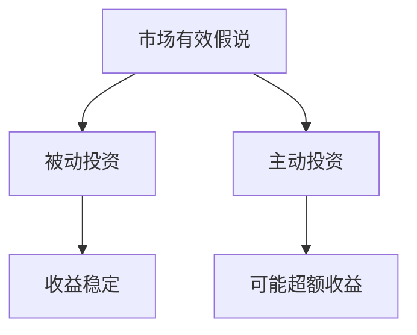

                 

# 被动投资 vs 主动投资：哪种策略更适合当前市场

## 关键词：被动投资，主动投资，市场有效假说，指数基金，风险管理，投资策略

## 摘要：本文详细分析被动投资和主动投资的优缺点，比较它们在当前市场环境下的适用性，帮助投资者选择适合自己的策略。通过理论分析和实际案例，探讨被动投资的低成本和风险分散优势，以及主动投资的灵活和高收益潜力，最终得出在当前市场环境下，被动投资更适合大多数投资者的结论。

---

# 第1章: 投资策略的基本概念

## 1.1 投资的定义与分类

### 1.1.1 投资的定义与分类

- **投资**是指将资金投入特定资产或项目，以期望获得未来收益的行为。
- 分类：股票、债券、房地产、黄金等。

## 1.2 被动投资与主动投资的定义

### 1.2.1 被动投资的定义与特点

- **被动投资**：遵循市场有效假说，通过跟踪指数来获得市场平均收益。
- 特点：低成本、低风险、长期稳定。

### 1.2.2 主动投资的定义与特点

- **主动投资**：通过基本面分析和技术分析，选择个股或行业，追求超额收益。
- 特点：高成本、高风险、灵活性强。

---

# 第2章: 被动投资的核心原理

## 2.1 被动投资的理论基础

### 2.1.1 市场有效假说

- **有效市场假说**：市场价格反映所有可获取信息，无法通过分析获得超额收益。
- 对比图：市场有效假说下，被动投资与主动投资的收益对比。

### 2.1.2 指数投资的逻辑

- 指数基金跟踪市场指数，如标普500，分散投资降低风险。

### 2.1.3 被动投资的成本优势

- 低管理费和交易成本，长期累积收益显著。

## 2.2 被动投资的主要工具

### 2.2.1 指数基金

- 定义：投资于特定指数的基金，费用低，风险分散。

### 2.2.2 交易所交易基金（ETF）

- 特点：可以在交易所买卖，流动性高。

### 2.2.3 定期定额投资策略

- 分散投资，降低市场波动影响。

---

# 第3章: 主动投资的核心原理

## 3.1 主动投资的理论基础

### 3.1.1 基本分析与技术分析

- 基本分析：研究公司基本面，如财务报表。
- 技术分析：通过价格和成交量预测未来走势。

### 3.1.2 主动管理的逻辑

- 寻找被低估或高成长的股票，追求超额收益。

## 3.2 主动投资的主要策略

### 3.2.1 价值投资

- 寻找低估股票，长期持有。

### 3.2.2 成长投资

- 投资高成长性公司，预期未来收益。

### 3.2.3 技术分析驱动的投资策略

- 利用图表模式预测价格走势。

---

# 第4章: 被动投资与主动投资的优劣势对比

## 4.1 被动投资的优劣势

### 4.1.1 成本低的优势

- 低管理费和交易成本。

### 4.1.2 风险分散的特点

- 投资多样化，降低特定资产风险。

### 4.1.3 无法跑赢市场的劣势

- 受限于市场平均收益。

## 4.2 主动投资的优劣势

### 4.2.1 有机会跑赢市场的优势

- 通过精选个股获得超额收益。

### 4.2.2 高成本的劣势

- 管理费和交易费较高。

### 4.2.3 需要专业管理的复杂性

- 需要专业知识和时间。

---

# 第5章: 被动投资与主动投资的适用场景

## 5.1 被动投资的适用场景

### 5.1.1 长期投资

- 长期持有，获得市场平均收益。

### 5.1.2 市场有效性较高的环境

- 有效市场中，被动投资收益稳定。

### 5.1.3 低风险偏好的投资者

- 保守型投资者适合被动投资。

## 5.2 主动投资的适用场景

### 5.2.1 短期投资机会

- 短期市场波动中，主动投资可能获利。

### 5.2.2 市场无效性较高的环境

- 无效市场中，主动投资有机会。

### 5.2.3 高风险承受能力的投资者

- 高风险偏好者适合主动投资。

---

# 第6章: 当前市场环境下的策略选择

## 6.1 当前市场环境的分析

### 6.1.1 全球经济形势

- 疫情后经济复苏，市场波动大。

### 6.1.2 市场波动性分析

- 近期市场波动性较高，被动投资更稳定。

### 6.1.3 利率与货币政策的影响

- 低利率环境下，被动投资收益较低。

## 6.2 被动投资与主动投资的策略比较

### 6.2.1 被动投资的可行性

- 适合长期投资者，风险低。

### 6.2.2 主动投资的机会

- 短期市场波动中可能获利，但风险高。

---

# 图表

## 市场有效假说下被动投资与主动投资的收益对比

## 主动投资与被动投资的成本收益对比

---

# 作者：AI天才研究院 & 禅与计算机程序设计艺术

通过本文的分析，读者可以了解被动投资和主动投资的优缺点，并根据当前市场环境和个人风险偏好选择合适的策略。被动投资在市场有效性高、风险偏好低的情况下更为适合，而主动投资则在市场无效性和短期波动中可能带来超额收益，但需要较高的专业性和风险承受能力。最终，投资者应根据自身情况，合理配置投资策略，分散风险，实现长期稳健的收益。

--- 

**（本文完）**

