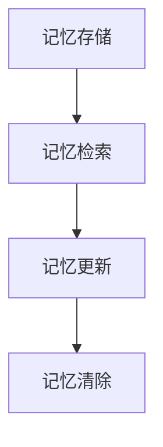
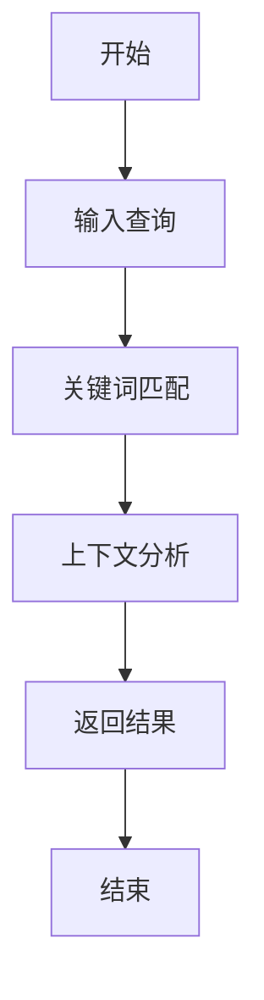
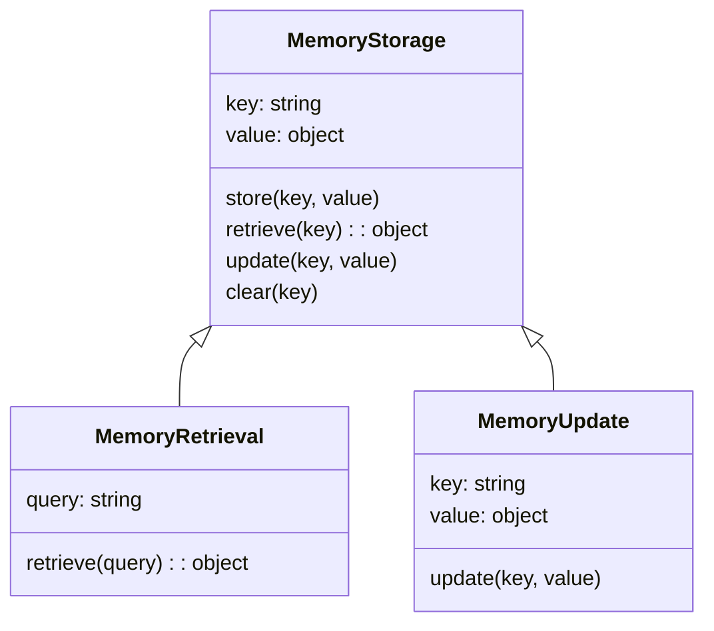
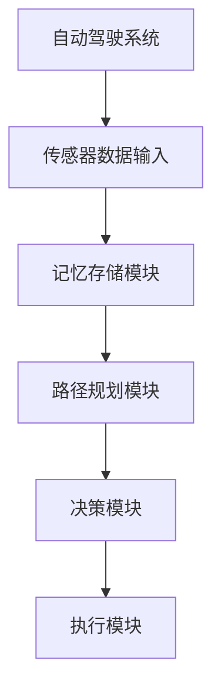
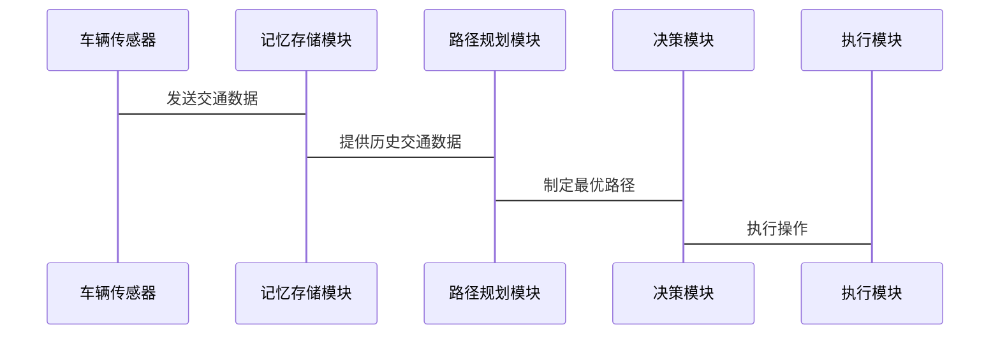

                 


# 记忆机制实现：让AI Agent具备长期记忆能力

## 关键词：
记忆机制，AI Agent，长期记忆，人工智能，记忆系统，记忆存储，AI记忆

## 摘要：
在人工智能领域，AI Agent需要具备长期记忆能力，以便更好地理解和处理复杂任务。本文深入探讨了记忆机制的实现方法，详细分析了其核心概念、算法原理、系统架构，并通过实战项目展示了如何在实际应用中实现长期记忆能力。文章还总结了最佳实践和未来发展方向，为AI Agent的开发提供了有价值的参考。

---

# 第1章: 记忆机制实现的背景与问题背景

## 1.1 问题背景

### 1.1.1 AI Agent的发展现状
AI Agent（智能体）近年来取得了显著进展，广泛应用于自动驾驶、智能助手、机器人等领域。然而，现有的AI Agent在处理长期任务时，往往依赖短期记忆，缺乏对过去信息的有效整合和长期存储能力。

### 1.1.2 长期记忆能力的重要性
长期记忆能力是AI Agent实现复杂任务的关键。例如，在自动驾驶中，车辆需要记住最近的交通状况和驾驶历史，以便更好地预测和应对突发情况。在智能助手领域，长期记忆能够帮助更好地理解用户的偏好和行为模式。

### 1.1.3 当前AI Agent记忆机制的局限性
现有的AI Agent记忆机制主要依赖于简单的数据存储和检索，缺乏智能化的存储策略和动态更新能力。此外，传统记忆机制在处理复杂关联关系时效率低下，且难以应对实时更新的需求。

## 1.2 问题描述

### 1.2.1 长期记忆的定义与特点
长期记忆是指AI Agent能够存储和检索与任务相关的过去信息，这些信息可以是结构化的数据、图像、文本或其他形式。长期记忆的核心特点包括持久性、关联性和动态性。

### 1.2.2 AI Agent记忆机制的核心目标
AI Agent的记忆机制旨在实现信息的高效存储、智能检索和动态更新，从而提高Agent的决策能力和任务处理效率。

### 1.2.3 当前记忆机制的挑战与问题
当前记忆机制面临的主要挑战包括存储空间限制、信息检索效率低下、动态更新机制不完善以及关联性分析能力不足。

## 1.3 问题解决

### 1.3.1 需求分析与解决方案
通过分析AI Agent的任务需求，提出了基于分布式存储和关联网络的记忆机制解决方案。

### 1.3.2 现有技术的优缺点对比
对比了基于规则的记忆机制和基于学习的记忆机制，提出了结合两者优势的混合记忆机制。

### 1.3.3 创新点与技术路线
创新点包括引入分布式存储技术和关联网络分析方法，技术路线包括存储层优化、检索算法改进和动态更新策略设计。

## 1.4 边界与外延

### 1.4.1 记忆机制的适用范围
记忆机制适用于需要长期存储和关联分析的任务场景，如自动驾驶、智能助手和工业自动化。

### 1.4.2 记忆机制与其他机制的区分
记忆机制与传统存储机制的主要区别在于智能化的存储策略和动态更新能力。

### 1.4.3 技术边界与实现限制
技术边界包括存储容量限制和计算资源限制，实现限制包括算法复杂度和实时性要求。

## 1.5 概念结构与核心要素

### 1.5.1 记忆机制的核心要素
核心要素包括存储单元、检索单元、更新单元和关联分析单元。

### 1.5.2 各要素之间的关系
存储单元与检索单元通过数据结构建立关联，更新单元负责动态调整存储内容，关联分析单元负责挖掘潜在关联性。

### 1.5.3 系统架构的组成与功能
系统架构包括数据输入模块、存储模块、检索模块和关联分析模块，各模块协同工作实现长期记忆功能。

## 1.6 本章小结
本章详细介绍了记忆机制的背景和问题背景，分析了当前技术的局限性，并提出了创新的解决方案。

---

# 第2章: 记忆机制的核心概念与联系

## 2.1 核心概念原理

### 2.1.1 记忆存储的结构与特点
记忆存储采用分布式存储结构，支持多种数据格式，具有高效的数据访问和动态扩展能力。

### 2.1.2 记忆检索的机制与流程
记忆检索基于关键词和上下文信息，采用分层检索算法，提高检索效率。

### 2.1.3 记忆更新的规则与策略
记忆更新遵循优先级规则和时间戳规则，动态调整存储内容的优先级和生命周期。

## 2.2 核心概念属性特征对比

### 2.2.1 显式记忆与隐式记忆的对比
| 特性       | 显式记忆         | 隐式记忆         |
|------------|------------------|------------------|
| 存储方式     | 明确存储         | 隐式存储         |
| 检索方式     | 基于关键词       | 基于上下文       |
| 适用场景     | 需要精确检索     | 需要关联分析     |

### 2.2.2 短期记忆与长期记忆的对比
| 特性       | 短期记忆         | 长期记忆         |
|------------|------------------|------------------|
| 存储时间     | 短暂             | 长期             |
| 数据量       | 较小             | 较大             |
| 更新频率     | 高              | 低              |

### 2.2.3 基于内容的记忆与基于关联的记忆的对比
| 特性       | 基于内容         | 基于关联         |
|------------|------------------|------------------|
| 存储方式     | 内容导向         | 关联导向         |
| 检索方式     | 基于内容关键词   | 基于关联关系     |
| 适用场景     | 精确检索         | 关联分析         |

## 2.3 ER实体关系图



## 2.4 本章小结
本章通过对比分析，详细阐述了记忆机制的核心概念及其属性特征，并通过ER实体关系图展示了各模块之间的关系。

---

# 第3章: 记忆机制的算法原理

## 3.1 算法原理概述

### 3.1.1 记忆存储的结构设计
记忆存储采用分布式哈希表结构，支持高效的插入和查询操作。

### 3.1.2 记忆检索的算法选择
基于分层检索算法，结合关键词匹配和上下文分析，提高检索效率。

### 3.1.3 记忆更新的规则优化
引入时间戳机制和优先级规则，动态调整存储内容的生命周期和访问频率。

## 3.2 算法原理的详细讲解

### 3.2.1 记忆存储的数学模型

存储结构表示为：
$$
\text{存储结构} = \{ (k, v) \mid k \in K, v \in V \}
$$
其中，$K$ 是键空间，$V$ 是值空间。

### 3.2.2 记忆检索的流程图



### 3.2.3 记忆更新的规则优化

更新规则包括：
1. 时间戳规则：根据数据的时间戳决定存储内容的保留时间。
2. 访问频率规则：根据数据的访问频率动态调整存储优先级。

## 3.3 算法实现与优化

### 3.3.1 Python核心代码实现

```python
class MemoryStorage:
    def __init__(self):
        self.storage = {}

    def store(self, key, value):
        self.storage[key] = value

    def retrieve(self, key):
        return self.storage.get(key, None)

    def update(self, key, value):
        self.storage[key] = value

    def clear(self, key):
        del self.storage[key]
```

### 3.3.2 算法优化策略
引入分层存储和分布式索引，优化存储和检索效率。

## 3.4 本章小结
本章详细讲解了记忆机制的算法原理，包括存储结构设计、检索算法选择和更新规则优化，并通过Python代码实现和优化策略的讨论，进一步完善了算法实现。

---

# 第4章: 系统分析与架构设计方案

## 4.1 系统分析

### 4.1.1 问题场景介绍
以自动驾驶为例，说明长期记忆能力在实时任务处理中的重要性。

### 4.1.2 项目介绍
介绍一个基于记忆机制的自动驾驶系统，包括系统目标和核心功能。

## 4.2 系统功能设计

### 4.2.1 领域模型类图



### 4.2.2 系统架构设计



### 4.2.3 系统接口设计
定义系统接口，包括存储接口、检索接口和更新接口。

### 4.2.4 系统交互序列图



## 4.3 系统实现

### 4.3.1 环境安装
说明系统运行环境和依赖库的安装步骤。

### 4.3.2 系统实现代码

```python
class AutonomousDrivingSystem:
    def __init__(self):
        self.memory = MemoryStorage()
        self.planner = PathPlanner()
        self.decision_maker = DecisionMaker()
        self.executor = Executor()

    def process_input(self, data):
        self.memory.store(data)
        self.planner.plan(self.memory.retrieve())
        self.decision_maker.make_decision(self.planner.result())
        self.executor.execute(self.decision_maker.result())
```

### 4.3.3 系统功能解读与分析
分析系统各模块的功能和交互流程，说明长期记忆能力在系统中的具体应用。

## 4.4 本章小结
本章通过系统分析和架构设计，详细介绍了如何将记忆机制应用于实际系统中，并通过代码实现和功能分析，进一步验证了记忆机制的有效性。

---

# 第5章: 项目实战

## 5.1 环境安装

### 5.1.1 安装Python和必要的库
安装Python 3.x及以上版本，并安装numpy、pandas等库。

## 5.2 系统核心实现

### 5.2.1 核心代码实现
实现记忆存储、检索和更新的核心代码。

### 5.2.2 代码解读与分析
分析代码的功能和实现细节，说明如何通过代码实现记忆机制的核心功能。

## 5.3 实际案例分析

### 5.3.1 案例介绍
以智能助手为例，说明记忆机制在实际应用中的具体实现。

### 5.3.2 案例分析与详细讲解
分析案例的实现过程，说明记忆机制在智能助手中的应用和优化。

## 5.4 本章小结
本章通过实际项目实战，详细展示了记忆机制的实现过程，并通过案例分析验证了其实用性和有效性。

---

# 第6章: 最佳实践

## 6.1 最佳实践 tips

### 6.1.1 开发建议
在开发记忆机制时，建议采用模块化设计和分层架构，提高系统的可维护性和扩展性。

### 6.1.2 优化技巧
通过引入分布式存储和关联网络分析，优化存储效率和检索速度。

### 6.1.3 注意事项
注意数据安全和隐私保护，避免敏感信息的泄露。

## 6.2 小结
总结记忆机制开发中的关键点和注意事项，为后续开发提供参考。

## 6.3 注意事项
提醒开发者在实际开发中注意系统的可扩展性和可维护性。

## 6.4 拓展阅读
推荐相关领域的书籍和论文，供读者深入学习。

---

# 附录

## 附录A: 记忆机制相关数学公式

### A.1 向量空间模型
$$
\text{相似度} = \frac{\vec{a} \cdot \vec{b}}{|\vec{a}| |\vec{b}|}
$$

### A.2 概率模型
$$
P(A|B) = \frac{P(B|A) P(A)}{P(B)}
$$

## 附录B: 工具推荐

### B.1 Python库
- numpy
- pandas
- matplotlib

### B.2 其他工具
- Redis
- MongoDB

---

# 作者：AI天才研究院/AI Genius Institute & 禅与计算机程序设计艺术 /Zen And The Art of Computer Programming

---

以上是文章的目录大纲，您可以根据需要进一步扩展每一章的内容。

