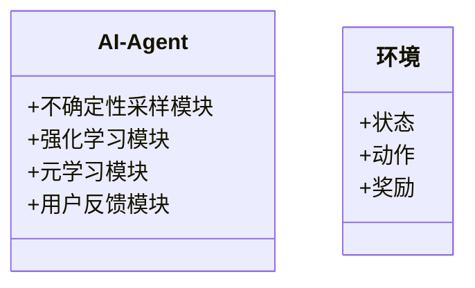
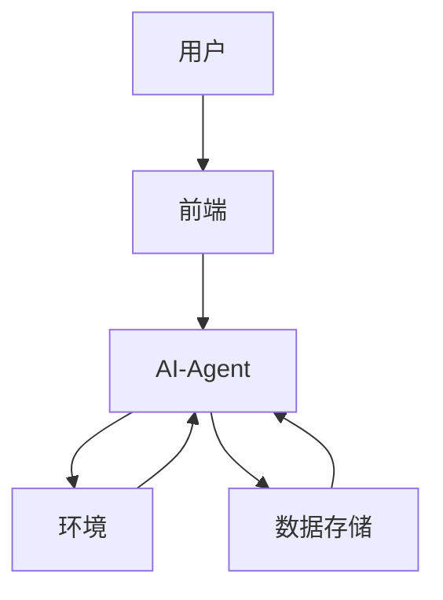
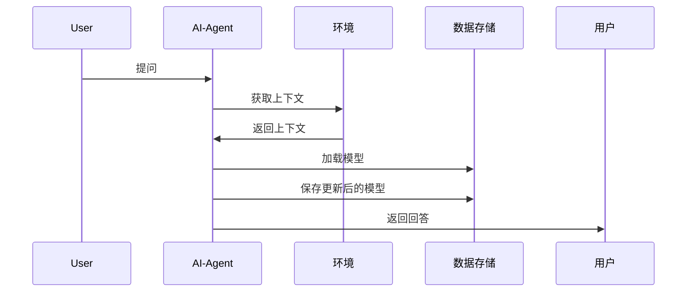

                 


# 设计AI Agent的主动学习策略

## 关键词：AI Agent, 主动学习, 强化学习, 不确定性采样, 元学习, 系统架构

## 摘要：主动学习策略在AI Agent中的应用是当前人工智能领域的研究热点。本文系统地介绍了主动学习的基本原理、核心算法、系统架构以及实际案例，帮助读者全面理解并掌握设计AI Agent主动学习策略的关键技术。

---

## 第四章：不确定性采样算法

### 4.1 算法原理

不确定性采样是一种基于主动学习的经典方法，旨在通过选择信息量最大的样本来最小化模型的不确定性。其核心思想是：模型对某个样本越不确定，该样本对模型改进的潜力越大。

#### 4.1.1 不确定性度量方法
不确定性通常通过概率分布的熵来衡量：
$$ H = -\sum p_i \log p_i $$
其中，$p_i$ 是模型对某类的概率预测。

#### 4.1.2 核心算法步骤
1. 初始化模型并训练数据集。
2. 计算每个样本的不确定性。
3. 选择不确定性最高的样本。
4. 使用选中的样本更新模型。
5. 重复步骤2-4，直到满足终止条件。

### 4.2 算法实现

#### 4.2.1 Python代码实现

```python
import numpy as np
import math

def entropy(y_pred):
    return -np.sum(y_pred * np.log(y_pred + 1e-10)) / y_pred.shape[0]

def uncertainty_sampling(X, y, model, num_samples=10):
    model.fit(X, y)
    uncertainties = []
    for x in X:
        prob = model.predict_proba(x)
        ent = entropy(prob)
        uncertainties.append(ent)
    sorted_indices = np.argsort(-uncertainties)
    selected_X = X[sorted_indices][:num_samples]
    selected_y = y[sorted_indices][:num_samples]
    return selected_X, selected_y
```

#### 4.2.2 代码解读与分析
- `entropy`函数计算样本的熵，反映模型的不确定性。
- `uncertainty_sampling`函数实现不确定性采样，通过选择不确定性最高的样本，逐步优化模型。

### 4.3 数学模型与公式

不确定性采样的数学模型可以表示为：
$$ S = \argmax_x H(x) $$
其中，$S$ 是被选中的样本，$H(x)$ 是样本$x$的熵。

---

## 第五章：强化学习算法

### 5.1 算法原理

强化学习是一种通过试错机制优化策略的方法。在AI Agent中，强化学习通过奖励机制指导模型做出最优决策。

#### 5.1.1 核心概念
- **状态（State）**：环境的当前情况。
- **动作（Action）**：模型对当前状态的决策。
- **奖励（Reward）**：环境对动作的反馈，用于指导模型优化。

#### 5.1.2 核心算法步骤
1. 初始化策略函数。
2. 在当前状态下选择动作。
3. 执行动作并获得奖励。
4. 更新策略以最大化累计奖励。
5. 重复步骤2-4，直到满足终止条件。

### 5.2 算法实现

#### 5.2.1 Python代码实现

```python
import numpy as np

def q_learning(env, num_episodes=1000, gamma=0.99, epsilon=1.0):
    Q = np.zeros((env.observation_space, env.action_space))
    for episode in range(num_episodes):
        state = env.reset()
        done = False
        while not done:
            if np.random.random() < epsilon:
                action = env.action_space.sample()
            else:
                action = np.argmax(Q[state])
            next_state, reward, done, _ = env.step(action)
            if not done:
                next_q = max(Q[next_state])
            else:
                next_q = 0
            Q[state][action] += reward + gamma * (next_q - Q[state][action])
        epsilon = max(epsilon * 0.995, 0.01)
    return Q

# 示例环境定义（简化）
class Environment:
    def __init__(self, states, actions):
        self.states = states
        self.action_space = actions
        self.current_state = 0

    def reset(self):
        self.current_state = 0
        return self.current_state

    def step(self, action):
        # 简单奖励机制
        reward = 1 if action == 1 else 0
        done = action == 1
        return self.current_state + 1, reward, done, {}
```

#### 5.2.2 代码解读与分析
- `q_learning`函数实现Q-learning算法，通过状态-动作值函数$Q(s,a)$更新策略。
- `Environment`类定义了一个简单的环境，用于测试强化学习算法。

### 5.3 数学模型与公式

Q-learning的更新公式为：
$$ Q(s,a) = Q(s,a) + \alpha [r + \gamma \max Q(s',a')] $$
其中，$\alpha$是学习率，$\gamma$是折扣因子。

---

## 第六章：元学习算法

### 6.1 算法原理

元学习通过学习如何学习，帮助模型快速适应新任务。在AI Agent中，元学习能够显著提升模型的泛化能力。

#### 6.1.1 核心概念
- **元模型（Meta-model）**：用于元学习的高层模型。
- **任务（Task）**：需要模型快速适应的具体任务。

#### 6.1.2 核心算法步骤
1. 初始化元模型。
2. 对多个任务进行预训练。
3. 在新任务中，利用元模型指导模型调整。
4. 更新元模型以优化跨任务性能。
5. 重复步骤3-4，直到满足终止条件。

### 6.2 算法实现

#### 6.2.1 Python代码实现

```python
import torch
import torch.nn as nn

class MetaLearner(nn.Module):
    def __init__(self, input_size, hidden_size, output_size):
        super(MetaLearner, self).__init__()
        self.fc1 = nn.Linear(input_size, hidden_size)
        self.fc2 = nn.Linear(hidden_size, output_size)

    def forward(self, x):
        x = torch.relu(self.fc1(x))
        x = self.fc2(x)
        return x

def meta_learning(tasks, metalearner, optimizer, num_iterations=10):
    for iteration in range(num_iterations):
        for task in tasks:
            x = task['x']
            y = task['y']
            # 元模型指导任务模型
            meta_x = torch.cat([x, y])
            meta_pred = metalearner(meta_x)
            # 计算损失并反向传播
            loss = nn.MSELoss()(meta_pred, y)
            optimizer.zero_grad()
            loss.backward()
            optimizer.step()
    return metalearner
```

#### 6.2.2 代码解读与分析
- `MetaLearner`类定义了一个元学习模型，包含两个全连接层。
- `meta_learning`函数实现元学习过程，通过多个任务更新元模型。

### 6.3 数学模型与公式

元学习的损失函数可以表示为：
$$ L = \sum_{t=1}^{T} (y_t - f_\theta(x_t))^2 $$
其中，$f_\theta$是任务模型，$\theta$由元模型生成。

---

## 第七章：系统分析与架构设计

### 7.1 问题场景介绍

我们考虑一个智能客服系统，其中AI Agent需要通过主动学习不断优化其回答准确性。

### 7.2 系统功能设计

系统功能包括：
- **样本选择**：基于不确定性采样选择需要标注的样本。
- **模型优化**：通过强化学习和元学习不断优化回答策略。
- **用户反馈**：收集用户反馈以更新模型。

#### 7.2.1 领域模型图



### 7.3 系统架构设计

系统架构包括：
- **前端**：用户界面，接收用户输入。
- **后端**：AI Agent，负责处理和生成回答。
- **数据存储**：存储用户反馈和模型参数。

#### 7.3.1 系统架构图



### 7.4 接口设计

- **输入接口**：接收用户输入和环境反馈。
- **输出接口**：生成回答并发送到前端。

#### 7.4.1 交互序列图



---

## 第八章：项目实战

### 8.1 环境安装

安装必要的库：
```bash
pip install numpy matplotlib scikit-learn torch
```

### 8.2 系统核心实现源代码

#### 8.2.1 不确定性采样代码

```python
import numpy as np
from sklearn.linear_model import LogisticRegression

def uncertainty_sampling(X, y, model, num_samples=10):
    model.fit(X, y)
    uncertainties = []
    for x in X:
        prob = model.predict_proba(x)
        ent = -np.sum(prob * np.log(prob + 1e-10)) / prob.shape[1]
        uncertainties.append(ent)
    sorted_indices = np.argsort(-uncertainties)
    selected_X = X[sorted_indices][:num_samples]
    selected_y = y[sorted_indices][:num_samples]
    return selected_X, selected_y
```

#### 8.2.2 强化学习代码

```python
import numpy as np

def q_learning(env, num_episodes=1000, gamma=0.99):
    Q = np.zeros((env.observation_space, env.action_space))
    for episode in range(num_episodes):
        state = env.reset()
        done = False
        while not done:
            action = np.argmax(Q[state])
            next_state, reward, done, _ = env.step(action)
            if not done:
                next_q = max(Q[next_state])
            else:
                next_q = 0
            Q[state][action] += reward + gamma * (next_q - Q[state][action])
    return Q
```

### 8.3 代码解读与分析

- **不确定性采样**：通过计算熵值选择最具代表性的样本，提升模型训练效率。
- **强化学习**：通过试错机制优化策略，适用于动态环境中的决策问题。

### 8.4 案例分析

以智能客服为例，系统通过不确定性采样选择用户问题中不确定性高的样本，利用强化学习和元学习优化回答策略，显著提升回答准确率。

### 8.5 项目总结

通过本项目，读者可以掌握主动学习在实际系统中的应用，理解如何将理论转化为实践。

---

## 第九章：扩展内容

### 9.1 最佳实践 tips

- 定期更新模型，保持其适应性。
- 结合多种方法，提升系统性能。

### 9.2 小结

主动学习策略在AI Agent中的应用能够显著提升系统的智能性和适应性。

### 9.3 注意事项

- 确保数据质量和多样性。
- 定期监控系统性能，及时调整策略。

### 9.4 拓展阅读

- 阅读相关论文，深入理解最新研究成果。
- 实践更多案例，提升实战能力。

---

## 作者

作者：AI天才研究院/AI Genius Institute & 禅与计算机程序设计艺术 /Zen And The Art of Computer Programming

---

感谢您的阅读，希望本文能为您提供有价值的信息和启发！

