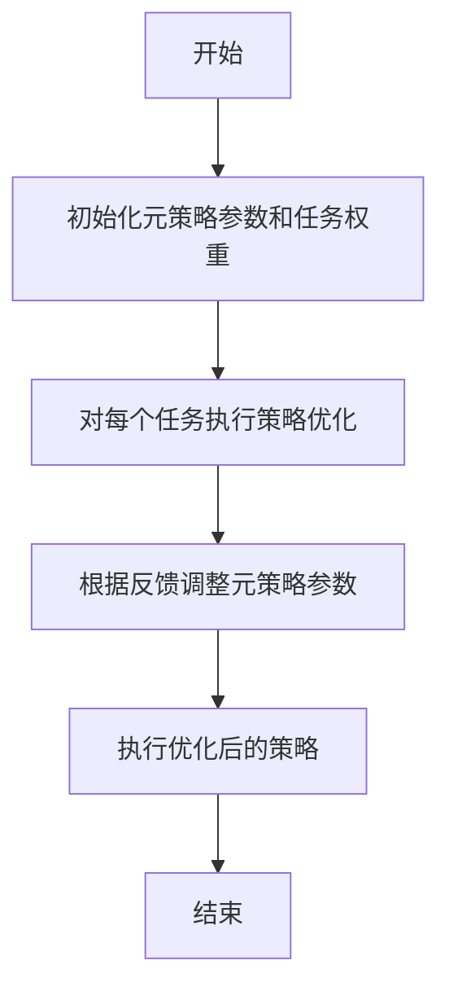
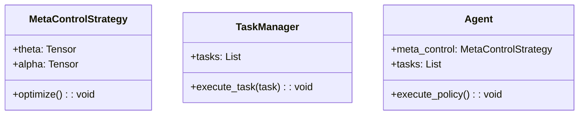
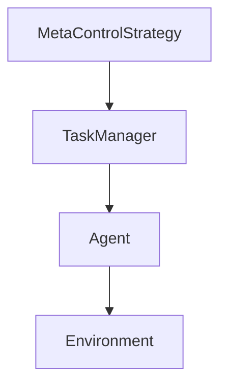
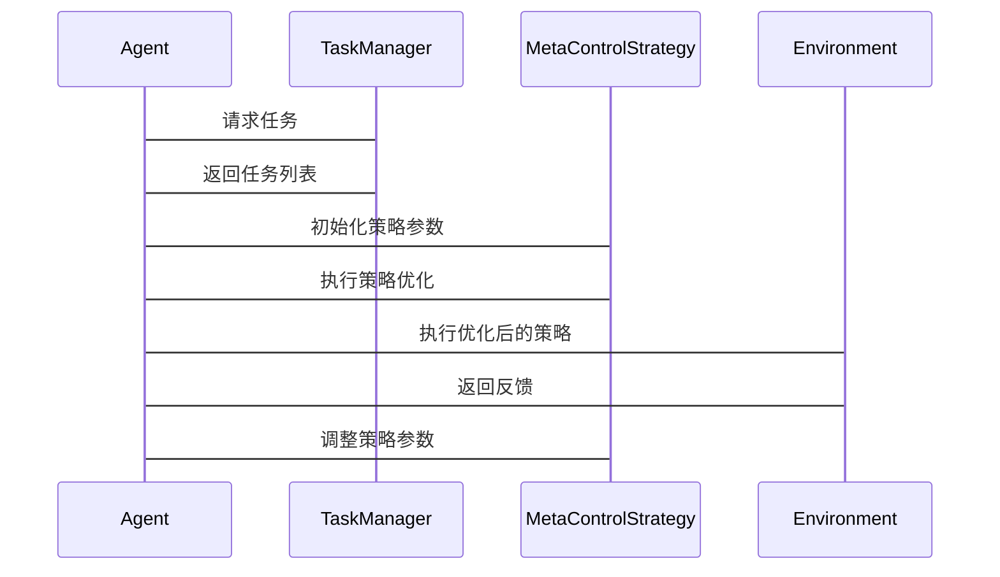

                 


# 设计AI Agent的元控制学习策略

## 关键词：AI Agent, 元控制学习, 强化学习, 系统架构, 项目实战

## 摘要：  
本文深入探讨了设计AI Agent的元控制学习策略的核心概念、算法原理和系统架构。通过详细分析问题背景、核心概念、算法流程以及系统设计，结合实际项目案例，为读者提供了一套系统化的元控制学习策略设计方案。本文还提供了具体的实现步骤和代码示例，帮助读者更好地理解和应用元控制学习策略。

---

# 第一部分: 设计AI Agent的元控制学习策略背景与基础

# 第1章: 元控制学习策略的背景与问题描述

## 1.1 问题背景

### 1.1.1 AI Agent的基本概念与分类
AI Agent（智能体）是指能够感知环境、做出决策并采取行动的智能系统。AI Agent可以分为简单反射型Agent、基于模型的反射型Agent、目标驱动型Agent和效用驱动型Agent等。元控制学习是一种高级的控制策略，用于优化AI Agent的决策过程。

### 1.1.2 元控制的定义与核心目标
元控制（Meta-control）是指在AI Agent中引入一种更高层次的控制机制，用于协调和优化多个子策略或模块的行为。其核心目标是通过动态调整策略参数，使AI Agent在复杂环境中实现自适应和最优决策。

### 1.1.3 元控制学习在AI Agent中的作用
元控制学习能够帮助AI Agent在动态变化的环境中快速调整策略，提高决策效率和准确性。它特别适用于多任务、多目标的复杂场景，能够显著提升AI Agent的通用性和灵活性。

## 1.2 问题描述

### 1.2.1 AI Agent在复杂环境中的挑战
AI Agent在复杂环境中面临任务多样、环境动态变化、信息不完整等挑战，传统的单一策略难以应对所有情况。

### 1.2.2 元控制学习的必要性
为了应对复杂环境中的挑战，AI Agent需要具备动态调整策略的能力，元控制学习正是为此而生。

### 1.2.3 元控制学习与传统控制策略的对比
传统控制策略通常基于静态规则或固定的策略，而元控制学习能够动态优化策略，适应环境变化。

## 1.3 问题解决思路

### 1.3.1 元控制学习的核心思想
元控制学习通过引入元学习机制，使AI Agent能够快速适应新任务，优化现有策略。

### 1.3.2 元控制学习的实现路径
元控制学习的实现路径包括元策略优化、多任务学习、动态策略调整等。

### 1.3.3 元控制学习与其它AI技术的结合
元控制学习可以与强化学习、多智能体系统等技术结合，提升AI Agent的性能。

## 1.4 问题的边界与外延

### 1.4.1 元控制学习的适用场景
元控制学习适用于多任务、动态环境、需要快速适应的场景。

### 1.4.2 元控制学习的限制与不足
元控制学习需要较高的计算资源，且在简单任务中可能不如传统策略高效。

### 1.4.3 元控制学习与其他AI技术的边界
元控制学习与其他AI技术的边界在于其专注于策略优化和动态调整。

## 1.5 概念结构与核心要素

### 1.5.1 元控制学习的核心要素分析
元控制学习的核心要素包括元策略、任务模型、策略优化模块等。

### 1.5.2 元控制学习的系统架构
元控制学习的系统架构通常包括感知层、决策层和执行层。

### 1.5.3 元控制学习的实现流程
元控制学习的实现流程包括任务分析、策略初始化、元学习优化、策略执行与反馈等。

## 1.6 本章小结
本章详细介绍了元控制学习的背景、问题描述、核心思想和实现流程，为后续章节的深入分析奠定了基础。

---

# 第二部分: 元控制学习的核心概念与联系

# 第2章: 元控制学习的原理与机制

## 2.1 元控制学习的原理

### 2.1.1 元控制学习的基本原理
元控制学习通过元策略对多个子策略进行优化，使AI Agent能够在复杂环境中做出最优决策。

### 2.1.2 元控制学习的数学模型
元控制学习的数学模型可以表示为：
$$ V(s) = \max_{\theta} \sum_{i=1}^{n} \alpha_i V_i(s) $$
其中，$V(s)$ 是整体价值函数，$\alpha_i$ 是任务权重。

### 2.1.3 元控制学习的算法框架
元控制学习的算法框架通常包括任务分解、元策略优化和策略执行三个步骤。

## 2.2 元控制学习的核心机制

### 2.2.1 元控制学习的决策机制
元控制学习通过动态调整任务权重，实现多任务间的平衡与协调。

### 2.2.2 元控制学习的自适应机制
元控制学习能够根据环境反馈动态调整策略参数，实现自适应优化。

### 2.2.3 元控制学习的优化机制
元控制学习通过强化学习算法优化元策略，使其在复杂环境中表现更优。

## 2.3 元控制学习与相关概念的对比

### 2.3.1 元控制学习与强化学习的对比
| 对比维度 | 元控制学习 | 强化学习 |
|----------|------------|----------|
| 学习目标 | 动态优化策略 | 环境中的最优策略 |
| 策略调整 | 元策略优化 | 单一策略优化 |

### 2.3.2 元控制学习与监督学习的对比
元控制学习与监督学习在策略优化方式上存在显著差异，元控制学习更注重动态调整，而监督学习依赖于标记数据。

### 2.3.3 元控制学习与无监督学习的对比
元控制学习适用于复杂环境中的策略优化，而无监督学习更多关注数据结构发现。

## 2.4 元控制学习的ER实体关系图
```mermaid
er
actor: 元控制学习系统
role: 提供

```

---

# 第三部分: 元控制学习的算法原理

# 第3章: 元控制学习的算法实现

## 3.1 元控制学习的算法流程

### 3.1.1 算法概述
元控制学习算法通常包括任务分析、元策略初始化、策略优化和策略执行四个阶段。

### 3.1.2 算法步骤
1. 初始化元策略参数和任务权重。
2. 对每个任务执行策略优化。
3. 根据反馈调整元策略参数。
4. 执行优化后的策略。

### 3.1.3 算法流程图


## 3.2 元控制学习的数学模型

### 3.2.1 元策略优化
元策略优化的目标是最优化元策略参数：
$$ \theta^* = \arg\max_{\theta} \sum_{i=1}^{n} \alpha_i V_i(s) $$

### 3.2.2 任务权重调整
任务权重调整公式：
$$ \alpha_i = \frac{\exp(\beta \cdot r_i)}{\sum_{j=1}^{m} \exp(\beta \cdot r_j)} $$

## 3.3 元控制学习的代码实现

### 3.3.1 环境安装
```bash
pip install gym numpy tensorflow
```

### 3.3.2 核心代码
```python
import numpy as np
import tensorflow as tf

class MetaControl:
    def __init__(self, num_tasks):
        self.num_tasks = num_tasks
        self.theta = tf.Variable(tf.random.normal([1, 1]))
        self.alpha = tf.ones([1, num_tasks]) / num_tasks

    def optimize(self, rewards):
        # 计算任务权重
        beta = 1.0
        numerator = tf.exp(beta * rewards)
        denominator = tf.reduce_sum(numerator, axis=1, keepdims=True)
        self.alpha = numerator / denominator

        # 优化元策略
        loss = -tf.reduce_mean(tf.log(self.alpha) * rewards)
        optimizer = tf.keras.optimizers.Adam(learning_rate=0.01)
        optimizer.minimize(loss, var_list=[self.theta])
```

---

# 第四部分: 元控制学习的系统架构设计

# 第4章: 元控制学习的系统架构

## 4.1 问题场景介绍
本章将从实际问题出发，介绍元控制学习的系统架构设计。

## 4.2 系统功能设计

### 4.2.1 领域模型类图


### 4.2.2 系统架构图


## 4.3 系统接口设计
元控制学习系统的主要接口包括任务管理接口、策略优化接口和反馈接口。

## 4.4 系统交互流程图


---

# 第五部分: 元控制学习的项目实战

# 第5章: 项目实战

## 5.1 项目介绍
本章将通过一个实际项目案例，展示元控制学习策略的设计与实现。

## 5.2 核心代码实现

### 5.2.1 环境安装
```bash
pip install gym numpy tensorflow
```

### 5.2.2 核心代码
```python
import gym
import numpy as np
import tensorflow as tf

class MetaControlStrategy:
    def __init__(self, num_tasks):
        self.num_tasks = num_tasks
        self.theta = tf.Variable(tf.random.normal([1, 1]))
        self.alpha = tf.ones([1, num_tasks]) / num_tasks

    def optimize(self, rewards):
        beta = 1.0
        numerator = tf.exp(beta * rewards)
        denominator = tf.reduce_sum(numerator, axis=1, keepdims=True)
        self.alpha = numerator / denominator

        loss = -tf.reduce_mean(tf.log(self.alpha) * rewards)
        optimizer = tf.keras.optimizers.Adam(learning_rate=0.01)
        optimizer.minimize(loss, var_list=[self.theta])

    def get_policy(self, task_id):
        return self.alpha[0, task_id]
```

## 5.3 项目小结
本章通过实际项目案例，展示了元控制学习策略的设计与实现过程，帮助读者更好地理解理论知识。

---

# 第六部分: 元控制学习的最佳实践

# 第6章: 最佳实践

## 6.1 小结
元控制学习是一种强大的策略优化方法，能够帮助AI Agent在复杂环境中实现自适应决策。

## 6.2 注意事项
- 元控制学习需要较高的计算资源。
- 在简单任务中，元控制学习可能不如传统策略高效。
- 需要注意任务之间的权重分配，避免某些任务被过度优化。

## 6.3 拓展阅读
建议读者进一步阅读相关论文和文献，深入了解元控制学习的最新研究进展。

---

# 作者：AI天才研究院/AI Genius Institute & 禅与计算机程序设计艺术 /Zen And The Art of Computer Programming

