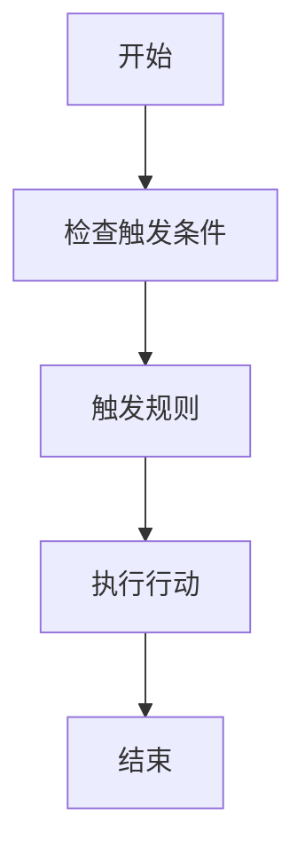
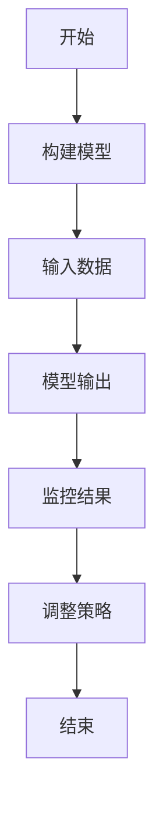
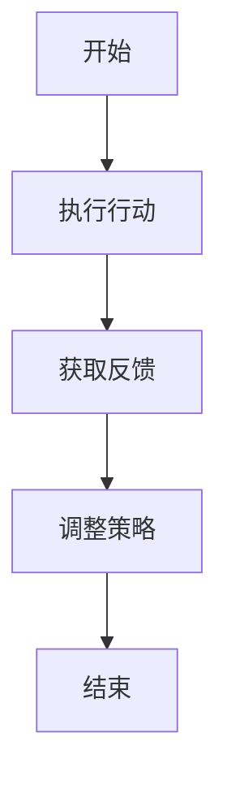
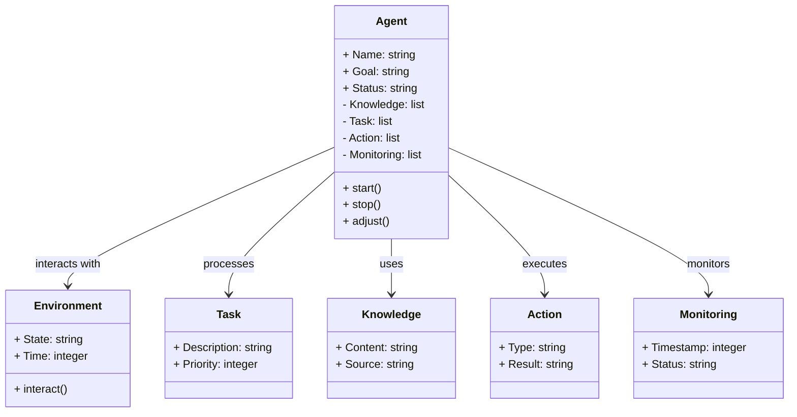
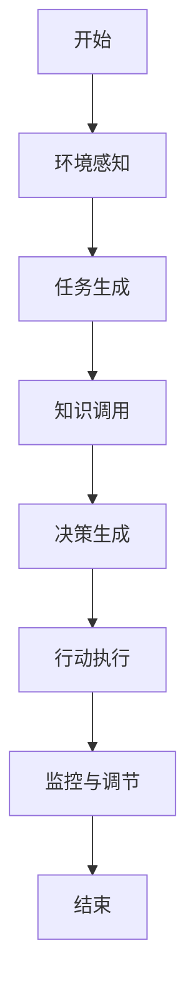
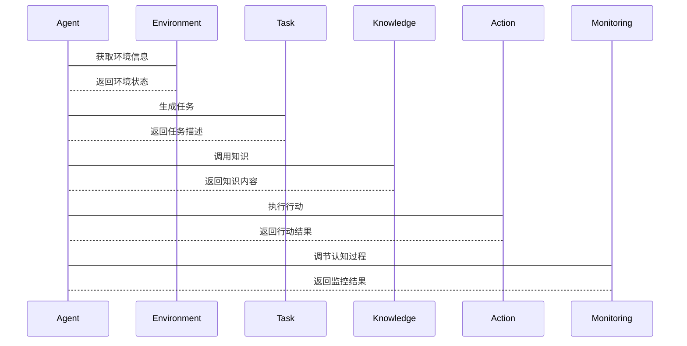

                 


# 设计AI Agent的元认知监控机制

> 关键词：AI Agent，元认知监控，算法实现，系统架构，项目实战

> 摘要：本文详细探讨了AI Agent的元认知监控机制的设计与实现，从核心概念、算法原理、系统架构到项目实战，全面分析了元认知监控机制在AI Agent中的重要性及其应用价值。文章通过理论分析与实践结合，为读者提供了一套完整的元认知监控机制设计方案。

---

## 第一部分: AI Agent与元认知监控机制的背景与概念

### 第1章: AI Agent的基本概念与元认知监控的必要性

#### 1.1 AI Agent的定义与特点

##### 1.1.1 AI Agent的定义
AI Agent（人工智能代理）是指能够感知环境、自主决策并执行任务的智能实体。它通过传感器获取信息，利用计算模型进行分析，并通过执行器与环境交互。AI Agent的核心目标是通过智能化的决策和行动，实现特定任务的目标。

##### 1.1.2 AI Agent的核心特点
1. **自主性**：AI Agent能够在没有外部干预的情况下自主决策。
2. **反应性**：能够实时感知环境并做出相应的反应。
3. **目标导向性**：所有的行为都以实现特定目标为导向。
4. **学习能力**：通过经验或数据不断优化自身的决策能力。

##### 1.1.3 AI Agent的应用场景与挑战
- **应用场景**：智能助手、自动驾驶、机器人、智能客服等。
- **挑战**：复杂环境下的决策不确定性、多目标冲突、动态环境的适应性等。

#### 1.2 元认知监控机制的定义与作用

##### 1.2.1 元认知的定义
元认知（Metacognition）是指对自身认知过程的认知，包括对思维过程的监控、评估和调节。在AI Agent中，元认知监控机制是指对AI Agent自身认知过程的监控和调节。

##### 1.2.2 元认知监控机制的定义
元认知监控机制是一种能够实时监控AI Agent的认知过程，并根据监控结果调整其认知策略和行为的机制。它能够帮助AI Agent更好地理解和管理自身的认知状态，从而提高任务执行的效率和准确性。

##### 1.2.3 元认知监控机制在AI Agent中的作用
1. **提升决策质量**：通过监控和调节认知过程，AI Agent能够做出更合理的决策。
2. **增强适应性**：在动态环境中，元认知监控机制能够帮助AI Agent快速调整策略，适应环境变化。
3. **减少错误发生**：通过实时监控，及时发现并纠正认知过程中的错误。

#### 1.3 问题背景与问题描述

##### 1.3.1 AI Agent在复杂任务中的局限性
在处理复杂任务时，AI Agent可能会因为环境的不确定性、信息的不完整性以及任务目标的多维性而导致决策失误或效率低下。

##### 1.3.2 元认知监控机制的必要性
为了克服上述问题，需要引入元认知监控机制，帮助AI Agent更好地理解和管理自身的认知过程。

##### 1.3.3 问题解决的思路与目标
通过设计和实现元认知监控机制，提升AI Agent在复杂任务中的决策能力和适应性，从而实现更高效、更准确的任务执行。

---

## 第2章: 元认知监控机制的核心概念与联系

### 2.1 元认知监控机制的核心原理

#### 2.1.1 元认知监控的层次结构
元认知监控机制可以分为三个层次：
1. **感知层**：感知环境信息，识别任务目标。
2. **认知层**：分析和处理信息，做出决策。
3. **监控层**：监控认知过程，调整决策策略。

#### 2.1.2 元认知监控的实现方式
元认知监控机制可以通过以下方式实现：
1. **基于规则的监控**：通过预定义的规则对认知过程进行监控和调节。
2. **基于模型的监控**：利用计算模型对认知过程进行建模和监控。
3. **基于反馈的监控**：通过实时反馈调整认知过程。

### 2.2 核心概念的属性特征对比

#### 2.2.1 元认知监控与其他监控机制的对比
| 对比维度 | 元认知监控 | 基于规则的监控 | 基于模型的监控 |
|----------|------------|-----------------|-----------------|
| 监控对象 | 认知过程    | 行为规则        | 计算模型        |
| 监控方式 | 实时监控    | 预定义规则      | 动态建模        |
| 适应性   | 高          | 低              | 中              |

#### 2.2.2 元认知监控机制的特征分析
1. **实时性**：能够实时监控和调整认知过程。
2. **主动性**：主动识别问题并采取行动。
3. **灵活性**：能够适应不同任务和环境的变化。

### 2.3 ER实体关系图架构

```mermaid
erd
    agent(AgentID, Name, Goal, Status)
    environment(EnvironmentID, State, Time)
    task(TaskID, Description, Priority)
    knowledge(KnowledgeID, Content, Source)
    action(ActionID, Type, Result)
    monitoring(MonitoringID, Timestamp, Status)
```

---

## 第3章: 元认知监控机制的算法实现

### 3.1 基于规则的元认知监控算法

#### 3.1.1 算法原理
基于规则的元认知监控算法通过预定义的规则对认知过程进行监控和调节。当认知过程中的某个条件被触发时，算法会根据预定义的规则采取相应的行动。

#### 3.1.2 算法实现



#### 3.1.3 算法流程图（mermaid）


#### 3.1.4 Python源代码示例

```python
def rule_based_monitoring():
    # 预定义规则
    rules = {
        'rule1': {'condition': lambda x: x > 5, 'action': 'adjust'},
        'rule2': {'condition': lambda x: x < 3, 'action': 'reset'}
    }
    # 监控过程
    state = 4
    for rule in rules.values():
        if rule['condition'](state):
            print(f"触发规则：{rule['action']}")
            # 执行相应操作
            if rule['action'] == 'adjust':
                state += 2
            elif rule['action'] == 'reset':
                state = 0
    print(f"最终状态：{state}")

rule_based_monitoring()
```

### 3.2 基于模型的元认知监控算法

#### 3.2.1 算法原理
基于模型的元认知监控算法通过对认知过程进行建模，利用模型的输出结果对认知过程进行监控和调节。

#### 3.2.2 算法实现



#### 3.2.3 算法流程图（mermaid）


#### 3.2.4 Python源代码示例

```python
import numpy as np
from sklearn import linear_model

def model_based_monitoring():
    # 构建模型
    model = linear_model.LinearRegression()
    # 输入数据
    X = np.array([[1], [2], [3], [4]])
    y = np.array([2, 4, 6, 8])
    model.fit(X, y)
    # 监控过程
    new_X = np.array([[5]])
    predicted_y = model.predict(new_X)[0]
    print(f"预测结果：{predicted_y}")
    # 调整策略
    if predicted_y > 7:
        print("调整策略：降低预测值")
        predicted_y = 7
    print(f"最终预测值：{predicted_y}")

model_based_monitoring()
```

### 3.3 基于反馈的元认知监控算法

#### 3.3.1 算法原理
基于反馈的元认知监控算法通过实时反馈调整认知过程。当收到反馈时，算法会根据反馈结果调整自身的认知策略。

#### 3.3.2 算法实现



#### 3.3.3 算法流程图（mermaid）


#### 3.3.4 Python源代码示例

```python
def feedback_based_monitoring():
    # 初始化参数
    parameter = 5
    target = 10
    # 执行行动
    action = parameter + 2
    print(f"执行行动：{action}")
    # 获取反馈
    feedback = action - target
    print(f"反馈结果：{feedback}")
    # 调整策略
    if feedback > 0:
        parameter -= 1
    elif feedback < 0:
        parameter += 1
    print(f"调整后的参数：{parameter}")

feedback_based_monitoring()
```

### 3.4 算法的数学模型与公式

#### 3.4.1 基于规则的监控模型
$$ \text{如果 } x > 5 \text{，则执行调整操作} $$

#### 3.4.2 基于模型的监控模型
$$ y = \beta_0 + \beta_1 x + \epsilon $$

#### 3.4.3 基于反馈的监控模型
$$ \text{反馈} = \text{实际值} - \text{预测值} $$

---

## 第4章: 元认知监控机制的数学模型与公式

### 4.1 元认知监控的数学模型

#### 4.1.1 损失函数
$$ L = \frac{1}{n}\sum_{i=1}^{n}(y_i - \hat{y_i})^2 $$

#### 4.1.2 优化函数
$$ \theta = \arg\min L $$

#### 4.1.3 状态转移方程
$$ s_{t+1} = f(s_t, a_t) $$

---

## 第5章: 系统分析与架构设计

### 5.1 问题场景介绍

#### 5.1.1 问题背景
在智能客服系统中，AI Agent需要通过与用户的交互，识别用户的需求并提供相应的服务。

#### 5.1.2 项目介绍
本项目旨在设计一个基于元认知监控机制的智能客服系统，通过实时监控和调节AI Agent的认知过程，提升用户体验。

### 5.2 系统功能设计

#### 5.2.1 系统功能模块
- **用户交互模块**：接收用户的输入并进行解析。
- **需求识别模块**：识别用户的需求并生成相应的任务。
- **决策模块**：根据需求生成相应的决策。
- **监控模块**：监控整个认知过程并进行调节。

#### 5.2.2 领域模型（mermaid类图）



### 5.3 系统架构设计

#### 5.3.1 系统架构图（mermaid架构图）



#### 5.3.2 接口设计
- **输入接口**：接收用户的输入并进行解析。
- **输出接口**：输出决策结果并进行反馈。

#### 5.3.3 交互流程图（mermaid序列图）



---

## 第6章: 项目实战

### 6.1 环境安装与配置

#### 6.1.1 安装依赖
- Python 3.8+
- NumPy
- Scikit-learn
- Mermaid

#### 6.1.2 安装命令
```bash
pip install numpy scikit-learn
```

### 6.2 系统核心实现

#### 6.2.1 核心代码实现

```python
import numpy as np
from sklearn import linear_model

class Agent:
    def __init__(self):
        self.knowledge = {}
        self.tasks = []
        self.monitoring = []

    def感知环境(self, environment):
        # 获取环境信息
        self.environment = environment
        return self.environment

    def 生成任务(self, goal):
        # 生成任务
        self.tasks.append(goal)
        return self.tasks

    def 调用知识(self, knowledge):
        # 调用知识库
        self.knowledge.update(knowledge)
        return self.knowledge

    def 执行行动(self, action):
        # 执行行动
        self.action = action
        return self.action

    def 调节认知(self, feedback):
        # 调节认知过程
        self.monitoring.append(feedback)
        return self.monitoring

def main():
    # 初始化环境
    environment = {'state': 'normal', 'time': 10}
    agent = Agent()
    agent.感知环境(environment)
    # 生成任务
    goal = '提供客户服务'
    agent.生成任务(goal)
    # 调用知识
    knowledge = {'product': '智能客服系统', 'source': '文档'}
    agent.调用知识(knowledge)
    # 执行行动
    action = '回答问题'
    agent.执行行动(action)
    # 获取反馈
    feedback = '满意'
    agent.调节认知(feedback)
    # 输出结果
    print(f"环境状态：{agent.environment}")
    print(f"任务列表：{agent.tasks}")
    print(f"知识库：{agent.knowledge}")
    print(f"行动结果：{agent.action}")
    print(f"监控结果：{agent.monitoring}")

if __name__ == "__main__":
    main()
```

#### 6.2.2 代码解读与分析
1. **Agent类**：实现了环境感知、任务生成、知识调用、行动执行和认知调节的功能。
2. **main函数**：展示了Agent类的具体使用过程，包括环境初始化、任务生成、知识调用、行动执行和反馈调节。

### 6.3 实际案例分析

#### 6.3.1 案例背景
在智能客服系统中，用户向AI Agent咨询产品问题。

#### 6.3.2 案例分析
1. **环境感知**：AI Agent获取用户的问题并解析需求。
2. **任务生成**：生成“解答用户问题”的任务。
3. **知识调用**：调用产品知识库，获取相关知识。
4. **行动执行**：生成回答并反馈给用户。
5. **反馈调节**：根据用户的反馈调整回答策略。

#### 6.3.3 详细代码实现

```python
def main():
    # 初始化环境
    environment = {'state': 'normal', 'time': 10}
    agent = Agent()
    agent.感知环境(environment)
    # 生成任务
    goal = '解答用户问题'
    agent.生成任务(goal)
    # 调用知识
    knowledge = {'product': '智能客服系统', 'source': '文档'}
    agent.调用知识(knowledge)
    # 执行行动
    action = '生成回答'
    agent.执行行动(action)
    # 获取反馈
    feedback = '满意'
    agent.调节认知(feedback)
    # 输出结果
    print(f"环境状态：{agent.environment}")
    print(f"任务列表：{agent.tasks}")
    print(f"知识库：{agent.knowledge}")
    print(f"行动结果：{agent.action}")
    print(f"监控结果：{agent.monitoring}")

if __name__ == "__main__":
    main()
```

### 6.4 项目小结

#### 6.4.1 核心代码功能总结
通过Agent类和main函数的实现，展示了元认知监控机制在智能客服系统中的具体应用。

#### 6.4.2 项目实现的关键点
1. **环境感知**：准确获取环境信息。
2. **任务生成**：合理生成任务目标。
3. **知识调用**：高效调用知识库。
4. **行动执行**：准确执行任务行动。
5. **反馈调节**：实时调节认知过程。

---

## 第7章: 最佳实践、小结与注意事项

### 7.1 最佳实践

#### 7.1.1 系统设计
- **模块化设计**：将系统划分为独立的模块，便于维护和扩展。
- **可扩展性设计**：预留接口，方便后续功能的扩展。

#### 7.1.2 代码实现
- **代码复用**：尽量复用已有的代码库和框架。
- **代码规范**：遵循代码规范，确保代码的可读性和可维护性。

#### 7.1.3 测试与优化
- **单元测试**：对每个模块进行单元测试，确保功能正常。
- **性能优化**：通过优化算法和数据结构，提升系统的性能。

### 7.2 小结

#### 7.2.1 核心内容总结
本文详细探讨了AI Agent的元认知监控机制的设计与实现，从核心概念、算法原理、系统架构到项目实战，全面分析了元认知监控机制在AI Agent中的重要性及其应用价值。

#### 7.2.2 项目意义
通过设计和实现元认知监控机制，提升AI Agent在复杂任务中的决策能力和适应性，从而实现更高效、更准确的任务执行。

### 7.3 注意事项

#### 7.3.1 开发注意事项
- **环境配置**：确保开发环境的配置正确，避免因环境问题导致的错误。
- **代码调试**：在开发过程中，及时调试和修复代码中的错误。

#### 7.3.2 测试注意事项
- **全面测试**：对系统的各个模块进行全面测试，确保功能正常。
- **性能测试**：对系统的性能进行测试，确保系统的稳定性和响应速度。

### 7.4 拓展阅读

#### 7.4.1 推荐书籍
- 《人工智能：一种现代的方法》
- 《机器学习实战》

#### 7.4.2 推荐论文
- "A survey on meta-learning in neural networks"
- "Attention mechanisms in deep learning"

---

## 第8章: 总结与展望

### 8.1 总结

#### 8.1.1 核心内容回顾
本文通过理论分析与实践结合，为读者提供了一套完整的元认知监控机制设计方案，包括核心概念、算法原理、系统架构和项目实战。

#### 8.1.2 研究意义
通过设计和实现元认知监控机制，提升AI Agent在复杂任务中的决策能力和适应性，从而实现更高效、更准确的任务执行。

### 8.2 展望

#### 8.2.1 未来研究方向
- **元学习**：研究元学习在元认知监控中的应用。
- **自适应算法**：研究自适应算法在元认知监控中的应用。
- **多模态数据**：研究多模态数据在元认知监控中的应用。

#### 8.2.2 技术发展趋势
- **深度学习**：深度学习在元认知监控中的应用。
- **强化学习**：强化学习在元认知监控中的应用。
- **边缘计算**：边缘计算在元认知监控中的应用。

---

## 作者

作者：AI天才研究院/AI Genius Institute & 禅与计算机程序设计艺术 /Zen And The Art of Computer Programming

