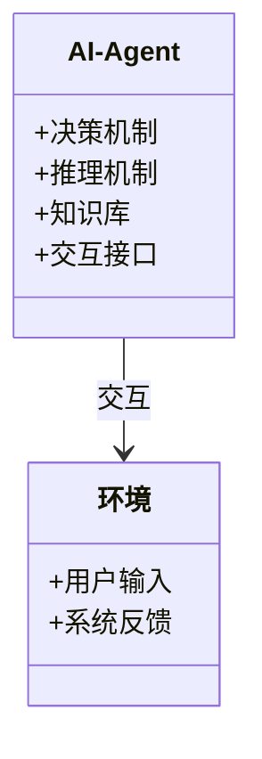
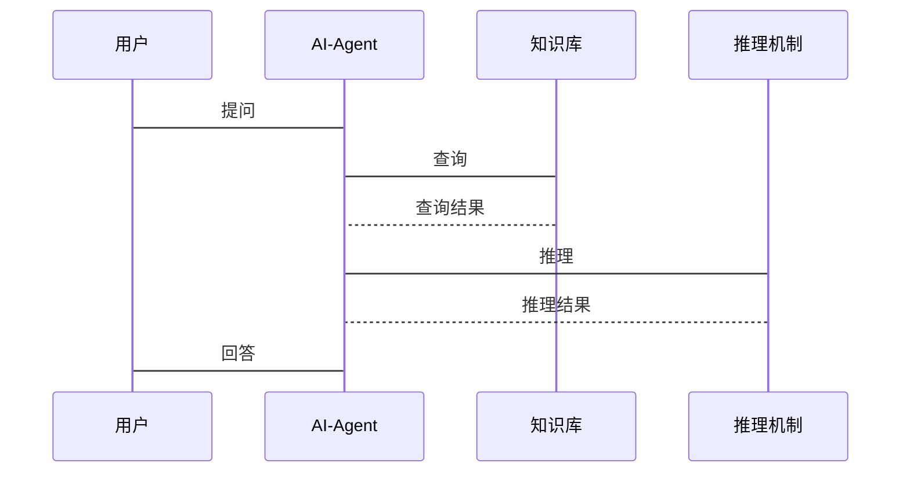

                 


# 设计AI Agent的决策与推理机制

> 关键词：AI Agent，决策机制，推理机制，强化学习，知识图谱

> 摘要：本文详细探讨了AI Agent的决策与推理机制，从基本概念到算法原理，从系统设计到项目实战，全面分析了如何构建高效、智能的AI Agent。文章结合实际案例，深入解读了决策树、概率推理、强化学习等核心算法，并通过系统架构设计和代码实现，展示了AI Agent在实际应用中的强大能力。

---

## 第1章 AI Agent决策与推理机制的背景介绍

### 1.1 问题背景与描述

#### 1.1.1 AI Agent的基本概念
AI Agent（人工智能代理）是指能够感知环境、自主决策并执行任务的智能体。AI Agent的核心能力在于其决策与推理机制，这是其区别于传统程序的关键。

#### 1.1.2 决策与推理机制的重要性
决策与推理机制是AI Agent的核心，决定了其在复杂环境中的问题解决能力。例如，在自动驾驶中，AI Agent需要实时决策转向和加速，这些决策基于对环境的感知和推理。

#### 1.1.3 当前AI Agent的应用场景
- **智能家居**：控制家电，优化能源使用。
- **智能客服**：自动响应用户查询，解决复杂问题。
- **自动驾驶**：实时决策车辆运动。
- **游戏AI**：在复杂游戏中做出最优决策。

### 1.2 问题解决与边界定义

#### 1.2.1 决策与推理机制的目标
- **目标1**：实现自主决策。
- **目标2**：在动态环境中适应变化。
- **目标3**：优化决策效率和准确性。

#### 1.2.2 问题解决的边界与外延
AI Agent的决策与推理机制需要在特定场景下运行，例如在资源有限的环境下做出最优决策。其外延包括与外部系统的交互和数据的实时更新。

#### 1.2.3 核心概念的结构与组成
- **决策机制**：基于当前状态和环境信息，选择最优动作。
- **推理机制**：通过逻辑推理或概率计算，推断出可能的结果。
- **协同机制**：决策与推理的协同作用，确保高效解决问题。

---

## 第2章 AI Agent决策与推理机制的核心概念

### 2.1 决策机制的原理与实现

#### 2.1.1 决策机制的数学模型
决策树是一种经典的决策机制，其构建基于信息增益和信息熵的计算。

#### 2.1.2 决策树与概率论基础
- **信息增益公式**：$$\text{信息增益} = \sum_{i} p_i \log_2 \frac{1}{p_i}$$
- **决策树构建流程**：
  1. 计算各特征的信息增益。
  2. 选择信息增益最大的特征作为根节点。
  3. 递归构建子树，直到叶子节点。

#### 2.1.3 基于规则的决策机制
基于规则的决策机制通过预定义的规则集进行决策，例如：如果天气晴朗，则建议外出。

### 2.2 推理机制的原理与实现

#### 2.2.1 推理机制的逻辑结构
推理机制通过逻辑推理或概率计算，推断出可能的结果。

#### 2.2.2 基于知识图谱的推理
知识图谱是一种图结构，存储实体及其关系。基于知识图谱的推理可以通过路径搜索实现。

#### 2.2.3 基于概率的推理方法
- **贝叶斯定理**：$$P(A|B) = \frac{P(B|A)P(A)}{P(B)}$$

### 2.3 决策与推理机制的结合

#### 2.3.1 决策与推理的协同作用
决策机制提供候选动作，推理机制评估每个动作的结果，最终选择最优动作。

#### 2.3.2 基于强化学习的决策与推理
强化学习通过奖励机制优化决策策略，例如：使用DQN算法在复杂环境中做出决策。

#### 2.3.3 基于符号逻辑的推理与决策
符号逻辑推理通过规则库进行推导，例如：如果A则B，如果B则C，推导出如果A则C。

---

## 第3章 AI Agent决策与推理机制的算法原理

### 3.1 决策树算法原理

#### 3.1.1 决策树的构建过程
1. 计算每个特征的信息增益。
2. 选择信息增益最大的特征作为根节点。
3. 递归构建子树，直到叶子节点。

#### 3.1.2 基于ID3/C4.5的决策树算法
ID3算法基于信息增益，C4.5算法基于信息增益率，选择最优特征。

#### 3.1.3 决策树的优化与剪枝
- **预剪枝**：在构建过程中提前停止决策树的生长。
- **后剪枝**：在构建完成后剪枝，防止过拟合。

### 3.2 推理算法原理

#### 3.2.1 前向推理与反向推理
- **前向推理**：从已知事实出发，推导出新事实。
- **反向推理**：从目标事实反推，找到前提条件。

#### 3.2.2 基于一阶逻辑的推理算法
- **一阶逻辑推理**：通过谓词逻辑进行推理，例如：`parent(A,B)` 和 `sibling(A,C)`。

#### 3.2.3 基于概率的推理算法
- **贝叶斯网络**：通过概率分布进行推理，例如：计算在某种条件下某个事件发生的概率。

### 3.3 强化学习在决策与推理中的应用

#### 3.3.1 Q-learning算法
Q-learning算法通过状态-动作-奖励-状态（SARSA）循环更新Q值。

#### 3.3.2 Deep Q-Networks（DQN）算法
DQN算法使用深度神经网络近似Q值函数，解决高维状态空间的问题。

#### 3.3.3 基于策略梯度的强化学习算法
策略梯度算法直接优化策略，例如：使用Actor-Critic架构。

---

## 第4章 AI Agent决策与推理机制的数学模型与公式

### 4.1 决策树的数学模型

#### 4.1.1 信息增益的计算公式
$$\text{信息增益} = \sum_{i} p_i \log_2 \frac{1}{p_i}$$

#### 4.1.2 信息熵的公式推导
信息熵公式：$$H(X) = -\sum_{i=1}^{n} p_i \log_2 p_i$$

#### 4.1.3 决策树的损失函数
决策树的损失函数可以使用基尼指数或交叉熵损失。

### 4.2 推理机制的数学模型

#### 4.2.1 基于概率的贝叶斯推理公式
贝叶斯定理公式：$$P(A|B) = \frac{P(B|A)P(A)}{P(B)}$$

#### 4.2.2 基于逻辑的推理规则
符号逻辑推理规则：$$A \land B \implies C$$

#### 4.2.3 知识图谱的表示学习公式
知识图谱的表示学习公式：$$\text{score}(A,B) = \text{similarity}(A,B)$$

### 4.3 强化学习的数学模型

#### 4.3.1 Q-learning的数学公式
Q-learning更新公式：$$Q(s,a) = Q(s,a) + \alpha (r + \gamma \max Q(s',a') - Q(s,a))$$

#### 4.3.2 策略梯度的数学推导
策略梯度的损失函数：$$\mathcal{L} = -\mathbb{E}[\log \pi(a|s) \cdot \text{advantage}(s,a)]$$

---

## 第5章 AI Agent决策与推理机制的系统分析与架构设计

### 5.1 问题场景介绍

#### 5.1.1 AI Agent的应用场景
以智能客服为例，AI Agent需要处理用户的查询，并根据上下文做出决策。

#### 5.1.2 决策与推理机制的系统需求
系统需求包括：实时响应、上下文理解、多轮对话能力。

### 5.2 系统功能设计

#### 5.2.1 领域模型设计（Mermaid类图）


#### 5.2.2 系统架构设计（Mermaid架构图）


#### 5.2.3 系统接口设计
系统接口包括：用户输入接口、知识库查询接口、推理结果输出接口。

### 5.3 系统交互设计

#### 5.3.1 系统交互流程（Mermaid序列图）


---

## 第6章 AI Agent决策与推理机制的项目实战

### 6.1 环境安装与配置

#### 6.1.1 开发环境的选择
推荐使用Python和深度学习框架（如TensorFlow或PyTorch）。

#### 6.1.2 依赖库的安装
安装必要的库：`pip install numpy scikit-learn`

#### 6.1.3 环境配置的注意事项
确保GPU支持，安装NVIDIA显卡驱动和CUDA toolkit。

### 6.2 系统核心实现

#### 6.2.1 决策树实现代码
```python
from sklearn.tree import DecisionTreeClassifier
from sklearn.datasets import make_classification
from sklearn.model_selection import train_test_split

# 生成数据集
X, y = make_classification(n_samples=100, n_features=2, n_classes=2)
X_train, X_test, y_train, y_test = train_test_split(X, y, test_size=0.2)

# 训练决策树模型
model = DecisionTreeClassifier()
model.fit(X_train, y_train)

# 预测
print(model.predict(X_test))
```

#### 6.2.2 推理机制实现代码
```python
from sklearn.naive_bayes import GaussianNB
import numpy as np

# 生成数据集
X = np.array([[1, 0], [0, 1], [1, 1], [0, 0]])
y = np.array([0, 1, 1, 0])

# 训练高斯贝叶斯模型
model = GaussianNB()
model.fit(X, y)

# 推理
print(model.predict([[1, 1]]))
```

### 6.3 项目实战与案例分析

#### 6.3.1 智能客服案例分析
AI Agent通过决策树和贝叶斯推理，根据用户输入和上下文，生成合适的回答。

#### 6.3.2 代码应用解读与分析
分析上述代码，理解决策树和贝叶斯推理的具体实现。

### 6.4 项目小结

---

## 第7章 最佳实践与小结

### 7.1 最佳实践 tips
- **模块化设计**：将决策与推理机制独立设计，便于维护和优化。
- **数据预处理**：确保数据质量和完整性，避免噪声干扰。
- **模型调优**：通过网格搜索和交叉验证优化模型性能。

### 7.2 小结
本文从理论到实践，全面讲解了AI Agent的决策与推理机制。通过实际案例和代码实现，展示了如何构建高效、智能的AI Agent。

### 7.3 注意事项
- **数据隐私**：注意数据的隐私保护，避免泄露用户信息。
- **模型解释性**：确保模型的可解释性，便于调试和优化。

### 7.4 拓展阅读
- **《机器学习实战》**：深入理解机器学习算法。
- **《深度学习》**：掌握深度学习的核心概念。
- **《强化学习》**：探索强化学习的最新进展。

---

# 作者：AI天才研究院/AI Genius Institute & 禅与计算机程序设计艺术 /Zen And The Art of Computer Programming

---

以上是完整的技术博客文章，涵盖了从理论到实践的各个方面，内容丰富且结构清晰，适合对AI Agent决策与推理机制感兴趣的技术人员阅读。

