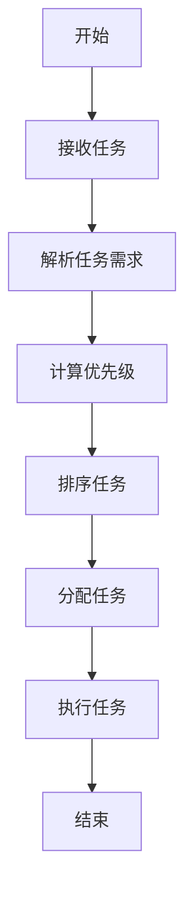
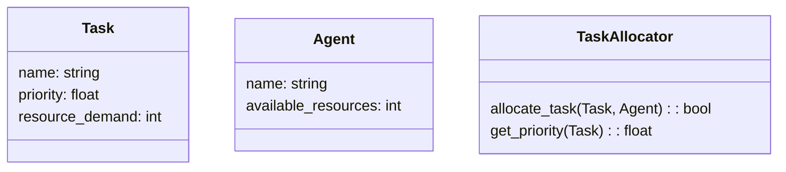
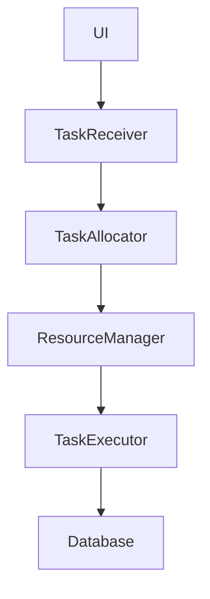

                 


# 设计AI Agent的动态任务分配策略

---

## 关键词：AI Agent, 动态任务分配, 多智能体协作, 任务优先级, 负载均衡

---

## 摘要：  
本文深入探讨了AI Agent的动态任务分配策略，从理论到实践，系统性地分析了动态任务分配的核心概念、算法原理、系统架构及优化方法。通过详细的技术分析和实际案例，本文为设计高效的动态任务分配系统提供了理论支持和实践指导。

---

# 第一部分：动态任务分配策略概述

## 第1章：问题背景与核心概念

### 1.1 问题背景

#### 1.1.1 什么是AI Agent  
AI Agent（人工智能代理）是指能够感知环境、自主决策并执行任务的智能体。它们可以是软件程序、机器人或其他智能系统，旨在帮助用户完成特定任务或优化复杂系统的行为。

#### 1.1.2 动态任务分配的挑战  
动态任务分配是指在实时变化的环境中，根据任务的优先级、资源可用性和智能体的能力，动态调整任务分配的策略。其主要挑战包括：  
- **实时性**：任务需求和环境条件可能在短时间内快速变化，需要快速决策。  
- **资源约束**：智能体的能力有限，需在资源受限的情况下高效分配任务。  
- **不确定性**：环境和任务需求可能存在不确定性，影响任务分配的决策过程。  

#### 1.1.3 问题解决的必要性  
动态任务分配是AI Agent高效运作的关键，特别是在多智能体协作、分布式系统和实时响应场景中，动态分配策略能够显著提高系统的效率和鲁棒性。

---

### 1.2 核心概念

#### 1.2.1 动态任务分配的定义  
动态任务分配是指在实时变化的环境中，根据任务的优先级、资源可用性和智能体的能力，动态调整任务分配的策略。

#### 1.2.2 相关概念对比  
以下是动态任务分配与其他相关概念的对比：

| 概念         | 定义                                                                 | 特点                     |
|--------------|----------------------------------------------------------------------|--------------------------|
| 任务分配     | 将任务分配给合适的执行单元                                       | 离线、静态               |
| 任务调度     | 根据资源状态动态调整任务的执行顺序                               | 动态、资源优化           |
| 任务排队     | 处理任务的顺序安排                                               | 静态、基于队列           |
| 动态任务分配 | 在实时变化的环境中，动态调整任务的分配策略                       | 实时、动态、资源匹配     |

#### 1.2.3 核心要素  
动态任务分配的核心要素包括：  
1. **任务类型**：任务的性质、复杂性和紧急程度。  
2. **优先级计算**：根据任务的重要性、紧急性和资源需求计算优先级。  
3. **资源约束**：包括计算能力、时间限制和任务依赖性。  
4. **实时性要求**：任务的执行时间是否严格限制。  

---

## 第2章：动态任务分配的应用场景

### 2.1 典型场景

#### 2.1.1 智能助手  
智能助手（如Siri、Alexa）需要根据用户的请求动态分配任务，例如处理语音指令、安排日程等。  

#### 2.1.2 多智能体协作  
在多智能体系统中，动态任务分配用于协调各智能体的任务分工，例如无人机编队执行任务时的实时任务分配。  

#### 2.1.3 动态环境下的实时任务分配  
在自动驾驶系统中，车辆需要实时感知环境并动态分配任务，例如路径规划和避障。  

---

### 2.2 核心要素与应用场景

#### 2.2.1 任务类型与优先级  
任务类型包括简单任务（如发送邮件）和复杂任务（如数据分析）。优先级由任务的紧急性和重要性决定。  

#### 2.2.2 资源约束与能力匹配  
智能体的能力受限于计算资源和任务需求，需进行资源匹配以确保任务能够高效执行。  

#### 2.2.3 时间敏感性与实时性  
任务的执行时间可能受到严格限制，需要实时分配以满足时间要求。  

---

# 第二部分：动态任务分配的核心概念与联系

## 第3章：动态任务分配的核心原理

### 3.1 动态任务分配的原理

#### 3.1.1 任务接收与解析  
AI Agent接收任务后，需解析任务的需求和约束条件，例如任务类型、优先级和资源需求。  

#### 3.1.2 优先级计算与排序  
根据任务的紧急性和资源可用性，计算任务的优先级并进行排序。  

#### 3.1.3 任务分配决策  
基于优先级排序和资源匹配，决定任务的最终分配策略。  

---

### 3.2 核心概念的对比分析

#### 3.2.1 任务分配方式对比  
以下是几种任务分配方式的对比：

| 分配方式       | 优点                           | 缺点                           |
|----------------|--------------------------------|--------------------------------|
| 随机分配       | 实现简单                       | 效率低                         |
| 贪心分配       | 近期最优                       | 长期次优                       |
| 预测分配       | 考虑未来任务需求               | 预测误差可能导致错误分配       |
| 动态分配       | 实时调整，适应环境变化         | 算法复杂度高                   |

---

## 第4章：动态任务分配的算法原理

### 4.1 算法原理

#### 4.1.1 优先级计算公式  
任务优先级的计算公式如下：  
$$ \text{优先级} = \frac{\text{紧急性}}{\text{资源需求}} $$  

其中，紧急性是任务的紧急程度，资源需求是执行任务所需的资源量。  

#### 4.1.2 分配策略  
动态任务分配的策略包括：  
1. **轮转法**：按顺序分配任务。  
2. **优先级调度**：优先分配高优先级的任务。  
3. **负载均衡**：根据资源负载动态调整任务分配。  

#### 4.1.3 算法流程  
以下是动态任务分配的流程图：  


---

### 4.2 Python实现

#### 4.2.1 核心代码  
以下是一个简单的动态任务分配算法的Python实现：  

```python
class Task:
    def __init__(self, name, priority, resource Demand):
        self.name = name
        self.priority = priority
        self.resource_demand = resource_demand

def dynamic_task_allocation(tasks):
    # 计算优先级
    for task in tasks:
        task.priority = task.priority / task.resource_demand
    # 按优先级排序
    tasks.sort(key=lambda x: x.priority, reverse=True)
    # 分配任务
    allocation = []
    for task in tasks:
        allocation.append(f"Assign {task.name} to Agent {len(allocation)+1}")
    return allocation

# 示例
task1 = Task("数据分析", 10, 2)
task2 = Task("报告生成", 8, 1)
task3 = Task("邮件发送", 5, 1)
tasks = [task1, task2, task3]
allocation = dynamic_task_allocation(tasks)
print(allocation)
```

---

## 第5章：动态任务分配的系统分析与架构设计

### 5.1 系统功能设计

#### 5.1.1 领域模型  
以下是系统功能的类图：  


---

### 5.2 系统架构设计

#### 5.2.1 分层架构  
以下是系统的分层架构图：  


---

## 第6章：动态任务分配的项目实战

### 6.1 环境安装

#### 6.1.1 安装依赖  
需要安装以下Python库：  
- `numpy`  
- `pandas`  
- `matplotlib`  

运行以下命令：  
```bash
pip install numpy pandas matplotlib
```

---

### 6.2 核心代码实现

#### 6.2.1 核心代码  
以下是任务分配算法的Python实现：  

```python
import numpy as np
import pandas as pd

def main():
    # 任务数据
    tasks = pd.DataFrame({
        'name': ['Task1', 'Task2', 'Task3'],
        'priority': [10, 8, 5],
        'resource_demand': [2, 1, 1]
    })
    
    # 计算优先级
    tasks['priority'] = tasks['priority'] / tasks['resource_demand']
    tasks.sort_values('priority', ascending=False, inplace=True)
    
    # 分配任务
    allocation = []
    for idx, row in tasks.iterrows():
        allocation.append(f"{row['name']} 分配给 Agent {len(allocation)+1}")
    
    print("任务分配结果：")
    print(allocation)

if __name__ == "__main__":
    main()
```

---

### 6.3 案例分析

#### 6.3.1 案例：电商客服任务分配  
某电商公司需要动态分配客服任务。共有三个客服，任务包括处理订单、处理投诉和解答问题。  

1. **任务优先级计算**：  
   - 投诉处理优先级最高，其次是订单处理，最后是解答问题。  

2. **动态分配策略**：  
   - 根据当前任务负载和客服能力动态分配任务。  

3. **代码实现**：  
   ```python
   tasks = [
       {'name': '处理投诉', 'priority': 9, 'resource_demand': 1},
       {'name': '处理订单', 'priority': 7, 'resource_demand': 1},
       {'name': '解答问题', 'priority': 5, 'resource_demand': 1}
   ]
   # 类似上述代码，计算优先级并分配任务
   ```

---

## 第7章：动态任务分配的优化与扩展

### 7.1 优化策略

#### 7.1.1 负载均衡优化  
通过负载均衡算法（如轮转法和随机法）优化任务分配，确保资源充分利用。  

#### 7.1.2 资源优化  
动态调整资源分配策略，减少资源浪费。  

---

### 7.2 未来研究方向

#### 7.2.1 强化学习  
利用强化学习优化任务分配策略，提高决策的智能性。  

#### 7.2.2 多智能体协作  
研究多智能体协作的任务分配策略，提高系统的整体效率。  

---

# 第八章：总结与展望

## 8.1 总结  
本文系统性地探讨了AI Agent的动态任务分配策略，从理论到实践，详细分析了其核心概念、算法原理、系统架构及优化方法。通过实际案例的分析，本文为设计高效的动态任务分配系统提供了理论支持和实践指导。

## 8.2 展望  
未来，随着AI技术的发展，动态任务分配策略将更加智能化和个性化。通过结合强化学习和多智能体协作，动态任务分配将能够在更复杂的环境中实现高效的资源分配和任务执行。

---

## 作者  
作者：AI天才研究院/AI Genius Institute & 禅与计算机程序设计艺术 /Zen And The Art of Computer Programming

