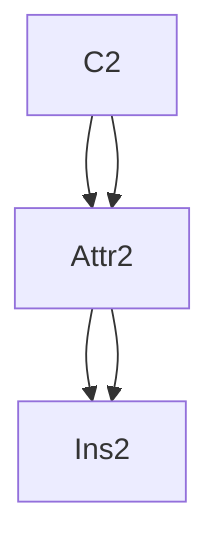
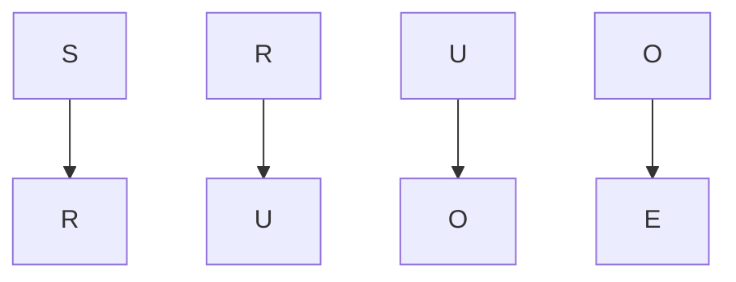
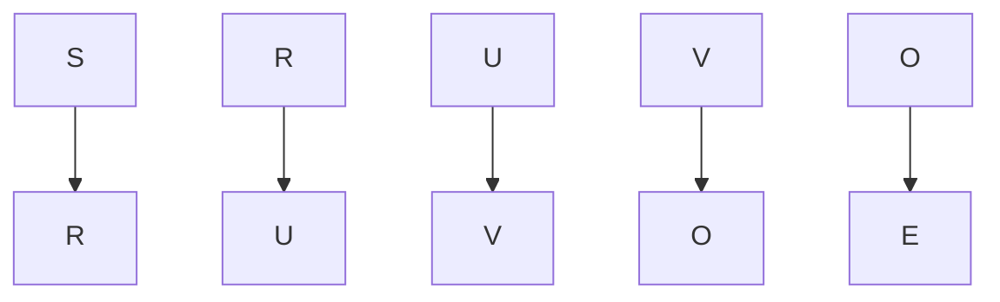
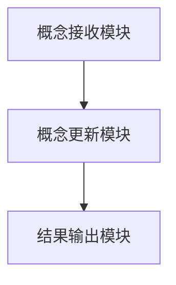
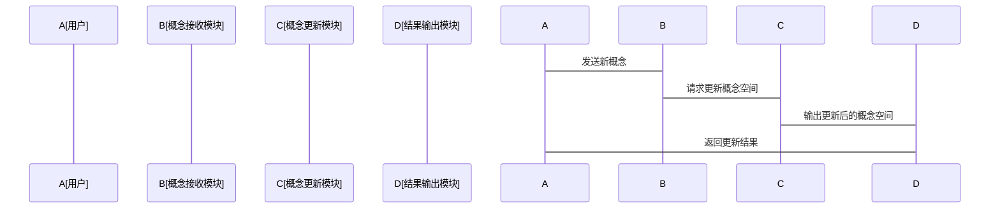

                 


# 设计AI Agent的增量式概念学习策略

---

## 关键词：AI Agent, 增量式学习, 概念学习, 算法原理, 系统架构, 项目实战

---

## 摘要

本文旨在设计一种AI Agent的增量式概念学习策略，探讨其核心算法原理、系统架构及实际应用。通过详细分析增量式学习的背景、算法实现、系统设计与项目实战，结合数学模型和实际案例，为AI Agent的持续学习与进化提供理论与实践指导。

---

# 第一部分: AI Agent与增量式概念学习背景介绍

## 第1章: AI Agent与增量式学习概述

### 1.1 AI Agent的基本概念

#### 1.1.1 AI Agent的定义

AI Agent（人工智能代理）是指能够感知环境、自主决策并执行任务的智能实体。它可以是一个软件程序、机器人或其他智能系统，具备以下核心特征：

- **自主性**：无需外部干预，自主决策。
- **反应性**：能够实时感知环境并做出响应。
- **目标导向性**：通过设定目标来驱动行为。

AI Agent与传统AI的区别在于其动态性和适应性。传统AI依赖于预设规则，而AI Agent能够通过与环境互动，不断优化自身行为。

#### 1.1.2 AI Agent的核心特征

| 特征 | 描述 |
|------|------|
| 自主性 | 能够自主决策，无需外部干预 |
| 反应性 | 能够实时感知环境并做出响应 |
| 目标导向性 | 通过设定目标驱动行为 |
| 适应性 | 能够通过经验优化自身行为 |

#### 1.1.3 AI Agent与传统AI的区别

| 方面 | 传统AI | AI Agent |
|------|--------|----------|
| 决策方式 | 预设规则 | 自主决策 |
| 环境互动 | 被动执行 | 主动感知与交互 |
| 学习能力 | 无 | 支持增量式学习 |

### 1.2 增量式概念学习的背景

#### 1.2.1 什么是增量式学习

增量式学习（Incremental Learning）是一种机器学习方法，模型在接收到新的数据样本后，能够逐步更新自身的知识表示，而非一次性训练整个模型。

#### 1.2.2 增量式学习的必要性

在动态变化的环境中，AI Agent需要不断适应新的概念和信息。增量式学习能够帮助AI Agent在新数据到来时，逐步更新知识表示，避免重新训练整个模型，从而提高效率和实时性。

#### 1.2.3 增量式学习的应用场景

| 场景 | 描述 |
|------|------|
| 实时数据分析 | 在线处理实时数据流 |
| 自然语言处理 | 面对不断变化的语言环境 |
| 自动驾驶 | 遇到未见过的交通场景 |

### 1.3 问题背景与问题描述

#### 1.3.1 当前AI Agent学习的局限性

传统AI Agent的学习方式多为一次性训练，无法适应动态变化的环境。当新的概念出现时，往往需要重新训练整个模型，导致效率低下。

#### 1.3.2 增量式概念学习的提出

为了解决上述问题，提出一种增量式概念学习策略，使AI Agent能够逐步吸收和理解新的概念，实现持续学习和优化。

#### 1.3.3 问题解决的目标与边界

- **目标**：设计一种增量式概念学习策略，使AI Agent能够高效地更新知识表示。
- **边界**：仅关注概念空间的增量更新，不涉及模型的其他部分。

### 1.4 核心概念与联系

#### 1.4.1 核心概念原理

增量式概念学习的核心在于如何将新概念整合到现有的概念空间中，通过更新概念表示和属性特征，逐步优化模型。

#### 1.4.2 概念属性特征对比表格

| 属性 | 现有概念 | 新概念 |
|------|----------|--------|
| 属性1 | 特征A    | 特征B  |
| 属性2 | 特征C    | 特征D  |

#### 1.4.3 ER实体关系图架构



---

## 第二部分: 增量式概念学习策略的算法原理

## 第2章: 增量式概念学习的算法原理

### 2.1 增量式学习算法概述

#### 2.1.1 增量式学习的基本流程



#### 2.1.2 增量式学习的核心算法

以下是一个简单的增量式学习算法的伪代码：

```python
def incremental_learning(new_concept):
    # 初始化概念空间
    concept_space = initialize_concepts()
    # 更新概念空间
    concept_space = update_concepts(concept_space, new_concept)
    return concept_space
```

#### 2.1.3 增量式学习的数学模型

增量式学习的数学模型可以表示为：

$$ \text{新概念空间} = f(\text{旧概念空间}, \text{新概念}) $$

其中，$f$ 是一个更新函数，用于将新概念整合到现有概念空间中。

### 2.2 增量式概念学习的数学模型

#### 2.2.1 概念空间的表示

概念空间可以表示为一个向量空间，其中每个概念对应一个向量。

$$ C = \{c_1, c_2, \ldots, c_n\} $$

其中，$c_i$ 表示第 $i$ 个概念。

#### 2.2.2 概念更新的公式推导

当接收到新概念 $c_{n+1}$ 时，更新公式如下：

$$ c_{n+1} = f(c_1, c_2, \ldots, c_n, c_{n+1}) $$

#### 2.2.3 概念相似度的计算

概念相似度可以通过余弦相似度来计算：

$$ \text{相似度}(c_i, c_j) = \frac{c_i \cdot c_j}{\|c_i\| \|c_j\|} $$

### 2.3 增量式学习的算法实现

#### 2.3.1 算法流程图



#### 2.3.2 Python核心代码实现

以下是一个简单的增量式学习算法的实现：

```python
import numpy as np

def update_concepts(concept_space, new_concept):
    # 将新概念添加到概念空间中
    new_concept_vector = np.array(new_concept)
    updated_space = np.vstack((concept_space, new_concept_vector))
    return updated_space

# 初始化概念空间
concept_space = np.array([[1, 0], [0, 1]])

# 接收新概念
new_concept = [1, 1]

# 更新概念空间
updated_space = update_concepts(concept_space, new_concept)

print(updated_space)
```

### 2.4 算法的数学模型与举例说明

#### 2.4.1 算法的数学模型

增量式学习的数学模型可以表示为：

$$ c_{n+1} = f(c_1, c_2, \ldots, c_n, c_{n+1}) $$

其中，$f$ 是一个更新函数，用于将新概念整合到现有概念空间中。

#### 2.4.2 举例说明

假设现有概念空间为：

$$ C = \{c_1, c_2\} $$

其中，$c_1 = [1, 0]$，$c_2 = [0, 1]$。

接收到新概念 $c_3 = [1, 1]$ 后，更新后的概念空间为：

$$ C' = \{c_1, c_2, c_3\} $$

---

## 第三部分: 增量式概念学习策略的系统架构设计

## 第3章: 系统分析与架构设计

### 3.1 项目介绍与问题场景

#### 3.1.1 项目介绍

本项目旨在设计一种AI Agent的增量式概念学习策略，通过持续更新概念空间，提升AI Agent的适应能力和智能水平。

#### 3.1.2 问题场景

在动态变化的环境中，AI Agent需要不断吸收新的概念，以应对新的挑战。

### 3.2 系统功能设计

#### 3.2.1 系统功能模块

系统主要功能模块包括：

- **概念接收模块**：接收新概念。
- **概念更新模块**：更新概念空间。
- **结果输出模块**：输出更新后的概念空间。

### 3.3 系统架构设计

#### 3.3.1 系统架构图



#### 3.3.2 接口设计

- **输入接口**：接收新概念。
- **输出接口**：输出更新后的概念空间。

#### 3.3.3 交互序列图



---

## 第四部分: 项目实战

## 第4章: 项目实战

### 4.1 环境安装与配置

#### 4.1.1 环境需求

- Python 3.6+
- numpy库

#### 4.1.2 安装步骤

```bash
pip install numpy
```

### 4.2 核心代码实现

#### 4.2.1 核心代码

```python
import numpy as np

def update_concepts(concept_space, new_concept):
    # 将新概念添加到概念空间中
    new_concept_vector = np.array(new_concept)
    updated_space = np.vstack((concept_space, new_concept_vector))
    return updated_space

# 初始化概念空间
concept_space = np.array([[1, 0], [0, 1]])

# 接收新概念
new_concept = [1, 1]

# 更新概念空间
updated_space = update_concepts(concept_space, new_concept)

print("更新后的概念空间：")
print(updated_space)
```

#### 4.2.2 代码解读

- `update_concepts` 函数用于将新概念整合到现有概念空间中。
- `np.vstack` 用于垂直堆叠数组，将新概念添加到现有概念空间中。

### 4.3 案例分析与实际应用

#### 4.3.1 案例分析

假设我们有一个简单的概念空间，包含两个概念：$c_1 = [1, 0]$ 和 $c_2 = [0, 1]$。接收到新概念 $c_3 = [1, 1]$ 后，更新后的概念空间为：

$$ C' = \{c_1, c_2, c_3\} $$

#### 4.3.2 实际应用

上述代码可以应用于任何需要增量式概念学习的场景，例如：

- 自然语言处理中的词汇扩展。
- 图像识别中的新类别识别。

### 4.4 项目小结

通过本项目，我们实现了一种简单的增量式概念学习策略，能够将新概念整合到现有概念空间中。尽管这是一个简单的例子，但展示了增量式学习的基本原理和实现方法。

---

## 第五部分: 最佳实践与总结

## 第5章: 最佳实践

### 5.1 最佳实践 tips

- 在实际应用中，可以考虑更复杂的更新策略，例如基于相似度的加权更新。
- 定期验证更新后的概念空间，确保其准确性和有效性。

### 5.2 小结

通过本文的探讨，我们设计了一种AI Agent的增量式概念学习策略，详细分析了其算法原理、系统架构及实际应用。这种策略能够帮助AI Agent在动态变化的环境中，逐步更新知识表示，提升其智能水平。

### 5.3 注意事项

- 更新概念空间时，需要考虑新概念与现有概念之间的关系。
- 避免概念空间过于复杂，影响模型的效率。

### 5.4 拓展阅读

- 关于增量式学习的进一步研究可以参考相关文献。
- 探索更高效的更新算法，例如基于深度学习的增量式学习方法。

---

## 作者：AI天才研究院/AI Genius Institute & 禅与计算机程序设计艺术 /Zen And The Art of Computer Programming

---

以上是《设计AI Agent的增量式概念学习策略》的完整内容，涵盖了背景介绍、算法原理、系统架构、项目实战以及总结与展望。通过本文的探讨，我们深入分析了增量式概念学习的核心原理和实现方法，并通过实际案例展示了其应用价值。希望本文能够为相关领域的研究和实践提供有价值的参考。

