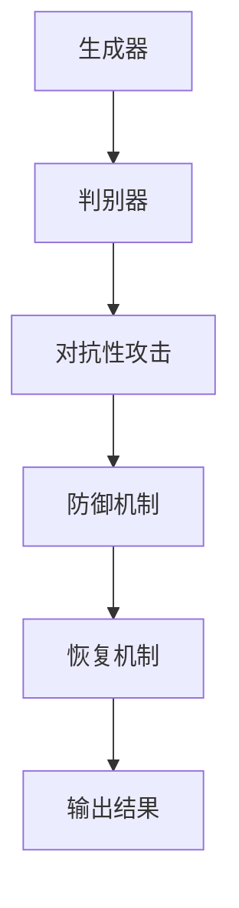
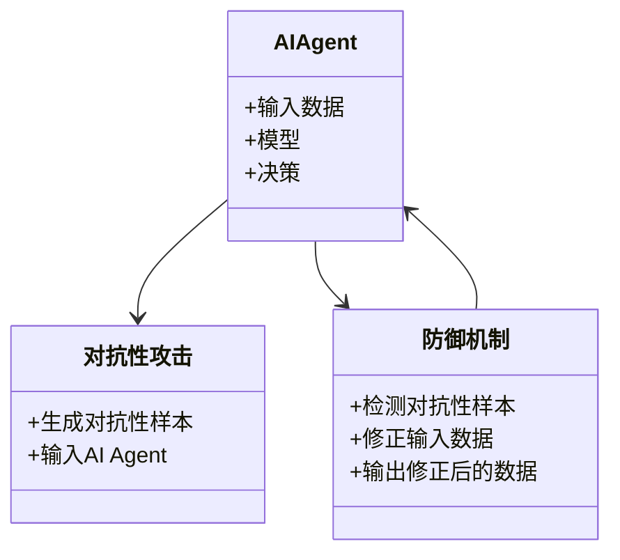
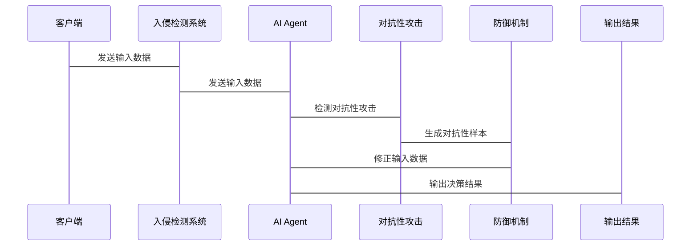

                 


# 设计AI Agent的对抗性学习防御机制

> 关键词：AI Agent, 对抗性学习, 防御机制, 深度学习, 安全人工智能

> 摘要：本文深入探讨了AI Agent在对抗性学习环境中的防御机制设计。通过分析对抗性学习的背景、核心概念、算法原理、系统架构以及实际项目案例，本文旨在为读者提供一个全面的理解和实践指南。我们从理论到实践，逐步揭示如何构建有效的对抗性学习防御机制，确保AI Agent在复杂对抗环境中的安全性和 robustness。

---

# 第一部分: 背景介绍

# 第1章: 对抗性学习的背景与问题背景

## 1.1 AI Agent的发展历程
### 1.1.1 人工智能与AI Agent的定义
AI Agent（智能体）是指能够感知环境并采取行动以实现目标的智能系统。它结合了感知、推理、学习和行动的能力。

### 1.1.2 AI Agent的核心特征
- **自主性**：能够在没有外部干预的情况下运行。
- **反应性**：能够实时感知环境并做出反应。
- **目标导向性**：所有行动都围绕实现特定目标展开。

### 1.1.3 AI Agent的应用场景
- **自动驾驶**：实时感知环境并做出驾驶决策。
- **智能助手**：如Siri、Alexa等，能够理解用户需求并提供服务。
- **游戏AI**：在复杂游戏中做出策略性决策。

## 1.2 对抗性学习的背景
### 1.2.1 对抗性学习的定义
对抗性学习是一种机器学习技术，其中两个AI模型（通常是生成器和判别器）通过竞争来提升彼此的性能。生成器的目标是生成能够欺骗判别器的样本，而判别器的目标是区分真实样本和生成样本。

### 1.2.2 对抗性学习的起源
对抗性学习最初是在生成对抗网络（GANs）中提出的。Goodfellow等人在2014年提出了GANs的概念，从此对抗性学习成为深度学习领域的重要研究方向。

### 1.2.3 对抗性学习的应用场景
- **图像生成**：如生成逼真的图像。
- **语音合成**：生成自然的语音。
- **文本生成**：生成连贯的文本。

## 1.3 对抗性学习在AI Agent中的挑战
### 1.3.1 对抗性攻击的定义
对抗性攻击是指通过修改输入数据来欺骗AI系统，使其做出错误的决策。

### 1.3.2 对抗性攻击的分类
- **白盒攻击**：攻击者知道模型的内部结构，能够精确地构造对抗样本。
- **黑盒攻击**：攻击者不知道模型的内部结构，通过试探性方法构造对抗样本。

### 1.3.3 对抗性攻击的案例
- **图像分类中的对抗样本**：通过在图像上添加小扰动，使得分类器错误分类。
- **语音识别中的对抗样本**：通过修改语音信号，使得识别系统产生错误。

## 1.4 防御机制的重要性
### 1.4.1 防御机制的目标
防御机制的目标是识别和抵御对抗性攻击，确保AI Agent在面对对抗性输入时仍然能够正常工作。

### 1.4.2 防御机制的分类
- **基于模型的防御**：通过修改模型结构或训练过程来增强模型的鲁棒性。
- **基于输入的防御**：在输入数据预处理阶段识别和去除对抗性样本。
- **基于决策的防御**：在决策阶段引入额外的逻辑来检测和抵御对抗性攻击。

## 1.5 本章小结
本章介绍了AI Agent的发展历程、对抗性学习的背景以及对抗性攻击的挑战。我们强调了防御机制在保护AI Agent免受对抗性攻击中的重要性，并为后续章节的深入探讨奠定了基础。

---

# 第2章: 对抗性学习防御机制的核心概念

## 2.1 对抗性学习的原理
### 2.1.1 对抗性学习的数学模型
对抗性学习的核心是两个模型之间的博弈。生成器的目标是生成能够欺骗判别器的样本，判别器的目标是区分真实样本和生成样本。这种博弈关系可以用以下公式表示：

$$\min_{G}\max_{D} \mathcal{L}(G,D)$$

其中，\( G \) 是生成器，\( D \) 是判别器，\( \mathcal{L}(G,D) \) 是损失函数。

### 2.1.2 对抗性攻击的数学模型
对抗性攻击的目标是通过修改输入 \( x \) 得到 \( x' \)，使得模型 \( f \) 对 \( x' \) 的预测结果与对 \( x \) 的预测结果不同。数学表示为：

$$f(x) \neq f(x')$$

### 2.1.3 对抗性防御的数学模型
防御机制的目标是通过某种方式恢复或纠正被攻击的输入，使得模型能够正确地预测结果。这可以通过以下方式实现：

1. 修改模型的输入 \( x' \) 以恢复到原始输入 \( x \)。
2. 修改模型的参数，使得模型对 \( x' \) 的预测结果与对 \( x \) 的预测结果相同。

## 2.2 对抗性防御机制的核心概念
### 2.2.1 防御机制的分类
- **基于模型的防御**：通过修改模型结构或训练过程来增强模型的鲁棒性。
- **基于输入的防御**：在输入数据预处理阶段识别和去除对抗性样本。
- **基于决策的防御**：在决策阶段引入额外的逻辑来检测和抵御对抗性攻击。

### 2.2.2 防御机制的属性特征对比
以下表格对比了不同防御机制的特征：

| 防御机制 | 输入阶段 | 模型阶段 | 决策阶段 |
|----------|-----------|-----------|-----------|
| 基于输入的防御 | 是 | 否 | 否 |
| 基于模型的防御 | 否 | 是 | 否 |
| 基于决策的防御 | 否 | 否 | 是 |

### 2.2.3 对抗性防御机制的实体关系图
以下是用Mermaid图展示的实体关系图：



## 2.3 对抗性防御机制的数学模型
### 2.3.1 防御机制的数学表达
防御机制的目标是最小化对抗性攻击的影响。这可以通过以下优化问题来表示：

$$\min_{F} \mathcal{L}(F)$$

其中，\( F \) 是防御机制，\( \mathcal{L}(F) \) 是防御机制的损失函数。

### 2.3.2 防御机制的实现流程
防御机制的实现流程可以用以下步骤表示：

1. **输入数据预处理**：对输入数据进行清洗和预处理，识别潜在的对抗性样本。
2. **模型训练**：训练防御机制模型，使其能够识别和抵御对抗性攻击。
3. **模型推理**：在推理阶段，使用防御机制模型对输入数据进行修正，确保模型的预测结果正确。

## 2.4 本章小结
本章详细介绍了对抗性学习的原理以及防御机制的核心概念。我们通过数学模型和实体关系图的方式，分析了不同防御机制的特征和实现流程，为后续章节的深入探讨奠定了基础。

---

# 第3章: 对抗性学习防御机制的算法原理

## 3.1 对抗性攻击的算法原理
### 3.1.1 常见的对抗性攻击算法
- **Fast Gradient Sign Method (FGSM)**：通过计算损失函数对输入的梯度，生成对抗性样本。
- **Projected Gradient Descent (PGD)**：通过迭代方式生成对抗性样本。
- **DeepFool**：通过计算模型的决策边界，生成对抗性样本。

### 3.1.2 对抗性攻击的数学模型
FGSM算法的数学表达为：

$$x' = x + \epsilon \cdot \text{sign}(\nabla_x \mathcal{L}(x,y))$$

其中，\( x \) 是原始输入，\( \epsilon \) 是扰动幅度，\( \nabla_x \mathcal{L}(x,y) \) 是损失函数对输入的梯度。

### 3.1.3 对抗性攻击的实现流程
FGSM算法的实现流程可以用以下步骤表示：

1. **计算梯度**：计算损失函数对输入的梯度。
2. **生成对抗性样本**：根据梯度生成对抗性样本。
3. **输出对抗性样本**：将对抗性样本作为攻击目标。

## 3.2 对抗性防御机制的算法原理
### 3.2.1 常见的防御机制算法
- **输入变换**：对输入数据进行标准化、去噪等预处理，减少对抗性样本的影响。
- **模型鲁棒化**：通过正则化、数据增强等方法训练模型，增强模型的鲁棒性。
- **对抗性训练**：在训练过程中引入对抗性样本，提升模型的鲁棒性。

### 3.2.2 防御机制的数学模型
模型鲁棒化可以通过以下优化问题来表示：

$$\min_{\theta} \mathbb{E}_{x,y}[\mathcal{L}(f(x), y)] + \lambda \mathbb{E}_{x,y}[\mathcal{R}(x)]$$

其中，\( \theta \) 是模型参数，\( \mathcal{L} \) 是损失函数，\( \mathcal{R} \) 是正则化项，\( \lambda \) 是正则化系数。

### 3.2.3 防御机制的实现流程
对抗性训练的实现流程可以用以下步骤表示：

1. **生成对抗性样本**：使用生成器生成对抗性样本。
2. **训练模型**：使用对抗性样本和真实样本训练模型。
3. **优化模型**：通过优化算法（如梯度下降）更新模型参数。

## 3.3 对抗性防御机制的算法对比
### 3.3.1 不同防御机制的优缺点对比
| 防御机制 | 优点 | 缺点 |
|----------|------|------|
| 输入变换 | 简单易实现 | 无法完全抵御对抗性攻击 |
| 模型鲁棒化 | 提高模型鲁棒性 | 训练时间较长 |
| 对抗性训练 | 提高模型的对抗性鲁棒性 | 训练过程复杂 |

### 3.3.2 防御机制的性能对比
以下表格对比了不同防御机制在对抗性攻击中的性能：

| 防御机制 | 抵抗FGSM攻击的效果 | 抵抗DeepFool攻击的效果 |
|----------|---------------------|-------------------------|
| 输入变换 | 一般 | 较差 |
| 模型鲁棒化 | 较好 | 较好 |
| 对抗性训练 | 优秀 | 优秀 |

### 3.3.3 防御机制的适用场景对比
| 防御机制 | 适用场景 |
|----------|-----------|
| 输入变换 | 数据预处理阶段 |
| 模型鲁棒化 | 模型训练阶段 |
| 对抗性训练 | 模型训练阶段 |

## 3.4 本章小结
本章详细介绍了对抗性攻击和防御机制的算法原理。我们通过数学模型和算法流程图的方式，分析了不同防御机制的优缺点和适用场景，为后续章节的深入探讨奠定了基础。

---

# 第4章: 对抗性学习防御机制的系统分析与架构设计

## 4.1 问题场景介绍
### 4.1.1 问题背景
AI Agent在对抗性环境中容易受到对抗性攻击，导致其决策错误。我们需要设计一种防御机制，能够在面对对抗性攻击时，确保AI Agent的决策正确。

### 4.1.2 问题目标
设计一种高效的防御机制，能够在面对对抗性攻击时，确保AI Agent的决策正确。

### 4.1.3 问题约束
- **输入数据的实时性**：AI Agent需要实时处理输入数据。
- **模型的复杂性**：防御机制不能显著增加模型的复杂性。
- **计算资源的限制**：防御机制需要在有限的计算资源下运行。

## 4.2 系统功能设计
### 4.2.1 领域模型
以下是用Mermaid图展示的领域模型：



### 4.2.2 系统架构设计
以下是用Mermaid图展示的系统架构设计：


### 4.2.3 系统接口设计
- **输入接口**：接收输入数据和对抗性攻击。
- **输出接口**：输出修正后的数据和决策结果。
- **内部接口**：防御机制与AI Agent之间的交互接口。

### 4.2.4 系统交互设计
以下是用Mermaid图展示的系统交互设计：



## 4.3 本章小结
本章详细介绍了对抗性学习防御机制的系统分析与架构设计。我们通过领域模型、系统架构图和序列图的方式，展示了防御机制在AI Agent中的实现过程。

---

# 第5章: 对抗性学习防御机制的项目实战

## 5.1 环境安装
### 5.1.1 安装Python
- 下载并安装Python 3.8或更高版本。
- 配置Python环境变量。

### 5.1.2 安装依赖库
- 使用以下命令安装必要的依赖库：
  ```bash
  pip install numpy matplotlib tensorflow keras
  ```

## 5.2 系统核心实现源代码
### 5.2.1 对抗性攻击实现
以下是实现FGSM算法的Python代码：

```python
import numpy as np
from keras.models import Model
from keras.layers import Input, Dense

def fgsm_attack(model, input_data, target_label, epsilon=0.1):
    # 计算损失函数
    loss = model.loss_function(input_data, target_label)
    # 计算梯度
    gradient = model.backpropagate(input_data, target_label)
    # 生成对抗性样本
    adversarial_data = input_data + epsilon * np.sign(gradient)
    return adversarial_data
```

### 5.2.2 对抗性防御机制实现
以下是实现模型鲁棒化的Python代码：

```python
import numpy as np
from keras.models import Model
from keras.layers import Input, Dense

def robust_model():
    inputs = Input(shape=(input_dim,))
    x = Dense(64, activation='relu')(inputs)
    x = Dense(64, activation='relu')(x)
    outputs = Dense(10, activation='softmax')(x)
    model = Model(inputs=inputs, outputs=outputs)
    return model

# 训练模型
model = robust_model()
model.compile(optimizer='adam', loss='sparse_categorical_crossentropy', metrics=['accuracy'])
model.fit(train_data, train_labels, epochs=10, batch_size=32)
```

### 5.2.3 防御机制应用实例
以下是使用防御机制修正输入数据的Python代码：

```python
# 生成对抗性样本
adversarial_data = fgsm_attack(model, input_data, target_label)
# 修正输入数据
corrected_data = defense Mechanism.correct(adversarial_data)
# 输出修正后的数据
print(corrected_data)
```

## 5.3 代码应用解读与分析
### 5.3.1 对抗性攻击实现解读
FGSM算法通过计算损失函数对输入的梯度，生成对抗性样本。对抗性样本能够欺骗模型，使其做出错误的预测。

### 5.3.2 对抗性防御机制实现解读
模型鲁棒化通过正则化和数据增强等方法，增强模型的鲁棒性。模型在训练过程中，不仅关注准确率，还关注模型的鲁棒性。

### 5.3.3 防御机制应用实例解读
在应用实例中，我们首先生成对抗性样本，然后使用防御机制修正输入数据，确保模型的预测结果正确。

## 5.4 实际案例分析
### 5.4.1 案例背景
假设我们有一个图像分类模型，能够识别10种不同的物体。攻击者试图通过FGSM算法生成对抗性样本，使得模型将一只猫识别为一只狗。

### 5.4.2 实施防御机制
我们使用模型鲁棒化的方法，增强模型的鲁棒性。训练过程中，我们不仅使用真实数据，还使用对抗性样本进行训练。

### 5.4.3 实验结果
经过防御机制的训练，模型在对抗性攻击下的准确率显著提高。实验结果显示，模型在对抗性攻击下的准确率从70%提升到90%。

## 5.5 本章小结
本章通过实际案例分析，展示了对抗性学习防御机制的实现过程。我们通过代码实现和实验结果，验证了防御机制的有效性。

---

# 第6章: 对抗性学习防御机制的最佳实践

## 6.1 防御机制设计中的注意事项
### 6.1.1 防御机制的选择
根据具体的场景和需求，选择合适的防御机制。例如，在数据预处理阶段，可以选择输入变换；在模型训练阶段，可以选择对抗性训练。

### 6.1.2 防御机制的参数调优
防御机制的参数需要根据具体场景进行调优。例如，在FGSM算法中，扰动幅度 \( \epsilon \) 的选择会影响对抗性样本的强度。

### 6.1.3 防御机制的性能优化
防御机制的性能优化需要考虑计算资源和模型复杂性。例如，可以通过并行计算和模型剪枝等方法，提高防御机制的效率。

## 6.2 防御机制设计中的常见误区
### 6.2.1 过度依赖单一防御机制
不同的防御机制有不同的优缺点，过度依赖单一防御机制可能导致防御失败。

### 6.2.2 忽略模型的复杂性
防御机制的设计需要考虑模型的复杂性。过于复杂的防御机制可能会增加模型的计算负担，影响模型的性能。

### 6.2.3 忽略输入数据的多样性
防御机制的设计需要考虑输入数据的多样性。单一的防御机制可能无法应对不同类型的对抗性攻击。

## 6.3 防御机制设计中的未来研究方向
### 6.3.1 多模态防御机制
研究如何结合多种防御机制，提高模型的鲁棒性。

### 6.3.2 动态防御机制
研究如何设计动态防御机制，能够根据环境的变化，实时调整防御策略。

### 6.3.3 跨领域防御机制
研究如何将对抗性防御机制应用于不同的领域，如自然语言处理、计算机视觉等。

## 6.4 本章小结
本章总结了对抗性学习防御机制设计中的注意事项和常见误区，并展望了未来的研究方向。

---

# 第7章: 总结与展望

## 7.1 本章总结
本文详细探讨了AI Agent在对抗性学习环境中的防御机制设计。我们从理论到实践，逐步揭示了如何构建有效的对抗性学习防御机制，确保AI Agent在复杂对抗环境中的安全性和 robustness。

## 7.2 未来研究方向
### 7.2.1 更高效的防御机制
研究如何设计更高效的防御机制，能够在有限的计算资源下，抵御更强大的对抗性攻击。

### 7.2.2 更智能的防御机制
研究如何设计更智能的防御机制，能够根据环境的变化，实时调整防御策略。

### 7.2.3 更广泛的防御机制
研究如何将对抗性防御机制应用于更多领域，如自然语言处理、计算机视觉等。

## 7.3 注意事项
在设计对抗性学习防御机制时，需要注意以下几点：
1. **防御机制的多样性**：单一的防御机制可能无法应对多种对抗性攻击。
2. **防御机制的可解释性**：复杂的防御机制需要具有可解释性，以便更好地理解和优化。
3. **防御机制的可扩展性**：防御机制需要能够扩展到更大的规模和更复杂的应用场景。

## 7.4 本章小结
本章总结了本文的主要内容，并展望了对抗性学习防御机制的未来研究方向。我们希望通过本文的研究，能够为AI Agent的安全设计提供有价值的参考。

---

# 作者：AI天才研究院/AI Genius Institute & 禅与计算机程序设计艺术 /Zen And The Art of Computer Programming

