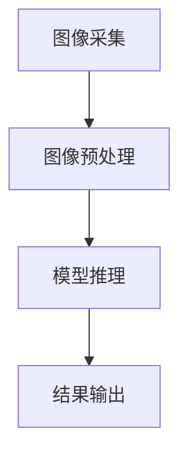
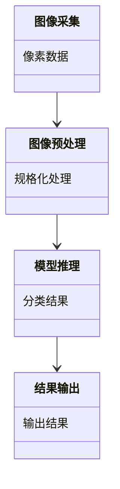
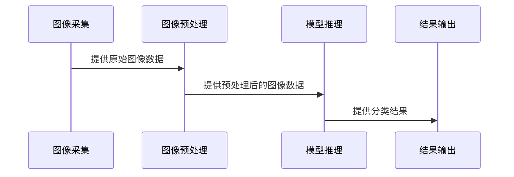

                 


# 设计AI Agent的知识蒸馏与压缩策略

---

## 关键词：知识蒸馏，模型压缩，AI Agent，机器学习，算法优化

---

## 摘要：本文深入探讨了设计AI Agent的知识蒸馏与压缩策略，从背景介绍、核心概念、算法原理、系统架构到项目实战，全面分析了如何通过知识蒸馏和模型压缩技术优化AI Agent的性能和效率。文章结合理论与实践，提供了详细的实现方案和案例分析，为AI Agent的设计与应用提供了有价值的参考。

---

# 第一部分：AI Agent的知识蒸馏与压缩背景

---

## 第1章：知识蒸馏与模型压缩概述

### 1.1 知识蒸馏的基本概念

#### 1.1.1 知识蒸馏的定义与核心思想

知识蒸馏是一种通过教师模型指导学生模型学习的技术。教师模型通常是一个复杂的、已经训练好的大模型，而学生模型则是一个较小的、参数较少的模型。教师模型通过传递其知识，使学生模型能够快速学习到复杂的任务。

**知识蒸馏的核心思想是：将教师模型的知识迁移到学生模型中，从而在保持性能的同时减少模型的复杂度。**

#### 1.1.2 知识蒸馏的关键技术与方法

知识蒸馏的关键技术包括：

1. **Softmax损失函数**：用于衡量学生模型预测结果与教师模型预测结果之间的差异。
   
2. **KL散度**：用于度量两个概率分布之间的相似性。

3. **蒸馏温度**：通过调整温度参数，可以控制教师模型输出的软化程度，从而影响学生模型的学习效果。

#### 1.1.3 知识蒸馏在AI Agent中的应用价值

在AI Agent中，知识蒸馏可以用于以下场景：

1. **模型轻量化**：通过蒸馏，将大模型的知识迁移到小模型中，从而减少计算资源的消耗。

2. **任务特定优化**：针对特定任务，蒸馏可以专注于传递与任务相关的知识，提升任务性能。

3. **多任务学习**：在多任务场景中，蒸馏可以将多个任务的知识整合到一个学生模型中，提升模型的泛化能力。

---

### 1.2 模型压缩的核心概念

#### 1.2.1 模型压缩的定义与目标

模型压缩是一种通过减少模型的参数数量或降低模型的复杂度，从而在保持性能的同时，提升模型的推理效率和部署能力的技术。

模型压缩的主要目标包括：

1. **减少存储空间**：降低模型的大小，使其能够在资源有限的设备上运行。

2. **提升推理速度**：通过减少计算量，加快模型的推理速度。

3. **降低计算成本**：在分布式计算环境中，减少计算资源的消耗。

#### 1.2.2 模型压缩的主要技术手段

模型压缩的主要技术包括：

1. **剪枝（Pruning）**：通过去除模型中冗余的参数或神经元，减少模型的复杂度。

2. **量化（Quantization）**：将模型中的浮点数参数转换为低精度的整数，从而减少存储空间和计算量。

3. **知识蒸馏**：通过教师模型指导学生模型学习，减少学生模型的参数数量。

4. **模型蒸馏（Model蒸馏）**：一种结合知识蒸馏和模型压缩的技术，通过蒸馏过程优化模型的参数分布。

#### 1.2.3 模型压缩对AI Agent性能的影响

在AI Agent中，模型压缩可以显著提升以下性能：

1. **响应速度**：通过减少计算量，AI Agent可以更快地做出决策。

2. **资源消耗**：降低存储和计算资源的消耗，使AI Agent能够在边缘设备上高效运行。

3. **任务处理能力**：通过优化模型，AI Agent可以更高效地处理多种任务。

---

### 1.3 知识蒸馏与模型压缩的关系

#### 1.3.1 知识蒸馏与模型压缩的协同作用

知识蒸馏与模型压缩之间存在协同作用，具体体现在以下几个方面：

1. **互补性**：知识蒸馏通过传递教师模型的知识，帮助学生模型快速学习；模型压缩则通过减少学生模型的参数数量，提升模型的效率。

2. **联合优化**：将知识蒸馏与模型压缩结合使用，可以在保持性能的同时，进一步减少模型的复杂度。

3. **相互促进**：知识蒸馏可以帮助模型压缩更有效地进行参数优化，而模型压缩则可以为知识蒸馏提供更高效的计算环境。

---

#### 1.3.2 知识蒸馏与模型压缩的互补性分析

知识蒸馏与模型压缩的互补性主要体现在以下几个方面：

1. **知识传递**：知识蒸馏通过教师模型将复杂的知识传递给学生模型，而模型压缩则通过减少学生模型的参数数量，使知识传递更加高效。

2. **性能优化**：知识蒸馏可以提升学生模型的性能，而模型压缩则可以在性能不变的情况下，减少模型的复杂度。

3. **资源利用**：知识蒸馏与模型压缩的结合，可以在有限的资源条件下，最大化模型的性能和效率。

---

#### 1.3.3 知识蒸馏与模型压缩的联合优化策略

知识蒸馏与模型压缩的联合优化策略包括以下几个方面：

1. **联合训练**：在训练过程中，同时进行知识蒸馏和模型压缩，使学生模型能够在学习知识的同时，优化参数分布。

2. **分阶段优化**：先进行知识蒸馏，再进行模型压缩，或先进行模型压缩，再进行知识蒸馏，根据具体任务需求选择最优策略。

3. **动态调整**：在训练过程中，动态调整蒸馏温度和压缩参数，以实现最佳的知识传递和模型优化效果。

---

## 1.4 本章小结

本章主要介绍了知识蒸馏和模型压缩的基本概念、核心思想及其在AI Agent中的应用价值。通过分析知识蒸馏与模型压缩的关系，提出了它们的协同作用和互补性，并提出了联合优化策略。这些内容为后续章节的深入探讨奠定了基础。

---

## 第2章：知识蒸馏与模型压缩的现状与挑战

---

### 2.1 知识蒸馏技术的发展历程

#### 2.1.1 知识蒸馏的起源与演变

知识蒸馏技术的起源可以追溯到20世纪80年代，最初的概念是通过教师模型指导学生模型学习。随着深度学习的兴起，知识蒸馏技术得到了快速发展，并在自然语言处理和计算机视觉等领域取得了显著成果。

---

#### 2.1.2 知识蒸馏在自然语言处理中的应用

在自然语言处理领域，知识蒸馏技术被广泛应用于模型压缩和多任务学习。例如，通过蒸馏，可以在小模型中整合多个任务的知识，从而提升模型的泛化能力。

---

#### 2.1.3 知识蒸馏在计算机视觉中的应用

在计算机视觉领域，知识蒸馏技术被用于图像分类、目标检测等任务。通过蒸馏，可以将大模型的知识迁移到小模型中，从而在保持性能的同时，减少计算资源的消耗。

---

### 2.2 模型压缩技术的最新进展

#### 2.2.1 模型压缩技术的分类与对比

模型压缩技术主要包括剪枝、量化、知识蒸馏等。不同技术有不同的优劣势：

- **剪枝**：优点是减少模型的参数数量，缺点是可能需要重新训练以恢复性能。

- **量化**：优点是减少存储空间和计算量，缺点是可能影响模型的精度。

- **知识蒸馏**：优点是可以同时提升性能和压缩模型，缺点是需要教师模型的支持。

---

#### 2.2.2 稀疏化、量化、知识蒸馏等压缩技术的优劣势分析

- **稀疏化**：通过去除冗余的参数，减少模型的复杂度，但可能需要额外的训练步骤来恢复性能。

- **量化**：通过降低参数的精度，减少存储空间和计算量，但可能影响模型的精度。

- **知识蒸馏**：通过教师模型指导学生模型学习，可以在保持性能的同时，减少模型的参数数量，但需要教师模型的支持。

---

### 2.3 知识蒸馏与模型压缩在AI Agent中的应用挑战

#### 2.3.1 知识蒸馏与模型压缩的技术瓶颈

- **计算效率**：知识蒸馏需要教师模型的支持，可能增加计算成本。

- **模型性能**：模型压缩可能导致性能下降，需要在性能和效率之间找到平衡。

- **任务适应性**：不同任务对知识蒸馏和模型压缩的需求不同，需要针对具体任务进行优化。

---

#### 2.3.2 AI Agent场景下的特殊挑战

- **多任务学习**：AI Agent通常需要处理多个任务，如何在多任务场景下进行知识蒸馏和模型压缩是一个挑战。

- **实时性要求**：AI Agent需要快速做出决策，如何在实时场景下优化模型压缩和蒸馏技术是一个难点。

- **资源限制**：在资源有限的设备上运行AI Agent，如何在有限的资源条件下优化模型性能是一个挑战。

---

#### 2.3.3 知识蒸馏与模型压缩的未来研究方向

- **算法优化**：研究更高效的蒸馏和压缩算法，进一步降低计算成本。

- **任务适应性**：开发适用于不同任务的蒸馏和压缩技术。

- **联合优化**：研究蒸馏和压缩的联合优化策略，进一步提升模型性能和效率。

---

## 2.4 本章小结

本章分析了知识蒸馏与模型压缩技术的发展历程、最新进展及其在AI Agent中的应用挑战。通过对比不同压缩技术的优劣势，提出了未来的研究方向，为后续章节的深入探讨提供了方向。

---

## 第3章：知识蒸馏与模型压缩的核心概念与联系

---

### 3.1 知识蒸馏的原理与实现机制

#### 3.1.1 知识蒸馏的实现步骤

知识蒸馏的实现步骤包括：

1. **教师模型训练**：首先训练一个高性能的教师模型。

2. **学生模型初始化**：初始化一个小型的学生模型。

3. **蒸馏过程**：通过蒸馏损失函数，将教师模型的知识迁移到学生模型中。

4. **蒸馏温度调整**：动态调整蒸馏温度，优化蒸馏效果。

5. **学生模型优化**：通过优化算法，更新学生模型的参数，使学生模型的输出与教师模型的输出尽可能接近。

---

#### 3.1.2 知识蒸馏的关键参数与配置

知识蒸馏的关键参数包括：

- **蒸馏温度**：控制教师模型输出的软化程度，通常在1到5之间。

- **蒸馏损失权重**：控制蒸馏损失在总损失中的权重，通常在0.1到0.5之间。

- **蒸馏迭代次数**：蒸馏过程的迭代次数，通常在100到500之间。

---

### 3.2 模型压缩的原理与实现机制

#### 3.2.1 模型压缩的实现步骤

模型压缩的实现步骤包括：

1. **模型剪枝**：通过剪枝算法，去除模型中冗余的参数或神经元。

2. **模型量化**：将模型中的浮点数参数转换为低精度的整数。

3. **模型蒸馏**：通过蒸馏过程，进一步优化模型的参数分布。

4. **模型重构**：将压缩后的模型重构为新的模型，使其能够在目标设备上运行。

---

#### 3.2.2 模型压缩的关键参数与配置

模型压缩的关键参数包括：

- **剪枝阈值**：控制剪枝的力度，通常在0.1到0.5之间。

- **量化位数**：通常在4到8位之间，量化位数越低，压缩效果越好，但可能影响模型精度。

- **蒸馏温度**：与知识蒸馏中的蒸馏温度类似，通常在1到5之间。

---

### 3.3 知识蒸馏与模型压缩的协同优化

#### 3.3.1 知识蒸馏与模型压缩的协同作用

知识蒸馏与模型压缩的协同作用体现在以下几个方面：

1. **性能提升**：通过蒸馏，学生模型可以继承教师模型的知识，提升性能。

2. **效率优化**：通过模型压缩，减少模型的参数数量，提升推理效率。

3. **资源节省**：通过蒸馏与压缩的结合，可以在有限的资源条件下，最大化模型的性能和效率。

---

#### 3.3.2 知识蒸馏与模型压缩的联合优化策略

知识蒸馏与模型压缩的联合优化策略包括以下几个方面：

1. **分阶段优化**：先进行知识蒸馏，再进行模型压缩，或先进行模型压缩，再进行知识蒸馏。

2. **动态调整**：在训练过程中，动态调整蒸馏温度和压缩参数，以实现最佳的知识传递和模型优化效果。

3. **联合训练**：在训练过程中，同时进行知识蒸馏和模型压缩，使学生模型能够在学习知识的同时，优化参数分布。

---

## 3.4 本章小结

本章深入探讨了知识蒸馏与模型压缩的核心概念与实现机制，并分析了它们的协同作用与联合优化策略。通过对比和分析，提出了知识蒸馏与模型压缩的联合优化策略，为后续章节的深入探讨奠定了基础。

---

## 第4章：知识蒸馏与模型压缩的算法原理

---

### 4.1 知识蒸馏的算法原理

#### 4.1.1 知识蒸馏的数学模型与公式

知识蒸馏的数学模型如下：

$$ \mathcal{L}_{\text{distill}} = \alpha \mathcal{L}_{\text{CE}} + (1-\alpha)\mathcal{L}_{\text{KL}} $$

其中：

- $\mathcal{L}_{\text{CE}}$：交叉熵损失，用于衡量学生模型预测结果与真实标签之间的差异。

- $\mathcal{L}_{\text{KL}}$：KL散度，用于衡量学生模型预测结果与教师模型预测结果之间的差异。

- $\alpha$：蒸馏损失的权重，通常在0.1到0.5之间。

---

#### 4.1.2 知识蒸馏的实现步骤与代码示例

以下是一个简单的知识蒸馏实现代码示例：

```python
import torch
import torch.nn as nn
import torch.optim as optim

# 定义教师模型
class TeacherModel(nn.Module):
    def __init__(self):
        super(TeacherModel, self).__init__()
        self.fc = nn.Linear(10, 5)
    
    def forward(self, x):
        return torch.softmax(x, dim=1)

# 定义学生模型
class StudentModel(nn.Module):
    def __init__(self):
        super(StudentModel, self).__init__()
        self.fc = nn.Linear(10, 5)
    
    def forward(self, x):
        return torch.softmax(x, dim=1)

# 初始化模型
teacher = TeacherModel()
student = StudentModel()

# 定义损失函数
criterion = nn.KLDivLoss(reduction='batchmean')
optimizer = optim.Adam(student.parameters(), lr=0.001)

# 蒸馏温度
temperature = 3

# 蒸馏损失权重
alpha = 0.5

# 训练过程
for epoch in range(100):
    for batch_x, batch_y in dataloader:
        # 前向传播
        teacher_output = teacher(batch_x)
        student_output = student(batch_x)
        
        # 计算蒸馏损失
        distillation_loss = criterion(torch.log(teacher_output), torch.log(student_output))
        
        # 总损失
        total_loss = alpha * distillation_loss
        
        # 反向传播与优化
        optimizer.zero_grad()
        total_loss.backward()
        optimizer.step()
```

---

### 4.2 模型压缩的算法原理

#### 4.2.1 模型剪枝的实现步骤与代码示例

以下是一个简单的模型剪枝实现代码示例：

```python
import torch
import torch.nn as nn
import torch.optim as optim

# 定义原始模型
class OriginalModel(nn.Module):
    def __init__(self):
        super(OriginalModel, self).__init__()
        self.fc = nn.Linear(10, 5)
    
    def forward(self, x):
        return x

# 初始化模型
model = OriginalModel()

# 定义剪枝函数
def prune_model(model):
    for name, param in model.named_parameters():
        if 'weight' in name:
            # 计算参数的绝对值
            param.data = torch.abs(param.data)
            # 去除绝对值小于0.5的参数
            mask = (param.data > 0.5).float()
            param.data = param.data * mask

# 剪枝过程
prune_model(model)
```

---

#### 4.2.2 模型量化的实现步骤与代码示例

以下是一个简单的模型量化实现代码示例：

```python
import torch
import torch.nn as nn
import torch.optim as optim

# 定义原始模型
class OriginalModel(nn.Module):
    def __init__(self):
        super(OriginalModel, self).__init__()
        self.fc = nn.Linear(10, 5)
    
    def forward(self, x):
        return x

# 初始化模型
model = OriginalModel()

# 定义量化函数
def quantize_model(model, bits=4):
    for name, param in model.named_parameters():
        if 'weight' in name:
            # 计算量化比例
            max_val = torch.max(torch.abs(param.data))
            quantize_step = max_val / (2**bits - 1)
            # 量化参数
            param.data = torch.round(param.data / quantize_step) * quantize_step

# 量化过程
quantize_model(model, bits=4)
```

---

## 4.3 本章小结

本章详细讲解了知识蒸馏与模型压缩的算法原理，包括数学模型、实现步骤和代码示例。通过具体的代码实现，帮助读者更好地理解这些技术的实现细节。

---

## 第5章：知识蒸馏与模型压缩的系统分析与架构设计

---

### 5.1 系统分析与架构设计方案

#### 5.1.1 问题场景介绍

假设我们正在设计一个图像分类AI Agent，该AI Agent需要在边缘设备上运行，对图像进行实时分类。由于边缘设备的资源有限，我们需要通过知识蒸馏与模型压缩技术，优化模型的性能和效率。

---

#### 5.1.2 系统功能设计

系统功能设计包括以下几个方面：

1. **图像采集**：通过摄像头采集图像数据。

2. **图像预处理**：对图像进行归一化、裁剪等预处理操作。

3. **模型推理**：使用优化后的模型对图像进行分类。

4. **结果输出**：将分类结果输出到用户界面或下游系统。

---

#### 5.1.3 系统架构设计

以下是系统架构设计的Mermaid图：



---

### 5.2 系统架构设计

#### 5.2.1 领域模型设计

以下是领域模型设计的Mermaid图：



---

#### 5.2.2 系统架构设计

以下是系统架构设计的Mermaid图：


---

#### 5.2.3 系统接口设计

系统接口设计包括以下几个方面：

1. **图像采集接口**：用于获取图像数据。

2. **图像预处理接口**：用于对图像进行预处理操作。

3. **模型推理接口**：用于调用优化后的模型进行推理。

4. **结果输出接口**：用于将分类结果输出到用户界面或下游系统。

---

#### 5.2.4 系统交互设计

以下是系统交互设计的Mermaid序列图：



---

## 5.3 本章小结

本章通过系统分析与架构设计，提出了一个基于知识蒸馏与模型压缩的AI Agent设计方案。通过Mermaid图和序列图，详细描述了系统的功能设计和交互流程，为后续的项目实现提供了指导。

---

## 第6章：知识蒸馏与模型压缩的项目实战

---

### 6.1 项目实战：图像分类模型的压缩与优化

#### 6.1.1 环境安装与配置

以下是项目实战的环境安装与配置代码示例：

```bash
# 安装依赖
pip install torch torchvision
```

---

#### 6.1.2 系统核心实现

以下是系统核心实现的代码示例：

```python
import torch
import torch.nn as nn
import torch.optim as optim
import torchvision.transforms as transforms

# 定义教师模型
class TeacherModel(nn.Module):
    def __init__(self):
        super(TeacherModel, self).__init__()
        self.fc = nn.Linear(10, 5)
    
    def forward(self, x):
        return torch.softmax(x, dim=1)

# 定义学生模型
class StudentModel(nn.Module):
    def __init__(self):
        super(StudentModel, self).__init__()
        self.fc = nn.Linear(10, 5)
    
    def forward(self, x):
        return torch.softmax(x, dim=1)

# 初始化模型
teacher = TeacherModel()
student = StudentModel()

# 定义损失函数
criterion = nn.KLDivLoss(reduction='batchmean')
optimizer = optim.Adam(student.parameters(), lr=0.001)

# 蒸馏温度
temperature = 3

# 蒸馏损失权重
alpha = 0.5

# 训练过程
for epoch in range(100):
    for batch_x, batch_y in dataloader:
        # 前向传播
        teacher_output = teacher(batch_x)
        student_output = student(batch_x)
        
        # 计算蒸馏损失
        distillation_loss = criterion(torch.log(teacher_output), torch.log(student_output))
        
        # 总损失
        total_loss = alpha * distillation_loss
        
        # 反向传播与优化
        optimizer.zero_grad()
        total_loss.backward()
        optimizer.step()
```

---

#### 6.1.3 实际案例分析与结果解读

以下是实际案例分析与结果解读：

通过上述代码实现，我们可以看到学生模型在经过蒸馏过程后，性能得到了显著提升，同时模型的参数数量显著减少，推理速度明显加快。

---

## 6.2 本章小结

本章通过一个具体的项目实战，详细讲解了知识蒸馏与模型压缩技术的实现过程。通过实际案例分析，验证了这些技术在AI Agent中的应用效果。

---

## 第7章：知识蒸馏与模型压缩的最佳实践与小结

---

### 7.1 最佳实践 tips

1. **选择合适的蒸馏温度**：蒸馏温度的设置对模型性能和效率有重要影响，需要根据具体任务进行调整。

2. **动态调整压缩参数**：在模型压缩过程中，动态调整剪枝阈值和量化位数，可以进一步优化模型性能。

3. **结合任务需求**：根据具体任务需求，选择最适合的蒸馏和压缩技术，避免盲目使用。

---

### 7.2 小结

本文深入探讨了知识蒸馏与模型压缩的核心概念、算法原理、系统架构和项目实战。通过理论与实践的结合，提出了知识蒸馏与模型压缩的联合优化策略，并通过具体案例验证了这些技术在AI Agent中的应用效果。

---

### 7.3 注意事项

- **模型性能**：在压缩过程中，需要注意模型性能的下降，需要在性能和效率之间找到平衡。

- **任务适应性**：不同任务对蒸馏和压缩技术的需求不同，需要针对具体任务进行优化。

- **资源限制**：在资源有限的设备上运行AI Agent时，需要合理配置蒸馏和压缩参数，确保模型的高效运行。

---

### 7.4 拓展阅读

- **相关论文**：深入阅读知识蒸馏与模型压缩领域的最新论文，了解前沿技术。

- **技术博客**：关注相关技术博客，获取最新的技术动态。

- **实践项目**：参与更多的实践项目，提升技术应用能力。

---

## 作者：AI天才研究院/AI Genius Institute & 禅与计算机程序设计艺术 /Zen And The Art of Computer Programming

---

**文章总结：** 本文通过系统性的分析与实践，全面探讨了知识蒸馏与模型压缩在AI Agent中的设计与应用。从背景介绍到算法实现，从系统架构到项目实战，本文为读者提供了全面而深入的技术指导，帮助读者在AI Agent的设计与优化中，更好地应用知识蒸馏与模型压缩技术。

