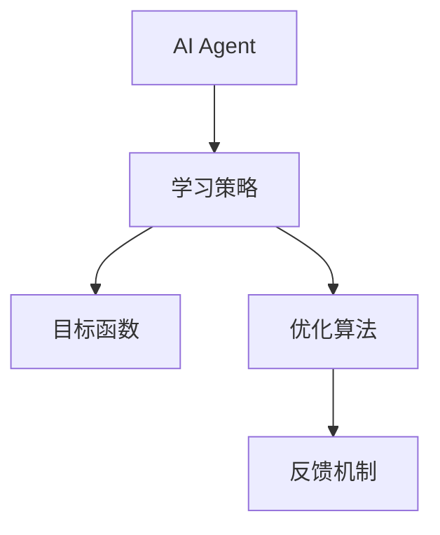
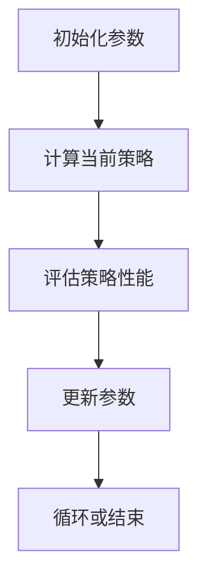
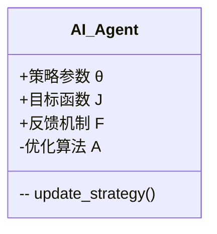
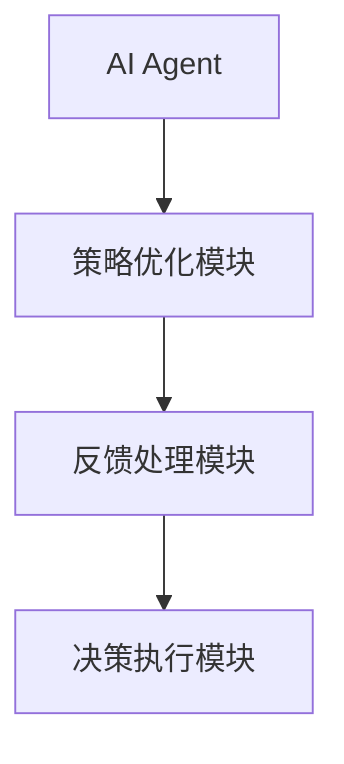
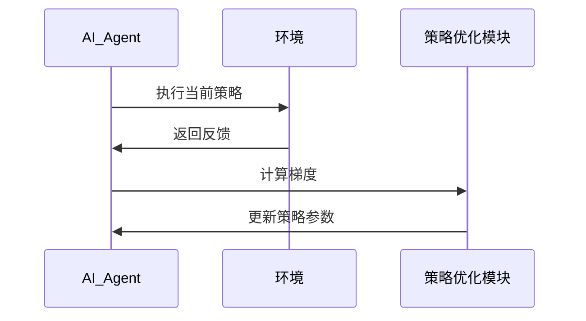

                 


# 设计AI Agent的自我修正学习策略

---

## 关键词：  
AI Agent, 自我修正学习, 策略优化, 算法原理, 系统架构, 项目实战  

---

## 摘要：  
本文将深入探讨AI Agent的自我修正学习策略的设计与实现。从问题背景到核心概念，从算法原理到系统架构，再到项目实战，我们将全面解析如何构建一个能够自我修正、持续优化的学习策略。通过结合数学模型、系统设计和实际案例，本文将为读者提供一份详尽的指南，帮助他们理解并掌握AI Agent的自我修正学习策略的设计方法。  

---

## 第一部分：背景介绍  

### 第1章：问题背景与问题描述  

#### 1.1 问题背景  
- 1.1.1 AI Agent的基本概念  
  AI Agent（智能体）是指能够感知环境、做出决策并采取行动的智能系统。它可以自主学习、适应环境变化并优化自身的行为策略。  
- 1.1.2 自我修正学习策略的必要性  
  在复杂动态环境中，AI Agent需要不断调整其学习策略以应对新情况。自我修正学习策略能够帮助AI Agent快速适应环境变化，避免因固定策略导致的性能下降。  
- 1.1.3 当前AI Agent面临的挑战  
  当前AI Agent在实际应用中面临的主要挑战包括环境不确定性、策略过时、计算资源限制等。  

#### 1.2 问题描述  
- 1.2.1 自我修正学习的定义  
  自我修正学习是指AI Agent能够在运行过程中根据反馈信息主动调整其学习策略，以优化自身的决策能力。  
- 1.2.2 学习策略的核心要素  
  学习策略的核心要素包括目标函数、优化算法、反馈机制和策略更新规则。  
- 1.2.3 问题解决的目标与边界  
  问题解决的目标是设计一种能够持续优化的自我修正学习策略，边界包括环境动态性、计算资源限制和策略收敛性。  

#### 1.3 问题解决方法  
- 1.3.1 自我修正学习策略的设计思路  
  自我修正学习策略的设计思路包括动态目标设定、在线反馈收集、策略自适应优化等。  
- 1.3.2 现有解决方案的优缺点  
  现有解决方案的优点包括实时性高、适应性强；缺点包括计算开销大、策略更新不稳定。  
- 1.3.3 创新点与改进方向  
  创新点在于结合强化学习和元学习的思想，改进方向包括优化算法效率、增强策略稳定性。  

---

## 第二部分：核心概念与联系  

### 第2章：AI Agent与自我修正学习策略的核心概念  

#### 2.1 核心概念原理  
- 2.1.1 AI Agent的基本原理  
  AI Agent通过感知环境、构建模型、制定决策和执行动作来实现其目标。  
- 2.1.2 自我修正学习策略的机制  
  自我修正学习策略通过反馈机制不断调整学习目标和优化算法，以提升决策性能。  
- 2.1.3 策略优化的核心要素  
  策略优化的核心要素包括目标函数、优化算法、反馈机制和策略更新规则。  

#### 2.2 核心概念对比分析  
- 2.2.1 不同学习策略的特征对比  
  | 学习策略 | 目标函数 | 优化算法 | 反馈机制 |  
  |----------|----------|----------|----------|  
  | 强化学习 | 奖励函数 | 梯度下降 | 延时反馈 |  
  | 监督学习 | 标签匹配 | 最小二乘法 | 即时反馈 |  
- 2.2.2 策略优化算法的性能对比  
  | 算法名称 | 收敛速度 | 稳定性 | 计算复杂度 |  
  |----------|----------|----------|------------|  
  | Q-Learning | 中等 | 高 | 高 |  
  | SARSA | 中等 | 中等 | 中等 |  
- 2.2.3 策略稳定性的关键因素  
  策略稳定性的关键因素包括反馈机制的可靠性、目标函数的设计和优化算法的收敛性。  

#### 2.3 实体关系图（ER图）  


---

## 第三部分：算法原理讲解  

### 第3章：自我修正学习策略的算法原理  

#### 3.1 算法原理概述  
- 3.1.1 算法的基本思路  
  自我修正学习策略的核心思想是通过实时反馈不断优化策略参数，以提升决策性能。  
- 3.1.2 算法的核心步骤  
  1. 初始化策略参数。  
  2. 通过环境反馈计算梯度。  
  3. 根据梯度更新策略参数。  
  4. 重复上述步骤直到收敛或达到目标。  

#### 3.2 算法流程图  


#### 3.3 算法实现代码  
```python
def self_correcting_strategy():
    params = initialize_params()
    while True:
        current_policy = compute_policy(params)
        feedback = get_feedback(current_policy)
        gradient = compute_gradient(params, feedback)
        params = update_params(params, gradient)
```

#### 3.4 数学模型与公式  
- 3.4.1 目标函数  
  $$ J(\theta) = \sum_{i=1}^{n} f(x_i, y_i, \theta) $$  
  其中，$$\theta$$ 是策略参数，$$f$$ 是反馈函数。  
- 3.4.2 梯度计算  
  $$ \nabla J(\theta) = \sum_{i=1}^{n} \frac{\partial f}{\partial \theta}(x_i, y_i, \theta) $$  
- 3.4.3 参数更新  
  $$ \theta_{new} = \theta_{old} - \alpha \nabla J(\theta_{old}) $$  
  其中，$$\alpha$$ 是学习率。  

---

## 第四部分：系统分析与架构设计  

### 第4章：系统分析与架构设计  

#### 4.1 问题场景介绍  
- 系统需要支持实时反馈和策略优化，能够在动态环境中快速调整策略。  
- 系统需要具备高效的计算能力，以支持大规模数据处理和快速决策。  

#### 4.2 系统功能设计  
- 领域模型设计：  


- 系统架构设计：  


- 接口设计：  
  - 输入接口：环境反馈、目标函数值。  
  - 输出接口：优化后的策略参数、决策结果。  

- 交互流程图：  


---

## 第五部分：项目实战  

### 第5章：项目实战  

#### 5.1 环境安装与配置  
- 安装Python和相关库（如NumPy、TensorFlow、Keras）。  

#### 5.2 核心代码实现  
```python
import numpy as np
import tensorflow as tf

def compute_policy(params, state):
    # 计算当前策略
    return tf.nn.softmax(tf.matmul(state, params['policy_weights']) + params['policy_bias'])

def compute_gradient(params, state, action, reward):
    # 计算梯度
    with tf.GradientTape() as tape:
        policy = compute_policy(params, state)
        loss = -tf.log(policy[action]) * reward
    gradients = tape.gradient(loss, [params['policy_weights'], params['policy_bias']])
    return gradients

def update_params(params, gradients, learning_rate):
    # 更新参数
    optimizer = tf.keras.optimizers.Adam(learning_rate=learning_rate)
    optimizer.apply_gradients(zip([gradients[0], gradients[1]], 
                                  [params['policy_weights'], params['policy_bias']]))
```

#### 5.3 代码解读与分析  
- `compute_policy` 函数用于计算当前策略的概率分布。  
- `compute_gradient` 函数通过梯度带tape计算梯度。  
- `update_params` 函数使用Adam优化器更新策略参数。  

#### 5.4 实际案例分析  
假设我们设计一个简单的库存管理AI Agent，其目标是通过自我修正学习策略优化库存水平。通过实时销售数据和市场反馈，AI Agent能够不断调整其订货策略，以最小化成本和最大化利润。  

---

## 第六部分：最佳实践与小结  

### 第6章：最佳实践  

#### 6.1 小结  
- 自我修正学习策略的关键在于实时反馈和策略优化。  
- 系统设计需要考虑动态性、计算效率和稳定性。  

#### 6.2 注意事项  
- 确保反馈机制的可靠性，避免错误反馈导致策略偏差。  
- 优化算法的选择需要根据具体场景和计算资源进行权衡。  

#### 6.3 拓展阅读  
- 建议深入研究强化学习和元学习的相关论文，探索更高效的策略优化方法。  

---

## 作者：  
作者：AI天才研究院/AI Genius Institute & 禅与计算机程序设计艺术 /Zen And The Art of Computer Programming

