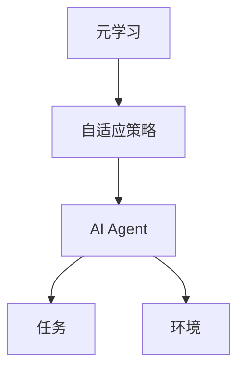
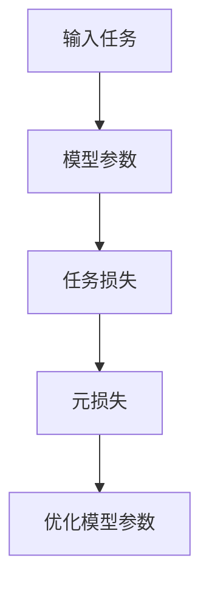
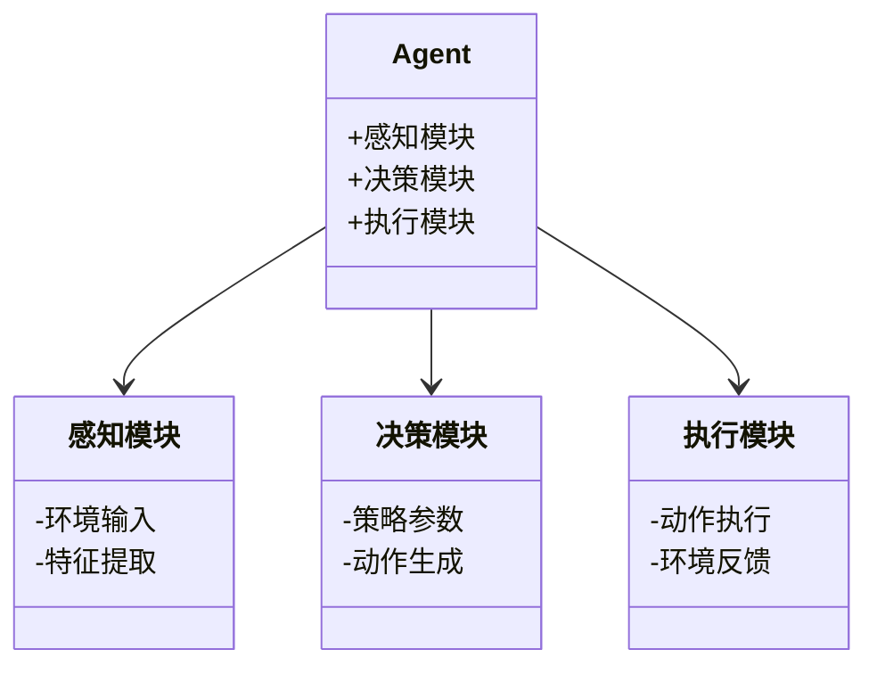
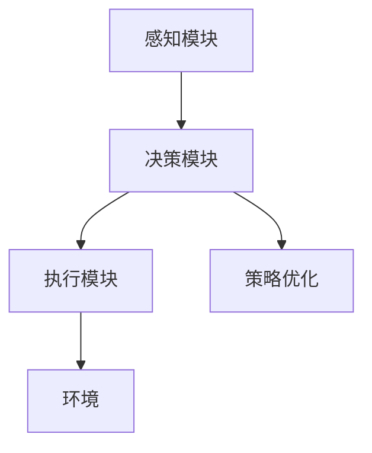

                 


# 设计AI Agent的自适应元学习策略

**关键词**：AI Agent, 元学习, 自适应学习, 策略优化, 强化学习, 迁移学习, 系统架构设计

**摘要**：  
本文旨在探讨如何设计AI Agent的自适应元学习策略。通过分析问题背景、核心概念和算法原理，结合系统架构设计和项目实战，深入讲解如何利用元学习提升AI Agent的自适应能力，使其在动态环境中实现高效学习与策略优化。文章内容涵盖理论与实践，适合对AI Agent和元学习感兴趣的读者阅读。

---

## 第一章: 问题背景与核心概念

### 1.1 问题背景

#### 1.1.1 人工智能与AI Agent的发展现状
人工智能（AI）技术的快速发展推动了AI Agent的应用。AI Agent是一种能够感知环境、自主决策并执行任务的智能体，广泛应用于机器人、自动驾驶、智能助手等领域。然而，传统AI Agent在动态、复杂环境中的适应性有限，难以快速应对未知任务和变化。

#### 1.1.2 自适应学习的需求与挑战
在实际应用中，AI Agent需要在动态环境中快速适应新任务，例如在机器人导航中避障策略的变化，或者在智能助手中处理用户的多样化需求。传统机器学习方法依赖大量标注数据且难以快速调整，难以满足实时性要求。因此，如何设计一种高效的自适应学习机制成为关键。

#### 1.1.3 元学习在AI Agent中的应用价值
元学习（Meta-Learning）是一种新兴的学习方法，旨在让模型学会“如何学习”，而非仅仅“学习某件事”。通过元学习，AI Agent可以在有限的数据和时间下快速适应新任务，提升其自适应能力。本文将重点探讨如何设计基于元学习的自适应策略，以提升AI Agent的灵活性和效率。

### 1.2 问题描述

#### 1.2.1 AI Agent在动态环境中的适应性问题
AI Agent需要在动态环境中快速调整策略以应对新任务，例如在智能机器人中避障策略的变化。传统强化学习（Reinforcement Learning）方法虽然可以在特定任务中表现优异，但难以快速适应新环境，训练成本高。

#### 1.2.2 元学习在自适应策略中的作用
元学习通过优化模型的参数更新方式，使其能够在新任务中快速调整策略。例如，在元学习框架下，AI Agent可以在新环境中快速找到最优策略，无需从头开始训练。

#### 1.2.3 问题解决的边界与外延
本文将聚焦于基于元学习的自适应策略设计，重点探讨算法原理、系统架构和项目实现。文章的范围限定在AI Agent的策略优化和自适应学习，不涉及感知和执行层面的具体实现。

### 1.3 核心概念与联系

#### 1.3.1 自适应元学习的定义与特征
自适应元学习是一种通过元学习方法实现自适应策略优化的技术。其核心特征包括：
- **快速适应性**：能够在有限的数据和时间下快速适应新任务。
- **通用性**：适用于多种任务和环境。
- **自适应性**：通过动态调整策略参数实现灵活应对变化。

#### 1.3.2 AI Agent的系统架构与功能模块
AI Agent的系统架构通常包括感知、决策和执行三个模块：
- **感知模块**：负责接收环境输入并提取特征。
- **决策模块**：基于特征和策略参数生成动作。
- **执行模块**：将动作转化为实际操作。

#### 1.3.3 核心概念对比表格
| 概念         | 描述                               |
|--------------|------------------------------------|
| 元学习       | 学习如何学习，优化参数更新策略       |
| 自适应学习   | 在动态环境中快速调整策略           |
| AI Agent     | 具备感知、决策和执行能力的智能体     |

#### 1.3.4 ER实体关系图（Mermaid流程图）


---

## 第二章: 元学习算法原理

### 2.1 元学习算法概述

#### 2.1.1 Meta-Learning的基本概念
元学习是一种通过优化模型的参数更新方式，使其能够快速适应新任务的技术。其核心思想是通过在多个任务上的训练，使模型具备快速调整的能力。

#### 2.1.2 基于梯度的元学习方法
基于梯度的元学习方法是最常见的实现方式，例如模型agnostic meta-learning（MAML）算法。

#### 2.1.3 元学习与传统机器学习的对比
| 特性         | 元学习             | 传统机器学习       |
|--------------|--------------------|--------------------|
| 数据需求     | 较低               | 较高               |
| 适应性       | 高                 | 低                 |
| 训练效率     | 高                 | 低                 |

### 2.2 常见元学习算法解析

#### 2.2.1 MAML算法原理（Mermaid流程图）


#### 2.2.2 Reptile算法的工作机制
Reptile算法通过在每个任务上进行局部优化，然后将所有任务的优化结果平均化，实现模型参数的更新。

#### 2.2.3 元学习与自适应策略的结合
自适应元学习通过动态调整模型参数，使其能够在新任务中快速找到最优策略。

### 2.3 元学习算法的数学模型

#### 2.3.1 MAML算法的数学模型
MAML的目标是最小化元损失，即：
$$
\min_{\theta} \sum_{i=1}^{N} L_i(\theta + \delta_i)
$$
其中，$\delta_i$是针对任务$i$的参数更新。

#### 2.3.2 基于梯度的元学习公式
元学习的梯度更新公式为：
$$
\theta = \theta - \eta \nabla_{\theta} L_{meta}
$$
其中，$\eta$是学习率，$L_{meta}$是元损失函数。

---

## 第三章: AI Agent的系统架构与设计

### 3.1 项目背景与目标

#### 3.1.1 项目需求分析
本项目旨在设计一种基于元学习的自适应策略，使AI Agent能够在动态环境中快速调整行为。

#### 3.1.2 项目目标设定
- 实现基于MAML的自适应元学习算法。
- 设计AI Agent的系统架构，实现感知、决策和执行模块的集成。

### 3.2 系统功能设计

#### 3.2.1 领域模型类图（Mermaid）


#### 3.2.2 功能模块划分
- **感知模块**：接收环境输入并提取特征。
- **决策模块**：基于特征和策略参数生成动作。
- **执行模块**：将动作转化为实际操作并返回反馈。

### 3.3 系统架构设计

#### 3.3.1 系统架构图（Mermaid）


---

## 第四章: 项目实战与实现

### 4.1 环境安装与配置

#### 4.1.1 开发环境搭建
建议使用Python 3.8及以上版本，安装必要的库：
```bash
pip install numpy matplotlib tensorflow
```

#### 4.1.2 依赖库安装
安装MAML实现所需的库：
```bash
pip install gym numpy
```

### 4.2 核心代码实现

#### 4.2.1 MAML算法实现
```python
import tensorflow as tf
import numpy as np

def meta_learning_update(model, tasks, inner_steps=1, inner_lr=1e-3, meta_lr=1e-3):
    for task in tasks:
        # 内部梯度下降
        with tf.GradientTape() as inner_tape:
            loss = model.compute_loss(task)
        inner grads = inner_tape.gradient(loss, model.trainable_weights)
        # 更新参数
        new_weights = [w - inner_lr * g for w, g in zip(model.trainable_weights, inner_grads)]
        # 计算元梯度
        with tf.GradientTape() as meta_tape:
            meta_loss = model.compute_meta_loss(task, new_weights)
        meta_grads = meta_tape.gradient(meta_loss, model.trainable_weights)
        # 元更新
        model.optimizer.apply_gradients(zip(meta_grads, model.trainable_weights))
```

#### 4.2.2 动作选择与执行
```python
def select_action(model, state):
    state = tf.convert_to_tensor([state], dtype=tf.float32)
    action_probs = model(state)
    action = np.random.choice(len(action_probs[0]))
    return action
```

---

## 第五章: 总结与展望

### 5.1 总结
本文详细探讨了设计AI Agent的自适应元学习策略的关键点，包括算法原理、系统架构和项目实现。通过MAML算法和系统设计，展示了如何提升AI Agent的自适应能力。

### 5.2 展望
未来的研究方向包括：
1. 更高效的元学习算法设计。
2. 多任务学习与自适应元学习的结合。
3. 更复杂的动态环境中的应用。

---

**作者：AI天才研究院/AI Genius Institute & 禅与计算机程序设计艺术 /Zen And The Art of Computer Programming**

