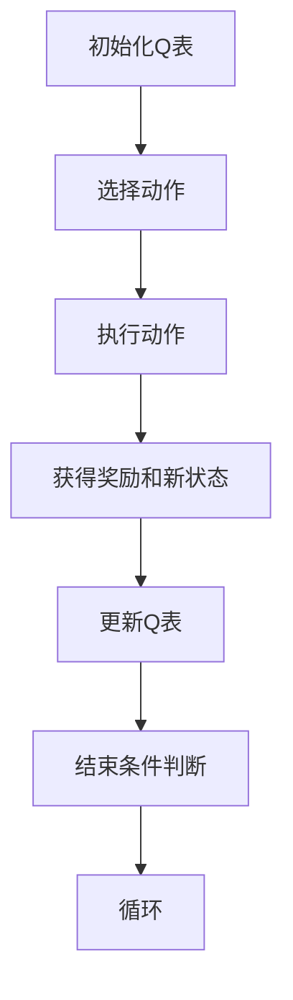
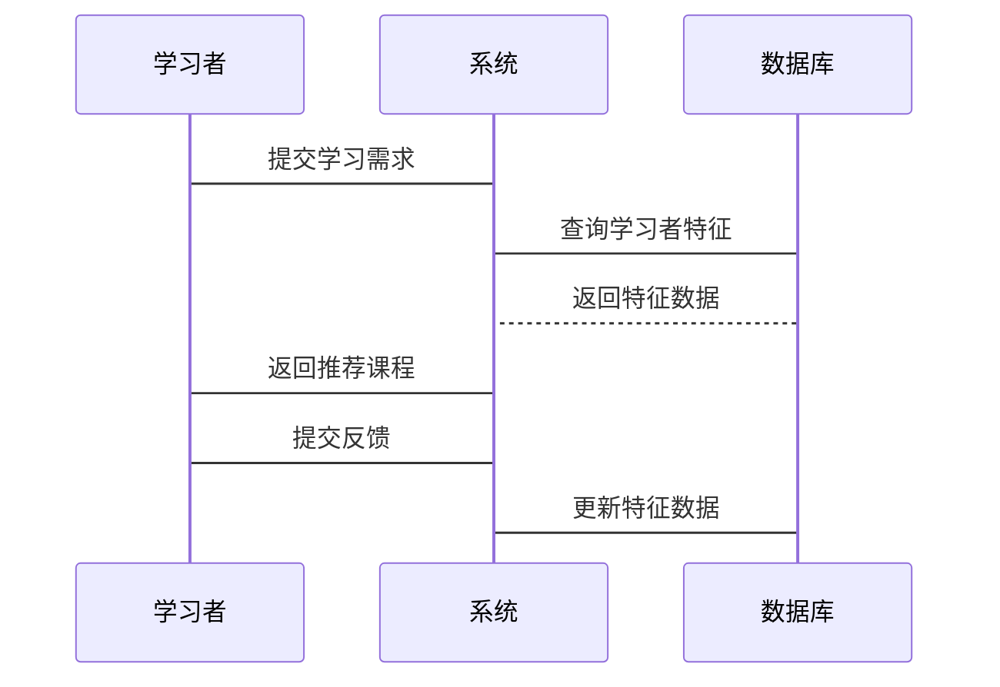

                 


# 设计AI Agent的自适应课程学习策略

**关键词**：AI Agent、自适应学习、课程设计、强化学习、推荐算法

**摘要**：  
本文探讨如何设计一种基于AI Agent的自适应课程学习策略，通过分析学习者特征、学习目标和学习路径，结合推荐算法和强化学习，实现动态调整学习计划和实时反馈优化，从而提高学习效率和效果。文章从背景介绍、核心概念、算法原理、系统架构设计到项目实战，全面阐述了自适应课程学习策略的设计与实现。

---

## 第一部分：AI Agent与自适应学习策略概述

### 第1章：AI Agent与自适应学习策略概述

#### 1.1 AI Agent的基本概念

##### 1.1.1 AI Agent的定义与分类
- **定义**：AI Agent（人工智能代理）是一种能够感知环境、自主决策并执行任务的智能实体。  
- **分类**：
  - **简单反射型Agent**：基于预定义规则直接响应输入。  
  - **基于模型的反射型Agent**：维护环境模型，基于模型进行推理和决策。  
  - **目标驱动型Agent**：基于目标驱动行为，通过规划实现目标。  
  - **效用驱动型Agent**：基于效用函数优化决策。  

##### 1.1.2 AI Agent的核心特征
- **自主性**：无需外部干预，自主完成任务。  
- **反应性**：能够实时感知环境并做出反应。  
- **目标导向性**：基于目标驱动行为，优化决策。  
- **学习能力**：通过经验或数据改进性能。  

##### 1.1.3 AI Agent在教育领域的应用背景
- **个性化学习**：AI Agent可以根据学习者的特征提供个性化学习建议。  
- **动态调整**：实时跟踪学习者的学习进度，动态调整学习计划。  
- **效率提升**：通过智能化推荐和优化，提高学习效率和效果。  

#### 1.2 自适应学习策略的基本原理

##### 1.2.1 自适应学习的定义
- **定义**：自适应学习是一种根据学习者的特点、需求和学习效果动态调整学习内容、节奏和方式的教学方法。  
- **核心要素**：
  - **学习者特征**：包括知识水平、兴趣爱好、学习风格等。  
  - **学习目标**：明确的学习目标是自适应学习的基础。  
  - **学习路径**：根据学习者特征和目标设计的个性化学习路径。  

##### 1.2.2 自适应学习的核心要素
| 核心要素 | 描述 |
|----------|------|
| 学习者特征 | 包括知识水平、兴趣、学习风格等。 |
| 学习目标 | 明确的学习目标是自适应学习的基础。 |
| 学习路径 | 根据特征和目标设计的个性化学习计划。 |

##### 1.2.3 自适应学习在教育中的意义
- **提升学习效果**：通过个性化推荐和动态调整，优化学习效果。  
- **提高学习效率**：减少无效学习时间，提高学习效率。  
- **增强学习体验**：个性化推荐和实时反馈增强学习者的参与感和体验感。  

#### 1.3 AI Agent与自适应学习策略的结合

##### 1.3.1 AI Agent在自适应学习中的作用
- **知识表示与推理**：AI Agent能够处理和推理学习者特征和学习目标。  
- **动态调整学习计划**：基于实时反馈优化学习路径。  
- **实时反馈与优化**：通过反馈机制调整学习策略，提升学习效果。  

##### 1.3.2 自适应学习策略在AI Agent中的应用
- **学习目标分解**：将复杂目标分解为可执行的子任务。  
- **学习路径优化**：根据学习者特征推荐最优学习路径。  
- **反馈与调整**：实时收集反馈，动态调整学习策略。  

##### 1.3.3 两者的结合对教育的影响
- **个性化学习**：通过AI Agent实现高度个性化的学习体验。  
- **高效学习**：动态调整学习计划，提升学习效率。  
- **智能化教育**：结合AI技术，推动教育的智能化发展。  

#### 1.4 本章小结
本章介绍了AI Agent和自适应学习策略的基本概念、核心要素及其在教育中的应用背景，为后续章节的深入分析奠定了基础。

---

## 第二部分：自适应课程学习策略的核心概念与联系

### 第2章：自适应课程学习策略的原理

#### 2.1 自适应学习策略的核心原理

##### 2.1.1 学习者特征分析
- **知识水平**：评估学习者当前的知识储备。  
- **兴趣爱好**：了解学习者偏好，提高学习积极性。  
- **学习风格**：分析学习者适合的学习方式（如视觉型、听觉型等）。  

##### 2.1.2 学习目标分解
- **目标层次化**：将复杂目标分解为子目标。  
- **目标优先级**：根据重要性排序学习目标。  
- **目标动态调整**：根据反馈实时优化目标。  

##### 2.1.3 学习路径优化
- **路径规划**：根据学习者特征和目标设计学习路径。  
- **路径调整**：实时反馈优化学习路径。  
- **路径评估**：评估路径的有效性和效率。  

##### 2.1.4 本节小结
学习者特征分析和学习目标分解是自适应学习策略的基础，学习路径优化则是其实现的核心。

#### 2.2 AI Agent的决策机制

##### 2.2.1 基于规则的决策
- **规则定义**：根据预定义的规则进行决策。  
- **优点**：简单易实现，适用于规则明确的场景。  
- **缺点**：缺乏灵活性，难以应对复杂场景。  

##### 2.2.2 基于模型的决策
- **模型构建**：建立环境模型，基于模型进行推理和决策。  
- **优点**：灵活性高，适用于复杂场景。  
- **缺点**：模型构建复杂，需要大量数据支持。  

##### 2.2.3 基于强化学习的决策
- **强化学习机制**：通过奖励机制优化决策策略。  
- **优点**：适用于动态变化的环境，能够自适应优化。  
- **缺点**：需要大量数据和计算资源支持。  

##### 2.2.4 本节小结
AI Agent的决策机制多样，基于规则的决策适用于简单场景，基于模型的决策适用于复杂场景，基于强化学习的决策适用于动态变化的复杂环境。

#### 2.3 自适应学习策略与AI Agent的结合

##### 2.3.1 知识表示与推理
- **知识表示**：将学习目标和路径表示为知识图谱。  
- **知识推理**：基于知识图谱进行推理，优化学习路径。  

##### 2.3.2 动态调整学习计划
- **实时反馈**：根据学习效果调整学习计划。  
- **路径优化**：基于反馈优化学习路径。  

##### 2.3.3 实时反馈与优化
- **反馈机制**：实时收集学习者反馈，优化学习策略。  
- **优化算法**：基于反馈优化学习路径和策略。  

##### 2.3.4 本节小结
自适应学习策略与AI Agent的结合，实现了动态调整学习计划和实时反馈优化，显著提升了学习效果和效率。

#### 2.4 本章小结
本章详细分析了自适应学习策略的核心原理和AI Agent的决策机制，并探讨了两者的结合方式，为后续算法实现奠定了理论基础。

---

## 第三部分：算法原理讲解

### 第3章：推荐算法与强化学习

#### 3.1 推荐算法原理

##### 3.1.1 基于协同过滤的推荐算法
- **协同过滤**：通过寻找相似用户或相似项目的推荐。  
- **优缺点**：简单易实现，但存在数据稀疏性和冷启动问题。  

##### 3.1.2 基于内容的推荐算法
- **内容分析**：基于项目本身的属性进行推荐。  
- **优缺点**：推荐结果更精准，但需要高质量的内容分析。  

##### 3.1.3 基于深度学习的推荐算法
- **深度学习模型**：如神经网络协同过滤（Neural Collaborative Filtering, NCF）。  
- **优缺点**：推荐效果更优，但需要大量数据和计算资源。  

##### 3.1.4 本节小结
推荐算法多种多样，适用于不同的场景和数据规模。

#### 3.2 强化学习原理

##### 3.2.1 基本概念
- **强化学习**：通过智能体与环境的交互，学习最优策略。  
- **马尔可夫决策过程（MDP）**：定义了状态、动作、奖励和转移概率。  
- **Q-learning算法**：一种经典的强化学习算法，通过更新Q值函数学习最优策略。  

##### 3.2.2 马尔可夫决策过程（MDP）
- **状态（State）**：环境中的当前情况。  
- **动作（Action）**：智能体采取的行为。  
- **奖励（Reward）**：智能体采取动作后获得的反馈。  
- **转移概率（Transition Probability）**：从一个状态转移到另一个状态的概率。  

##### 3.2.3 Q-learning算法
- **算法流程**：
  1. 初始化Q值函数。  
  2. 在每个时间步，选择当前状态下的动作。  
  3. 执行动作，获得奖励，并转移到新状态。  
  4. 更新Q值函数：$Q(s, a) = Q(s, a) + \alpha (r + \gamma \max Q(s', a'))$。  

##### 3.2.4 本节小结
Q-learning算法是一种有效的强化学习方法，适用于离散状态和动作空间的环境。

#### 3.3 自适应学习策略的算法实现

##### 3.3.1 算法流程图


##### 3.3.2 Python代码实现
```python
class QLearningAgent:
    def __init__(self, state_space_size, action_space_size):
        self.q_table = np.zeros((state_space_size, action_space_size))
        
    def choose_action(self, state, epsilon=0.1):
        if np.random.random() < epsilon:
            return np.random.randint(0, action_space_size)
        else:
            return np.argmax(self.q_table[state])
        
    def learn(self, state, action, reward, next_state):
        learning_rate = 0.1
        gamma = 0.9
        self.q_table[state][action] = self.q_table[state][action] + learning_rate * (reward + gamma * np.max(self.q_table[next_state]) - self.q_table[state][action])
```

##### 3.3.3 本节小结
通过Q-learning算法实现自适应学习策略，能够动态调整学习计划，优化学习效果。

---

## 第四部分：系统架构设计

### 第4章：系统架构设计

#### 4.1 问题场景分析
- **学习者特征分析**：需要分析学习者的知识水平、兴趣爱好、学习风格等。  
- **学习目标分解**：将复杂目标分解为可执行的子任务。  
- **学习路径优化**：根据分析结果设计个性化学习路径。  

#### 4.2 系统功能设计

##### 4.2.1 学习者特征分析模块
- **功能**：收集和分析学习者特征数据。  
- **输入**：学习者的基本信息和学习历史数据。  
- **输出**：学习者特征分析结果。  

##### 4.2.2 自适应课程推荐模块
- **功能**：根据学习者特征和目标推荐学习内容。  
- **输入**：学习者特征和学习目标。  
- **输出**：推荐的学习路径和内容。  

##### 4.2.3 学习效果反馈模块
- **功能**：实时收集学习者的学习效果数据。  
- **输入**：学习者的学习行为数据。  
- **输出**：反馈信息和优化建议。  

##### 4.2.4 本节小结
系统功能设计清晰，各模块协同工作，实现自适应课程推荐和优化。

#### 4.3 系统架构设计图


#### 4.4 接口设计
- **API接口**：
  - `/api/analyze_feature`：学习者特征分析接口。  
  - `/api/recommend_course`：自适应课程推荐接口。  
  - `/api/feedback_learning`：学习效果反馈接口。  

#### 4.5 交互流程


#### 4.6 本章小结
本章通过系统架构设计，展示了如何实现自适应课程学习策略的系统支持，包括功能模块设计、接口设计和交互流程。

---

## 第五部分：项目实战

### 第5章：项目实战

#### 5.1 环境搭建

##### 5.1.1 工具安装
- **Python**：安装Python 3.x及以上版本。  
- **库安装**：安装`numpy`、`pandas`、`scikit-learn`、`mermaid`等库。  

##### 5.1.2 开发环境配置
- **IDE选择**：推荐使用Jupyter Notebook或PyCharm。  
- **数据准备**：收集学习者特征和课程数据。  

#### 5.2 核心代码实现

##### 5.2.1 学习者特征分析模块
```python
import numpy as np
import pandas as pd

def analyze_feature(data):
    # 数据预处理
    df = pd.DataFrame(data)
    # 特征提取
    feature = df['knowledge_level'].mean()
    return feature
```

##### 5.2.2 自适应课程推荐模块
```python
def recommend_course(feature, target):
    # 根据特征和目标推荐课程
    course_recommendation = {}
    course_recommendation['primary_courses'] = [target[0]]
    course_recommendation['additional_courses'] = target[1:]
    return course_recommendation
```

##### 5.2.3 学习效果反馈模块
```python
def feedback_learning(feedback):
    # 分析反馈并优化策略
    return '优化建议'
```

#### 5.3 案例分析
- **案例背景**：假设一名学习者需要学习Python编程。  
- **特征分析**：学习者具备一定的编程基础，但对数据结构和算法较为薄弱。  
- **目标分解**：分解为“Python基础语法”、“数据结构”、“算法”三个子目标。  
- **课程推荐**：推荐“Python基础语法”作为首要学习内容，接着是“数据结构”和“算法”。  
- **反馈与优化**：根据学习者的学习效果调整后续学习内容。  

#### 5.4 项目总结
- **成果总结**：成功实现了一个基于AI Agent的自适应课程推荐系统。  
- **经验总结**：算法选择和数据质量对推荐效果有重要影响。  
- **改进建议**：进一步优化推荐算法，引入实时反馈机制。  

#### 5.5 本章小结
通过项目实战，展示了如何将理论应用于实践，实现自适应课程学习策略的系统支持。

---

## 第六部分：最佳实践与小结

### 第6章：最佳实践与小结

#### 6.1 最佳实践

##### 6.1.1 数据质量
- 确保数据的准确性和完整性，提升推荐效果。  

##### 6.1.2 算法选择
- 根据具体场景选择合适的算法，平衡准确性和计算效率。  

##### 6.1.3 反馈机制
- 实时反馈和优化是提升学习效果的关键。  

##### 6.1.4 系统架构
- 模块化设计便于维护和扩展。  

#### 6.2 小结
本文详细探讨了AI Agent的自适应课程学习策略的设计与实现，从理论到实践，全面分析了其核心概念、算法原理和系统架构。未来的研究可以进一步优化推荐算法，引入更复杂的学习者特征分析，以及增强实时反馈机制。

---

**作者：AI天才研究院/AI Genius Institute & 禅与计算机程序设计艺术/Zen And The Art of Computer Programming**

