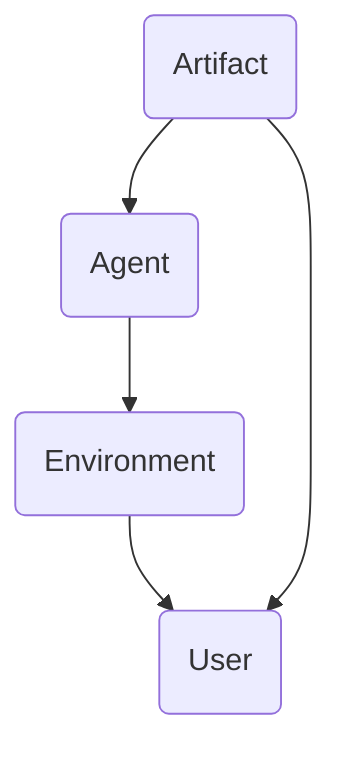

                 

# 设计可扩展的AI Agent架构

> **关键词**：AI Agent、可扩展性、体系结构设计、算法优化、系统性能

> **摘要**：本文详细探讨了设计可扩展AI Agent架构的核心概念、体系结构、算法优化及实际应用。通过模块化设计、分层架构和分布式计算等方法，结合具体案例分析，展示了如何构建高效且可扩展的AI Agent系统。

---

## 第1章 AI Agent的基本概念与背景

### 1.1 AI Agent的定义与特点

AI Agent（智能代理）是指能够感知环境、自主决策并采取行动以实现特定目标的计算机系统。AI Agent的核心特点包括自主性、反应性、目标导向和社交能力。与传统AI相比，AI Agent更注重动态环境中的实时交互和自主决策能力。

### 1.2 AI Agent的历史与发展

AI Agent的概念起源于20世纪60年代的知识表示与推理研究。随着计算能力的提升和机器学习技术的发展，AI Agent逐渐从理论研究走向实际应用，尤其在智能助手、自动驾驶等领域取得了显著进展。

### 1.3 AI Agent的应用场景

AI Agent广泛应用于智能助手、自动交易系统、游戏AI和智慧城市等领域。例如，智能助手（如Siri）通过自然语言处理技术为用户提供服务；自动交易系统利用AI Agent进行实时市场分析和交易决策。

### 1.4 可扩展性的重要性

可扩展性是AI Agent设计中的关键因素。随着任务复杂度和数据量的增加，系统必须能够高效扩展以满足性能需求。可扩展性不仅影响系统的性能，还决定了其应用场景的广度和深度。

## 第2章 可扩展AI Agent的核心概念与联系

### 2.1 可扩展性原理

可扩展性设计依赖于模块化设计、并行处理和分层架构。模块化设计允许系统组件独立开发和维护；并行处理提高系统的吞吐量；分层架构使系统各部分职责分明，便于扩展。

### 2.2 核心概念对比表

| 概念         | 优势                       | 局限性                     |
|--------------|----------------------------|----------------------------|
| 模块化设计   | 独立性高，便于维护           | 需增加通信开销               |
| 并行处理     | 提高处理速度               | 资源竞争，可能导致性能下降   |
| 分层架构     | 易于扩展和维护             | 层间通信复杂性增加           |

### 2.3 ER实体关系图

以下是AI Agent系统中实体关系的Mermaid图：

## 第3章 AI Agent的体系结构设计

### 3.1 模块化设计

模块化设计将系统划分为独立模块，如感知模块、决策模块和执行模块。每个模块负责特定功能，模块间通过定义良好的接口进行通信。

### 3.2 通信机制

AI Agent需要高效的通信机制，常用的消息传递机制包括发布-订阅模式和请求-响应模式。发布-订阅模式适用于异步通信，而请求-响应模式适用于同步通信。

### 3.3 容错机制

系统必须具备容错能力，以应对硬件故障或网络中断。常用的方法包括冗余设计和故障恢复机制。冗余设计通过备份模块确保系统可靠性，故障恢复机制在检测到故障后自动切换到备用模块。

## 第4章 算法与模型的扩展性优化

### 4.1 算法选择

选择适合分布式计算的算法，如分布式随机梯度下降（Distributed SGD）。Distributed SGD通过将训练数据分布在多个计算节点上，每个节点独立更新模型参数，最终汇总得到全局模型。

### 4.2 分层架构中的算法优化

分层架构允许在每个层中独立优化算法。例如，在感知层可以使用强化学习算法，决策层使用决策树或神经网络进行预测。

## 第5章 系统性能分析与调优

### 5.1 性能评估指标

关键性能指标包括响应时间、吞吐量和资源利用率。响应时间衡量系统对请求的处理速度，吞吐量反映系统的处理能力，资源利用率评估系统的资源效率。

### 5.2 调优方法

调优方法包括负载均衡和资源分配优化。负载均衡技术将任务均匀分配到不同的计算节点，避免资源瓶颈。资源分配优化根据任务需求动态分配计算资源。

## 第6章 项目实战

### 6.1 环境搭建

选择适合的开发框架，如Python的Django或Flask，结合机器学习库如TensorFlow或PyTorch进行开发。

### 6.2 核心实现

实现AI Agent的感知、决策和执行模块。例如，感知模块使用自然语言处理技术分析用户输入，决策模块基于规则或机器学习模型生成响应，执行模块将决策结果传递给外部系统。

### 6.3 案例分析

以智能客服为例，AI Agent通过自然语言处理理解用户问题，调用知识库进行回答生成，并通过对话系统与用户交互。

## 第7章 扩展性设计的挑战与未来趋势

### 7.1 挑战

主要挑战包括资源分配的复杂性和系统复杂性。资源分配需平衡计算能力和成本，系统复杂性要求更高的设计和维护能力。

### 7.2 未来趋势

未来，AI Agent将更加智能化和自适应，边缘计算和多模态交互将成为主要方向。边缘计算允许AI Agent在本地处理数据，减少延迟和带宽消耗；多模态交互使AI Agent能够处理多种输入形式，如文本、语音和图像。

---

**作者：AI天才研究院 & 禅与计算机程序设计艺术**

---

**致谢**：感谢读者的支持与关注，如需进一步探讨或合作，请联系作者。

