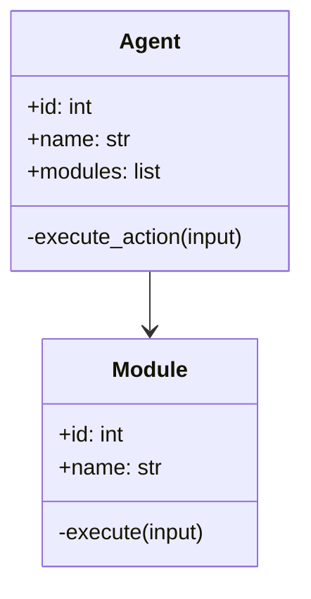

                 


# 设计可扩展的AI Agent架构：模块化与微服务

## 关键词：AI Agent、可扩展性、模块化设计、微服务、系统架构、服务发现、负载均衡

## 摘要：  
随着人工智能技术的快速发展，AI Agent（智能体）在各种应用场景中扮演着越来越重要的角色。然而，随着任务复杂性和数据量的增加，AI Agent的可扩展性问题变得日益突出。本文深入探讨了如何通过模块化设计和微服务架构来构建可扩展的AI Agent架构。文章从模块化设计的基本原理、微服务架构的核心特点出发，结合实际案例，详细分析了AI Agent模块化与微服务的实现过程，包括服务发现、负载均衡等关键算法的设计与实现。通过系统化的架构设计和项目实战，本文为读者提供了一套高效的设计方法和实践经验，帮助开发者更好地应对AI Agent架构的扩展性挑战。

---

# 第一章: AI Agent架构与可扩展性概述

## 1.1 AI Agent的基本概念与核心功能

AI Agent（人工智能智能体）是指能够感知环境并采取行动以实现目标的智能系统。它通常具备以下核心功能：

1. **感知环境**：通过传感器、API或其他接口获取环境信息。
2. **决策与规划**：基于感知信息，通过算法（如强化学习、决策树）做出决策。
3. **执行动作**：通过执行器或API调用将决策转化为具体行动。
4. **学习与优化**：通过反馈机制不断优化自身行为。

AI Agent的应用场景包括自动驾驶、智能客服、机器人控制、推荐系统等。

## 1.2 可扩展性问题的提出

随着AI Agent应用场景的扩展，系统需要处理的任务复杂性和数据量呈指数级增长。传统的单体架构难以满足以下需求：

1. **高并发处理**：需要同时处理大量的请求或任务。
2. **功能扩展性**：需要快速添加新的功能模块。
3. **容错性**：某个模块故障不应导致整个系统崩溃。

可扩展性问题的核心在于如何在不显著增加成本的情况下提升系统的处理能力。

## 1.3 当前AI Agent架构的现状与不足

传统AI Agent架构通常采用单体设计，所有功能模块耦合度高，难以扩展。具体问题包括：

1. **耦合度过高**：模块之间相互依赖，难以独立部署和扩展。
2. **性能瓶颈**：单点故障导致系统响应变慢或崩溃。
3. **维护成本高**：功能扩展或修改需要修改整个系统。

模块化设计和微服务架构为解决这些问题提供了新的思路。

---

# 第二章: 模块化设计的原理与优势

## 2.1 模块化设计的基本原理

模块化设计是一种将系统分解为独立模块的设计方法。每个模块具有明确的功能和接口，模块之间通过定义良好的接口进行通信。

### 核心原则
1. **信息隐藏**：每个模块只暴露必要的接口，隐藏内部实现细节。
2. **抽象**：通过抽象接口定义模块的行为，而不暴露具体实现。
3. **依赖倒置**：模块依赖于抽象接口，而不是具体实现。

### 优势
- **可维护性**：模块独立性高，修改某一模块不影响其他模块。
- **可扩展性**：新增功能时，只需添加新的模块，而无需修改现有代码。
- **可测试性**：模块可以独立测试，减少整体测试复杂性。

---

# 第三章: AI Agent模块化与微服务的算法实现

## 3.1 模块化设计的算法实现

模块化设计的核心是模块间通信机制。以下是其实现流程：

1. **定义模块接口**：通过接口定义模块的行为。
2. **模块通信**：通过API调用或消息队列实现模块间的通信。
3. **动态加载模块**：通过动态加载机制实现模块的灵活扩展。

### 代码实现
```python
# 模块接口定义
class AgentModule:
    def execute_action(self, input_data):
        pass

# 具体实现模块
class PerceptionModule(AgentModule):
    def execute_action(self, input_data):
        # 处理感知数据
        return result

class DecisionModule(AgentModule):
    def execute_action(self, input_data):
        # 处理决策逻辑
        return result
```

## 3.2 微服务架构中的服务发现与负载均衡

### 服务发现算法
服务发现是微服务架构中的关键问题。以下是常用算法：

1. **基于注册中心的服务发现**：通过注册中心（如Eureka）获取可用服务实例。
2. **基于路由表的服务发现**：通过预定义的路由表进行服务查找。

### 负载均衡算法
负载均衡算法用于分配请求到不同的服务实例。常用算法包括：

1. **轮询算法**：依次将请求分配到不同的服务实例。
2. **随机算法**：随机选择一个服务实例。
3. **加权算法**：根据服务实例的权重分配请求。

### 代码实现
```python
# 负载均衡实现
class LoadBalancer:
    def __init__(self, service_instances):
        self.service_instances = service_instances

    def get_instance(self):
        # 简单轮询算法
        return self.service_instances[hash(time.time()) % len(self.service_instances)]
```

---

# 第四章: 系统架构设计

## 4.1 系统功能设计

### 领域模型
以下是AI Agent的领域模型类图：



## 4.2 系统架构设计

以下是AI Agent的系统架构图：


---

# 第五章: 项目实战

## 5.1 环境安装

### 安装依赖
```bash
pip install fastapi uvicorn redis
```

## 5.2 核心实现

### API Gateway实现
```python
from fastapi import FastAPI
from fastapi.responses import JSONResponse
import requests

app = FastAPI()

@app.get("/execute")
async def execute_action():
    # 调用服务发现和负载均衡
    service_url = get_service_url()
    response = requests.get(service_url)
    return JSONResponse(content=response.json())
```

---

# 第六章: 最佳实践与小结

## 6.1 最佳实践

1. **模块化设计原则**：遵循依赖倒置、接口隔离等原则。
2. **服务发现与负载均衡**：选择合适的算法和工具。
3. **容错设计**：实现服务降级和熔断机制。

## 6.2 小结

设计可扩展的AI Agent架构需要结合模块化设计和微服务架构。通过模块化设计，可以提高系统的灵活性和可维护性；通过微服务架构，可以实现系统的高可用性和可扩展性。本文通过理论分析和实战案例，为读者提供了一套高效的设计方法和实践经验。

---

# 作者：AI天才研究院/AI Genius Institute & 禅与计算机程序设计艺术 /Zen And The Art of Computer Programming

