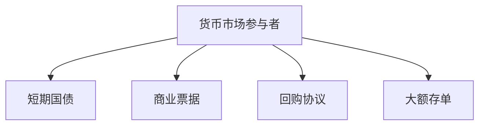

                 

# 货币市场工具：短期资金管理的安全港

## 关键词：货币市场工具、短期资金、流动性管理、金融市场、投资策略、风险管理

## 摘要：货币市场工具作为短期资金管理的重要手段，是投资者在金融市场中寻求安全性和流动性的理想选择。本文深入探讨货币市场工具的核心概念、定价机制、管理策略以及创新趋势，帮助读者全面理解如何在复杂多变的金融市场中优化短期资金管理，确保资金安全性和收益性。

---

# 目录大纲：《货币市场工具：短期资金管理的安全港》

## 第1章：货币市场工具的定义与背景

### 1.1 货币市场的定义与特点

#### 1.1.1 货币市场的定义
- 货币市场的概念
- 货币市场的参与者
- 货币市场的功能

#### 1.1.2 货币市场的特点
- 短期性
- 高流动性
- 低风险性

#### 1.1.3 货币市场的背景与重要性
- 货币市场的历史演变
- 货币市场在金融体系中的作用

### 1.2 货币市场工具的主要类型

#### 1.2.1 短期国债
- 定义与特点
- 市场流动性分析

#### 1.2.2 商业票据
- 定义与特点
- 与短期国债的对比

#### 1.2.3 回购协议
- 定义与运作机制
- 风险分析

#### 1.2.4 大额存单
- 定义与特点
- 与普通存款的区别

## 第2章：货币市场工具的核心概念

### 2.1 货币市场工具的基本属性

#### 2.1.1 流动性
- 定义与衡量标准
- 流动性对投资决策的影响

#### 2.1.2 安全性
- 定义与影响因素
- 安全性与收益性的权衡

#### 2.1.3 收益性
- 定义与影响因素
- 收益性与风险性的关系

### 2.2 货币市场工具的比较分析

#### 2.2.1 货币市场工具的属性对比表
| 工具类型 | 流动性 | 安全性 | 收益性 |
|----------|--------|--------|--------|
| 短期国债 | 高     | 高     | 中     |
| 商业票据 | 中高   | 中     | 中高   |
| 回购协议 | 高     | 高     | 中     |
| 大额存单 | 中高   | 高     | 中     |

#### 2.1.2 货币市场工具的ER实体关系图（Mermaid流程图）

## 第3章：货币市场工具的定价机制

### 3.1 货币市场工具的定价原理

#### 3.1.1 市场利率的影响
- 市场利率的定义与计算
- 市场利率对货币市场工具价格的影响

#### 3.1.2 工具期限与价格的关系
- 期限对价格的影响
- 利息计算方法

#### 3.1.3 贴现率的计算
- 贴现率的定义
- 贴现率的计算公式：$$\text{贴现率} = \frac{\text{面值}}{\text{期限}} \times 100\%$$

### 3.2 货币市场工具的收益率计算

#### 3.2.1 收益率的计算公式
- 简单收益率的计算：$$\text{收益率} = \frac{\text{利息}}{\text{本金}} \times 100\%$$
- 复合收益率的计算：$$\text{复合收益率} = (1 + \frac{\text{利息}}{\text{本金}})^n - 1$$

#### 3.2.2 收益率计算的实例分析
- 案例：购买1000元的短期国债，期限为3个月，利息为20元
- 计算：$$\text{收益率} = \frac{20}{1000} \times 100\% = 2\%$$

### 3.3 货币市场工具定价机制的总结

## 第4章：短期资金管理策略

### 4.1 资金流动性管理

#### 4.1.1 短期资金的流动性需求
- 企业的短期资金需求
- 金融机构的流动性管理

#### 4.1.2 资金池的构建与管理
- 资金池的定义
- 资金池的管理策略

### 4.2 资金风险管理

#### 4.2.1 信用风险的评估与控制
- 信用风险的定义
- 信用风险的控制方法

#### 4.2.2 利率风险的管理策略
- 利率风险的定义
- 利率风险管理工具

### 4.3 资金投资策略

#### 4.3.1 货币市场工具的投资策略
- 投资策略的制定
- 投资策略的风险控制

#### 4.3.2 货币市场工具的组合投资
- 组合投资的优势
- 组合投资的风险分散

## 第5章：货币市场工具的创新与发展

### 5.1 货币市场工具的创新

#### 5.1.1 新型货币市场工具的出现
- 创新工具的定义
- 创新工具的特点

#### 5.1.2 创新工具的影响
- 创新工具对市场的影响
- 创新工具的风险与收益

### 5.2 货币市场工具的未来发展

#### 5.2.1 金融科技对货币市场工具的影响
- 金融科技的定义
- 金融科技的应用

#### 5.2.2 货币市场工具的未来趋势
- 未来趋势的预测
- 未来趋势的影响

## 第6章：货币市场工具的风险分析

### 6.1 货币市场工具的风险类型

#### 6.1.1 信用风险
- 信用风险的定义
- 信用风险的影响因素

#### 6.1.2 流动性风险
- 流动性风险的定义
- 流动性风险的影响因素

#### 6.1.3 市场风险
- 市场风险的定义
- 市场风险的影响因素

### 6.2 货币市场工具的风险评估与管理

#### 6.2.1 风险评估方法
- 风险评估的步骤
- 风险评估的工具

#### 6.2.2 风险管理策略
- 风险分散
- 风险对冲

## 第7章：货币市场工具的投资策略

### 7.1 货币市场工具的投资策略

#### 7.1.1 被动投资策略
- 被动投资的定义
- 被动投资的优缺点

#### 7.1.2 主动投资策略
- 主动投资的定义
- 主动投资的优缺点

### 7.2 货币市场工具的组合投资

#### 7.2.1 组合投资的优势
- 组合投资的风险分散
- 组合投资的收益优化

#### 7.2.2 组合投资的实施步骤
- 确定投资目标
- 选择投资工具
- 制定投资计划

## 第8章：货币市场工具的案例分析

### 8.1 案例分析

#### 8.1.1 案例一：短期国债的投资分析
- 案例背景
- 投资分析
- 投资结果

#### 8.1.2 案例二：商业票据的风险管理
- 案例背景
- 风险管理过程
- 管理结果

### 8.2 案例总结

#### 8.2.1 案例的成功经验
- 成功经验的总结
- 经验的应用

#### 8.2.2 案例的教训与启示
- 教训的总结
- 启示的应用

## 第9章：总结与展望

### 9.1 全文总结

#### 9.1.1 货币市场工具的核心内容
- 核心内容的总结
- 核心内容的回顾

#### 9.1.2 投资策略的总结
- 投资策略的总结
- 投资策略的回顾

### 9.2 未来展望

#### 9.2.1 货币市场工具的发展趋势
- 未来趋势的预测
- 未来趋势的影响

#### 9.2.2 投资者的机会与挑战
- 投资者的机会
- 投资者面临的挑战

## 作者：AI天才研究院/AI Genius Institute & 禅与计算机程序设计艺术 /Zen And The Art of Computer Programming

## 拓展阅读
- [货币市场工具](https://www.wikipedia.org/wiki/Money_market_tools)
- [短期资金管理](https://www.wikipedia.org/wiki/Short-term_finance_management)
- [金融市场](https://www.wikipedia.org/wiki/Financial_markets)
- [投资策略](https://www.wikipedia.org/wiki/Investment_strategy)
- [风险管理](https://www.wikipedia.org/wiki/Risk_management)

---

**注意：以上目录大纲是根据用户提供的结构整理而成，具体内容需要根据实际需求进一步补充和细化。**

