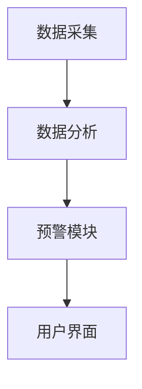

                 


# 货币政策对资产价格的影响机制

## 关键词
货币政策、资产价格、利率政策、传导机制、经济模型

## 摘要
本文详细探讨了货币政策如何影响资产价格的机制。通过分析货币政策的主要工具及其对不同资产价格的影响，结合理论模型和实际案例，揭示货币政策如何通过多种渠道影响资产价格。文章还结合系统架构和项目实战，深入分析了货币政策对资产价格的量化影响，并提出了实际应用中的注意事项和最佳实践。

---

## 第一部分：货币政策的基本概念与资产价格的定义

### 第1章：货币政策的基本概念

#### 1.1 货币政策的定义与目标
- **货币政策的定义**：货币政策是由中央银行制定的，通过调节货币供应量、利率等工具来实现宏观调控的政策。
- **货币政策的主要目标**：稳定物价、促进就业、维持经济增长和维护金融稳定。
- **货币政策的实施主体**：中央银行（如美联储、中国人民银行）。

#### 1.2 货币政策的工具
- **利率政策**：调整基准利率、存款准备金率等。
- **货币供应量政策**：通过公开市场操作调节基础货币供应。
- **公开市场操作**：买卖政府债券以影响市场流动性。

#### 1.3 货币政策的作用机制
- **利率渠道**：降低利率会降低借款成本，刺激投资和消费。
- **信贷渠道**：通过影响银行信贷供给，间接影响资产价格。
- **资产价格渠道**：直接影响金融资产价格，如股票和债券。

### 第2章：资产价格的定义与分类

#### 2.1 资产价格的定义
- 资产价格是资产在市场上的交易价格，反映了市场对资产未来收益的预期。

#### 2.2 资产价格的分类
- **金融资产**：股票、债券、基金等。
- **实物资产**：房地产、黄金等。
- **无形资产**：专利、品牌等。

#### 2.3 资产价格的影响因素
- **宏观经济因素**：GDP增长率、通货膨胀率、利率水平。
- **市场预期**：投资者对未来的预期影响当前价格。
- **市场流动性**：流动性充裕时，资产价格往往上涨。

---

## 第二部分：货币政策对资产价格的影响机制

### 第3章：货币政策的类型与资产价格的影响

#### 3.1 货币政策的类型
- **扩张性货币政策**：通过增加货币供应量来刺激经济增长。
- **紧缩性货币政策**：通过减少货币供应量来控制通胀。

#### 3.2 不同类型货币政策对资产价格的影响
- **扩张性货币政策**：
  - **股票市场**：企业融资成本降低，利润增加，股价上涨。
  - **债券市场**：利率下降，债券价格上升。
  - **房地产市场**：贷款成本降低，需求增加，房价上涨。
- **紧缩性货币政策**：
  - **股票市场**：企业融资成本上升，利润下降，股价下跌。
  - **债券市场**：利率上升，债券价格下降。
  - **房地产市场**：贷款成本上升，需求减少，房价下跌。

### 第4章：货币政策对资产价格的传导机制

#### 4.1 货币政策的传导路径
- **利率渠道**：中央银行调整基准利率，影响市场利率，进而影响资产价格。
- **资产价格渠道**：中央银行直接干预金融市场，影响资产价格。
- **信贷渠道**：通过影响银行信贷供给，间接影响资产价格。

#### 4.2 货币政策对资产价格的直接与间接影响
- **直接影响**：通过调整利率直接影响债券和股票价格。
- **间接影响**：通过影响经济基本面（如GDP增长率）间接影响资产价格。

---

## 第三部分：货币政策对资产价格影响的理论模型

### 第5章：资本资产定价模型（CAPM）

#### 5.1 CAPM的定义
- CAPM是用于估计资产期望收益的模型，考虑了系统性风险和非系统性风险。

#### 5.2 CAPM的公式
$$ E(r_i) = r_f + \beta_i (E(r_m) - r_f) $$
- $E(r_i)$：资产i的期望收益率
- $r_f$：无风险利率
- $\beta_i$：资产i的贝塔系数
- $E(r_m)$：市场期望收益率

#### 5.3 CAPM与货币政策的关系
- 货币政策通过影响无风险利率和市场期望收益率，进而影响资产价格。

### 第6章：货币政策与资产价格的数学模型

#### 6.1 货币政策对股票价格的影响模型
- 假设：中央银行调整利率对股票价格的影响。
- 模型：股票价格与利率呈负相关关系。

#### 6.2 货币政策对房地产价格的影响模型
- 假设：贷款利率变化影响房地产需求。
- 模型：房地产价格与贷款利率呈负相关关系。

---

## 第四部分：系统分析与架构设计

### 第7章：系统功能设计

#### 7.1 问题场景
- 中央银行调整利率对股市的影响。

#### 7.2 功能模块
- 数据采集模块：采集股票价格和利率数据。
- 数据分析模块：计算相关性，预测资产价格变化。
- 预警模块：当价格波动超过阈值时，触发预警。

#### 7.3 系统架构图


---

## 第五部分：项目实战

### 第8章：项目实战

#### 8.1 环境配置
- 数据来源：历史股票价格和利率数据。
- 工具：Python、Pandas、Matplotlib。

#### 8.2 核心实现
```python
import pandas as pd
import matplotlib.pyplot as plt

# 数据加载
data = pd.read_csv('stock_price.csv')

# 数据分析
correlation = data['interest_rate'].corr(data['stock_price'])
print(f"相关系数：{correlation}")

# 图形绘制
plt.scatter(data['interest_rate'], data['stock_price'])
plt.xlabel('利率')
plt.ylabel('股价')
plt.title('利率与股价关系')
plt.show()
```

#### 8.3 实际案例分析
- 案例：美联储加息对房地产市场的影响。
- 分析：加息导致贷款成本上升，房地产需求下降，房价下跌。

---

## 第六部分：最佳实践

### 第9章：小结与注意事项

#### 9.1 小结
- 货币政策通过多种渠道影响资产价格，包括利率、信贷和资产价格渠道。
- 不同类型资产对货币政策的反应不同。

#### 9.2 注意事项
- 货币政策效果受经济环境影响，需综合考虑。
- 投资者应关注宏观经济政策变化，合理配置资产。

### 第10章：拓展阅读

#### 10.1 推荐书籍
- 《货币政策与金融稳定》
- 《资产定价理论》

#### 10.2 在线资源
- 央行官网政策解读
- 金融学专业期刊论文

---

## 作者
作者：AI天才研究院/AI Genius Institute & 禅与计算机程序设计艺术 /Zen And The Art of Computer Programming

