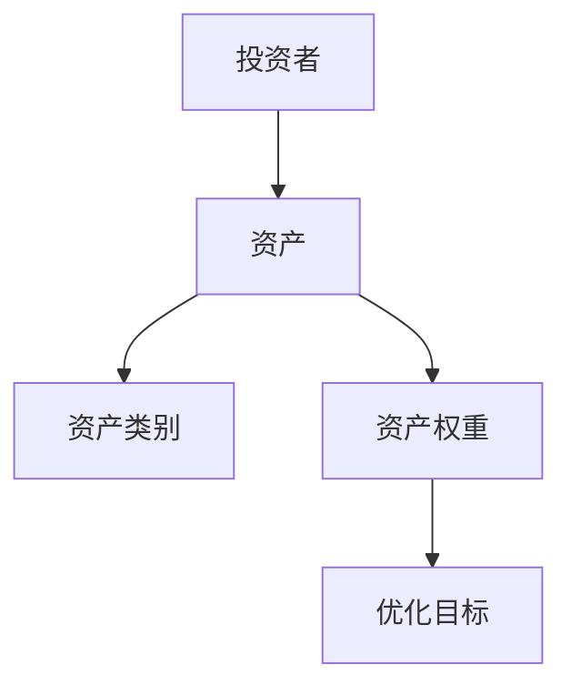
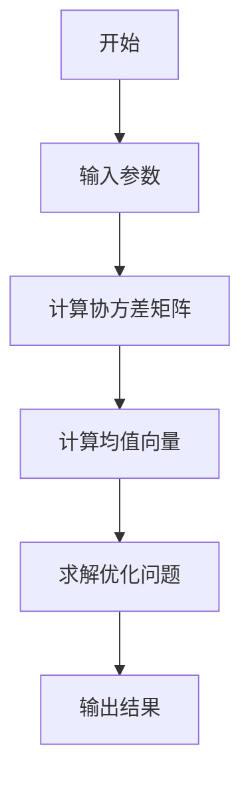
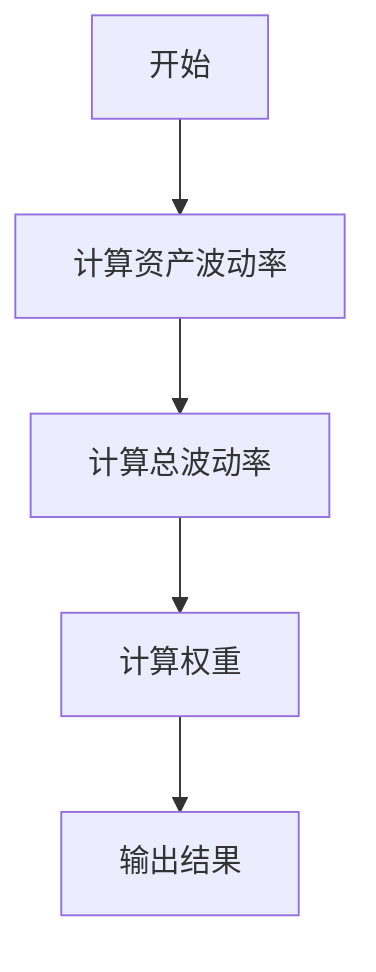
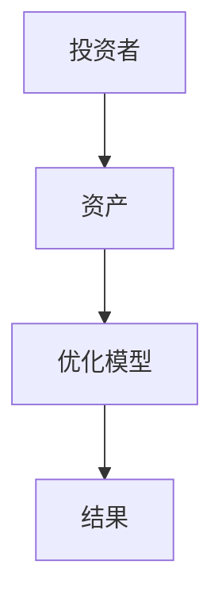

                 


# 资产配置模型：优化风险收益比的科学方法

## 关键词：资产配置模型、风险收益比、均值-方差优化、风险平价模型、数学优化

## 摘要：  
资产配置模型是一种科学的方法，旨在通过优化资产组合来实现风险与收益的最佳平衡。本文从资产配置的基本概念出发，深入探讨其核心原理、算法模型、系统设计及实际应用，帮助投资者和程序员理解如何通过数学优化和系统架构来实现资产配置的目标。

---

# 第一部分: 资产配置模型概述

## 第1章: 资产配置模型的背景与概念

### 1.1 资产配置的基本概念

#### 1.1.1 资产配置的定义  
资产配置是指根据投资者的风险承受能力、收益目标和投资期限，将资金分配到不同资产类别（如股票、债券、房地产等）中的过程。其核心目标是通过科学的组合配置，最大化收益的同时最小化风险。

#### 1.1.2 资产配置的核心要素  
- **资产类别**：股票、债券、现金等。  
- **权重分配**：每类资产在组合中的比例。  
- **风险与收益**：资产的波动性和预期回报。  

#### 1.1.3 资产配置的目标与意义  
- **目标**：实现收益最大化、风险最小化或两者之间的平衡。  
- **意义**：分散风险、提高投资效率、适应市场变化。  

### 1.2 资产配置的分类

#### 1.2.1 按资产类别划分  
- **股票型**：高风险、高收益。  
- **债券型**：低风险、稳定收益。  
- **混合型**：平衡风险与收益。  

#### 1.2.2 按配置策略划分  
- **主动型**：动态调整配置比例。  
- **被动型**：固定配置比例。  

#### 1.2.3 按时间维度划分  
- **短期**：灵活调整，适应市场波动。  
- **长期**：稳定配置，注重资产增值。  

### 1.3 资产配置模型的发展历程

#### 1.3.1 传统资产配置方法  
- 基于经验判断，缺乏科学性。  

#### 1.3.2 现代资产配置方法  
- 引入数学优化模型，如均值-方差模型。  

#### 1.3.3 当前研究热点与趋势  
- 大数据驱动的资产配置。  
- 多目标优化与机器学习的结合。  

---

## 第2章: 资产配置模型的核心概念与联系

### 2.1 核心概念原理

#### 2.1.1 资产类别与权重分配  
- 资产类别决定收益和风险特征。  
- 权重分配影响整体组合的波动性。  

#### 2.1.2 风险与收益的权衡  
- 高风险资产可能带来高收益。  
- 低风险资产通常收益稳定。  

#### 2.1.3 优化目标与约束条件  
- 最优化目标：最大化收益或最小化风险。  
- 约束条件：资金限制、风险承受能力等。  

### 2.2 核心概念对比分析

#### 2.2.1 不同资产类别风险收益对比  
| 资产类别 | 预期收益 | 波动性 |
|----------|----------|--------|
| 股票     | 高       | 高     |
| 债券     | 中       | 低     |
| 现金     | 低       | 极低   |

#### 2.2.2 不同配置策略效果对比  
| 策略       | 风险 | 收益 |
|------------|------|------|
| 保守型     | 低   | 中   |
| 积极型     | 高   | 高   |

#### 2.2.3 不同时间周期的资产表现对比  
- 短期：波动性大，风险高。  
- 长期：趋势性明显，风险可控。  

### 2.3 ER实体关系图



---

## 第3章: 资产配置模型的算法原理

### 3.1 均值-方差优化模型

#### 3.1.1 模型定义  
均值-方差模型由Harry Markowitz提出，旨在最小化投资组合的方差（风险），在给定收益下。

#### 3.1.2 模型公式  
$$\text{Minimize } \sigma^2 \text{ subject to } \mu \cdot w = r$$

- $\sigma^2$：投资组合的方差（风险）。  
- $\mu$：资产的预期收益向量。  
- $w$：资产权重向量。  
- $r$：目标收益。  

#### 3.1.3 算法步骤



#### 3.1.4 Python实现

```python
import numpy as np
from scipy.optimize import minimize

def portfolio_optimization(returns, weights):
    # 定义目标函数
    def objective(weights):
        return np.dot(weights.T, np.dot(returns, weights))
    
    # 约束条件：权重之和为1
    cons = ({'type': 'eq', 'fun': lambda w: np.sum(w) - 1})
    
    # 求解
    result = minimize(objective, weights, constraints=cons, bounds=[(0,1)]*len(weights))
    return result.x

# 示例数据
returns = np.array([[0.1, 0.2], [0.2, 0.1]])
weights = np.array([0.5, 0.5])

optimal_weights = portfolio_optimization(returns, weights)
print(optimal_weights)
```

---

### 3.2 风险平价模型

#### 3.2.1 模型定义  
风险平价模型将风险视为资产权重的决定因素，使每类资产的风险贡献相等。

#### 3.2.2 模型公式  
$$w_i = \frac{1}{\sum_{j=1}^{n} \frac{\sigma_j^2}{\sum_{j=1}^{n} \sigma_j^2}}$$

- $w_i$：第i类资产的权重。  
- $\sigma_j^2$：第j类资产的波动率平方。  

#### 3.2.3 算法步骤



#### 3.2.4 Python实现

```python
def risk_parity(weights, returns):
    # 计算波动率矩阵
    cov_matrix = np.cov(returns)
    diag = np.diag(np.diag(cov_matrix))
    inv_diag = np.linalg.inv(diag)
    # 计算权重
    weights_risk_parity = np.dot(inv_diag, weights)
    return weights_risk_parity / np.sum(weights_risk_parity)

# 示例数据
returns = np.array([[0.1, 0.2], [0.2, 0.1]])
weights = np.array([0.5, 0.5])

risk_parity_weights = risk_parity(weights, returns)
print(risk_parity_weights)
```

---

## 第4章: 系统分析与架构设计

### 4.1 问题场景介绍

#### 4.1.1 项目介绍  
开发一个基于资产配置模型的投资管理系统，实现风险与收益的科学平衡。  

#### 4.1.2 系统功能设计


#### 4.1.3 系统架构设计



---

## 第5章: 项目实战

### 5.1 环境安装

```bash
pip install numpy scipy matplotlib
```

### 5.2 核心实现

#### 5.2.1 均值-方差优化实现

```python
def portfolio_optimization(returns, weights):
    def objective(weights):
        return np.dot(weights.T, np.dot(returns, weights))
    
    cons = ({'type': 'eq', 'fun': lambda w: np.sum(w) - 1})
    result = minimize(objective, weights, constraints=cons, bounds=[(0,1)]*len(weights))
    return result.x
```

#### 5.2.2 风险平价实现

```python
def risk_parity(weights, returns):
    cov_matrix = np.cov(returns)
    diag = np.diag(np.diag(cov_matrix))
    inv_diag = np.linalg.inv(diag)
    weights_risk_parity = np.dot(inv_diag, weights)
    return weights_risk_parity / np.sum(weights_risk_parity)
```

### 5.3 案例分析

#### 5.3.1 数据准备

```python
returns = np.array([[0.1, 0.2], [0.2, 0.1]])
weights = np.array([0.5, 0.5])
```

#### 5.3.2 应用实现

```python
optimal_weights = portfolio_optimization(returns, weights)
risk_parity_weights = risk_parity(weights, returns)
print(optimal_weights)
print(risk_parity_weights)
```

---

## 第6章: 最佳实践与小结

### 6.1 最佳实践 tips

1. **数据质量**：确保输入数据的准确性和完整性。  
2. **模型选择**：根据实际情况选择合适的优化模型。  
3. **风险管理**：定期监控和调整配置比例。  

### 6.2 小结  
资产配置模型通过数学优化和系统设计，帮助投资者在风险与收益之间找到最佳平衡点。掌握这些模型和方法，投资者可以更科学地进行资产配置，实现长期稳健的投资收益。

### 6.3 注意事项

1. **模型局限性**：假设资产收益服从正态分布。  
2. **市场变化**：需动态调整配置比例。  
3. **代码实现**：注意数值计算的精度问题。  

### 6.4 拓展阅读

- Harry Markowitz的《Portfolio Selection》。  
- 《现代投资组合理论与投资学》。  

---

# 作者：AI天才研究院 & 禅与计算机程序设计艺术

---

这篇文章系统地介绍了资产配置模型的背景、核心概念、算法原理、系统设计和实际应用，帮助读者全面理解如何通过科学方法优化风险收益比。

